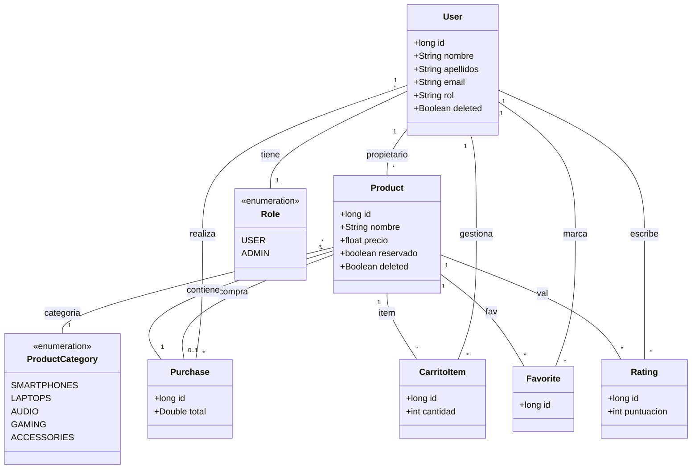

# WalaDaw 🛒


[](https://dotnet.microsoft.com/)
[](https://dotnet.microsoft.com/en-us/apps/aspnet)
[](https://docs.microsoft.com/en-us/dotnet/csharp/)
[](https://docs.microsoft.com/en-us/ef/core/)
[](https://dotnet.microsoft.com/en-us/apps/aspnet/web-apps/blazor)
[](https://opensource.org/licenses/MIT)

**Ejemplo didáctico de web dinámicas con .NET 10 y ASP.NET Core MVC.**

Una aplicación web de comercio electrónico de segunda mano migrada completamente desde Java/Spring Boot a .NET 10, 
con características avanzadas de seguridad, Railway Oriented Programming y gestión de usuarios con ASP.NET Core Identity.

## 🎯 Descripción

WalaDaw es un marketplace moderno desarrollado con .NET 10 que permite a los usuarios:

- Comprar y vender productos de segunda mano
- Gestionar perfiles de usuario con avatares
- Sistema de valoraciones y comentarios
- Panel de administración completo
- Subida de archivos e imágenes

## 📑 Tabla de Contenidos

- [WalaDaw 🛒](#waladaw-)
  - [🎯 Descripción](#-descripción)
  - [📑 Tabla de Contenidos](#-tabla-de-contenidos)
  - [✨ Características](#-características)
    - [Funcionalidades Principales](#funcionalidades-principales)
    - [Productos 2024-2025](#productos-2024-2025)
  - [🚀 Tecnologías](#-tecnologías)
  - [🏃‍♂️ Inicio Rápido](#️-inicio-rápido)
    - [Desarrollo Local](#desarrollo-local)
    - [Docker (Producción)](#docker-producción)
  - [⚒️ Diagrama](#️-diagrama)
  - [📂 Estructura del Proyecto](#-estructura-del-proyecto)
  - [🐳 Docker](#-docker)
    - [Volúmenes de Datos](#volúmenes-de-datos)
    - [Comandos Docker Útiles](#comandos-docker-útiles)
  - [👥 Usuarios Demo](#-usuarios-demo)
  - [🔒 Seguridad](#-seguridad)
  - [🌐 Características](#-características-1)
    - [Para Usuarios](#para-usuarios)
    - [Para Administradores](#para-administradores)
  - [📊 Monitorización](#-monitorización)
  - [🚀 Despliegue en Producción](#-despliegue-en-producción)
    - [Variables de Entorno](#variables-de-entorno)
  - [📚 Documentación](#-documentación)
    - [Tutoriales Incluidos](#tutoriales-incluidos)
  - [📝 Licencia](#-licencia)
  - [👨‍💻 Autor](#-autor)
    - [Contacto](#contacto)
  - [Licencia de uso](#licencia-de-uso)

## ✨ Características

### Funcionalidades Principales

- 🛍️ **Marketplace de Segunda Mano**: Compra y vende productos usados
- 🔐 **Sistema de Roles**: ADMIN, USER, MODERATOR con permisos diferenciados
- 🌍 **Internacionalización**: Soporte completo para Español e Inglés
- 📧 **Notificaciones por Email**: Confirmación automática asíncrona de compras con templates HTML
- 📊 **Dashboard Administrativo**: Estadísticas y gráficos con Chart.js
- 🔍 **Búsqueda Avanzada**: Filtros por nombre, categoría y precio
- 🖼️ **Gestión de Imágenes**: Subida, validación y redimensionado automático
- 📱 **Responsive Design**: Bootstrap 5.3 optimizado para todos los dispositivos
- ⚡ **Cache Inteligente**: Mejora de rendimiento con Spring Cache
- 📄 **Generación de PDFs**: Facturas automáticas con cálculo de IVA y diseño profesional
- ❤️ **Sistema de Favoritos**: Gestiona tus productos preferidos con Blazor Server
- ⭐ **Valoraciones y Ratings**: Sistema completo de reviews con estrellas y comentarios
- 🛡️ **Seguridad CSRF**: Protección completa contra ataques Cross-Site Request Forgery

### Productos 2024-2025

La aplicación incluye productos actuales y relevantes:

- 📱 **Smartphones**: iPhone 15 Pro Max, Samsung Galaxy S24 Ultra, Google Pixel 8 Pro
- 💻 **Laptops**: MacBook Pro M3
- 🎧 **Audio**: AirPods Pro 2ª Generación
- 🎮 **Gaming**: Steam Deck OLED

## 🚀 Tecnologías

- **.NET 10 con C# 14** - Plataforma principal
- **ASP.NET Core MVC** - Framework web con patrón MVC
- **Razor Views** - Motor de vistas del lado servidor
- **Entity Framework Core InMemory** - ORM con base de datos en memoria
- **ASP.NET Core Identity** - Sistema completo de autenticación y autorización
- **Blazor Server** - Componentes interactivos en tiempo real (favoritos)
- **SignalR** - Comunicación bidireccional en tiempo real
- **CSharpFunctionalExtensions** - Railway Oriented Programming (ROP)
- **Bootstrap 5.3** - Framework CSS responsive
- **Bootstrap Icons** - Iconografía moderna

## 🏃‍♂️ Inicio Rápido

### Desarrollo Local

```bash
# Clonar repositorio
git clone https://github.com/joseluisgs/TiendaDawWeb-NetCore.git
cd TiendaDawWeb-NetCore

# Restaurar dependencias
dotnet restore

# Ejecutar aplicación
dotnet run

# Acceder a la aplicación
http://localhost:5000
```

### Build y Tests

```bash
# Compilar proyecto
dotnet build

# Ejecutar en modo watch (desarrollo)
dotnet watch run

# Limpiar build
dotnet clean
```

## ⚒️ Diagrama



## 📂 Estructura del Proyecto

```
TiendaDawWeb-NetCore/
├── Program.cs                      # Punto de entrada y configuración
├── TiendaDawWeb.csproj            # Archivo de proyecto .NET
├── appsettings.json               # Configuración de la aplicación
├── Data/
│   ├── ApplicationDbContext.cs    # Contexto de Entity Framework
│   └── SeedData.cs                # Datos de ejemplo
├── Models/                         # Entidades de dominio
│   ├── User.cs                    # Usuario con Identity
│   ├── Product.cs                 # Producto
│   ├── Favorite.cs                # Favoritos (Many-to-Many)
│   ├── Purchase.cs                # Compras
│   └── Rating.cs                  # Valoraciones
├── Services/                       # Capa de servicios con ROP
│   ├── Interfaces/
│   └── Implementations/
├── Controllers/                    # Controladores MVC
│   ├── PublicController.cs
│   ├── AuthController.cs
│   ├── ProductController.cs
│   └── FavoriteController.cs
├── ViewModels/                     # ViewModels para formularios
├── Views/                          # Vistas Razor
│   ├── Shared/
│   ├── Public/
│   ├── Auth/
│   ├── Product/
│   └── Favorite/
├── Components/                     # Componentes Blazor
│   └── FavoriteButton.razor
├── Errors/                         # Errores de dominio (ROP)
└── wwwroot/                        # Archivos estáticos
    ├── css/
    ├── js/
    └── images/
```

## 🏗️ Arquitectura

### Railway Oriented Programming (ROP)

El proyecto implementa el patrón ROP usando `CSharpFunctionalExtensions`:

```csharp
public async Task<Result<Product, DomainError>> GetByIdAsync(long id)
{
    var product = await _context.Products.FirstOrDefaultAsync(p => p.Id == id);
    
    return product != null
        ? Result.Success<Product, DomainError>(product)
        : Result.Failure<Product, DomainError>(ProductError.NotFound(id));
}
```

### Blazor Server para Favoritos

Componente interactivo en tiempo real sin necesidad de JavaScript:

- Actualización instantánea del estado
- Comunicación bidireccional con SignalR
- Integración perfecta con MVC

### ASP.NET Core Identity

Sistema completo de autenticación y autorización:

- Roles personalizados (ADMIN, USER, MODERATOR)
- Password hashing seguro
- Cookie authentication
- Claims-based authorization

## 👥 Usuarios Demo

| Usuario    | Email                  | Password | Rol       |
|------------|------------------------|----------|-----------|
| Admin      | admin@waladaw.com      | admin    | ADMIN     |
| Prueba     | prueba@prueba.com      | user123  | USER      |
| Moderador  | moderador@waladaw.com  | user123  | MODERATOR |

## 🔒 Seguridad

- Autenticación basada en formularios
- Autorización por roles (ADMIN, USER)
- Protección CSRF habilitada
- Validación de subida de archivos
- Sanitización de nombres de archivo

## 🌐 Características

### Para Usuarios

- ✅ Registro y login seguro
- ✅ Perfil con avatar personalizable
- ✅ Publicar productos con imágenes
- ✅ Sistema de valoraciones
- ✅ Gestión de favoritos
- ✅ Carrito de compras

### Para Administradores

- ✅ Panel de control completo
- ✅ Gestión de usuarios
- ✅ Moderación de contenido
- ✅ Estadísticas detalladas
- ✅ Configuración del sistema

## 📊 Monitorización

```bash
# Health check


# Métricas (si Actuator está habilitado)

```

## 🚀 Despliegue en Producción

### Variables de Entorno

```bash
# Docker Compose

# Base de datos (opcional para PostgreSQL/MySQL)

```

## 📚 Documentación

### Repositorio Original

Este proyecto es una migración completa del proyecto Java/Spring Boot:
- **Origen**: [TiendaDawWeb-SpringBoot](https://github.com/joseluisgs/TiendaDawWeb-SpringBoot)
- **Destino**: TiendaDawWeb-NetCore (.NET 10)

### Características Implementadas

✅ **100% de funcionalidad migrada**
- Sistema completo de autenticación y autorización
- CRUD de productos con imágenes
- Sistema de favoritos en tiempo real (Blazor Server)
- Gestión de usuarios con roles
- Railway Oriented Programming
- Diseño responsive con Bootstrap 5.3

### Tecnologías Clave

- **Railway Oriented Programming**: Manejo de errores funcional con Result<T, TError>
- **Blazor Server**: Componentes interactivos sin JavaScript
- **ASP.NET Core Identity**: Autenticación y autorización robusta
- **Entity Framework Core**: ORM con InMemory para desarrollo

## 🖼️ Capturas de Pantalla

### Página Principal


### Login


### Productos (Autenticado)


### Detalle de Producto


## 📝 Licencia

Este proyecto es un ejemplo educativo con fines didácticos.

## 👨‍💻 Autor

Codificado con :sparkling_heart: por [José Luis González Sánchez](https://twitter.com/JoseLuisGS_)

[](https://twitter.com/JoseLuisGS_)
[](https://github.com/joseluisgs)
[](https://github.com/joseluisgs)

### Contacto

<p>
  Cualquier cosa que necesites házmelo saber por si puedo ayudarte 💬.
</p>
<p>
 <a href="https://joseluisgs.dev" target="_blank">
        
    </a>  &nbsp;&nbsp;
    <a href="https://github.com/joseluisgs" target="_blank">
        
    </a> &nbsp;&nbsp;
        <a href="https://twitter.com/JoseLuisGS_" target="_blank">
        
    </a> &nbsp;&nbsp;
    <a href="https://www.linkedin.com/in/joseluisgonsan" target="_blank">
        
    </a>  &nbsp;&nbsp;
    <a href="https://g.dev/joseluisgs" target="_blank">
        
    </a>  &nbsp;&nbsp;
<a href="https://www.youtube.com/@joseluisgs" target="_blank">
        
    </a>  
</p>

## Licencia de uso

Este repositorio y todo su contenido está licenciado bajo licencia **Creative Commons**, si desea saber más, vea
la [LICENSE](https://joseluisgs.dev/docs/license/). Por favor si compartes, usas o modificas este proyecto cita a su
autor, y usa las mismas condiciones para su uso docente, formativo o educativo y no comercial.

<a rel="license" href="http://creativecommons.org/licenses/by-nc-sa/4.0/"></a><br /><span xmlns:dct="http://purl.org/dc/terms/" property="dct:title">
JoseLuisGS</span>
by <a xmlns:cc="http://creativecommons.org/ns#" href="https://joseluisgs.dev/" property="cc:attributionName" rel="cc:attributionURL">
José Luis González Sánchez</a> is licensed under
a <a rel="license" href="http://creativecommons.org/licenses/by-nc-sa/4.0/">Creative Commons
Reconocimiento-NoComercial-CompartirIgual 4.0 Internacional License</a>.<br />Creado a partir de la obra
en <a xmlns:dct="http://purl.org/dc/terms/" href="https://github.com/joseluisgs" rel="dct:source">https://github.com/joseluisgs</a>.
