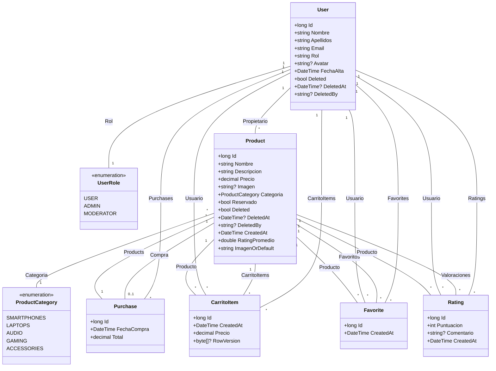
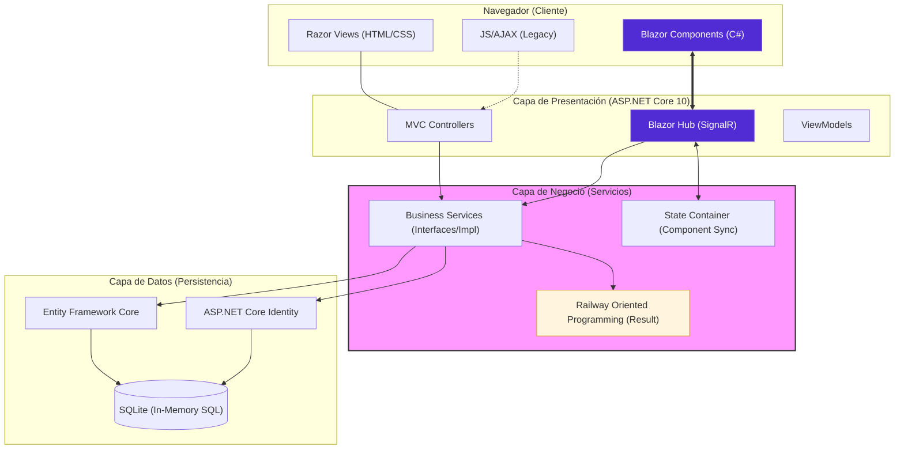

# WalaDaw 🛒


[](https://dotnet.microsoft.com/)
[](https://dotnet.microsoft.com/en-us/apps/aspnet)
[](https://docs.microsoft.com/en-us/dotnet/csharp/)
[](https://docs.microsoft.com/en-us/ef/core/)
[](https://dotnet.microsoft.com/en-us/apps/aspnet/web-apps/razor)
[](https://dotnet.microsoft.com/en-us/apps/aspnet/web-apps/blazor)
[](https://dotnet.microsoft.com/en-us/apps/aspnet/signalr)
[](https://opensource.org/licenses/MIT)

**Ejemplo didáctico de web dinámicas con .NET 10 y ASP.NET Core MVC.**

Una aplicación web de comercio electrónico de segunda mano con características avanzadas de seguridad, Railway Oriented
Programming y gestión de usuarios con ASP.NET Core Identity.

## 🎯 Descripción

WalaDaw es un marketplace moderno desarrollado con .NET 10 que permite a los usuarios:

- Comprar y vender productos de segunda mano
- Gestionar perfiles de usuario con avatares
- Sistema de valoraciones y comentarios
- Panel de administración completo
- Subida de archivos e imágenes

## 📑 Tabla de Contenidos

- [WalaDaw 🛒](#waladaw-)
  - [🎯 Descripción](#-descripción)
  - [📑 Tabla de Contenidos](#-tabla-de-contenidos)
  - [✨ Características](#-características)
    - [Funcionalidades Principales](#funcionalidades-principales)
    - [Productos 2024-2025](#productos-2024-2025)
  - [🚀 Tecnologías](#-tecnologías)
  - [🏃‍♂️ Inicio Rápido](#️-inicio-rápido)
    - [Desarrollo Local](#desarrollo-local)
    - [Build y Tests](#build-y-tests)
  - [⚒️ Diagrama](#️-diagrama)
  - [📂 Estructura del Proyecto](#-estructura-del-proyecto)
  - [🏗️ Arquitectura](#️-arquitectura)
    - [Railway Oriented Programming (ROP)](#railway-oriented-programming-rop)
    - [ASP.NET Core Identity](#aspnet-core-identity)
  - [💡 Estrategias de Interfaz: El Triple Camino](#-estrategias-de-interfaz-el-triple-camino)
    - [1. SSR Tradicional (Razor Pages/Views)](#1-ssr-tradicional-razor-pagesviews)
    - [2. SPA dinámica con AJAX (Legacy Support)](#2-spa-dinámica-con-ajax-legacy-support)
    - [3. Componentes Reactivos (Blazor Server) 🚀](#3-componentes-reactivos-blazor-server-)
  - [👥 Usuarios Demo](#-usuarios-demo)
  - [🔒 Seguridad](#-seguridad)
  - [🌐 Características](#-características-1)
    - [Para Usuarios](#para-usuarios)
    - [Para Administradores](#para-administradores)
  - [📚 Documentación](#-documentación)
  - [📝 Licencia](#-licencia)
  - [👨‍💻 Autor](#-autor)
    - [Contacto](#contacto)
  - [Licencia de uso](#licencia-de-uso)


## ✨ Características

### Funcionalidades Principales

- 🛍️ **Marketplace de Segunda Mano**: Compra y vende productos usados
- 🔐 **Sistema de Roles**: ADMIN, USER, MODERATOR con permisos diferenciados
- 📧 **Notificaciones por Email**: Confirmación automática asíncrona de compras con templates HTML
- 📊 **Panel de Administración Completo**: Dashboard con estadísticas en tiempo real, gestión de usuarios, productos y
  compras
- 🔍 **Búsqueda Avanzada**: Filtros por nombre, categoría y precio
- 🖼️ **Gestión de Imágenes**: Subida, validación y redimensionado automático con ImageSharp
- 📱 **Responsive Design**: Bootstrap 5.3 optimizado para todos los dispositivos
- 📄 **Generación de PDFs**: Facturas automáticas con iText7 y diseño profesional
- ❤️ **Sistema de Favoritos**: Gestión asícrona con AJAX
- ⭐ **Valoraciones y Ratings**: Sistema completo de reviews con estrellas interactivo
- 🛒 **Carrito de Compras**: Control de concurrencia con transacciones SERIALIZABLE
- 🛡️ **Seguridad CSRF**: Protección completa contra ataques Cross-Site Request Forgery
- 👤 **Gestión de Perfil**: Edición de perfil con avatar y cambio de contraseña
- 🔄 **Control de Concurrencia**: Manejo de race conditions con Optimistic Concurrency Control

### Productos 2024-2025

La aplicación incluye productos actuales y relevantes:

- 📱 **Smartphones**: iPhone 15 Pro Max, Samsung Galaxy S24 Ultra, Google Pixel 8 Pro
- 💻 **Laptops**: MacBook Pro M3
- 🎧 **Audio**: AirPods Pro 2ª Generación
- 🎮 **Gaming**: Steam Deck OLED

## 🚀 Tecnologías

- **.NET 10 con C# 14** - Plataforma principal
- **ASP.NET Core MVC** - Framework web con patrón MVC
- **Razor Views** - Motor de vistas del lado servidor
- **Blazor Server** - Componentes interactivos en tiempo real con C#
- **SignalR** - Comunicación bidireccional para reactividad Blazor
- **EF Core con SQLite In-Memory** - Motor SQL real en RAM con soporte de transacciones
- **ASP.NET Core Identity** - Sistema completo de autenticación y autorización
- **CSharpFunctionalExtensions** - Railway Oriented Programming (ROP)
- **Bootstrap 5.3** - Framework CSS responsive
- **Bootstrap Icons** - Iconografía moderna
- **Localization (I18n/L10n)** - Soporte multilenguaje

## 🏃‍♂️ Inicio Rápido

### Desarrollo Local

```bash
# Clonar repositorio
git clone https://github.com/joseluisgs/TiendaDawWeb-NetCore.git
cd TiendaDawWeb-NetCore

# Restaurar dependencias
dotnet restore

# Ejecutar aplicación (Normal)
dotnet run --project TiendaDawWeb.Web

# Ejecutar con Hot Reload (Recomendado para desarrollo)
dotnet watch --project TiendaDawWeb.Web
```

### 🚀 Desarrollo Ágil (Hot Reload)

Este proyecto está optimizado para **Hot Reload**. Si usas `dotnet watch`, podrás ver los cambios en la UI al instante sin perder los datos de la base de datos SQLite en memoria.

- **JetBrains Rider:** Activa "Apply hot reload changes on save" en los ajustes.
- **Visual Studio:** Usa el icono de la llama naranja o inicia con `Ctrl + F5`.

### Build y Tests

```bash
# Compilar proyecto
dotnet build

# Ejecutar en modo watch (desarrollo)
dotnet watch run

# Limpiar build
dotnet clean
```

## ⚒️ Diagrama



## 📂 Estructura del Proyecto

```
TiendaDawWeb-NetCore/
├── Program.cs
│   # Punto de entrada. Configura servicios y la app web (host, middlewares, rutas, etc).
├── TiendaDawWeb.csproj
│   # Archivo de proyecto y dependencias NuGet.
├── appsettings.json
│   # Configuración de cadena de conexión, opciones de la app, etc.
│
├── Data/
│   ├── ApplicationDbContext.cs      # DbContext de Entity Framework, define DbSets/relaciones.
│   └── SeedData.cs                  # Inicialización profesional de datos de ejemplo.
│
├── Components/                      # Componentes Blazor Server (Reactividad)
│   ├── AdminStatsWidget.razor       # Dashboard de administración en tiempo real.
│   └── Ratings/                     # Dominio de valoraciones interactivo.
│       ├── RatingSection.razor      # Formulario y listado de votos.
│       └── RatingSummary.razor      # Resumen de media en cabecera.
│
├── Services/                        # Lógica de negocio centralizada.
│   ├── Interfaces/                  # Contratos para Inversión de Dependencias.
│   │   ├── IProductService.cs
│   │   ├── IRatingService.cs
│   │   └── ...
│   └── Implementations/             # Implementaciones de lógica y estado.
│       ├── ProductService.cs
│       ├── RatingService.cs
│       ├── RatingStateContainer.cs  # Mediador para comunicación entre componentes.
│       └── ...
│
├── Controllers/
│   ├── HomeController.cs            # Inicio y páginas generales.
│   ├── AuthController.cs            # Registro/inicio de sesión/cierre sesión.
│   ├── ProductController.cs         # Listado, detalle, crear, editar, eliminar producto.
│   ├── FavoriteController.cs        # Añadir/quitar/listar favoritos.
│   ├── CarritoController.cs         # Añadir/quitar/cargar el carrito.
│   ├── PurchaseController.cs        # Comprar, ver historial y detalle de compras.
│   ├── RatingController.cs          # Añadir/ver valoraciones vía AJAX/API.
│   ├── AdminController.cs           # Panel de admin.
│   └── ProfileController.cs         # Detalle, edición y seguridad de perfil usuario.
│
├── ViewModels/
│   ├── ProductViewModel.cs          # Datos compuestos para vistas de producto.
│   ├── UserViewModel.cs             # Datos compuestos para vistas de usuario.
│   ├── PurchaseViewModel.cs         # Para vistas de compras.
│   ├── RatingViewModel.cs           # Valoraciones (si no usas entidades directas).
│   ├── CarritoItemViewModel.cs      # Visualización del carrito.
│   ├── LoginViewModel.cs            # Login.
│   ├── RegisterViewModel.cs         # Registro.
│   └── ...                          # Otros, según necesidades de formularios/vistas.
│
├── Views/
│   ├── Shared/
│   │   ├── _Layout.cshtml           # Layout principal de la web.
│   │   ├── _LoginPartial.cshtml     # Login/logout parcial menú.
│   │   ├── _ValidationScriptsPartial.cshtml
│   │   └── Error.cshtml             # Página general de error.
│   ├── Home/
│   │   ├── Index.cshtml             # Home (landing).
│   │   └── About.cshtml             # Acerca de, ayuda, etc.
│   ├── Auth/
│   │   ├── Login.cshtml
│   │   ├── Register.cshtml
│   │   ├── ForgotPassword.cshtml
│   │   └── ResetPassword.cshtml
│   ├── Product/
│   │   ├── Index.cshtml             # Listado de productos.
│   │   ├── Details.cshtml           # Ficha de producto.
│   │   ├── Create.cshtml
│   │   ├── Edit.cshtml
│   │   └── Delete.cshtml
│   ├── Favorite/
│   │   └── Index.cshtml             # Listado de favoritos.
│   ├── Carrito/
│   │   ├── Index.cshtml             # Carrito de usuario.
│   │   ├── Checkout.cshtml          # Confirmar compra.
│   ├── Purchase/
│   │   ├── Index.cshtml             # Historial de compras.
│   │   ├── Details.cshtml           # Detalle de compra.
│   ├── Profile/
│   │   ├── Index.cshtml             # Mi perfil.
│   │   ├── Edit.cshtml              # Editar datos.
│   │   ├── ChangePassword.cshtml    # Cambiar contraseña.
│   └── Admin/
│       ├── Index.cshtml             # Dashboard.
│       ├── Usuarios.cshtml          # Administración de usuarios.
│       ├── Productos.cshtml         # Administración de productos.
│       ├── Compras.cshtml           # Administración de compras.
│       ├── Estadisticas.cshtml      # Estadísticas, gráficas, etc.
│       └── Logs.cshtml              # Logs del sistema (opcional).
│
├── Errors/
│   └── ErrorViewModel.cs            # ViewModel de errores.
│
├── _Imports.razor                   # Usings globales para componentes Blazor.
├── Program.cs                       # Configuración de Pipeline, DI y Middlewares.
├── TiendaDawWeb.csproj              # Definición de proyecto y paquetes NuGet.
│
├── wwwroot/                         # Recursos estáticos servidos por el servidor.
│   ├── css/                         # Hojas de estilo (site.css, styles.css).
│   ├── js/                          # Lógica AJAX Legacy (ratings.js, favorites.js).
│   └── images/                      # Assets estáticos y logos.
└── Views/
    ├── _ViewImports.cshtml          # Usings y TagHelpers globales para Razor MVC.
    ├── _ViewStart.cshtml            # Configuración de Layout por defecto para vistas.
    ├── Shared/                      # Vistas compartidas (Layout, Navbar, etc).
```

## 🏗️ Arquitectura

El proyecto sigue una arquitectura en capas con un enfoque híbrido de presentación, permitiendo una transición suave entre el renderizado tradicional y la reactividad moderna.



### Railway Oriented Programming (ROP)

El proyecto implementa el patrón ROP usando `CSharpFunctionalExtensions`:

```csharp
public async Task<Result<Product, DomainError>> GetByIdAsync(long id)
{
    var product = await _context.Products.FirstOrDefaultAsync(p => p.Id == id);
    
    return product != null
        ? Result.Success<Product, DomainError>(product)
        : Result.Failure<Product, DomainError>(ProductError.NotFound(id));
}
```


### ASP.NET Core Identity

Sistema completo de autenticación y autorización:

- Roles personalizados (ADMIN, USER, MODERATOR)
- Password hashing seguro
- Cookie authentication
- Claims-based authorization

## 💡 Estrategias de Interfaz: El Triple Camino

WalaDaw es un laboratorio docente donde conviven tres enfoques para la construcción de interfaces, permitiendo al alumno comparar su implementación y beneficios:

### 1. SSR Tradicional (Razor Pages/Views)
Utilizado en el 90% de la web (Login, Registro, Listados estáticos).
- **Fortaleza:** Simplicidad, SEO nativo y seguridad robusta.
- **Debilidad:** Requiere recarga completa de página para cualquier cambio de estado.

### 2. SPA dinámica con AJAX (Legacy Support)
Implementado en el sistema original de Favoritos (ver `wwwroot/js/`).
- **Fortaleza:** UX fluida sin recargas.
- **Debilidad:** Fragmentación de código (C# en backend, JS en frontend), gestión manual de tokens CSRF y dificultad para sincronizar componentes.

### 3. Componentes Reactivos (Blazor Server) 🚀
Nuestra apuesta moderna para el Dashboard de Administración y el nuevo sistema de Valoraciones.
- **Fortaleza:** **Single Language Stack (C# everywhere)**. Permite usar servicios inyectados directamente en la UI, comunicación en tiempo real mediante SignalR y un modelo de estado compartido (`StateContainer`) que sincroniza múltiples componentes instantáneamente.
- **Comunicación:** Implementa el patrón **State Container**, permitiendo que componentes desacoplados se sincronicen mediante eventos C# sin necesidad de JavaScript.
- **Caso de éxito:** El `AdminStatsWidget` actualiza datos en vivo sin que el administrador tenga que refrescar manualmente la vista.


## 👥 Usuarios Demo

| Usuario   | Email                 | Password | Rol       |
|-----------|-----------------------|----------|-----------|
| Admin     | admin@waladaw.com     | admin    | ADMIN     |
| Prueba    | prueba@prueba.com     | user123  | USER      |
| Moderador | moderador@waladaw.com | user123  | MODERATOR |

## 🔒 Seguridad

- ✅ Autenticación basada en ASP.NET Core Identity
- ✅ Autorización por roles ([Authorize(Roles = "ADMIN")])
- ✅ Protección CSRF con Anti-Forgery Tokens
- ✅ Validación de subida de archivos (tipo y tamaño)
- ✅ Sanitización de nombres de archivo
- ✅ Control de concurrencia optimista (RowVersion)
- ✅ Transacciones SERIALIZABLE para carrito/compras
- ✅ Soft delete para usuarios y productos
- ✅ Password hashing seguro (Identity)
- ✅ Validación de propiedad de recursos
- ✅ Nullable reference types habilitadas
- ✅ TreatWarningsAsErrors activo

## 🌐 Características

### Para Usuarios

- ✅ Registro y login seguro
- ✅ Perfil con avatar personalizable
- ✅ Publicar productos con imágenes
- ✅ Editar y eliminar productos propios
- ✅ Sistema de valoraciones con estrellas
- ✅ Gestión de favoritos en tiempo real
- ✅ Carrito de compras con control de concurrencia
- ✅ Proceso de checkout completo
- ✅ Historial de compras
- ✅ Descarga de facturas en PDF
- ✅ Búsqueda avanzada con filtros
- ✅ Localización con I18n y L10n

### Para Administradores

- ✅ Panel de control completo (`/admin`)
- ✅ Dashboard con estadísticas en tiempo real
- ✅ Gestión de usuarios (ver, editar roles, eliminar)
- ✅ Gestión de productos (ver, filtrar, eliminar)
- ✅ Historial de todas las compras
- ✅ Estadísticas avanzadas:
    - Categorías más vendidas
    - Top 10 compradores
    - Top 10 vendedores
    - Ventas por mes (últimos 12 meses)
- ✅ Filtros por fecha y categoría


## 📚 Documentación

Para una comprensión profunda de la arquitectura y las tecnologías utilizadas, consulta nuestra **[Guía de Supervivencia para el alumnado de DAW (Enciclopedia .NET 10)](doc/README.md)**, que incluye:

- [Volumen 01: Arquitectura, Middlewares y DI](doc/01-Architecture-Pipeline-DI.md)
- [Volumen 02: Controladores y Lógica de Negocio (Pattern Result)](doc/02-Controllers-Models-Results.md)
- [Volumen 04: Blazor Server - Interactividad en Tiempo Real](doc/04-Blazor-Hybrid-SignalR.md)
- [Volumen 09: Evolución de la Interfaz - Razor vs AJAX vs Blazor Server](doc/09-BlazorVsRazorVsAjax.md)
- [Volumen 10: Comunicación entre Componentes Blazor - State Container](doc/10-Blazor-Component-Communication.md)
- [Volumen 11: Persistencia Volátil - Motor SQL en RAM](doc/11-SQLite-InMemory-Persistence.md)


- Repositorio de apuntes de curso: [Desarrollo Web en Entornos Servidor](https://github.com/joseluisgs/DesarrolloWebEntornosServidor-05-2025-2026)

## 📝 Licencia

Este proyecto es un ejemplo educativo con fines didácticos.

## 👨‍💻 Autor

Codificado con :sparkling_heart: por [José Luis González Sánchez](https://twitter.com/JoseLuisGS_)

[](https://twitter.com/JoseLuisGS_)
[](https://github.com/joseluisgs)
[](https://github.com/joseluisgs)

### Contacto

<p>
  Cualquier cosa que necesites házmelo saber por si puedo ayudarte 💬.
</p>
<p>
 <a href="https://joseluisgs.dev" target="_blank">
        
    </a>  &nbsp;&nbsp;
    <a href="https://github.com/joseluisgs" target="_blank">
        
    </a> &nbsp;&nbsp;
        <a href="https://twitter.com/JoseLuisGS_" target="_blank">
        
    </a> &nbsp;&nbsp;
    <a href="https://www.linkedin.com/in/joseluisgonsan" target="_blank">
        
    </a>  &nbsp;&nbsp;
    <a href="https://g.dev/joseluisgs" target="_blank">
        
    </a>  &nbsp;&nbsp;
<a href="https://www.youtube.com/@joseluisgs" target="_blank">
        
    </a>  
</p>

## Licencia de uso

Este repositorio y todo su contenido está licenciado bajo licencia **Creative Commons**, si desea saber más, vea
la [LICENSE](https://joseluisgs.dev/docs/license/). Por favor si compartes, usas o modificas este proyecto cita a su
autor, y usa las mismas condiciones para su uso docente, formativo o educativo y no comercial.

<a rel="license" href="http://creativecommons.org/licenses/by-nc-sa/4.0/"></a><br /><span xmlns:dct="http://purl.org/dc/terms/" property="dct:title">
JoseLuisGS</span>
by <a xmlns:cc="http://creativecommons.org/ns#" href="https://joseluisgs.dev/" property="cc:attributionName" rel="cc:attributionURL">
José Luis González Sánchez</a> is licensed under
a <a rel="license" href="http://creativecommons.org/licenses/by-nc-sa/4.0/">Creative Commons
Reconocimiento-NoComercial-CompartirIgual 4.0 Internacional License</a>.<br />Creado a partir de la obra
en <a xmlns:dct="http://purl.org/dc/terms/" href="https://github.com/joseluisgs" rel="dct:source">https://github.com/joseluisgs</a>.
