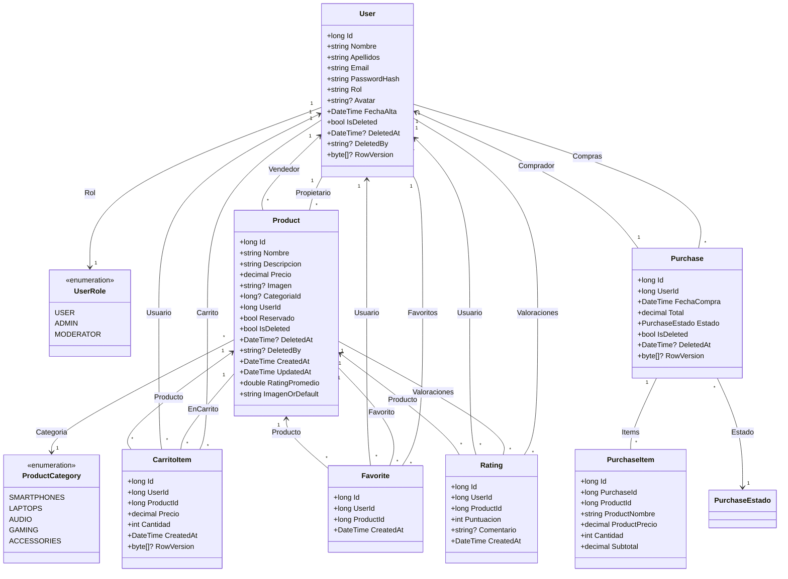
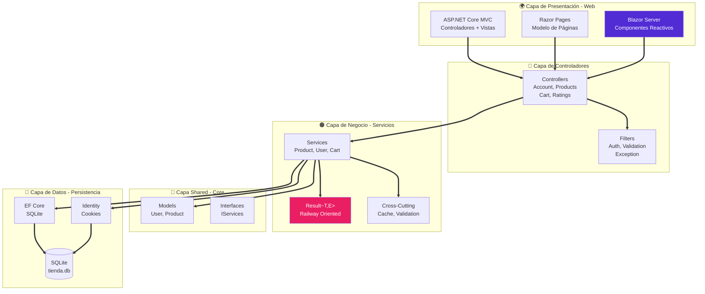
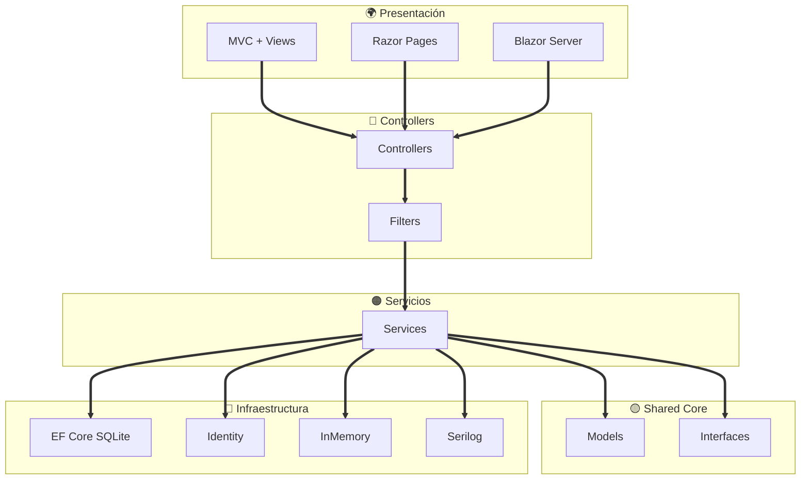
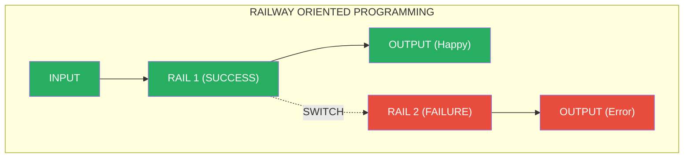

# WalaDaw 🛒


[](https://dotnet.microsoft.com/)
[](https://dotnet.microsoft.com/en-us/apps/aspnet)
[](https://docs.microsoft.com/en-us/dotnet/csharp/)
[](https://docs.microsoft.com/en-us/ef/core/)
[](https://dotnet.microsoft.com/en-us/apps/aspnet/web-apps/razor)
[](https://dotnet.microsoft.com/en-us/apps/aspnet/web-apps/blazor)
[](https://dotnet.microsoft.com/en-us/apps/aspnet/signalr)
[](https://playwright.dev/)
[](https://opensource.org/licenses/MIT)


**Ejemplo didáctico de web dinámicas con .NET 10 y ASP.NET Core MVC y Razor Pages.**

Una aplicación web de comercio electrónico de segunda mano con características avanzadas de seguridad, Railway Oriented Programming y gestión de usuarios con ASP.NET Core Identity.

## 🎯 Descripción

WalaDaw es un marketplace moderno desarrollado con .NET 10 ASP.NET Core que implementa una aplicación web completa para una tienda en línea, usando tanto Razor Pages como Blazor Server. El proyecto está diseñado con una arquitectura en capas con una aproximación híbrida de presentación que permite la coexistencia de renderizado tradicional (SSR) con componentes reactivos en tiempo real.

- 🏪 **Gestión de Productos y Categorías**: CRUD completo con validaciones
- 🛒 **Carrito de Compras**: Persistencia SQLite con control de concurrencia
- 👥 **Gestión de Usuarios**: Autenticación con ASP.NET Core Identity (Cookies)
- 💾 **Persistencia con SQLite In-Memory**: Base de datos volátil para testing rápido
- 🔐 **Seguridad**: Claims, roles, CSRF y protección de rutas
- 📡 **Blazor Server + SignalR**: Componentes interactivos y notificaciones en tiempo real
- 📊 **Panel de Administración**: Dashboard con estadísticas en tiempo real
- 🧪 **Testing**: Unit tests con NUnit, bUnit para Blazor, y E2E con Playwright
- 🎨 **Interfaz Híbrida**: Razor Pages + Blazor Server + AJAX (共存 de tres enfoques)

## 📑 Tabla de Contenidos

- [WalaDaw 🛒](#waladaw-)
  - [🎯 Descripción](#-descripción)
  - [📑 Tabla de Contenidos](#-tabla-de-contenidos)
  - [✨ Características](#-características)
  - [🚀 Tecnologías](#-tecnologías)
  - [🏃‍♂️ Inicio Rápido](#️-inicio-rápido)
    - [Desarrollo Local](#desarrollo-local)
    - [Desarrollo con Docker](#desarrollo-con-docker)
  - [🧪 Estrategia de Testing Total](#-estrategia-de-testing-total)
    - [Ejecución de Tests](#ejecución-de-tests)
      - [Tests Unitarios y de Componentes](#tests-unitarios-y-de-componentes)
      - [Tests E2E con Playwright](#tests-e2e-con-playwright)
      - [Con Coverage](#con-coverage)
      - [Configuración de Tests](#configuración-de-tests)
  - [📚 Documentación](#-documentación)
    - [Fundamentos y Configuración](#fundamentos-y-configuración)
    - [Controllers y Pages](#controllers-y-pages)
    - [Datos y Persistencia](#datos-y-persistencia)
    - [Interfaz de Usuario (Razor & Blazor)](#interfaz-de-usuario-razor--blazor)
    - [Seguridad y Autorización](#seguridad-y-autorización)
    - [Testing y Calidad](#testing-y-calidad)
    - [Optimización y Rendimiento](#optimización-y-rendimiento)
    - [Operaciones y Producción](#operaciones-y-producción)
  - [⚒️ Diagrama de Clases del Dominio](#️-diagrama-de-clases-del-dominio)
  - [📂 Estructura del Proyecto](#-estructura-del-proyecto)
    - [Descripción de Carpetas Principales](#descripción-de-carpetas-principales)
  - [🏗️ Arquitectura Híbrida MVC/Razor/Blazor](#️-arquitectura-híbrida-mvcrazorblazor)
    - [Principios Fundamentales](#principios-fundamentales)
    - [Capas de la Arquitectura](#capas-de-la-arquitectura)
    - [Estructura de Dependencias](#estructura-de-dependencias)
      - [Ventajas de Esta Arquitectura](#ventajas-de-esta-arquitectura)
  - [🛤️ Railway Oriented Programming (ROP)](#️-railway-oriented-programming-rop)
    - [Conceptos Fundamentales](#conceptos-fundamentales-1)
    - [Anatomía del Patrón (Two-Track Model)](#anatomía-del-patrón-two-track-model)
    - [Beneficios de ROP](#beneficios-de-rop)
    - [Ejemplos de Uso](#ejemplos-de-uso)
    - [Comparación: ROP vs Try-Catch](#comparación-rop-vs-try-catch)
  - [🗄️ Persistencia con SQLite](#️-persistencia-con-sqlite)
  - [🔐 Seguridad](#-seguridad)
  - [📡 Endpoints y Rutas](#-endpoints-y-rutas)
    - [MVC Controllers](#mvc-controllers)
    - [Razor Pages](#razor-pages)
    - [SignalR Hubs](#signalr-hubs)
  - [👥 Usuarios Demo](#-usuarios-demo)
  - [📝 Licencia](#-licencia)
  - [👨‍💻 Autor](#-autor)
    - [Contacto](#contacto)
  - [Licencia de uso](#licencia-de-uso)


## ✨ Características

| Categoría            | Funcionalidades                                                                 |
| -------------------- | -------------------------------------------------------------------------------- |
| **Gestión**          | Productos (CRUD), Categorías, Usuarios, Valoraciones, Favoritos                 |
| **Compras**          | Carrito persistente, Checkout, Facturas PDF, Historial de pedidos               |
| **Autenticación**    | Registro, Login, Roles (ADMIN, USER, MODERADOR), Claims, Password hashing        |
| **Tiempo Real**      | SignalR, Notificaciones live, Dashboard admin con estadísticas en vivo         |
| **Testing**          | Unit tests (NUnit), Componentes (bUnit), E2E (Playwright)                   |
| **UI/UX**            | Razor Pages, Blazor Server, AJAX, Bootstrap 5.3, I18n/L10n                       |

## 🚀 Tecnologías

| Tecnología               | Versión    | Propósito                                      |
| ------------------------ | ---------- | ---------------------------------------------- |
| **.NET**                 | 10         | Plataforma principal y runtime                |
| **C#**                   | 14         | Lenguaje de programación                      |
| **ASP.NET Core MVC**     | 10         | Framework web con patrón MVC                   |
| **Razor Pages**          | 10         | Motor de vistas del lado servidor              |
| **Blazor Server**        | 10         | Componentes interactivos en tiempo real        |
| **SignalR**              | 10         | Comunicación bidireccional para reactividad    |
| **EF Core**              | 10         | ORM con SQLite In-Memory                       |
| **SQLite In-Memory**     | -          | Base de datos volátil para desarrollo/testing  |
| **ASP.NET Core Identity**| 10         | Sistema de autenticación y autorización        |
| **NUnit**                | 4.x        | Framework de testing unitario                  |
| **bUnit**                | 2.x        | Testing de componentes Blazor                  |
| **Playwright**           | 1.x        | Testing E2E en navegador                       |
| **Bootstrap**            | 5.3        | Framework CSS responsive                       |
| **CSharpFunctionalExtensions**| 2.x   | Railway Oriented Programming (ROP)             |
| **OutputCache**          | 10         | Caché de respuestas HTML                       |
| **InMemoryCache**        | 10         | Caché de objetos en memoria                    |
| **Serilog**              | 8.x        | Logging estructurado                           |

## 🏃‍♂️ Inicio Rápido

### Desarrollo Local

```bash
# Clonar repositorio
git clone https://github.com/joseluisgs/TiendaDawWeb-NetCore.git
cd TiendaDawWeb-NetCore

# Restaurar dependencias
dotnet restore

# Ejecutar aplicación (Normal)
dotnet run --project TiendaDawWeb.Mvc

# Ejecutar con Hot Reload (Recomendado para desarrollo)
dotnet watch --project TiendaDawWeb.Mvc
```

> **Nota:** La aplicación usa SQLite In-Memory, por lo que los datos se pierden al detener la aplicación. Para desarrollo, usa `dotnet watch` para mantener los datos mientras editas.

### Desarrollo con Docker

Para ejecutar la aplicación en contenedores Docker:

```bash
# Construir y ejecutar todos los servicios
docker-compose up -d --build

# Ver logs de la aplicación
docker-compose logs -f

# Detener servicios
docker-compose down

# Detener y eliminar volúmenes
docker-compose down -v
```

**Servicios incluidos:**
- **TiendaDawWeb.Mvc** (puerto 5000): Aplicación MVC tradicional
- **TiendaDawWeb.RazorPages** (puerto 5002): Aplicación Razor Pages

> **Ver más:** [Docker y Contenedores](doc/24-Docker.md)

## 🧪 Estrategia de Testing Total

WalaDaw implementa una pirámide de pruebas profesional para garantizar la máxima calidad:

| Nivel | Tipo                    | Propósito                                      | Herramienta        |
| ----- | ---------------------- | ---------------------------------------------- | ------------------ |
| **1** | Unit Tests             | Validación de servicios, lógica de negocio      | NUnit              |
| **2** | Integration Tests      | Transacciones SQLite, Repositories              | NUnit + SQLite     |
| **3** | Component Tests        | Testeo reactivo de componentes Blazor          | bUnit v2.x         |
| **4** | E2E Tests              | Simulación de navegación real en navegador      | Playwright + C#    |

### Ejecución de Tests

```bash
# 🚀 Ejecutar TODOS los tests
dotnet test

# Solo tests unitarios y de integración (.NET)
dotnet test --filter "FullyQualifiedName!~E2E"

# Solo tests E2E (requiere aplicación corriendo)
cd TiendaDawWeb.Tests.E2E && dotnet test
```

#### Tests Unitarios y de Componentes

| Escenario                                     | Comando                              |
| --------------------------------------------- | ------------------------------------ |
| **Todos los tests**                           | `dotnet test`                       |
| **Solo unitarios**                            | `dotnet test --filter "Category=Unit"` |
| **Solo integración**                          | `dotnet test --filter "Category=Integration"` |
| **Solo componentes Blazor**                   | `dotnet test --filter "Category=Component"` |

#### Tests E2E con Playwright

```bash
# Ejecutar tests E2E
cd TiendaDawWeb.Tests.E2E && dotnet test

# Con video y screenshots
dotnet test --project TiendaDawWeb.Tests.E2E -v normal
```

> **Ver más:** [Unit Testing con NUnit y bUnit](doc/19-Unit-Testing.md), [E2E Testing con Playwright](doc/21-E2E-Testing.md)

#### Con Coverage

```bash
# Ejecutar todos los tests con coverage
dotnet test --collect:"XPlat Code Coverage"

# Ver reporte de coverage
open coverage/index.html
```

> **Ver más:** [Code Coverage](doc/20-Code-Coverage.md)

#### Configuración de Tests

| Tipo de Test    | Parallelización | Base de Datos           |
| --------------- | --------------- | ------------------------ |
| **Unit Tests**  | ✅ Paralelo     | Sin dependencia          |
| **Integration** | ✅ Paralelo     | SQLite In-Memory        |
| **Components**  | ✅ Paralelo     | Sin dependencia          |
| **E2E Tests**   | ❌ No paralelo  | Requiere app corriendo   |

## 📚 Documentación

Para una comprensión profunda de la arquitectura y las tecnologías utilizadas, consulta los documentos en la carpeta [`doc/`](doc/):

### Fundamentos y Configuración
| #   | Documento                                                         | Descripción                                        |
| --- | ----------------------------------------------------------------- | -------------------------------------------------- |
| 01  | [Arquitectura, Pipeline y DI](doc/01-Architecture-Pipeline-DI.md) | Middlewares, inyección de dependencias y host       |
| 02  | [Guía de Productividad](doc/02-Development-Tips.md)              | Hot Reload, tricks y productividad en .NET 10       |
| 03  | [Controladores Basics](doc/03-Controllers-Basics.md)            | Orquestación, Model Binding, Result<T,E>            |

### Controllers y Pages
| #   | Documento                                                   | Descripción                                        |
| --- | ----------------------------------------------------------- | -------------------------------------------------- |
| 04  | [MVC Controllers](doc/04-MVC-Controllers.md)               | Enfoque tradicional MVC, routing, binding          |
| 05  | [Razor Pages](doc/05-Razor-Pages.md)                       | Desarrollo web con Razor Pages y Tag Helpers        |

### Datos y Persistencia
| #   | Documento                                                   | Descripción                                        |
| --- | ----------------------------------------------------------- | -------------------------------------------------- |
| 06  | [SQLite Persistencia](doc/06-Persistence.md)               | Base de datos SQLite, EF Core                      |
| 07  | [Auditoría Automática](doc/07-Auditing.md)               | Tracking automático de quién/cuándo modifica datos |
| 08  | [Object Mapping](doc/08-Object-Mapping.md)                | Clean Controllers con mapeo de entidades a DTOs    |

### Interfaz de Usuario (Razor & Blazor)
| #   | Documento                                                   | Descripción                                        |
| --- | ----------------------------------------------------------- | -------------------------------------------------- |
| 09  | [Sintaxis Razor](doc/09-Razor-Syntax.md)                  | Razor syntax, Tag Helpers y patrones de UI         |
| 10  | [I18n Localización](doc/10-I18n.md)                     | Múltiples idiomas, formatos decimales y culturales|
| 11  | [JavaScript y AJAX](doc/11-JS-AJAX.md)                   | Fetch API, favoritos AJAX y seguridad CSRF          |
| 12  | [Razor vs AJAX vs Blazor](doc/12-BlazorVsRazor.md)        | Comparativa de los tres enfoques de interfaz        |
| 13  | [Blazor Server](doc/13-Blazor-Server.md)                   | Componentes interactivos con C#                    |
| 14  | [Blazor Communication](doc/14-Blazor-Comm.md)              | Comunicación entre componentes Blazor              |

### Tiempo Real
| #   | Documento                                           | Descripción                                |
| --- | --------------------------------------------------- | ------------------------------------------ |
| 15  | [SignalR Tiempo Real](doc/15-SignalR.md)         | Notificaciones en tiempo real              |

### Validación y Manejo de Errores
| #   | Documento                                           | Descripción                                   |
| --- | --------------------------------------------------- | --------------------------------------------- |
| 16  | [Exception Handling](doc/16-Exception-Handling.md) | Middleware de seguridad, ModelState vs Result |

### Seguridad y Autorización
| #   | Documento                                           | Descripción                                   |
| --- | --------------------------------------------------- | --------------------------------------------- |
| 17  | [Authentication Identity](doc/17-Auth-Identity.md) | ASP.NET Core Identity, Roles, Claims          |
| 18  | [Authentication Cookies](doc/18-Auth-Cookies.md)  | Cookies vs JWT, Identity, Claims              |

### Testing y Calidad
| #   | Documento                                           | Descripción                                       |
| --- | --------------------------------------------------- | ------------------------------------------------- |
| 19  | [Unit Testing](doc/19-Unit-Testing.md)           | Tests unitarios con NUnit y bUnit               |
| 20  | [Code Coverage](doc/20-Code-Coverage.md)         | Métricas de cobertura con Coverlet               |
| 21  | [E2E Testing](doc/21-E2E-Testing.md)             | Tests automatizados con Playwright               |

### Optimización y Rendimiento
| #   | Documento                                           | Descripción                           |
| --- | --------------------------------------------------- | ------------------------------------- |
| 22  | [InMemory Cache](doc/22-InMemory-Cache.md)       | Caché de objetos en memoria          |
| 23  | [Output Cache](doc/23-Output-Cache.md)           | Caché de respuestas HTML renderizadas|

### Operaciones y Producción
| #   | Documento                                           | Descripción                                           |
| --- | --------------------------------------------------- | ----------------------------------------------------- |
| 24  | [Docker](doc/24-Docker.md)                         | Contenedores y configuración de producción             |
| 25  | [Logging](doc/25-Logging.md)                       | Logging estructurado, correlación de peticiones        |
| 26  | [Infrastructure](doc/26-Infrastructure.md)         | Clean Architecture, DI, Extension Methods             |

## ⚒️ Diagrama de Clases del Dominio


```mermaid
classDiagram
  direction TB

  %% ENUMS
  class ProductCategory {
    <<enumeration>>
    SMARTPHONES
    LAPTOPS
    AUDIO
    GAMING
    ACCESSORIES
  }

  class UserRole {
    <<enumeration>>
    USER
    ADMIN
    MODERATOR
  }

  %% CLASES PRINCIPALES
  class User {
    +long Id
    +string Nombre
    +string Apellidos
    +string Email
    +string PasswordHash
    +string Rol
    +string? Avatar
    +DateTime FechaAlta
    +bool IsDeleted
    +DateTime? DeletedAt
    +string? DeletedBy
    +byte[]? RowVersion
  }

  class Product {
    +long Id
    +string Nombre
    +string Descripcion
    +decimal Precio
    +string? Imagen
    +long? CategoriaId
    +long UserId
    +bool Reservado
    +bool IsDeleted
    +DateTime? DeletedAt
    +string? DeletedBy
    +DateTime CreatedAt
    +DateTime UpdatedAt
    +double RatingPromedio
    +string ImagenOrDefault
  }

  class Purchase {
    +long Id
    +long UserId
    +DateTime FechaCompra
    +decimal Total
    +PurchaseEstado Estado
    +bool IsDeleted
    +DateTime? DeletedAt
    +byte[]? RowVersion
  }

  class PurchaseItem {
    +long Id
    +long PurchaseId
    +long ProductId
    +string ProductNombre
    +decimal ProductPrecio
    +int Cantidad
    +decimal Subtotal
  }

  class CarritoItem {
    +long Id
    +long UserId
    +long ProductId
    +decimal Precio
    +int Cantidad
    +DateTime CreatedAt
    +byte[]? RowVersion
  }

  class Favorite {
    +long Id
    +long UserId
    +long ProductId
    +DateTime CreatedAt
  }

  class Rating {
    +long Id
    +long UserId
    +long ProductId
    +int Puntuacion
    +string? Comentario
    +DateTime CreatedAt
  }

  %% RELACIONES
  User "1" --> "1" UserRole : Rol
  User "1" -- "*" Product : Propietario
  User "1" -- "*" Purchase : Compras
  User "1" -- "*" CarritoItem : Carrito
  User "1" -- "*" Favorite : Favoritos
  User "1" -- "*" Rating : Valoraciones

  Product "*" --> "1" ProductCategory : Categoria
  Product "1" -- "*" CarritoItem : EnCarrito
  Product "1" -- "*" Favorite : Favorito
  Product "1" -- "*" Rating : Valoraciones
  Product "*" --> "1" User : Vendedor

  Purchase "1" -- "*" PurchaseItem : Items
  Purchase "1" --> "1" User : Comprador
  Purchase "*" --> "1" PurchaseEstado : Estado

  CarritoItem "*" --> "1" User : Usuario
  CarritoItem "*" --> "1" Product : Producto

  Favorite "*" --> "1" User : Usuario
  Favorite "*" --> "1" Product : Producto

  Rating "*" --> "1" User : Usuario
  Rating "*" --> "1" Product : Producto
```

## 📂 Estructura del Proyecto

```
TiendaDawWeb-NetCore/
├── TiendaDawWeb.slnx                      # Solución global de .NET
├── docker-compose.yml                     # Orquestación por defecto
├── docker-compose.local.yml               # Desarrollo local
├── docker-compose.prod.yml                # Producción
├── .env.example                          # Variables de entorno de ejemplo
│
├── TiendaDawWeb.Mvc/                     # Proyecto Principal MVC
│   ├── Program.cs                         # Configuración de Pipeline, DI
│   ├── Controllers/                      # Controladores MVC
│   │   ├── AccountController.cs         # Auth (Login, Register)
│   │   ├── ProductsController.cs        # Gestión de productos
│   │   ├── CartController.cs            # Carrito de compras
│   │   └── Admin/                       # Panel de administración
│   ├── Views/                            # Vistas Razor
│   ├── wwwroot/                         # Recursos estáticos
│   ├── appsettings.json                  # Configuración
│   └── Dockerfile                       # Contenedor MVC
│
├── TiendaDawWeb.RazorPages/              # Proyecto Razor Pages
│   ├── Pages/                            # Páginas Razor
│   └── Program.cs                        # Configuración específica
│
├── TiendaDawWeb.Shared/                  # Lógica Compartida
│   ├── Models/                           # Modelos de dominio
│   │   ├── User.cs                      # Entidad Usuario
│   │   └── Product.cs                   # Entidad Producto
│   ├── Services/                        # Interfaces de Servicios
│   │   └── IProductService.cs          # Contrato productos
│   ├── Mappers/                         # Mapeadores
│   └── Extensions/                      # Extensiones DI
│
├── TiendaDawWeb.Shared.Blazor/         # Componentes Blazor
│   ├── Components/                      # Componentes reutilizables
│   │   ├── Admin/                      # Dashboard admin
│   │   └── Ratings/                    # Sistema de valoraciones
│   └── Services/                        # State Container
│
├── TiendaDawWeb.Tests/                 # Pruebas Unitarias
│   ├── Unit/                            # Tests unitarios
│   ├── Integration/                    # Tests de integración
│   └── Components/                     # Tests Blazor (bUnit)
│
├── TiendaDawWeb.Tests.E2E/             # Pruebas E2E (Playwright)
│   ├── Auth/                           # Tests de login/registro
│   ├── Products/                       # Tests de productos
│   └── E2ETestBase.cs                 # Clase base con video
│
├── doc/                                # Documentación técnica
└── README.md                           # Este archivo
```

### Descripción de Carpetas Principales

| Carpeta              | Propósito                                          | Contenido                                              |
| -------------------- | -------------------------------------------------- | ------------------------------------------------------ |
| **Controllers**      | Entry points HTTP MVC                              | Account, Products, Cart, Ratings, Admin              |
| **Views**            | Vistas Razor Pages                                 | Shared, Account, Products, Cart                        |
| **Components**       | Componentes Blazor Server                          | Admin/StatsWidget, Ratings/*                        |
| **Services**         | Lógica de negocio (Contratos)                     | IProductService, IUserService, ICartService           |
| **Models**           | Modelos de dominio                                | User, Product, Purchase, CarritoItem, Rating         |
| **Shared**           | Lógica compartida entre proyectos                  | Models, Services, Mappers                            |
| **Tests**            | Unit, Integration, Components                     | NUnit, bUnit                                           |
| **Tests.E2E**        | End-to-End                                        | Playwright con C#                                      |

## 🏗️ Arquitectura Híbrida MVC/Razor/Blazor

El proyecto implementa una arquitectura híbrida que combina el enfoque tradicional de MVC/Razor Pages con la reactividad moderna de Blazor Server.

### Principios Fundamentales

| Principio                           | Implementación                                                    |
| ----------------------------------- | ----------------------------------------------------------------- |
| **Core en el centro**               | Modelos (User, Product) sin dependencias externas                 |
| **Inversión de dependencias**       | Interfaces en Shared, implementaciones en el proyecto principal   |
| **Separación de responsabilidades** | Controllers → Services → Repositories → Data                      |
| **Interfaz híbrida**               | MVC + Razor Pages + Blazor Server coexisten                      |
| **Single Language Stack**           | C# en backend y frontend (Blazor Server)                        |

### Capas de la Arquitectura


```mermaid
graph TB
    subgraph "🌍 Capa de Presentación - Web"
        MVC["ASP.NET Core MVC<br/>Controladores + Vistas"]
        RP["Razor Pages<br/>Modelo de Páginas"]
        BLZR["Blazor Server<br/>Componentes Reactivos"]
    end

    subgraph "🔵 Capa de Controladores"
        CTRL["Controllers<br/>Account, Products<br/>Cart, Ratings"]
        FILT["Filters<br/>Auth, Validation<br/>Exception"]
    end

    subgraph "🟠 Capa de Negocio - Servicios"
        SVC["Services<br/>Product, User, Cart"]
        ROP["Result~T,E&gt;<br/>Railway Oriented"]
        CCC["Cross-Cutting<br/>Cache, Validation"]
    end

    subgraph "🔷 Capa Shared - Core"
        MOD["Models<br/>User, Product"]
        INT["Interfaces<br/>IServices"]
    end

    subgraph "🔴 Capa de Datos - Persistencia"
        EF["EF Core<br/>SQLite"]
        ID["Identity<br/>Cookies"]
        DB[("SQLite<br/>tienda.db")]
    end

    MVC & RP & BLZR ==> CTRL
    CTRL ==> FILT
    CTRL ==> SVC
    SVC ==> ROP
    SVC ==> CCC
    SVC ==> MOD
    SVC ==> EF
    SVC ==> ID
    EF & ID ==> DB

    style BLZR fill:#512bd4,color:#fff
    style ROP fill:#e91e63,color:#fff
```

### Estructura de Dependencias


```mermaid
graph TB
    subgraph "🌍 Presentación"
        MVC["MVC + Views"]
        RP["Razor Pages"]
        BLZR["Blazor Server"]
    end

    subgraph "🔵 Controllers"
        CTRL["Controllers"]
        FILT["Filters"]
    end

    subgraph "🟠 Servicios"
        SVC["Services"]
    end

    subgraph "🟡 Shared Core"
        MOD["Models"]
        INT["Interfaces"]
    end

    subgraph "🔴 Infraestructura"
        EF["EF Core SQLite"]
        ID["Identity"]
        CACHE["InMemory"]
        LOG["Serilog"]
    end

    MVC & RP & BLZR ==> CTRL
    CTRL ==> FILT
    FILT ==> SVC
    SVC ==> INT
    SVC ==> MOD
    SVC ==> EF & ID & CACHE & LOG
```

#### Ventajas de Esta Arquitectura

| Ventaja            | Descripción                                |
| ------------------ | ------------------------------------------ |
| **Flexibilidad**   | Tres enfoques de UI coexisten              |
| **Testabilidad**   | Core sin dependencias → fácil mocking      |
| **Mantenibilidad** | Cambios en UI no afectan lógica de negocio |

## 🛤️ Railway Oriented Programming (ROP)

El proyecto implementa **Railway Oriented Programming (ROP)** usando `CSharpFunctionalExtensions`.

### Conceptos Fundamentales

| Concepto    | Descripción                                         | Ejemplo                              |
| ----------- | --------------------------------------------------- | ------------------------------------ |
| **Result**  | Wrapper que encapsula éxito o fallo                 | `Result<T, TError>`                  |
| **Success** | Camino happy path con valor                         | `Result.Success(value)`              |
| **Failure** | Camino de error con mensaje                         | `Result.Failure(error)`              |
| **Bind**    | Encadena operaciones que retornan Result            | `result.Bind()`                      |
| **Map**     | Transforma el valor en éxito                        | `result.Map(value => newValue)`      |
| **Match**   | Maneja ambos casos                                 | `result.Match(onSuccess, onFailure)` |

### Anatomía del Patrón (Two-Track Model)


```mermaid
flowchart TB
    subgraph ROP["RAILWAY ORIENTED PROGRAMMING"]
        INP["INPUT"]
        R1["RAIL 1 (SUCCESS)"]
        OUT_H["OUTPUT (Happy)"]
        R2["RAIL 2 (FAILURE)"]
        OUT_E["OUTPUT (Error)"]
        
        INP --> R1
        R1 --> OUT_H
        R1 -.->|"SWITCH"| R2
        R2 --> OUT_E
    end

    style INP fill:#27ae60,color:#fff
    style R1 fill:#27ae60,color:#fff
    style OUT_H fill:#27ae60,color:#fff
    style R2 fill:#e74c3c,color:#fff
    style OUT_E fill:#e74c3c,color:#fff
```

### Beneficios de ROP

| Beneficio          | Descripción                                  |
| ------------------ | -------------------------------------------- |
| **Sin Exceptions** | Los errores son valores                      |
| **Composabilidad** | Encadenar operaciones de forma segura        |
| **Tipado Seguro**  | El tipo de error está en la firma            |
| **Legibilidad**    | Flujo lineal en lugar de if-else anidados    |

### Ejemplos de Uso

```csharp
public async Task<Result<Product, DomainError>> CreateAsync(CreateProductDto dto)
{
    return await Validate(dto)
        .Bind(ValidateStockAsync)
        .Bind(CreateProductAsync)
        .Map(p => _mapper.Map<Product>(p));
}

// Controller usage
var result = await _productService.CreateAsync(dto);
return result.Match(
    onSuccess: product => RedirectToAction("Index"),
    onFailure: error => View("Error", error));
```

### Comparación: ROP vs Try-Catch

| Aspecto         | Try-Catch tradicional     | ROP                     |
| --------------- | ------------------------ | ----------------------- |
| **Errores**     | Exceptions               | Valores                 |
| **Flujo**       | Saltos inesperados        | Lineal                  |
| **Tipado**      | Exception genérica       | Error tipado específico |
| **Composición** | Difícil                  | natural con Bind/Map    |

## 🗄️ Persistencia con SQLite

| Aspecto         | Descripción                                           |
| --------------- | ---------------------------------------------------- |
| **Base de Datos** | SQLite (relacional)                                  |
| **ORM**         | Entity Framework Core 10                             |
| **Patrón**      | Code First con migraciones                           |
| **Testing**     | SQLite In-Memory para tests rápidos                   |
| **Concurrencia** | Optimistic Concurrency (RowVersion)                   |

## 🔐 Seguridad

- ✅ **Cookies Authentication**: ASP.NET Core Identity con cookies
- ✅ **Role-Based Authorization**: ADMIN, USER, MODERADOR roles
- ✅ **Claims-Based**: Información adicional en tokens
- ✅ **CSRF Protection**: Anti-Forgery Tokens
- ✅ **Password Hashing**: BCrypt con salt aleatorio
- ✅ **Soft Delete**: Eliminación lógica (IsDeleted)
- ✅ **Concurrency Control**: RowVersion
- ✅ **Rate Limiting**: Protección contra DDoS
- ✅ **Security Headers**: X-Content-Type-Options

## 📡 Endpoints y Rutas

### MVC Controllers

#### Account Controller

| Endpoint                       | Método | Auth | Descripción                     |
| ------------------------------ | ------ | ---- | ------------------------------ |
| `/Account/Register`            | GET    | No   | Formulario de registro         |
| `/Account/Register`            | POST   | No   | Registrar nuevo usuario        |
| `/Account/Login`              | GET    | No   | Formulario de login           |
| `/Account/Login`              | POST   | No   | Iniciar sesión (Cookie)        |
| `/Account/Logout`             | POST   | Sí   | Cerrar sesión                 |
| `/Account/Profile`             | GET    | Sí   | Ver perfil propio              |

#### Products Controller

| Endpoint                      | Método | Auth | Descripción                       |
| ----------------------------- | ------ | ---- | -------------------------------- |
| `/Products`                   | GET    | No   | Listar productos                  |
| `/Products/{id:long}`         | GET    | No   | Ver producto                      |
| `/Products/Create`            | GET    | Sí   | Formulario crear producto        |
| `/Products/Create`            | POST   | Sí   | Crear producto                   |
| `/Products/{id}/Edit`         | GET    | Sí*  | Formulario editar producto        |

#### Cart Controller

| Endpoint                  | Método | Auth | Descripción                      |
| ------------------------ | ------ | ---- | -------------------------------- |
| `/Cart`                  | GET    | Sí   | Ver carrito                      |
| `/Cart/Add/{productId}`  | POST   | Sí   | Añadir producto al carrito        |
| `/Cart/Remove/{itemId}`   | POST   | Sí   | Eliminar item                    |
| `/Cart/Checkout`         | POST   | Sí   | Finalizar compra                 |

#### SignalR Hubs

| Endpoint          | Auth | Descripción                              | Eventos                    |
| ----------------- | ---- | --------------------------------------- | -------------------------- |
| `/adminHub`       | ADMIN| Dashboard en tiempo real              | StatsUpdated               |
| `/ratingsHub`     | Sí   | Notificaciones de valoraciones          | RatingAdded                |

## 👥 Usuarios Demo

| Usuario   | Email                 | Password | Rol       |
| --------- | --------------------- | -------- | --------- |
| Admin     | admin@waladaw.com     | admin    | ADMIN     |
| Prueba    | prueba@prueba.com     | user123  | USER      |

## 📝 Licencia

Este proyecto es un ejemplo educativo con fines didácticos.

## 👨‍💻 Autor

Codificado con :sparkling_heart: por [José Luis González Sánchez](https://twitter.com/JoseLuisGS_)

[](https://github.com/joseluisgs)

### Contacto

<p>
   <a href="https://joseluisgs.dev" target="_blank">
        
   </a> &nbsp;&nbsp;
   <a href="https://github.com/joseluisgs" target="_blank">
        
   </a> &nbsp;&nbsp;
   <a href="https://twitter.com/JoseLuisGS_" target="_blank">
        
   </a> &nbsp;&nbsp;
   <a href="https://www.linkedin.com/in/joseluisgonsan" target="_blank">
        
   </a>
</p>

## Licencia de uso

Este repositorio está licenciado bajo **Creative Commons**. Por favor si compartes, usas o modificas este proyecto cita a su autor.

<a rel="license" href="http://creativecommons.org/licenses/by-nc-sa/4.0/"></a>
