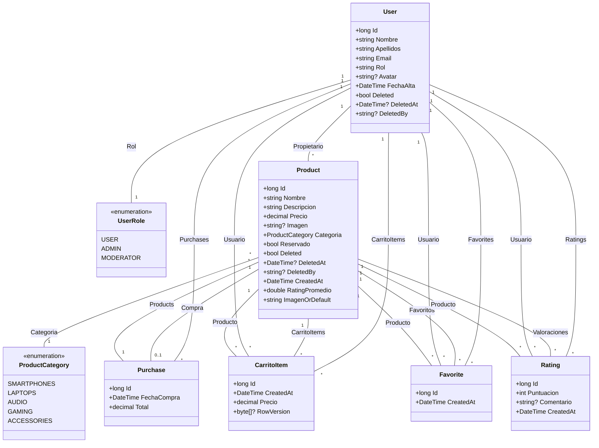
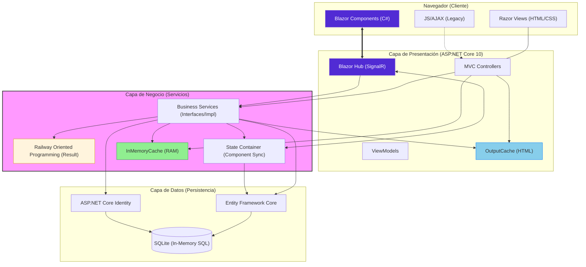

# WalaDaw 🛒


[](https://dotnet.microsoft.com/)
[](https://dotnet.microsoft.com/en-us/apps/aspnet)
[](https://docs.microsoft.com/en-us/dotnet/csharp/)
[](https://docs.microsoft.com/en-us/ef/core/)
[](https://dotnet.microsoft.com/en-us/apps/aspnet/web-apps/razor)
[](https://dotnet.microsoft.com/en-us/apps/aspnet/web-apps/blazor)
[](https://dotnet.microsoft.com/en-us/apps/aspnet/signalr)
[](https://playwright.dev/)
[](https://opensource.org/licenses/MIT)

**Ejemplo didáctico de web dinámicas con .NET 10 y ASP.NET Core MVC.**

Una aplicación web de comercio electrónico de segunda mano con características avanzadas de seguridad, Railway Oriented
Programming y gestión de usuarios con ASP.NET Core Identity.

## 🎯 Descripción

WalaDaw es un marketplace moderno desarrollado con .NET 10 que permite a los usuarios:

- Comprar y vender productos de segunda mano
- Gestionar perfiles de usuario con avatares
- Sistema de valoraciones y comentarios
- Panel de administración completo
- Subida de archivos e imágenes

## 📑 Tabla de Contenidos

- [WalaDaw 🛒](#waladaw-)
  - [🎯 Descripción](#-descripción)
  - [📑 Tabla de Contenidos](#-tabla-de-contenidos)
  - [✨ Características](#-características)
    - [Funcionalidades Principales](#funcionalidades-principales)
    - [Productos 2024-2025](#productos-2024-2025)
  - [🚀 Tecnologías](#-tecnologías)
  - [🏃‍♂️ Inicio Rápido](#️-inicio-rápido)
    - [Desarrollo Local](#desarrollo-local)
    - [🚀 Desarrollo Ágil (Hot Reload)](#-desarrollo-ágil-hot-reload)
  - [🧪 Estrategia de Testing Total](#-estrategia-de-testing-total)
    - [Ejecución de Tests](#ejecución-de-tests)
  - [📚 Documentación](#-documentación)
    - [Build y Tests](#build-y-tests)
  - [⚒️ Diagrama](#️-diagrama)
  - [📂 Estructura del Proyecto](#-estructura-del-proyecto)
  - [🏗️ Arquitectura](#️-arquitectura)
    - [Railway Oriented Programming (ROP)](#railway-oriented-programming-rop)
    - [ASP.NET Core Identity](#aspnet-core-identity)
  - [💡 Estrategias de Interfaz: El Triple Camino](#-estrategias-de-interfaz-el-triple-camino)
    - [1. SSR Tradicional (Razor Pages/Views)](#1-ssr-tradicional-razor-pagesviews)
    - [2. SPA dinámica con AJAX (Legacy Support)](#2-spa-dinámica-con-ajax-legacy-support)
    - [3. Componentes Reactivos (Blazor Server) 🚀](#3-componentes-reactivos-blazor-server-)
  - [👥 Usuarios Demo](#-usuarios-demo)
  - [🔒 Seguridad](#-seguridad)
  - [🌐 Características](#-características-1)
    - [Para Usuarios](#para-usuarios)
    - [Para Administradores](#para-administradores)
  - [📚 Documentación](#-documentación-1)
    - [🏗️ Fundamentos y Arquitectura](#️-fundamentos-y-arquitectura)
    - [💾 Datos y Persistencia](#-datos-y-persistencia)
    - [🎨 Interfaz de Usuario (Razor \& Blazor)](#-interfaz-de-usuario-razor--blazor)
    - [⚡ Interactividad y Tiempo Real](#-interactividad-y-tiempo-real)
    - [🛡️ Validación y Manejo de Errores](#️-validación-y-manejo-de-errores)
    - [🧪 Testing y Calidad](#-testing-y-calidad)
    - [⚡ Optimización y Rendimiento](#-optimización-y-rendimiento)
    - [🐳 Operaciones y Producción](#-operaciones-y-producción)
  - [📝 Licencia](#-licencia)
  - [👨‍💻 Autor](#-autor)
    - [Contacto](#contacto)
  - [Licencia de uso](#licencia-de-uso)

## ✨ Características

### Funcionalidades Principales

- 🛍️ **Marketplace de Segunda Mano**: Compra y vende productos usados
- 🔐 **Sistema de Roles**: ADMIN, USER, MODERADOR con permisos diferenciados
- 📧 **Notificaciones por Email**: Confirmación automática asíncrona de compras con templates HTML
- 📊 **Panel de Administración Completo**: Dashboard con estadísticas en tiempo real, gestión de usuarios, productos y compras gracias a Blazor Server y SignalR
- 🔍 **Búsqueda Avanzada**: Filtros por nombre, categoría y precio
- 🖼️ **Gestión de Imágenes**: Subida, validación y redimensionado automático con ImageSharp
- 📱 **Responsive Design**: Bootstrap 5.3 optimizado para todos los dispositivos
- 📄 **Generación de PDFs**: Facturas automáticas con iText7 y diseño profesional
- ❤️ **Sistema de Favoritos**: Gestión asíncrona con AJAX
- ⭐ **Valoraciones y Ratings**: Sistema completo de reviews con estrellas interactivo y en tiempo real con Blazor
- 🆕 **Notificaciones en Tiempo Real**: Actualizaciones instantáneas con SignalR
- 🛒 **Carrito de Compras**: Control de concurrencia con transacciones SERIALIZABLE
- 🛡️ **Seguridad CSRF**: Protección completa contra ataques Cross-Site Request Forgery
- 👤 **Gestión de Perfil**: Edición de perfil con avatar y cambio de contraseña
- 🔄 **Control de Concurrencia**: Manejo de race conditions con Optimistic Concurrency Control

### Productos 2024-2025

La aplicación incluye productos actuales y relevantes:

- 📱 **Smartphones**: iPhone 15 Pro Max, Samsung Galaxy S24 Ultra, Google Pixel 8 Pro
- 💻 **Laptops**: MacBook Pro M3
- 🎧 **Audio**: AirPods Pro 2ª Generación
- 🎮 **Gaming**: Steam Deck OLED

## 🚀 Tecnologías

- **.NET 10 con C# 14** - Plataforma principal
- **ASP.NET Core MVC** - Framework web con patrón MVC
- **Razor Views** - Motor de vistas del lado servidor
- **Blazor Server** - Componentes interactivos en tiempo real con C#
- **SignalR** - Comunicación bidireccional para reactividad Blazor
- **EF Core con SQLite In-Memory** - Motor SQL real en RAM con soporte de transacciones
- **ASP.NET Core Identity** - Sistema completo de autenticación y autorización
- **InMemoryCache** - Caché de objetos en RAM para reducir consultas a BD
- **OutputCache** - Caché de respuestas HTML en servidor para escalabilidad
- **CSharpFunctionalExtensions** - Railway Oriented Programming (ROP)
- **Bootstrap 5.3** - Framework CSS responsive
- **Bootstrap Icons** - Iconografía moderna
- **Localization (I18n/L10n)** - Soporte multilenguaje
- **Playwright** - Pruebas E2E automatizadas en navegador con C#

## 🏃‍♂️ Inicio Rápido

### Desarrollo Local

```bash
# Clonar repositorio
git clone https://github.com/joseluisgs/TiendaDawWeb-NetCore.git
cd TiendaDawWeb-NetCore

# Restaurar dependencias
dotnet restore

# Ejecutar aplicación (Normal)
dotnet run --project TiendaDawWeb.Web

# Ejecutar con Hot Reload (Recomendado para desarrollo)
dotnet watch --project TiendaDawWeb.Web
```

### 🚀 Desarrollo Ágil (Hot Reload)

Este proyecto está optimizado para **Hot Reload**. Si usas `dotnet watch`, podrás ver los cambios en la UI al instante sin perder los datos de la base de datos SQLite en memoria.

- **JetBrains Rider**: Activa "Apply hot reload changes on save" en los ajustes.
- **Visual Studio**: Usa el icono de la llama naranja o inicia con `Ctrl + F5`.

## 🧪 Estrategia de Testing Total

WalaDaw implementa una pirámide de pruebas profesional para garantizar la máxima calidad:

-   **Nivel 1: Pruebas Unitarias y de Integración (.NET)**: Validación de servicios, transacciones SQLite y lógica de negocio pura. Ubicadas en `TiendaDawWeb.Tests`.
-   **Nivel 2: Pruebas de Componentes (bUnit)**: Testeo reactivo de los componentes Blazor, simulando eventos de usuario en C#.
-   **Nivel 3: Pruebas de Extremo a Extremo (Playwright)**: Simulación de navegación real en el navegador con C#, validando la integración total de todos los módulos. Ubicadas en `TiendaDawWeb.Tests.E2E`.

### Ejecución de Tests
-   **Tests .NET**: `dotnet test`
-   **Tests E2E (Playwright)**: `cd TiendaDawWeb.Tests.E2E && dotnet test`

## 📚 Documentación

### Build y Tests

```bash
# 🛠️ Compilación y Ejecución .NET
dotnet build                                  # Compilar solución
dotnet run --project TiendaDawWeb.Web         # Ejecutar aplicación
dotnet watch --project TiendaDawWeb.Web       # Modo desarrollo (Hot Reload)

# 🧪 Pruebas Unitarias y de Componentes (.NET)
dotnet test                                   # Ejecutar todos los tests de C#

# 🤖 Pruebas de Extremo a Extremo (Playwright)
cd TiendaDawWeb.Tests.E2E && dotnet test
```

## ⚒️ Diagrama


```mermaid
classDiagram
  direction TB

%% ENUMS
  class ProductCategory {
    <<enumeration>>
    SMARTPHONES
    LAPTOPS
    AUDIO
    GAMING
    ACCESSORIES
  }

  class UserRole {
    <<enumeration>>
    USER
    ADMIN
    MODERATOR
  }

%% CLASES PRINCIPALES

  class User {
    +long Id
    +string Nombre
    +string Apellidos
    +string Email
    +string Rol
    +string? Avatar
    +DateTime FechaAlta
    +bool Deleted
    +DateTime? DeletedAt
    +string? DeletedBy
  }

  class Product {
    +long Id
    +string Nombre
    +string Descripcion
    +decimal Precio
    +string? Imagen
    +ProductCategory Categoria
    +bool Reservado
    +bool Deleted
    +DateTime? DeletedAt
    +string? DeletedBy
    +DateTime CreatedAt
    +double RatingPromedio
    +string ImagenOrDefault
  }

  class Purchase {
    +long Id
    +DateTime FechaCompra
    +decimal Total
  }

  class CarritoItem {
    +long Id
    +DateTime CreatedAt
    +decimal Precio
    +byte[]? RowVersion
  }

  class Favorite {
    +long Id
    +DateTime CreatedAt
  }

  class Rating {
    +long Id
    +int Puntuacion
    +string? Comentario
    +DateTime CreatedAt
  }

%% RELACIONES

  User "1" -- "*" Product : Propietario
  User "1" -- "*" Purchase : Purchases
  User "1" -- "*" CarritoItem : CarritoItems
  User "1" -- "*" Favorite : Favorites
  User "1" -- "*" Rating : Ratings
  User "1" -- "1" UserRole : Rol

  Product "*" -- "1" ProductCategory : Categoria
  Product "1" -- "0..1" Purchase : Compra
  Product "1" -- "*" CarritoItem : CarritoItems
  Product "1" -- "*" Favorite : Favoritos
  Product "1" -- "*" Rating : Valoraciones

  Purchase "1" -- "*" Product : Products

  Favorite "*" -- "1" User : Usuario
  Favorite "*" -- "1" Product : Producto

  Rating "*" -- "1" User : Usuario
  Rating "*" -- "1" Product : Producto

  CarritoItem "*" -- "1" User : Usuario
  CarritoItem "*" -- "1" Product : Producto
```

## 📂 Estructura del Proyecto

```
TiendaDawWeb-NetCore/
├── TiendaDawWeb.slnx                # Solución global de .NET (formato moderno)
│
├── TiendaDawWeb.Web/                # Proyecto Principal (ASP.NET Core 10)
│   ├── Program.cs                   # Configuración de Pipeline, DI, Cachés y SQLite In-Memory.
│   ├── _Imports.razor               # Usings globales para Blazor.
│   ├── Components/                  # Componentes Blazor Server (Reactividad)
│   │   ├── Admin/                   # Componentes administrativos (StatsWidget).
│   │   └── Ratings/                 # Dominio de valoraciones interactivo.
│   ├── Data/                        # Persistencia y SeedData profesional.
│   ├── Services/                    # Lógica de negocio y State Container.
│   ├── Implementations/              # Implementaciones con InMemoryCache y OutputCache.
│   ├── Controllers/                 # Controladores MVC y API Rest.
│   ├── Views/                       # Vistas Razor y configuración global (_ViewStart).
│   └── wwwroot/                     # Recursos estáticos (CSS, JS Legacy, Images).
│
├── TiendaDawWeb.Tests/              # Pruebas Unitarias y de Componentes
│   ├── Services/                    # Tests de lógica con SQLite In-Memory.
│   ├── Components/                  # Tests de UI Blazor con bUnit v2.x.
│   └── Infrastructure/              # Tests de auditoría automática.
│
└── TiendaDawWeb.Tests.E2E/         # Pruebas de Extremo a Extremo (Playwright)
    ├── Auth/                        # Tests de autenticación y registro.
    ├── Products/                    # Tests de búsqueda y gestión de productos.
    ├── Purchase/                    # Tests de flujo de compra y carrito.
    ├── Profile/                     # Tests de perfil y edición de usuario.
    ├── Favorites/                   # Tests de sistema de favoritos (AJAX).
    ├── Ratings/                     # Tests de valoraciones y ratings (Blazor).
    ├── Localization/                # Tests de localización y separadores decimales.
    ├── ErrorHandling/               # Tests de páginas de error personalizadas.
    ├── E2ETestBase.cs               # Clase base con soporte de video y screenshots.
    ├── Extensions/                  # Extensiones Playwright (TestId helper).
    └── Fixtures/                    # Archivos de prueba (SVG de test).
```

## 🏗️ Arquitectura

El proyecto sigue una arquitectura en capas con un enfoque híbrido de presentación, permitiendo una transición suave entre el renderizado tradicional y la reactividad moderna.


```mermaid
graph TD
    subgraph Cliente["Navegador (Cliente)"]
        UI_MVC["Razor Views (HTML/CSS)"]
        UI_BLZ["Blazor Components (C#)"]
        JS_AJAX["JS/AJAX (Legacy)"]
    end

    subgraph CapaPresentacion["Capa de Presentación (ASP.NET Core 10)"]
        CTRL["MVC Controllers"]
        HUB["Blazor Hub (SignalR)"]
        VM["ViewModels"]
        OUT["OutputCache (HTML)"]
    end

    subgraph CapaNegocio["Capa de Negocio (Servicios)"]
        SRV["Business Services (Interfaces/Impl)"]
        ROP["Railway Oriented Programming (Result)"]
        SC["State Container (Component Sync)"]
        IMC["InMemoryCache (RAM)"]
    end

    subgraph CapaDatos["Capa de Datos (Persistencia)"]
        EF["Entity Framework Core"]
        ID["ASP.NET Core Identity"]
        DB[("SQLite (In-Memory SQL)")]
    end

    %% Flujos de interacción
    UI_MVC --- CTRL
    JS_AJAX -.-> CTRL
    UI_BLZ <==> HUB

    CTRL --> SRV
    HUB --> SRV
    HUB <--> SC

    CTRL --> IMC
    CTRL --> OUT
    
    SRV --> ROP
    SRV --> IMC
    SRV --> OUT
    SRV --> SC

    SRV --> EF
    SC --> EF
    SRV --> ID

    EF --> DB
    ID --> DB

    %% Estilos
    style CapaNegocio fill:#f9f,stroke:#333,stroke-width:2px
    style UI_BLZ fill:#512bd4,color:#fff
    style HUB fill:#512bd4,color:#fff
    style ROP fill:#fff4dd,stroke:#d4a017
    style IMC fill:#90ee90,stroke:#28a745
    style OUT fill:#87ceeb,stroke:#007bff
```

### Railway Oriented Programming (ROP)

El proyecto implementa el patrón ROP usando `CSharpFunctionalExtensions`:

```csharp
public async Task<Result<Product, DomainError>> GetByIdAsync(long id)
{
    var product = await _context.Products.FirstOrDefaultAsync(p => p.Id == id);
    
    return product != null
        ? Result.Success<Product, DomainError>(product)
        : Result.Failure<Product, DomainError>(ProductError.NotFound(id));
}
```


### ASP.NET Core Identity

Sistema completo de autenticación y autorización:

- Roles personalizados (ADMIN, USER, MODERADOR)
- Password hashing seguro
- Cookie authentication
- Claims-based authorization

## 💡 Estrategias de Interfaz: El Triple Camino

WalaDaw es un laboratorio docente donde conviven tres enfoques para la construcción de interfaces, permitiendo al alumno comparar su implementación y beneficios:

### 1. SSR Tradicional (Razor Pages/Views)
Utilizado en el 90% de la web (Login, Registro, Listados estáticos).
- **Fortaleza:** Simplicidad, SEO nativo y seguridad robusta.
- **Debilidad:** Requiere recarga completa de página para cualquier cambio de estado.

### 2. SPA dinámica con AJAX (Legacy Support)
Implementado en el sistema original de Favoritos (ver `wwwroot/js/`).
- **Fortaleza:** UX fluida sin recargas.
- **Debilidad:** Fragmentación de código (C# en backend, JS en frontend), gestión manual de tokens CSRF y dificultad para sincronizar componentes.

### 3. Componentes Reactivos (Blazor Server) 🚀
Nuestra apuesta moderna para el Dashboard de Administración y el nuevo sistema de Valoraciones.
- **Fortaleza:** **Single Language Stack (C# everywhere)**. Permite usar servicios inyectados directamente en la UI, comunicación en tiempo real mediante SignalR y un modelo de estado compartido (`StateContainer`) que sincroniza múltiples componentes instantáneamente.
- **Comunicación:** Implementa el patrón **State Container**, permitiendo que componentes desacoplados se sincronicen mediante eventos C# sin necesidad de JavaScript.
- **Caso de éxito:** El `AdminStatsWidget` actualiza datos en vivo sin que el administrador tenga que refrescar manualmente la vista.


## 👥 Usuarios Demo

| Usuario   | Email                 | Password | Rol       |
| --------- | --------------------- | -------- | --------- |
| Admin     | admin@waladaw.com     | admin    | ADMIN     |
| Prueba    | prueba@prueba.com     | user123  | USER      |
| Moderador | moderador@waladaw.com | user123  | MODERADOR |
| Otro      | otro@otro.com         | user123  | USER      |


## 🔒 Seguridad

- ✅ Autenticación basada en ASP.NET Core Identity
- ✅ Autorización por roles (`[Authorize(Roles = "ADMIN")]`)
- ✅ Protección CSRF con Anti-Forgery Tokens
- ✅ Validación de subida de archivos (tipo y tamaño)
- ✅ Sanitización de nombres de archivo
- ✅ Control de concurrencia optimista (RowVersion)
- ✅ Transacciones SERIALIZABLE para carrito/compras
- ✅ Soft delete para usuarios y productos
- ✅ Password hashing seguro (Identity)
- ✅ Validación de propiedad de recursos
- ✅ Nullable reference types habilitadas
- ✅ TreatWarningsAsErrors activo

## 🌐 Características

### Para Usuarios

- ✅ Registro y login seguro
- ✅ Perfil con avatar personalizable
- ✅ Publicar productos con imágenes
- ✅ Editar y eliminar productos propios
- ✅ Sistema de valoraciones con estrellas
- ✅ Gestión de favoritos en tiempo real
- ✅ Carrito de compras con control de concurrencia
- ✅ Proceso de checkout completo
- ✅ Historial de compras
- ✅ Descarga de facturas en PDF
- ✅ Búsqueda avanzada con filtros
- ✅ Localización con I18n y L10n

### Para Administradores

- ✅ Panel de control completo (`/admin`)
- ✅ Dashboard con estadísticas en tiempo real
- ✅ Gestión de usuarios (ver, editar roles, eliminar)
- ✅ Gestión de productos (ver, filtrar, eliminar)
- ✅ Historial de todas las compras
- ✅ Estadísticas avanzadas:
    - Categorías más vendidas
    - Top 10 compradores
    - Top 10 vendedores
    - Ventas por mes (últimos 12 meses)
- ✅ Filtros por fecha y categoría

## 📚 Documentación

Para una comprensión profunda de la arquitectura y las tecnologías utilizadas, consulta nuestra documentación detallada en la carpeta [`doc/`](doc/):

### 🏗️ Fundamentos y Arquitectura
| #   | Documento                                                         | Descripción                                                     |
| --- | ----------------------------------------------------------------- | --------------------------------------------------------------- |
| 01  | [Arquitectura, Pipeline y DI](doc/01-Architecture-Pipeline-DI.md) | Middlewares, inyección de dependencias y configuración del host |
| 02  | [Guía de Productividad](doc/02-Development-Tips.md)               | Hot Reload, tricks y productividad en .NET 10                   |
| 03  | [Controladores y Models](doc/03-Controllers-Models-Results.md)    | Orquestación, Model Binding, Result<T,E> y validaciones         |

### 💾 Datos y Persistencia
| #   | Documento                                                   | Descripción                                        |
| --- | ----------------------------------------------------------- | -------------------------------------------------- |
| 04  | [EF Core y Persistencia](doc/04-EFCore-Persistence-Seed.md) | Configuración, migraciones y datos de prueba       |
| 05  | [SQLite In-Memory](doc/05-SQLite-InMemory-Persistence.md)   | Base de datos volátil para testing rápido          |
| 06  | [Auditoría Automática](doc/06-Entity-Auditing-EFCore.md)    | Tracking automático de quién/cuándo modifica datos |
| 07  | [Object Mapping](doc/07-Object-Mapping-Pattern.md)          | Clean Controllers con mapeo de entidades a DTOs    |

### 🎨 Interfaz de Usuario (Razor & Blazor)
| #   | Documento                                                   | Descripción                                        |
| --- | ----------------------------------------------------------- | -------------------------------------------------- |
| 09  | [Razor Masterclass](doc/09-Razor-Syntax-UI.md)              | Sintaxis Razor, Tag Helpers y patrones de UI       |
| 10  | [I18n y Localización](doc/10-I18n-Localization-Decimal.md)  | Múltiples idiomas, formatos decimales y culturales |
| 12  | [Razor vs AJAX vs Blazor](doc/12-BlazorVsRazorVsAjax.md)    | Comparativa de los tres enfoques de interfaz       |
| 13  | [Blazor Server Basics](doc/13-Blazor-Server-Basics.md)      | Componentes interactivos con C#                    |
| 14  | [State Container](doc/14-Blazor-Component-Communication.md) | Comunicación entre componentes Blazor              |

### ⚡ Interactividad y Tiempo Real
| #   | Documento                                           | Descripción                                |
| --- | --------------------------------------------------- | ------------------------------------------ |
| 11  | [JavaScript & AJAX](doc/11-JS-AJAX-Security.md)     | Fetch API, favoritos AJAX y seguridad CSRF |
| 15  | [SignalR](doc/15-SignalR-RealTime-Notifications.md) | Notificaciones en tiempo real              |

### 🛡️ Validación y Manejo de Errores
| #   | Documento                                                        | Descripción                                   |
| --- | ---------------------------------------------------------------- | --------------------------------------------- |
| 08  | [Global Exception Handling](doc/08-Global-Exception-Handling.md) | Middleware de seguridad, ModelState vs Result |

### 🧪 Testing y Calidad
| #   | Documento                                                            | Descripción                                       |
| --- | -------------------------------------------------------------------- | ------------------------------------------------- |
| 16  | [Unit Testing con NUnit y bUnit](doc/16-Unit-Testing-NUnit-bUnit.md) | Tests unitarios, integración y componentes Blazor |
| 17  | [Code Coverage](doc/17-Code-Coverage.md)                             | Métricas de cobertura con Coverlet                |
| 18  | [E2E Testing con Playwright](doc/18-E2E-Testing-Playwright.md)       | Tests automatizados de extremo a extremo          |

### ⚡ Optimización y Rendimiento
| #   | Documento                                              | Descripción                           |
| --- | ------------------------------------------------------ | ------------------------------------- |
| 19  | [InMemory Cache](doc/19-Optimizacion-InMemoryCache.md) | Caché de objetos en memoria           |
| 20  | [Output Cache](doc/20-OutputCache-Performance.md)      | Caché de respuestas HTML renderizadas |

### 🐳 Operaciones y Producción
| #   | Documento                                       | Descripción                                           |
| --- | ----------------------------------------------- | ----------------------------------------------------- |
| 21  | [Docker y Ficheros](doc/21-Ops-Docker-Files.md) | Contenedores, volúmenes y configuración de producción |

---

- Repositorio de apuntes de curso: [Desarrollo Web en Entornos Servidor](https://github.com/joseluisgs/DesarrolloWebEntornosServidor-05-2025-2026)

## 📝 Licencia

Este proyecto es un ejemplo educativo con fines didácticos.

## 👨‍💻 Autor

Codificado con :sparkling_heart: por [José Luis González Sánchez](https://twitter.com/JoseLuisGS_)

[](https://twitter.com/JoseLuisGS_)
[](https://github.com/joseluisgs)
[](https://github.com/joseluisgs)

### Contacto

<p>
   Cualquier cosa que necesites házmelo saber por si puedo ayudarte 💬.
</p>
<p>
   <a href="https://joseluisgs.dev" target="_blank">
        
     </a> &nbsp;&nbsp;
     <a href="https://github.com/joseluisgs" target="_blank">
        
     </a> &nbsp;&nbsp;
     <a href="https://twitter.com/JoseLuisGS_" target="_blank">
        
     </a> &nbsp;&nbsp;
     <a href="https://www.linkedin.com/in/joseluisgonsan" target="_blank">
        
     </a> &nbsp;&nbsp;
     <a href="https://g.dev/joseluisgs" target="_blank">
        
     </a>
     <a href="https://www.youtube.com/@joseluisgs" target="_blank">
        
     </a>
</p>

## Licencia de uso

Este repositorio y todo su contenido está licenciado bajo licencia **Creative Commons**, si desea saber más, vea
la [LICENSE](https://joseluisgs.dev/docs/license/). Por favor si compartes, usas o modificas este proyecto cita a su
autor, y usa las mismas condiciones para su uso docente, formativo o educativo y no comercial.

<a rel="license" href="http://creativecommons.org/licenses/by-nc-sa/4.0/"></a><br /><span xmlns:dct="http://purl.org/dc/terms/" property="dct:title">JoseLuisGS</span>
by <a xmlns:cc="http://creativecommons.org/ns#" href="https://joseluisgs.dev/" property="cc:attributionName" rel="cc:attributionURL">
    José Luis González Sánchez</a> is licensed under
<a rel="license" href="http://creativecommons.org/licenses/by-nc-sa/4.0/">Creative Commons
Reconocimiento-NoComercial-CompartirIgual 4.0 Internacional License</a>.<br />Creado a partir de la obra
en <a xmlns:dct="http://purl.org/dc/terms/" href="https://github.com/joseluisgs" rel="dct:source">https://github.com/joseluisgs</a>.
