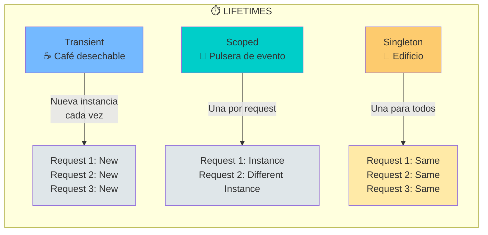

- [1. La Forja de .NET: Arquitectura, Middlewares y DI](#1-la-forja-de-net-arquitectura-middlewares-y-di)
  - [1. El Viaje de una Petición (Middleware Pipeline)](#1-el-viaje-de-una-petición-middleware-pipeline)
    - [1.1. Pipeline Visual](#11-pipeline-visual)
    - [1.1. Middlewares Clave en WalaDaw](#11-middlewares-clave-en-waladaw)
  - [2. Inyección de Dependencias (DI)](#2-inyección-de-dependencias-di)
    - [2.1. ¿Por qué usar DI?](#21-por-qué-usar-di)
    - [2.2. Los 3 Tiempos de Vida](#22-los-3-tiempos-de-vida)
    - [2.3. Peligro del Singleton](#23-peligro-del-singleton)
  - [3. Constructores Primarios C# 14](#3-constructores-primarios-c-14)
    - [3.1. Sintaxis Antigua vs Nueva](#31-sintaxis-antigua-vs-nueva)
    - [3.2. Beneficio](#32-beneficio)
  - [4. ViewModels: Seguridad y Flexibilidad](#4-viewmodels-seguridad-y-flexibilidad)
    - [4.1. ¿Por qué ViewModels?](#41-por-qué-viewmodels)
    - [4.2. Ejemplo de ViewModel](#42-ejemplo-de-viewmodel)
    - [4.3. Seguridad: Overposting](#43-seguridad-overposting)
  - [5. Patrón Result](#5-patrón-result)
    - [5.1. Definición en Servicio](#51-definición-en-servicio)
    - [5.2. Uso en Controlador](#52-uso-en-controlador)
    - [5.3. Ventajas del Patrón Result](#53-ventajas-del-patrón-result)
  - [6. TempData y Flash Messages](#6-tempdata-y-flash-messages)
    - [6.1. Flujo de TempData](#61-flujo-de-tempdata)
    - [6.2. Mostrar en Vista](#62-mostrar-en-vista)
    - [6.3. Característica Especial](#63-característica-especial)
  - [7. ContentRoot y WebRoot](#7-contentroot-y-webroot)
    - [7.1. Diferencias Clave](#71-diferencias-clave)
    - [7.2. Problema Común](#72-problema-común)
    - [7.3. Solución en Program.cs](#73-solución-en-programcs)
    - [7.4. Troubleshooting](#74-troubleshooting)

# 1. La Forja de .NET: Arquitectura, Middlewares y DI
.NET Core es una plataforma modular y flexible. En este capítulo, exploraremos cómo funciona su arquitectura interna, el pipeline de middlewares y la inyección de dependencias (DI).


## 1. El Viaje de una Petición (Middleware Pipeline)

Imagina tu aplicación ASP.NET Core como una fábrica. Cada estación (Middleware) realiza una tarea específica en la petición HTTP.

### 1.1. Pipeline Visual

```mermaid
flowchart LR
    subgraph "📥 PETICIÓN"
        Client[Navegador Web]
    end
    
    subgraph "🏭 PIPELINE MIDDLEWARE"
        Kestrel[Kestrel<br/>Servidor]
        Exception[Exception<br/>Handler]
        Https[Https<br/>Redirection]
        Static[Static<br/>Files]
        Routing[Routing]
        Localization[Localization]
        Auth[Authentication]
        Authorization[Authorization]
        Session[Session]
        End[Controller<br/>Razor<br/>Blazor]
    end
    
    subgraph "📤 RESPUESTA"
        Response[Navegador Web]
    end
    
    Client -->|HTTP Request| Kestrel
    Kestrel --> Exception
    Exception --> Https
    Https --> Static
    Static -->|Si no es static| Routing
    Routing --> Localization
    Localization --> Auth
    Auth --> Authorization
    Authorization --> Session
    Session --> End
    End -->|HTTP Response| Response
    
    style Exception fill:#ff6b6b
    style Auth fill:#4ecdc4
    style Authorization fill:#4ecdc4
    style End fill:#45b7d1
```



**La Regla de Oro**: El orden de `app.Use...` importa MUCHO.

### 1.1. Middlewares Clave en WalaDaw

| #   | Middleware               | Función                            |
| --- | ------------------------ | ---------------------------------- |
| 1.1 | `UseExceptionHandler`    | Captura excepciones no controladas |
| 1.2 | `UseHttpsRedirection`    | Redirige HTTP a HTTPS              |
| 1.3 | `UseStaticFiles`         | Serve CSS, JS, imágenes            |
| 1.4 | `UseRouting`             | Analiza la URL y determina la ruta |
| 1.5 | `UseRequestLocalization` | Configura idioma del usuario       |
| 1.6 | `UseAuthentication`      | Identifica al usuario (cookie)     |
| 1.7 | `UseAuthorization`       | Verifica permisos de acceso        |
| 1.8 | `UseSession`             | Datos temporales por usuario       |
| 1.9 | `MapControllerRoute`     | Ejecuta el controlador             |

---

## 2. Inyección de Dependencias (DI)

La DI es el patrón estrella de .NET Core. En lugar de que tus clases creen sus dependencias (`new MiServicio()`), las piden a un contenedor.

### 2.1. ¿Por qué usar DI?

- **Testabilidad**: Puedes simular dependencias (mocks) en pruebas
- **Mantenibilidad**: Cambiar implementación sin modificar código existente
- **Extensibilidad**: Añadir funcionalidades sin tocar código (Open/Closed)

### 2.2. Los 3 Tiempos de Vida



| Lifetime      | Metáfora                      | Comportamiento                  | Uso Común                        |
| ------------- | ----------------------------- | ------------------------------- | -------------------------------- |
| **Transient** | Café desechable               | Nueva instancia cada vez        | Servicios ligeros, sin estado    |
| **Scoped**    | Pulsera de evento             | Una instancia por petición HTTP | Servicios de negocio, DB Context |
| **Singleton** | Edificio del centro comercial | Una instancia para toda la app  | Configuración, caché global      |

```csharp
// Program.cs
builder.Services.AddScoped<IProductService, ProductService>();
builder.Services.AddSingleton<ITimeService, RealTimeService>();
builder.Services.AddTransient<IRandomNumberGenerator, GuidRandomNumberGenerator>();
```

### 2.3. Peligro del Singleton

⚠️ **Atención**: Si guardas datos específicos de un usuario en un Singleton, ¡todos los usuarios verán los mismos datos! Los Singletons deben ser thread-safe.

---

## 3. Constructores Primarios C# 14

C# 14 introduce constructores primarios que reducen el ruido visual en tus clases.

### 3.1. Sintaxis Antigua vs Nueva

```csharp
// Antes (C# antiguo)
public class MyService
{
    private readonly ILogger<MyService> _logger;
    private readonly IRepository _repository;

    public MyService(ILogger<MyService> logger, IRepository repository)
    {
        _logger = logger;
        _repository = repository;
    }
}

// Ahora (C# 14)
public class MyService(ILogger<MyService> logger, IRepository repository) : IMyService
{
    // 'logger' y 'repository' están disponibles automáticamente
    public void DoSomething() => logger.LogInformation("Doing something.");
}
```

### 3.2. Beneficio

Código más conciso, legible y menos propenso a errores (ej. olvidar asignar un campo).

---

## 4. ViewModels: Seguridad y Flexibilidad

Un ViewModel es un modelo diseñado específicamente para una vista.

### 4.1. ¿Por qué ViewModels?

| Beneficio       | Descripción                                     |
| --------------- | ----------------------------------------------- |
| **Seguridad**   | Previene overposting (campos ocultos malicious) |
| **Abstracción** | La vista recibe solo lo que necesita            |
| **Validación**  | Reglas específicas de UI separadas de BD        |

### 4.2. Ejemplo de ViewModel

```csharp
public class RegisterViewModel
{
    [Required, EmailAddress]
    public string Email { get; set; }

    [Required, DataType(DataType.Password)]
    [StringLength(100, MinimumLength = 4)]
    public string Password { get; set; }

    [DataType(DataType.Password), Compare("Password")]
    public string ConfirmPassword { get; set; }
}
```

### 4.3. Seguridad: Overposting

```csharp
// ❌ PELIGROSO: El usuario podría enviar 'IsAdmin=true' oculto
public IActionResult Create(Product product) => ...

// ✅ SEGURO: Solo recibe campos del ViewModel
public IActionResult Create(ProductViewModel vm) => ...
```

---

## 5. Patrón Result

Las excepciones son costosas y rompen el flujo. Para errores de negocio, usamos `Result<T, E>`.

### 5.1. Definición en Servicio

```csharp
public interface IProductService
{
    Task<Result<Product, DomainError>> GetByIdAsync(long id);
    Task<Result<bool, DomainError>> DeleteAsync(long id, long userId, bool isAdmin);
}
```

### 5.2. Uso en Controlador

```csharp
var result = await _productService.GetByIdAsync(id);
return result.Match(
    onSuccess: product => View(product),
    onFailure: error => error.Code switch
    {
        ProductError.NotFound.Code => NotFound(),
        _ => BadRequest(error.Message)
    }
);
```

### 5.3. Ventajas del Patrón Result

- ✅ El compilador obliga a gestionar éxito y fallo
- ✅ Código más robusto y predecible
- ✅ Rendimiento (no usa excepciones para flujo normal)

---

## 6. TempData y Flash Messages

`TempData` guarda datos en una cookie cifrada que sobrevive a una redirección.

### 6.1. Flujo de TempData

```csharp
// Controlador
[HttpPost]
public IActionResult Create(ProductViewModel model)
{
    _productService.Create(model);
    TempData["SuccessMessage"] = "¡Producto creado!";
    return RedirectToAction("Index");  // La redirección mantiene el mensaje
}
```

### 6.2. Mostrar en Vista

```razor
@if (TempData["SuccessMessage"] is string success)
{
    <div class="alert alert-success">@success</div>
}
@if (TempData["ErrorMessage"] is string error)
{
    <div class="alert alert-danger">@error</div>
}
```

### 6.3. Característica Especial

⚡ Los datos en TempData se eliminan automáticamente después de leerse una vez.

---

## 7. ContentRoot y WebRoot

### 7.1. Diferencias Clave

| Concepto            | Descripción                                      |
| ------------------- | ------------------------------------------------ |
| **ContentRootPath** | Directorio base (vistas, appsettings.json, DLLs) |
| **WebRootPath**     | Carpeta `wwwroot` (CSS, JS, imágenes estáticas)  |

### 7.2. Problema Común

Al ejecutar `dotnet run` desde la raíz de la solución, las rutas pueden fallar.

### 7.3. Solución en Program.cs

```csharp
var currentDir = Directory.GetCurrentDirectory();
var isRoot = !Directory.Exists(Path.Combine(currentDir, "wwwroot")) && 
             Directory.Exists(Path.Combine(currentDir, "TiendaDawWeb.Web", "wwwroot"));

var contentRoot = isRoot ? Path.Combine(currentDir, "TiendaDawWeb.Web") : currentDir;

var builder = WebApplication.CreateBuilder(new WebApplicationOptions
{
    ContentRootPath = contentRoot,
    WebRootPath = "wwwroot"
});

if (isRoot)
{
    builder.Environment.WebRootPath = Path.Combine(contentRoot, "wwwroot");
    builder.WebHost.UseStaticWebAssets();
}
```

### 7.4. Troubleshooting

Cuando veas `View not found` o 404 en archivos estátiços, verifica primero `ContentRootPath` y `WebRootPath`.

---

**Próximo Volumen**: [02. Guía de Productividad](../02-Development-Tips.md)
