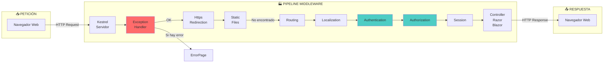

# 1. La Forja de .NET: Arquitectura, Middlewares y DI

## Índice

[1. La Forja de .NET: Arquitectura, Middlewares y DI](#1-la-forge-de-net-arquitectura-middlewares-y-di)
  - [1.1. El Viaje de una Petición (Middleware Pipeline)](#11-el-viaje-de-una-petición-middleware-pipeline)
  - [1.2. Inyección de Dependencias (DI)](#12-inyección-de-dependencias-di)
  - [1.3. Constructores Primarios C# 14](#13-constructores-primarios-c-14)
  - [1.4. ViewModels: Seguridad y Flexibilidad](#14-viewmodels-seguridad-y-flexibilidad)
  - [1.5. Patrón Result](#15-patrón-result)
  - [1.6. TempData y Flash Messages](#16-tempdata-y-flash-messages)
  - [1.7. ContentRoot y WebRoot](#17-contentroot-y-webroot)

---

## 1.1. El Viaje de una Petición (Middleware Pipeline)

Imagina tu aplicación ASP.NET Core como una fábrica. Cada estación (Middleware) realiza una tarea específica en la petición HTTP.

### Pipeline Visual



### Middlewares Clave en WalaDaw

```csharp
// Program.cs - Configuración de Middlewares
var builder = WebApplication.CreateBuilder(args);

var app = builder.Build();

// 1. Manejo de errores (primero para capturar excepciones)
app.UseExceptionHandler("/Error");

// 2. Redirección HTTPS (producción)
if (!app.Environment.IsDevelopment())
{
    app.UseHttpsRedirection();
    app.UseHsts();
}

// 3. Archivos estáticos (CSS, JS, imágenes)
app.UseStaticFiles();

// 4. Routing (decide qué controller/page recibe la petición)
app.UseRouting();

// 5. Localización (idioma del usuario)
app.UseRequestLocalization("es-ES");

// 6. Autenticación (identificar usuario)
app.UseAuthentication();

// 7. Autorización (verificar permisos)
app.UseAuthorization();

// 8. Session (datos temporales del usuario)
app.UseSession();

// 9. Endpoints (Controllers, Razor Pages, Blazor)
app.MapControllers();
app.MapRazorPages();
app.MapBlazorHub();

app.Run();
```

---

## 1.2. Inyección de Dependencias (DI)

**DI (Dependency Injection)** es un patrón de diseño que permite eliminar dependencias hardcodeadas, facilitando el testing y el mantenimiento.

### ¿Por qué usar DI?

| Problema sin DI                     | Solución con DI                              |
| ---------------------------------- | ------------------------------------------ |
| Acoplamiento fuerte entre clases     | Interfaces desacoplan clases                 |
| Difícil de testear                | Se pueden inyectar mocks                     |
| Código rígido                      | Componentes reutilizables                  |
| Cambios requieren modificar código | Solo cambiar la implementación               |

### Los 3 Tiempos de Vida

| Lifetime    | Descripción                                      | Ejemplo                           |
| ---------- | ------------------------------------------------ | -------------------------------- |
| **Singleton** | Una instancia para toda la aplicación             | IConfiguration, ILoggerFactory   |
| **Scoped**   | Una instancia por petición HTTP                   | DbContext, IUserAccessor        |
| **Transient** | Nueva instancia cada vez que se solicita          | Servicios ligeros, Helpers        |

```csharp
// Registro de servicios
builder.Services.AddDbContext<AppDbContext>(options =>
    options.UseSqlite(connectionString));

builder.Services.AddScoped<IProductRepository, ProductRepository>();
builder.Services.AddSingleton<ICacheService, MemoryCacheService>();
builder.Services.AddTransient<IEmailService, EmailService>();
```

### Peligro del Singleton

```csharp
// ❌ PELIGROO: DbContext como Singleton
builder.Services.AddSingleton<AppDbContext>(new AppDbContext(options));

// ✅ CORRECTO: DbContext como Scoped
builder.Services.AddDbContext<AppDbContext>(options => 
    options.UseSqlite(connectionString));

// ⚠️ Singleton solo para servicios SIN estado
builder.Services.AddSingleton<MetricsService>();
```

---

## 1.3. Constructores Primarios C# 14

Los **constructores primarios** simplifican la sintaxis de constructores en C# 14.

### Sintaxis Antigua vs Nueva

```csharp
// ❌ Antigua (C# 1-13)
public class ProductService
{
    private readonly IProductRepository _repository;
    private readonly ILogger<ProductService> _logger;
    
    public ProductService(
        IProductRepository repository,
        ILogger<ProductService> logger)
    {
        _repository = repository;
        _logger = logger;
    }
}

// ✅ Nueva (C# 14) - Constructor Primario
public class ProductService(
    IProductRepository repository,
    ILogger<ProductService> logger)
{
    // repository y logger están disponibles directamente
    public async Task<Product?> GetByIdAsync(long id)
    {
        return await repository.GetByIdAsync(id);
    }
}
```

### Beneficio

| Aspecto       | Antigua              | Nueva (C# 14)         |
| ------------ | ------------------- | ---------------------- |
| **Líneas**   | 8-12                | 1                      |
| **Repetición**| Alta (parámetros repetidos) | Ninguna             |
| **Lectura**  | Más código boilerplate| Más limpio            |
| **Propiedades**| Se requiere `init` | Automáticas            |

---

## 1.4. ViewModels: Seguridad y Flexibilidad

Los **ViewModels** son clases específicas para las vistas que contienen solo los datos necesarios.

### ¿Por qué ViewModels?

| Problema con Entity directa | Solución con ViewModel                |
| ------------------------ | ----------------------------------- |
| Sobrecarga de datos      | Solo datos necesarios               |
| Validación conjunta      | Validación específica por vista      |
| Seguridad (overposting)  | Propiedades controladas             |
| Formateo específico      | Datos ya formateados               |

### Ejemplo de ViewModel

```csharp
// ❌ PELIGROSO: Entity como Model de vista
public class Product
{
    public long Id { get; set; }
    public string Nombre { get; set; }
    public decimal Precio { get; set; }
    public decimal CostoInterno { get; set; } // ¡Sensible!
    public bool IsDeleted { get; set; }
    public DateTime DeletedAt { get; set; }
}

// ✅ SEGURO: ViewModel específico
public class ProductDetailViewModel
{
    public long Id { get; set; }
    public string Nombre { get; set; }
    public string Descripcion { get; set; }
    public decimal Precio { get; set; }
    public string PrecioFormateado => Precio.ToString("C");
    public string? Imagen { get; set; }
    public double RatingPromedio { get; set; }
    public int TotalReviews { get; set; }
    public string VendedorNombre { get; set; }
}
```

### Seguridad: Overposting

```csharp
// ❌ VULNERABLE A OVERPOSTING
[HttpPost]
public IActionResult Create(Product product) // ¡Peligroso!
{
    // User puede enviar IsAdmin = true, IsDeleted = true
}

// ✅ PROTEGIDO CON VIEWMODEL
[HttpPost]
public IActionResult Create(CreateProductViewModel vm)
{
    // Solo las propiedades del ViewModel se bindean
}
```

---

## 1.5. Patrón Result

El **Patrón Result** encapsula el resultado de una operación, evitando excepciones para errores de negocio.

### Definición en Servicio

```csharp
public class ProductService
{
    private readonly AppDbContext _context;
    private readonly ILogger<ProductService> _logger;
    
    public ProductService(AppDbContext context, ILogger<ProductService> logger)
    {
        _context = context;
        _logger = logger;
    }
    
    public Result<Product, string> GetById(long id)
    {
        var product = _context.Products.Find(id);
        
        if (product == null)
            return Result<Product, string>.Failure("Producto no encontrado");
        
        return Result<Product, string>.Success(product);
    }
    
    public async Task<Result<Product, string>> CreateAsync(CreateProductDto dto)
    {
        try
        {
            var product = new Product
            {
                Nombre = dto.Nombre,
                Precio = dto.Precio,
                CreatedAt = DateTime.UtcNow
            };
            
            _context.Products.Add(product);
            await _context.SaveChangesAsync();
            
            return Result<Product, string>.Success(product);
        }
        catch (Exception ex)
        {
            _logger.LogError(ex, "Error creando producto");
            return Result<Product, string>.Failure("Error al crear producto");
        }
    }
}
```

### Uso en Controlador

```csharp
public class ProductsController : Controller
{
    private readonly ProductService _productService;
    
    public ProductsController(ProductService productService)
    {
        _productService = productService;
    }
    
    public IActionResult Details(long id)
    {
        var result = _productService.GetById(id);
        
        return result.Match(
            onSuccess: product => View(product),
            onFailure: error => NotFound(error)
        );
    }
    
    [HttpPost]
    public async Task<IActionResult> Create(CreateProductDto dto)
    {
        var result = await _productService.CreateAsync(dto);
        
        return result.Match(
            onSuccess: product => RedirectToAction("Details", new { id = product.Id }),
            onFailure: error => View("Error", error)
        );
    }
}
```

### Ventajas del Patrón Result

| Ventaja                | Descripción                                      |
| --------------------- | ------------------------------------------------ |
| **Sin excepciones**    | Errores como valores, no excepciones              |
| **Tipado seguro**     | Errores específicos en el tipo de retorno        |
| **Flujo claro**       | Match hace explícito el manejo de éxito/error     |
| **Testeable**         | Fácil testear ambos casos (éxito y fallo)        |

---

## 1.6. TempData y Flash Messages

**TempData** permite pasar datos entre peticiones HTTP de forma temporal.

### Flujo de TempData

```mermaid
flowchart LR
    A[Petición 1<br/>Controller] -->|TempData["Success"]| B[Redirect]
    B --> C[Petición 2<br/>Vista]
    C -->|Mostrar mensaje| D[Usuario ve<br/>Flash Message]
    
    style A fill:#4ecdc4
    style B fill:#ffe66d
    style C fill:#4ecdc4
    style D fill:#ffe66d
```

### Mostrar en Vista

```csharp
// Controller
public IActionResult Create(ProductDto dto)
{
    if (!ModelState.IsValid)
        return View(dto);
    
    _service.Create(dto);
    
    TempData["Success"] = "Producto creado correctamente";
    
    return RedirectToAction("Index");
}
```

```html
<!-- Vista (_Layout.cshtml o _Notifications.cshtml) -->
@if (TempData.TryGetValue("Success", out var success))
{
    <div class="alert alert-success alert-dismissible fade show">
        @success
        <button type="button" class="btn-close" data-bs-dismiss="alert"></button>
    </div>
}

@if (TempData.TryGetValue("Error", out var error))
{
    <div class="alert alert-danger alert-dismissible fade show">
        @error
        <button type="button" class="btn-close" data-bs-dismiss="alert"></button>
    </div>
}
```

### Característica Especial

```csharp
// ✅ TempData SE GUARDA entre Redirect (PRG Pattern)
public IActionResult Create(ProductDto dto)
{
    _service.Create(dto);
    TempData["Message"] = "Guardado!";  // Se preserva
    return RedirectToAction("Index");     // Redirect
}

// Segunda petición Lee TempData
public IActionResult Index()
{
    var message = TempData["Message"];  // ✓ Disponible
}
```

---

## 1.7. ContentRoot y WebRoot

**ContentRoot** es la carpeta raíz del proyecto (donde está `.csproj`). **WebRoot** es la carpeta de archivos estáticos (por defecto `wwwroot`).

### Diferencias Clave

| Aspecto              | ContentRoot                              | WebRoot                             |
| ------------------- | --------------------------------------- | ----------------------------------- |
| **Propósito**        | Archivos de código, configuración        | Archivos públicos (CSS, JS, imágenes)|
| **Ubicación**        | Raíz del proyecto                       | `/wwwroot/`                         |
| **Acceso**           | `IWebHostEnvironment.ContentRootPath`    | `IWebHostEnvironment.WebRootPath`     |
| **Archivos típicos** | `.csproj`, `appsettings.json`           | `css/`, `js/`, `images/`           |

### Problema Común

```csharp
// ❌ ERROR: WebRootPath es NULL si wwwroot no existe
var imagesPath = Path.Combine(
    _env.WebRootPath, 
    "images", 
    "products"
);

// ✅ CORRECTO: Verificar y crear directorio
var imagesPath = Path.Combine(
    _env.ContentRootPath,  // Más seguro
    "uploads", 
    "products"
);

Directory.CreateDirectory(imagesPath);
```

### Solución en Program.cs

```csharp
var builder = WebApplication.CreateBuilder(args);

// Configurar WebRoot explícitamente
builder.WebHost.UseWebRoot("wwwroot");

// O crear wwwroot si no existe
var webRootPath = Path.Combine(builder.Environment.ContentRootPath, "wwwroot");
if (!Directory.Exists(webRootPath))
{
    Directory.CreateDirectory(webRootPath);
}

var app = builder.Build();

// Configurar archivos estáticos
app.UseStaticFiles();  // Usa WebRoot por defecto

// Mapear carpeta uploads como estática
var uploadsPath = Path.Combine(builder.Environment.ContentRootPath, "uploads");
app.UseStaticFiles(new StaticFileOptions
{
    FileProvider = new PhysicalFileProvider(uploadsPath),
    RequestPath = "/uploads"
});
```

### Troubleshooting

| Problema                            | Solución                                              |
| ----------------------------------- | ---------------------------------------------------- |
| CSS/JS no carga                     | Verificar `wwwroot/` existe                           |
| Imágenes 404                       | Verificar `UseStaticFiles()` está llamado              |
| Archivos fuera de wwwroot          | Usar `UseStaticFiles()` con `FileProvider`              |
| Ruta incorrecta                   | Usar `_env.ContentRootPath` (más seguro)              |

---

**Anterior**: [README](../README.md)  
**Próximo**: [02. Guía de Productividad](../02-Development-Tips.md)
