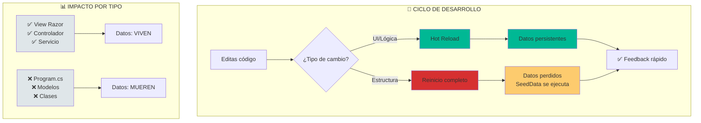

# 2. Guía de Productividad: Hot Reload y Trucos

## Índice

[2. Guía de Productividad: Hot Reload y Trucos](#2-guía-de-productividad-hot-reload-y-trucos)
  - [2.1. Hot Reload (Recarga en Caliente)](#21-hot-reload-recarga-en-caliente)
  - [2.2. Uso de dotnet watch](#22-uso-de-dotnet-watch)
  - [2.3. Trucos para Rider](#23-trucos-para-rider)
  - [2.4. Trucos para Visual Studio](#24-trucos-para-visual-studio)
  - [2.5. El "Limbo" de la Persistencia](#25-el-limbo-de-la-persistencia)

---

## 2.1. Hot Reload (Recarga en Caliente)

Hot Reload permite aplicar cambios en el código **sin reiniciar el servidor**.

### Flujo de Hot Reload



### ¿Por qué es vital en WalaDaw?

Como usamos **SQLite In-Memory**, si reiniciamos la aplicación, **perdemos los datos**. Con Hot Reload:

| Acción               | Hot Reload          | Datos        |
| -------------------- | ------------------- | ------------ |
| Cambiar Vista Razor  | ✅ Funciona          | ✅ Persisten  |
| Cambiar Controlador  | ✅ Funciona          | ✅ Persisten  |
| Cambiar Program.cs   | ❌ Requiere reinicio | ❌ Se pierden |
| Cambiar modelo/clase | ❌ Requiere reinicio | ❌ Se pierden |

### Beneficios Principales

- 🔄 **Ciclo de feedback rápido**: Ve cambios instantáneamente
- 💾 **Datos vivos**: No pierdes lo que has creado en tests
- ⚡ **Productividad**: Menos tiempo esperando reinicios

---

## 2.2. Uso de dotnet watch

El comando `watch` vigila archivos y aplica Hot Reload automáticamente.

### Comando Correcto

```bash
dotnet watch --project TiendaDawWeb.Web
```

⚠️ Especifica el proyecto porque la solución tiene múltiples proyectos.

### Atajos en Terminal

| Tecla    | Acción                                            |
| -------- | ------------------------------------------------ |
| `r`      | Reinicio completo (útil si DB está inconsistente) |
| `b`      | Fuerza compilación                                |
| `Ctrl+C` | Detener                                           |

---

## 2.3. Trucos para Rider

Rider es un IDE de alto rendimiento. Aprende a usarlo al máximo.

### El Rayo Amarillo

Cuando la app corre, verás un icono de rayo en la barra superior. Púlselo para inyectar cambios (Apply Changes).

### Hot Reload Automático

1. Ve a `Settings` → `Build, Execution, Deployment` → `Hot Reload`
2. Activa **"Apply hot reload changes on save"**
3. Cada `Ctrl+S` actualiza la web automáticamente

### Terminal Integrada

No salgas del IDE. Usa `Alt+F12` para abrir la terminal. Rider reconocerá errores de compilación directamente.

---

## 2.4. Trucos para Visual Studio

### Icono de la Llama

Usa el botón de la llama naranja para aplicar cambios sin reiniciar.

### Ctrl + F5 (Sin Depurar)

Inicia siempre con `Ctrl + F5`. El Hot Reload es más estable y rápido sin el debugger enganchado.

---

## 2.5. El "Limbo" de la Persistencia

### Regla de Oro

| Tipo de Cambio                  | Hot Reload | Datos        |
| ------------------------------- | ---------- | ------------ |
| UI/Lógica                       | ✅ Sí       | ✅ Persisten  |
| Estructura (clases, Program.cs) | ❌ No       | ❌ Se pierden |

### Recomendación

Cuando trabajes con datos de prueba y quieras conservarlos:
- Evita cambiar clases, modelos o Program.cs
- Limita cambios a Vistas, Controladores y lógica de servicios

---

**Anterior**: [01. Arquitectura y Pipeline DI](../01-Architecture-Pipeline-DI.md)  
**Próximo**: [03. Controladores y Models](../03-Controllers-Basics.md)
