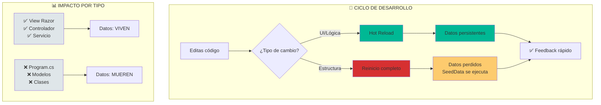

- [2. Guía de Productividad: Hot Reload y Trucos](#2-guía-de-productividad-hot-reload-y-trucos)
  - [1. Hot Reload (Recarga en Caliente)](#1-hot-reload-recarga-en-caliente)
    - [1.1. Flujo de Hot Reload](#11-flujo-de-hot-reload)
    - [1.2. ¿Por qué es vital en WalaDaw?](#12-por-qué-es-vital-en-waladaw)
    - [1.2. Beneficios Principales](#12-beneficios-principales)
  - [2. Uso de dotnet watch](#2-uso-de-dotnet-watch)
    - [2.1. Comando Correcto](#21-comando-correcto)
    - [2.2. Atajos en Terminal](#22-atajos-en-terminal)
  - [3. Trucos para Rider](#3-trucos-para-rider)
    - [3.1. El Rayo Amarillo](#31-el-rayo-amarillo)
    - [3.2. Hot Reload Automático](#32-hot-reload-automático)
    - [3.3. Terminal Integrada](#33-terminal-integrada)
  - [4. Trucos para Visual Studio](#4-trucos-para-visual-studio)
    - [4.1. Icono de la Llama](#41-icono-de-la-llama)
    - [4.2. Ctrl + F5 (Sin Depurar)](#42-ctrl--f5-sin-depurar)
  - [5. El "Limbo" de la Persistencia](#5-el-limbo-de-la-persistencia)
    - [5.1. Regla de Oro](#51-regla-de-oro)
    - [5.2. Recomendación](#52-recomendación)


# 2. Guía de Productividad: Hot Reload y Trucos
En este sección, exploraremos cómo maximizar tu productividad durante el desarrollo con .NET utilizando Hot Reload y otros trucos útiles en IDEs populares como Rider y Visual Studio.

## 1. Hot Reload (Recarga en Caliente)

Hot Reload permite aplicar cambios en el código **sin reiniciar el servidor**.

### 1.1. Flujo de Hot Reload



### 1.2. ¿Por qué es vital en WalaDaw?

Como usamos **SQLite In-Memory**, si reiniciamos la aplicación, **perdemos los datos**. Con Hot Reload:

| Acción               | Hot Reload          | Datos        |
| -------------------- | ------------------- | ------------ |
| Cambiar Vista Razor  | ✅ Funciona          | ✅ Persisten  |
| Cambiar Controlador  | ✅ Funciona          | ✅ Persisten  |
| Cambiar Program.cs   | ❌ Requiere reinicio | ❌ Se pierden |
| Cambiar modelo/clase | ❌ Requiere reinicio | ❌ Se pierden |

### 1.2. Beneficios Principales

- 🔄 **Ciclo de feedback rápido**: Ve cambios instantáneamente
- 💾 **Datos vivos**: No pierdes lo que has creado en tests
- ⚡ **Productividad**: Menos tiempo esperando reinicios

---

## 2. Uso de dotnet watch

El comando `watch` vigila archivos y aplica Hot Reload automáticamente.

### 2.1. Comando Correcto

```bash
dotnet watch --project TiendaDawWeb.Web
```

⚠️ Especifica el proyecto porque la solución tiene múltiples proyectos.

### 2.2. Atajos en Terminal

| Tecla    | Acción                                            |
| -------- | ------------------------------------------------- |
| `r`      | Reinicio completo (útil si DB está inconsistente) |
| `b`      | Fuerza compilación                                |
| `Ctrl+C` | Detener                                           |

---

## 3. Trucos para Rider

Rider es un IDE de alto rendimiento. Aprende a usarlo al máximo.

### 3.1. El Rayo Amarillo

Cuando la app corre, verás un icono de rayo en la barra superior. Púlselo para inyectar cambios (Apply Changes).

### 3.2. Hot Reload Automático

1. Ve a `Settings` → `Build, Execution, Deployment` → `Hot Reload`
2. Activa **"Apply hot reload changes on save"**
3. Cada `Ctrl+S` actualiza la web automáticamente

### 3.3. Terminal Integrada

No salgas del IDE. Usa `Alt+F12` para abrir la terminal. Rider reconocerá errores de compilación directamente.

---

## 4. Trucos para Visual Studio

### 4.1. Icono de la Llama

Usa el botón de la llama naranja para aplicar cambios sin reiniciar.

### 4.2. Ctrl + F5 (Sin Depurar)

Inicia siempre con `Ctrl + F5`. El Hot Reload es más estable y rápido sin el debugger enganchado.

---

## 5. El "Limbo" de la Persistencia

### 5.1. Regla de Oro

| Tipo de Cambio                  | Hot Reload | Datos        |
| ------------------------------- | ---------- | ------------ |
| UI/Lógica                       | ✅ Sí       | ✅ Persisten  |
| Estructura (clases, Program.cs) | ❌ No       | ❌ Se pierden |

### 5.2. Recomendación

Cuando trabajes con datos de prueba y quieras conservarlos:
- Evita cambiar clases, modelos o Program.cs
- Limita cambios a Vistas, Controladores y lógica de servicios

---

**Anterior Volumen**: [01. Arquitectura y Pipeline DI](../01-Architecture-Pipeline-DI.md)  
**Próximo Volumen**: [03. Controladores y Models](../03-Controllers-Models-Results.md)
