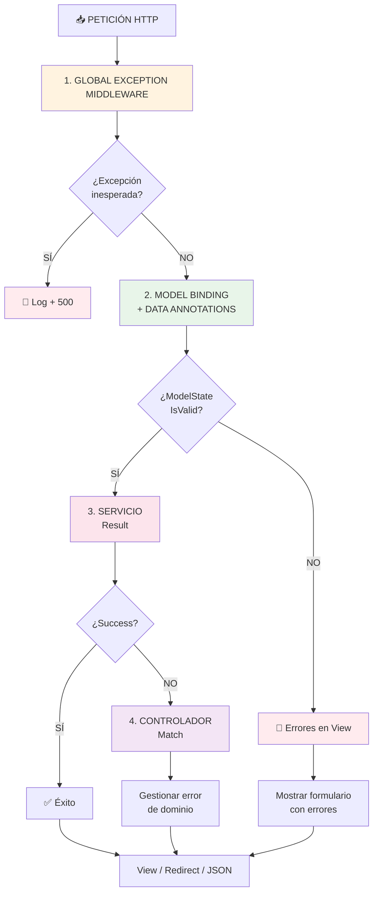

# 3. Controladores, Model Binding y Patrón Result

## Índice

[3. Controladores, Model Binding y Patrón Result](#3-controladores-model-binding-y-patrón-result)
  - [3.1. Rol del Controlador: Orquestador](#31-rol-del-controlador-orquestador)
  - [3.2. Model Binding](#32-model-binding)
  - [3.3. Patrón Result](#33-patrón-result)
  - [3.4. Trío de Hierro: ModelState vs Result vs Middleware](#34-trío-de-hierro-modelstate-vs-result-vs-middleware)
  - [3.5. Errores Comunes](#35-errores-comunes)
  - [3.6. Buenas Prácticas](#36-buenas-prácticas)

---

## 3.1. Rol del Controlador: Orquestador

Los controladores son los directores de orquesta. Reciben peticiones, coordinan servicios y deciden resultados.

### Lo que SÍ debe hacer un Controlador

| Responsabilidad         | Descripción                             |
| ----------------------- | --------------------------------------- |
| **Recibir Petición**    | Extraer datos de URL, formulario o JSON |
| **Validar Entrada**     | Verificar que los datos son válidos     |
| **Delegar a Servicios** | Llamar a la capa de negocio             |
| **Gestionar Resultado** | Decidir vista, redirect, JSON o error   |

### Lo que NO debe hacer un Controlador

| ❌ Evitar                   | ✅ En su lugar            |
| -------------------------- | ------------------------ |
| Acceso directo a BD        | Capa de servicios        |
| Lógica de negocio compleja | Servicios especializados |
| Validación de negocio      | Result<T,E> en servicios |

### Ejemplo de Controlador Limpio

```csharp
public class ProductController(
    IProductService productService, 
    ILogger<ProductController> logger) : Controller
{
    [HttpGet("details/{id}")]
    public async Task<IActionResult> Details(long id)
    {
        logger.LogInformation("Petición GET para producto ID: {ProductId}", id);
        
        var result = await productService.GetByIdAsync(id);
        
        return result.Match(
            onSuccess: product => View(product),
            onFailure: error => HandleDomainError(error)
        );
    }
}
```

---

## 3.2. Model Binding

El proceso por el cual ASP.NET Core convierte datos HTTP en objetos C#.

### ¿Cómo funciona?

1. Examina los parámetros del método
2. Busca datos en la petición (ruta, query, formulario, JSON)
3. Convierte al tipo C# del parámetro

### Fuentes del Model Binding (Orden de Prioridad)

| #   | Fuente       | Ejemplo                  |
| --- | ------------ | ------------------------ |
| 1   | Route Data   | `/products/{id}`         |
| 2   | Query String | `/products?name=abc`     |
| 3   | Form Data    | `<input name="email">`   |
| 4   | JSON Body    | `{ "email": "x@x.com" }` |

### Validación Automática con ModelState

```csharp
[HttpPost]
public async Task<IActionResult> Create(ProductViewModel model)
{
    // ❌ NUNCA te saltes esta validación
    if (!ModelState.IsValid)
    {
        logger.LogWarning("Intento de creación con datos inválidos");
        return View(model);  // Vuelve a mostrar con errores
    }
    
    var result = await _productService.CreateAsync(model);
    return result.Match(...)
}
```

⚠️ **Lección de Supervivencia**: SIEMPRE verifica `ModelState.IsValid`. ¡No confíes en el cliente!

---

## 3.3. Patrón Result

Para errores de negocio previsibles, usamos `Result<T, E>` en lugar de excepciones.

### ¿Por qué Result?

| Beneficio              | Descripción                             |
| ---------------------- | --------------------------------------- |
| **Claridad**           | Código más legible                      |
| **Tipado Fuerte**      | Error explícito, no Exception genérico  |
| **Rendimiento**        | Exceptions son costosas                 |
| **Obliga a Gestionar** | Compilador fuerza manejo de ambos casos |

### Implementación en Servicios

```csharp
public async Task<Result<Product, ProductError>> GetByIdAsync(long id)
{
    var product = await _context.Products.FirstOrDefaultAsync(p => p.Id == id);
    
    return product != null
        ? Result.Success(product)
        : Result.Failure(ProductError.NotFound(id));
}

public async Task<Result<bool, ProductError>> DeleteAsync(long id, long userId, bool isAdmin)
{
    var product = await _context.Products.FindAsync(id);
    if (product == null) 
        return Result.Failure(ProductError.NotFound(id));
    
    if (!isAdmin && product.PropietarioId != userId)
        return Result.Failure(ProductError.Unauthorized(userId, id));
    
    if (product.CompraId != null)
        return Result.Failure(ProductError.ProductAlreadySold(id));
    
    _context.Products.Remove(product);
    await _context.SaveChangesAsync();
    return Result.Success(true);
}
```

### Consumo con Match

```csharp
var result = await _productService.DeleteAsync(id, userId, isAdmin);

return result.Match(
    onSuccess: deleted => {
        TempData["SuccessMessage"] = "Producto eliminado";
        return RedirectToAction("MyProducts");
    },
    onFailure: error => {
        logger.LogError("Error: {Code} - {Message}", error.Code, error.Message);
        TempData["ErrorMessage"] = error.Message;
        return RedirectToAction("MyProducts");
    }
);
```

---

## 3.4. Trío de Hierro: ModelState vs Result vs Middleware



### ¿Cuándo usar cada uno?

| Escenario              | Mecanismo                 | ¿Por qué?                |
| ---------------------- | ------------------------- | ------------------------ |
| Email vacío            | ModelState                | Validación de formato    |
| Email sin @            | ModelState                | Validación de sintaxis   |
| Email ya existe        | Result                    | Regla de negocio         |
| Producto no encontrado | Result                    | Error semántico esperado |
| NullReferenceException | GlobalExceptionMiddleware | Bug inesperado           |
| Timeout BD             | GlobalExceptionMiddleware | Fallo técnico            |

### Ejemplo Completo de Controlador Robusto

```csharp
[HttpPost]
public async Task<IActionResult> Create(CreateProductVM model)
{
    // CAPA 1: ModelState
    if (!ModelState.IsValid)
        return View(model);
    
    // CAPA 2: Servicio con Result
    var result = await _productService.CreateAsync(model, User.GetUserId());
    
    // CAPA 3: Match
    return result.Match(
        onSuccess: product => {
            TempData["Success"] = "Producto creado";
            return RedirectToAction("Details", new { id = product.Id });
        },
        onFailure: error => {
            TempData["Error"] = error.Message;
            return View(model);
        }
    );
}
```

---

## 3.5. Errores Comunes

### Confundir Validación con Lógica de Negocio

```csharp
// ❌ MAL: Regla de negocio en DataAnnotations
public class ProductVM
{
    [Range(1, 1000000, ErrorMessage = "El precio debe ser positivo")]
    public decimal Precio { get; set; }
}

// ✅ BIEN: Validación de tipo en VM, regla de negocio en servicio
public class ProductVM
{
    [Range(0.01, 1000000)]  // Solo tipo de dato
    public decimal Precio { get; set; }
}

// En el servicio:
if (vm.Precio > promedio * 10)
    return Result.Failure(ProductError.PriceTooHigh);
```

### Usar Excepciones para Errores de Negocio

```csharp
// ❌ MAL
throw new ProductNotFoundException($"Producto {id} no encontrado");

// ✅ BIEN
return Result.Failure(ProductError.NotFound(id));
```

### No Validar ModelState

```csharp
// ❌ MAL
var result = await _service.CreateAsync(model);  // Puede fallar por datos inválidos

// ✅ BIEN
if (!ModelState.IsValid) return View(model);
var result = await _service.CreateAsync(model);
```

---

## 3.6. Buenas Prácticas

| #   | Práctica                                      |
| --- | --------------------------------------------- |
| 1   | Usa DataAnnotations para **formato** de datos |
| 2   | Usa Result<T,E> para **reglas de negocio**    |
| 3   | Usa GlobalExceptionMiddleware para **bugs**   |
| 4   | SIEMPRE verifica `ModelState.IsValid`         |
| 5   | SIEMPRE usa `Match()` para Result             |
| 6   | NUNCA uses `throw` para errores de negocio    |

---

**Anterior**: [02. Guía de Productividad](../02-Development-Tips.md)  
**Próximo**: [04. MVC Controllers](../04-MVC-Controllers.md)
