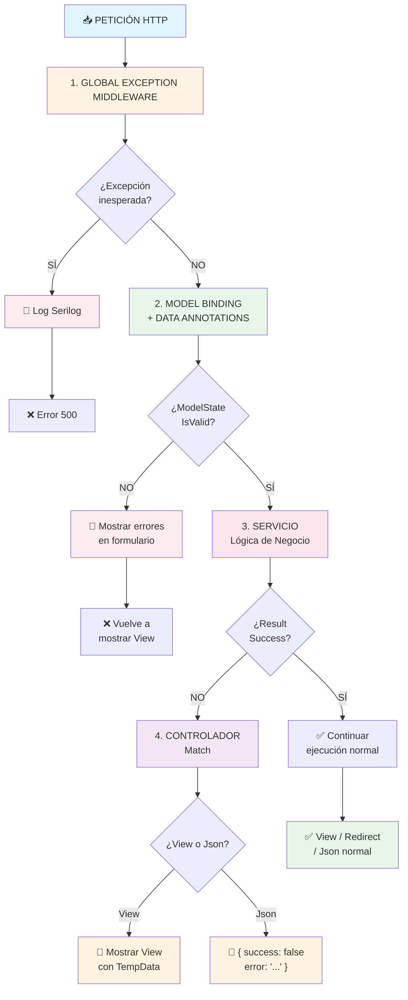

# 02. El Cerebro de la App: Controladores y Lógica de Negocio (La Visión Senior)

Los controladores son los directores de orquesta de tu aplicación. Reciben las peticiones, coordinan a los actores (Servicios) y deciden el resultado (una vista HTML, un JSON, una redirección).

## 1. El Rol del Controlador: Orquestador, no Ejecutor

Un error muy común es meter lógica de negocio o acceso directo a la base de datos en los controladores.

### 1.1. Lo que SÍ debe hacer un Controlador:
-   **Recibir la Petición**: Extraer datos de la URL, formulario o cuerpo (JSON).
-   **Validar la Entrada**: Asegurarse de que los datos recibidos son válidos.
-   **Delegar a Servicios**: Llamar a la capa de servicios para ejecutar la lógica de negocio.
-   **Gestionar el Resultado**: Decidir si mostrar una vista, redirigir, devolver un JSON o un error.

### 1.2. Lo que NO debe hacer un Controlador:
-   **Acceder directamente a la Base de Datos**: Eso es trabajo de la capa de datos (EF Core).
-   **Implementar lógica de negocio compleja**: Eso es trabajo de la capa de servicios.

```csharp
// TiendaDawWeb.Web/Controllers/ProductController.cs (Ejemplo Simplificado)
public class ProductController(IProductService productService, ILogger<ProductController> logger) : Controller
{
    // C# 14 Primary Constructor: Las dependencias se inyectan aquí
    // El controlador NO SABE cómo productService obtiene los productos. Solo sabe que PUEDE obtenerlos.

    [HttpGet("details/{id}")] // Atributo de ruta: /Product/details/5
    public async Task<IActionResult> Details(long id)
    {
        logger.LogInformation("Petición GET para detalles del producto ID: {ProductId}", id);
        
        // 1. Delegar a un servicio
        var result = await productService.GetByIdAsync(id);

        // 2. Gestionar el resultado del servicio (Patrón Result)
        return result.Match(
            onSuccess: (product) => View(product),       // Éxito: Mostrar la vista con el producto
            onFailure: (error) => HandleDomainError(error) // Fallo: Gestionar el error de negocio
        );
    }
}
```

---

## 2. Model Binding: La Magia de Traducir HTML a C#

El Model Binding es el proceso por el cual ASP.NET Core convierte automáticamente los datos de una petición HTTP (URL, formulario, JSON) en objetos C# fuertemente tipados.

### 2.1. ¿Cómo funciona?
-   ASP.NET Core examina los parámetros de tu método de acción (ej. `long id`, `ProductViewModel model`).
-   Busca datos en la petición (ruta, query string, cuerpo del formulario/JSON) con nombres que coincidan.
-   Intenta convertir esos datos al tipo C# del parámetro.

```csharp
// El framework busca un parámetro 'id' en la URL
public IActionResult GetProductById(long id) { /* ... */ }

// El framework rellena automáticamente un objeto 'model' con los datos del formulario
[HttpPost]
public IActionResult CreateProduct(ProductViewModel model) { /* ... */ }
```

### 2.2. Fuentes del Model Binding (Orden de Prioridad)
1.  **Ruta (Route Data)**: Parámetros en la URL (ej. `/products/{id}`).
2.  **Query String**: Parámetros después de `?` (ej. `/products?name=abc`).
3.  **Form Data**: Campos de un formulario HTML (`<input>`).
4.  **JSON Body**: Cuando envías JSON en el cuerpo de la petición (típico de APIs REST).

### 2.3. Validación Automática (`ModelState.IsValid`)
Una vez que el Model Binding ha rellenado tu objeto, ASP.NET Core ejecuta automáticamente las **Validaciones de Data Annotations** que hayas definido en tu modelo (`[Required]`, `[EmailAddress]`). Los resultados se almacenan en `ModelState`.

```csharp
[HttpPost]
public async Task<IActionResult> Create(ProductViewModel model)
{
    if (!ModelState.IsValid) // ¿El modelo tiene errores de validación (ej. campo requerido vacío)?
    {
        logger.LogWarning("Intento de creación de producto con datos inválidos.");
        return View(model); // Vuelve a mostrar el formulario con los errores pintados
    }

    // Si llegamos aquí, el modelo es válido. Delegamos al servicio.
    var result = await productService.CreateProductAsync(model);
    // ...
}
```
**Lección de Supervivencia**: Siempre, siempre, SIEMPRE verifica `ModelState.IsValid` en cualquier acción que reciba datos de un usuario. ¡No confíes en el cliente!

---

## 3. El Patrón Result: Lógica de Negocio Robusta y Funcional

Ya hemos hablado de que las excepciones (`throw`) son para fallos inesperados. Para los errores de negocio que podemos prever (ej. "El usuario no existe", "No tienes permiso"), usamos el **Patrón Result** con `CSharpFunctionalExtensions`.

### 3.1. ¿Por qué Result es Superior a Excepciones para Negocio?
-   **Claridad del Flujo**: El código se lee mejor, sabes cuándo un método puede fallar.
-   **Tipado Fuerte**: El tipo de error `DomainError` es explícito, no un genérico `Exception`.
-   **Rendimiento**: Crear excepciones es costoso en CPU. `Result` es solo un objeto.
-   **Obliga a Gestionar**: El compilador te fuerza a considerar tanto el éxito como el fallo.

### 3.2. Implementación en la Capa de Servicios (`ProductService.cs`)
```csharp
// TiendaDawWeb.Web/Services/Implementations/ProductService.cs
public async Task<Result<Product, DomainError>> GetByIdAsync(long id)
{
    var product = await _context.Products.FirstOrDefaultAsync(p => p.Id == id);
    if (product == null)
    {
        // En lugar de 'throw new ProductNotFoundException()', devolvemos un Fallo con un Error de Dominio
        return Result.Failure<Product, DomainError>(ProductError.NotFound(id));
    }
    return Result.Success<Product, DomainError>(product);
}

public async Task<Result<bool, DomainError>> DeleteAsync(long id, long userId, bool isAdmin = false)
{
    // Validaciones de negocio:
    // 1. ¿El producto existe?
    var product = await _context.Products.FirstOrDefaultAsync(p => p.Id == id);
    if (product == null) return Result.Failure<bool, DomainError>(ProductError.NotFound(id));

    // 2. ¿Tiene permiso el usuario? (Solo el dueño o un Admin)
    if (!isAdmin && product.PropietarioId != userId)
    {
        return Result.Failure<bool, DomainError>(ProductError.Unauthorized(userId, id));
    }

    // 3. ¿Está vendido? (Lógica de negocio: No se borra si ya hay una compra)
    if (product.CompraId != null)
    {
        return Result.Failure<bool, DomainError>(ProductError.ProductAlreadySold(id));
    }

    _context.Products.Remove(product);
    await _context.SaveChangesAsync();
    return Result.Success<bool, DomainError>(true);
}
```

### 3.3. Consumo en Controladores (El Patrón `Match`)
El método `Match` te permite ejecutar diferentes bloques de código según si el `Result` fue éxito o fallo.
```csharp
// TiendaDawWeb.Web/Controllers/ProductController.cs (Fragmento)
[HttpPost]
public async Task<IActionResult> Delete(long id)
{
    var userId = User.FindFirstValue(ClaimTypes.NameIdentifier); // Obtenemos el ID del usuario logueado
    var isAdmin = User.IsInRole("ADMIN");

    var result = await productService.DeleteAsync(id, long.Parse(userId), isAdmin);

    return result.Match(
        onSuccess: (deleted) => {
            TempData["SuccessMessage"] = "Producto eliminado con éxito.";
            return RedirectToAction("MyProducts");
        },
        onFailure: (error) => {
            logger.LogError("Error al eliminar producto {ProductId}: {ErrorCode} - {ErrorMessage}", id, error.Code, error.Message);
            // Aquí puedes mapear los errores de dominio a respuestas HTTP o mensajes de vista específicos
            if (error.Code == ProductError.NotFound(id).Code) return NotFound(error.Message);
            if (error.Code == ProductError.Unauthorized(long.Parse(userId), id).Code) return Forbid(error.Message);
            // ... otros errores
            TempData["ErrorMessage"] = error.Message; // Muestra el mensaje de error en la vista
            return RedirectToAction("MyProducts");
        }
    );
}
```
**Lección para Superdioses**: El `Patrón Result` te obliga a escribir código más robusto y predecible. Es la base de la programación funcional en C#.

---

## 4. El Trío de Hierro: ModelState vs Result vs GlobalExceptionMiddleware

Entender cuándo usar cada mecanismo es clave para escribir código profesional.

### 4.1. ¿Cuál usar en cada escenario?

| Escenario | Mecanismo | ¿Por qué? |
|-----------|-----------|-----------|
| Campo email vacío en formulario | **ModelState** | Validación de formato/tipo, no lógica de negocio |
| Email no tiene formato válido | **ModelState** | Validación de sintaxis, no semántica |
| Email ya existe en BD | **Result** | Regla de negocio específica de la aplicación |
| Producto no encontrado | **Result** | Error semántico esperado |
| Usuario sin permiso para eliminar | **Result** | Autorización es lógica de negocio |
| NullReferenceException (bug) | **GlobalExceptionMiddleware** | Error inesperado, no previsto |
| Timeout de base de datos | **GlobalExceptionMiddleware** | Fallo técnico, no validación |

### 4.2. Ejemplo Completo: Un Controlador Robusto

```csharp
// TiendaDawWeb.Web/Controllers/ProductController.cs
public class ProductController : Controller
{
    private readonly IProductService _productService;
    private readonly ILogger<ProductController> _logger;

    public ProductController(IProductService productService, ILogger<ProductController> logger)
    {
        _productService = productService;
        _logger = logger;
    }

    [HttpPost]
    public async Task<IActionResult> Create(CreateProductVM model)
    {
        // ┌─────────────────────────────────────────────────────────────┐
        // │ CAPA 1: ModelState (Validación de Formulario)              │
        // │ ¿El usuario nos envió datos válidos?                        │
        // └─────────────────────────────────────────────────────────────┘
        if (!ModelState.IsValid)
        {
            _logger.LogWarning("Intento de creación con datos inválidos");
            return View(model); // Vuelve a mostrar el formulario con errores
        }

        // ┌─────────────────────────────────────────────────────────────┐
        // │ CAPA 2: Servicio con Result (Lógica de Negocio)            │
        // │ ¿La operación es válida según nuestras reglas?              │
        // └─────────────────────────────────────────────────────────────┘
        var result = await _productService.CreateAsync(model, User.GetUserId());

        // ┌─────────────────────────────────────────────────────────────┐
        // │ CAPA 3: Match (Gestión del Resultado)                      │
        // │ ¿Qué hacemos con el resultado?                              │
        // └─────────────────────────────────────────────────────────────┘
        return result.Match(
            onSuccess: product =>
            {
                _logger.LogInformation("Producto {ProductId} creado por usuario {UserId}", 
                    product.Id, User.GetUserId());
                TempData["Success"] = "Producto creado correctamente";
                return RedirectToAction("Details", new { id = product.Id });
            },
            onFailure: error =>
            {
                _logger.LogWarning("Error al crear producto: {ErrorCode} - {Message}", 
                    error.Code, error.Message);
                
                TempData["Error"] = error.Message;
                return View(model);
            }
        );

        // NOTA: Si algo falla inesperadamente (bug), el 
        // GlobalExceptionMiddleware capturará la excepción y 
        // devolverá una página de error 500.
    }
}
```

### 4.3. Diagrama: El Flujo de Validación Completo



### 4.4. ¿Cuál usar en cada escenario?

### ❌ ERROR 1: Confundir Validación con Lógica de Negocio

```csharp
// ❌ MAL: Validación de negocio en el modelo con DataAnnotations
public class ProductVM
{
    [Range(1, 1000000, ErrorMessage = "El precio debe ser positivo")]
    public decimal Precio { get; set; }
}

// ✅ BIEN: Validación de tipo en modelo, validación de negocio en servicio
public class ProductVM
{
    [Range(0.01, 1000000)] // Tipo de dato: debe ser un número positivo
    public decimal Precio { get; set; }
}

// En el servicio:
public async Task<Result<Product, ProductError>> CreateAsync(ProductVM vm, long userId)
{
    // Regla de negocio: El precio no puede ser superior al promedio
    var promedio = await _context.Products.AverageAsync(p => p.Precio);
    if (vm.Precio > promedio * 10)
        return Result.Failure(ProductError.PriceTooHigh);
}
```

### ❌ ERROR 2: Usar Excepciones para Errores de Negocio

```csharp
// ❌ MAL: Usar throw para errores esperados
public async Task<Product> GetByIdAsync(long id)
{
    var product = await _context.Products.FindAsync(id);
    if (product == null)
        throw new ProductNotFoundException($"Producto {id} no encontrado");
    return product;
}

// ✅ BIEN: Usar Result para errores esperados
public async Task<Result<Product, ProductError>> GetByIdAsync(long id)
{
    var product = await _context.Products.FindAsync(id);
    return product != null
        ? Result.Success(product)
        : Result.Failure(ProductError.NotFound(id));
}
```

### ❌ ERROR 3: No Validar ModelState

```csharp
// ❌ MAL: Saltarse la validación del modelo
[HttpPost]
public async Task<IActionResult> Create(ProductVM model)
{
    var result = await _service.CreateAsync(model); // ¡Puede fallar por datos inválidos!
    return result.Match(...)
}

// ✅ BIEN: Validar siempre el modelo primero
[HttpPost]
public async Task<IActionResult> Create(ProductVM model)
{
    if (!ModelState.IsValid)
        return View(model); // Vuelve a mostrar con errores
    
    var result = await _service.CreateAsync(model);
    return result.Match(...)
}
```

---

## 6. Buenas Prácticas Resumen

1.  **Usa DataAnnotations** para validar el **formato** de los datos (tipos, rangos, formatos).
2.  **Usa Result<T,E>** para validar las **reglas de negocio** (existencias, permisos, duplicados).
3.  **Usa GlobalExceptionMiddleware** para capturar **bugs inesperados** (nulos, timeouts).
4.  **SIEMPRE** verifica `ModelState.IsValid` antes de llamar a servicios.
5.  **SIEMPRE** usa `Match()` para manejar explícitamente éxito y fracaso.
6.  **NUNCA** uses `throw` para errores que el usuario puede causar normalmente.

---

Este volumen te ha introducido al cerebro de tu aplicación: cómo los controladores orquestan la lógica de negocio y cómo la comunicación con los servicios debe ser robusta y predecible. Ahora profundizaremos en cómo los datos llegan a la interfaz de usuario.