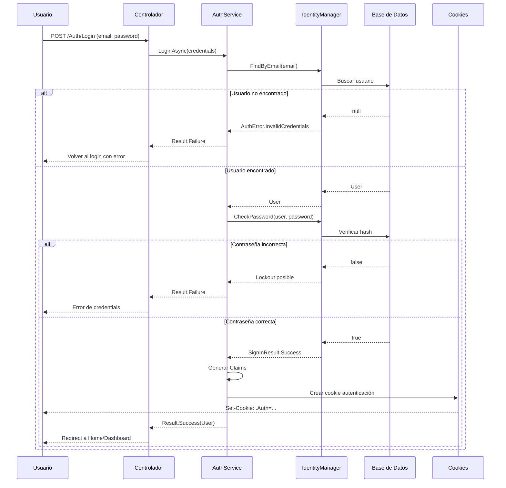
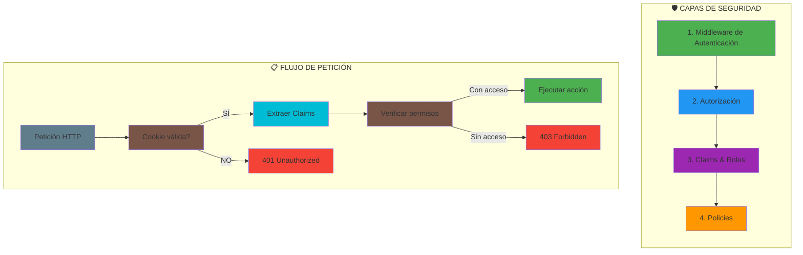
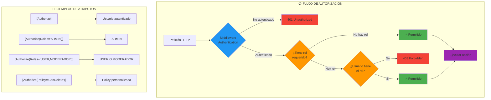
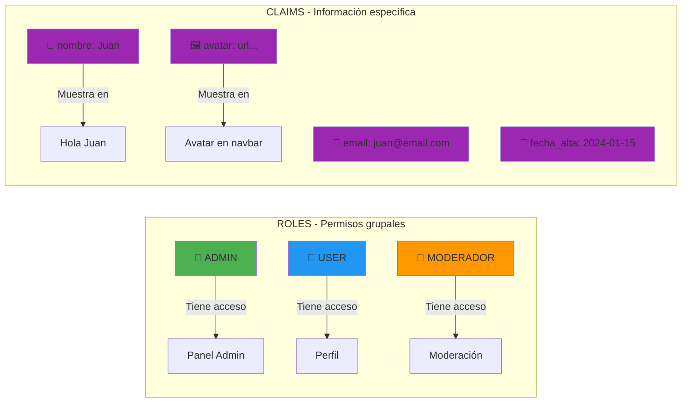

# 04. Autenticación y Autorización con ASP.NET Core Identity

Este volumen profundiza en el sistema de seguridad de WalaDaw: cómo gestionamos usuarios, roles, claims y la protección de recursos.

---

## 1. Flujo de Autenticación en WalaDaw



---

## 2. Introducción a ASP.NET Core Identity

ASP.NET Core Identity es un sistema completo de gestión de usuarios y autenticación que incluye:

-   **Registro e inicio de sesión** de usuarios
-   **Gestión de contraseñas** (hash, complejidad)
-   **Roles y Claims** para autorización
-   **Tokens de seguridad** y confirmación de email
-   **Externos** (Google, Facebook, etc.)

### 2.1. Capas de Seguridad en WalaDaw



### 1.1. Configuración en WalaDaw

```csharp
// Program.cs
builder.Services.AddIdentity<User, IdentityRole<long>>(options =>
{
    // Configuración de contraseñas
    options.Password.RequireDigit = true;
    options.Password.RequireLowercase = true;
    options.Password.RequireUppercase = true;
    options.Password.RequireNonAlphanumeric = false;
    options.Password.RequiredLength = 8;

    // Configuración de usuario
    options.User.RequireUniqueEmail = true;
    
    // Configuración de bloqueo
    options.Lockout.DefaultLockoutTimeSpan = TimeSpan.FromMinutes(15);
    options.Lockout.MaxFailedAccessAttempts = 5;
})
.AddEntityFrameworkStores<ApplicationDbContext>()
.AddDefaultTokenProviders();
```

### 1.2. El Modelo de Usuario Personalizado

WalaDaw extiende el usuario base con campos específicos:

```csharp
// Models/User.cs
public class User : IdentityUser<long>
{
    [Required, MaxLength(100)]
    public string Nombre { get; set; } = string.Empty;

    [Required, MaxLength(200)]
    public string Apellidos { get; set; } = string.Empty;

    public string? Avatar { get; set; }

    public DateTime FechaAlta { get; set; } = DateTime.UtcNow;

    public bool Deleted { get; set; }
    
    public DateTime? DeletedAt { get; set; }
    
    public string? DeletedBy { get; set; }

    // Propiedades de navegación
    public ICollection<Product> Productos { get; set; } = new List<Product>();
    public ICollection<CarritoItem> CarritoItems { get; set; } = new List<CarritoItem>();
    public ICollection<Favorite> Favorites { get; set; } = new List<Favorite>();
    public ICollection<Rating> Ratings { get; set; } = new List<Rating>();
}
```

---

## 2. Claims vs Roles: ¿Cuándo usar cada uno?

### 2.1. Diagrama de Autorización con [Authorize]



### 2.2. Roles vs Claims: Comparativa



### 2.3. Ejemplo de uso en Controladores

```csharp
// Verificar rol en controlador
[Authorize(Roles = "ADMIN")]
public IActionResult AdminPanel()
{
    return View();
}

// Verificar múltiples roles
[Authorize(Roles = "ADMIN,MODERADOR")]
public IActionResult ModerationPanel()
{
    return View();
}

// Policy con roles
builder.Services.AddAuthorization(options =>
{
    options.AddPolicy("AdminOnly", policy => policy.RequireRole("ADMIN"));
});
```

### 2.2. Claims (Información específica del usuario)

Los **Claims** son pares clave-valor que contienen información sobre el usuario.

```csharp
//claim típicos
ClaimTypes.Name           // "Juan García"
ClaimTypes.Email          // "juan@email.com"
ClaimTypes.Role           // "USER"
ClaimTypes.NameIdentifier // ID del usuario

// Claims personalizados
public const string AvatarClaim = "avatar";
public const string FullNameClaim = "fullname";
```

### 2.3. ¿Cuál usar?

| Escenario | Recomendación |
|-----------|---------------|
| Acceso a rutas/admin panels | **Roles** |
| Permisos generales (puede_editar, puede_borrar) | **Roles** |
| Información de perfil (nombre, avatar) | **Claims** |
| Datos contextuales (departamento, empresa) | **Claims** |

### 2.4. Configurar Claims personalizados al login

```csharp
// Services/AuthService.cs
public async Task<Result<User, AuthError>> LoginAsync(LoginVM model)
{
    var user = await _userManager.FindByEmailAsync(model.Email);
    if (user == null)
        return Result.Failure<User, AuthError>(AuthError.InvalidCredentials);

    var result = await _signInManager.CheckPasswordSignInAsync(user, model.Password, lockoutOnFailure: true);
    if (!result.Succeeded)
        return Result.Failure<User, AuthError>(AuthError.InvalidCredentials);

    // Claims personalizados
    var claims = new List<Claim>
    {
        new Claim(ClaimTypes.NameIdentifier, user.Id.ToString()),
        new Claim(ClaimTypes.Name, user.Nombre),
        new Claim(ClaimTypes.Surname, user.Apellidos),
        new Claim(ClaimTypes.Email, user.Email!),
        new Claim("avatar", user.Avatar ?? ""),
        new Claim("fullname", $"{user.Nombre} {user.Apellidos}")
    };

    // Añadir roles como claims
    var userRoles = await _userManager.GetRolesAsync(user);
    foreach (var role in userRoles)
    {
        claims.Add(new Claim(ClaimTypes.Role, role));
    }

    await _signInManager.SignInWithClaimsAsync(user, isPersistent: model.RememberMe, claims);

    return Result.Success<User, AuthError>(user);
}
```

---

## 3. Autorización a Nivel de Controlador y Acción

### 3.1. Atributos básicos

```csharp
// Solo usuarios autenticados
[Authorize]
public class DashboardController : Controller { }

// Roles específicos
[Authorize(Roles = "ADMIN")]
public class AdminController : Controller { }

// Múltiples roles (AND)
[Authorize(Roles = "ADMIN,MODERADOR", Policy = "AdminOModerador")]
public class ModerationController : Controller { }

// Política personalizada
[Authorize(Policy = "CanDeleteProducts")]
public class ProductManagementController : Controller { }
```

### 3.2. Políticas (Policies) personalizadas

```csharp
// Program.cs
builder.Services.AddAuthorization(options =>
{
    // Policy: El usuario es el dueño del recurso O es admin
    options.AddPolicy("OwnerOrAdmin", policy => 
        policy.RequireAssertion(context =>
        {
            var userId = context.User.FindFirstValue(ClaimTypes.NameIdentifier);
            var isAdmin = context.User.IsInRole("ADMIN");
            var resourceOwnerId = context.Resource?.GetType().GetProperty("PropietarioId")?.GetValue(context.Resource);
            
            return isAdmin || userId == resourceOwnerId?.ToString();
        }));

    // Policy: Usuario verificado (email confirmado)
    options.AddPolicy("EmailConfirmed", policy => 
        policy.RequireClaim("emailconfirmed", "true"));
});
```

### 3.3. Autorización a nivel de acción con filtros

```csharp
// Filters/AuthorizationFilter.cs
public class ValidateOwnershipAttribute : TypeFilterAttribute
{
    public class ValidateOwnershipImpl : IAsyncActionFilter
    {
        public async Task OnActionExecutionAsync(ActionExecutingContext context, ActionExecutionDelegate next)
        {
            var productId = context.ActionArguments["id"] as long?;
            var userId = context.HttpContext.User.FindFirstValue(ClaimTypes.NameIdentifier);
            
            var product = await context.HttpContext.RequestServices
                .GetRequiredService<IProductService>()
                .GetByIdAsync(productId.Value);
                
            if (product.IsFailure)
            {
                context.Result = new NotFoundResult();
                return;
            }
            
            if (product.Value.PropietarioId != long.Parse(userId!) && 
                !context.HttpContext.User.IsInRole("ADMIN"))
            {
                context.Result = new ForbidResult();
                return;
            }
            
            await next();
        }
    }
}

// Uso en controlador
[HttpDelete("{id}")]
[ValidateOwnership]
public async Task<IActionResult> Delete(long id)
{
    // ...
}
```

---

## 4. Authentication Schemes y Cookies

### 4.1. Configuración de Cookies

```csharp
// Program.cs
builder.Services.ConfigureApplicationCookie(options =>
{
    options.Cookie.Name = "WalaDaw.Auth";
    options.Cookie.HttpOnly = true;
    options.Cookie.SecurePolicy = CookieSecurePolicy.SameAsRequest;
    options.Cookie.SameSite = SameSiteMode.Lax;
    
    options.LoginPath = "/Auth/Login";
    options.AccessDeniedPath = "/Auth/AccessDenied";
    
    options.SlidingExpiration = true;
    options.ExpireTimeSpan = TimeSpan.FromDays(14);
    
    options.Events.OnRedirectToLogin = context =>
    {
        // API devuelve 401 en lugar de redirigir
        if (context.Request.Path.StartsWithSegments("/api"))
        {
            context.Response.StatusCode = 401;
            return Task.CompletedTask;
        }
        context.Response.Redirect(context.RedirectUri);
        return Task.CompletedTask;
    };
});
```

### 4.2. Múltiples esquemas de autenticación

```csharp
// Program.cs
builder.Services.AddAuthentication(options =>
{
    options.DefaultScheme = "Cookies";
    options.DefaultChallengeScheme = "Cookies";
})
.AddCookie("Cookies", options =>
{
    options.LoginPath = "/Auth/Login";
})
.AddJwtBearer("Bearer", options =>
{
    options.TokenValidationParameters = new TokenValidationParameters
    {
        ValidateIssuer = true,
        ValidateAudience = true,
        ValidateLifetime = true,
        ValidateIssuerSigningKey = true,
        ValidIssuer = builder.Configuration["Jwt:Issuer"],
        ValidAudience = builder.Configuration["Jwt:Audience"],
        IssuerSigningKey = new SymmetricSecurityKey(Encoding.UTF8.GetBytes(builder.Configuration["Jwt:Key"]!))
    };
});
```

---

## 5. Claims y Profile en Blazor

En Blazor Server, los claims están disponibles a través del `AuthenticationState`:

```csharp
// Components/Admin/AdminStatsWidget.razor
@inject AuthenticationStateProvider AuthenticationStateProvider

<div class="stats-widget">
    @if (isAdmin)
    {
        <h3>Panel de Administración</h3>
        <p>Bienvenido, @userName</p>
    }
</div>

@code {
    private bool isAdmin;
    private string userName = "";
    
    protected override async Task OnInitializedAsync()
    {
        var authState = await AuthenticationStateProvider.GetAuthenticationStateAsync();
        var user = authState.User;
        
        isAdmin = user.IsInRole("ADMIN");
        userName = user.FindFirst("fullname")?.Value ?? user.Identity?.Name ?? "Usuario";
    }
}
```

---

## 6. Autorización en AJAX y APIs

### 6.1. Validación de tokens en APIs

```csharp
// Controllers/Api/ProductsController.cs
[ApiController]
[Route("api/[controller]")]
[Authorize]
public class ProductsApiController : ControllerBase
{
    [HttpGet("{id}")]
    public async Task<IActionResult> GetProduct(long id)
    {
        // El usuario ya está autenticado gracias al atributo [Authorize]
        var userId = User.FindFirstValue(ClaimTypes.NameIdentifier);
        
        var product = await _productService.GetByIdAsync(id);
        return product.Match(Ok, NotFound);
    }
}
```

### 6.2. Protección CSRF en AJAX

```csharp
// Services/CsrfService.cs
public class CsrfService
{
    public string GenerateToken()
    {
        // Generar token anti-falsificación
        return Guid.NewGuid().ToString();
    }
}

// wwwroot/js/site.js
async function csrfFetch(url, options = {}) {
    const token = document.querySelector('input[name="__RequestVerificationToken"]').value;
    
    return fetch(url, {
        ...options,
        headers: {
            'RequestVerificationToken': token,
            'Content-Type': 'application/json',
            ...options.headers
        }
    });
}
```

---

## 7. Seguridad en Tiempo Real (SignalR)

SignalR requiere configuración especial para autenticación:

```csharp
// Program.cs
builder.Services.AddSignalR()
    .AddHubOptions<NotificationHub>(options =>
    {
        options.EnableDetailedErrors = true;
    });

// Configurar autenticación en SignalR
app.UseAuthentication();
app.UseAuthorization();

app.MapHub<NotificationHub>("/notifications");

// En el Hub
public class NotificationHub : Hub
{
    public override async Task OnConnectedAsync()
    {
        var userId = Context.User?.FindFirstValue(ClaimTypes.NameIdentifier);
        if (!string.IsNullOrEmpty(userId))
        {
            await Groups.AddToGroupAsync(Context.ConnectionId, $"user-{userId}");
        }
        await base.OnConnectedAsync();
    }
}
```

---

## 8. Mejores Prácticas de Seguridad

### ✅ SIEMPRE

```csharp
// Usar [Authorize] en controladores sensibles
[Authorize]
public class UserProfileController : Controller { }

// Verificar ownership antes de modificar
public async Task<IActionResult> Edit(long id)
{
    var userId = User.GetUserId();
    var product = await _service.GetByIdAsync(id);
    
    if (product.Value.PropietarioId != userId && !User.IsInRole("ADMIN"))
        return Forbid();
    
    return View(product.Value);
}

// Usar claims para información del usuario
var avatar = User.FindFirst("avatar")?.Value;
```

### ❌ NUNCA

```csharp
// NO almacenar contraseñas en texto plano
// NO usar [AllowAnonymous] en acciones sensibles
// NO confiar en datos del cliente sin validación
// NO exponer IDs internos en URLs públicas sin protección
```

---

## 9. Conclusión

La seguridad en WalaDaw se basa en una combinación de:

1.  **Identity** para gestión de usuarios
2.  **Claims** para información contextual
3.  **Roles** para permisos de acceso
4.  **Policies** para lógica de autorización compleja
5.  **CSRF Protection** para AJAX

Este enfoque multi-capa garantiza que solo los usuarios autorizados puedan acceder a los recursos correctos.
