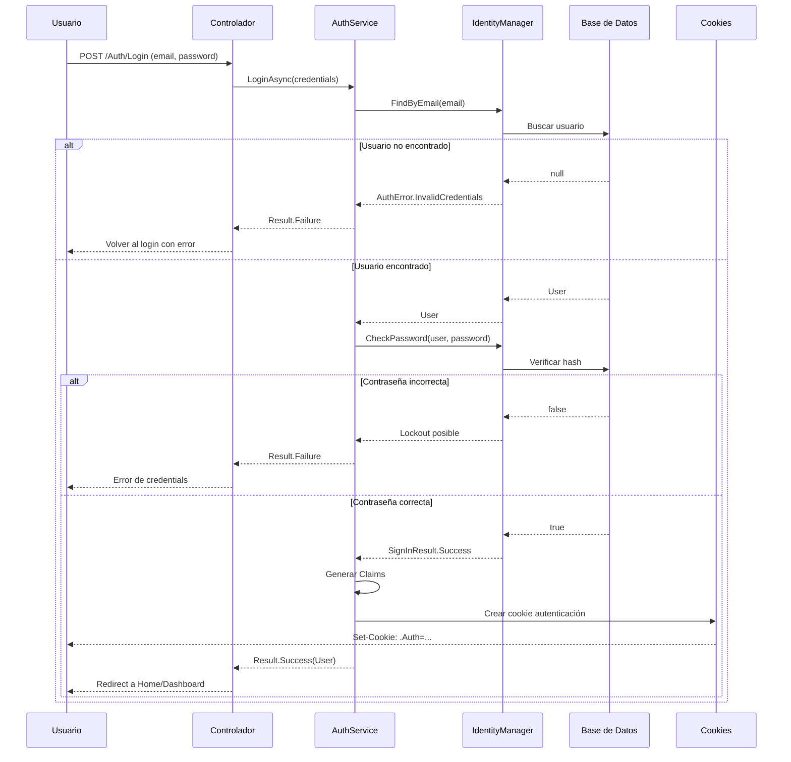
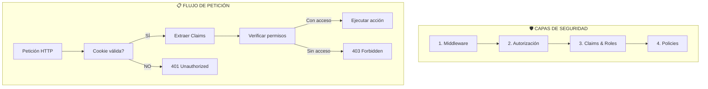
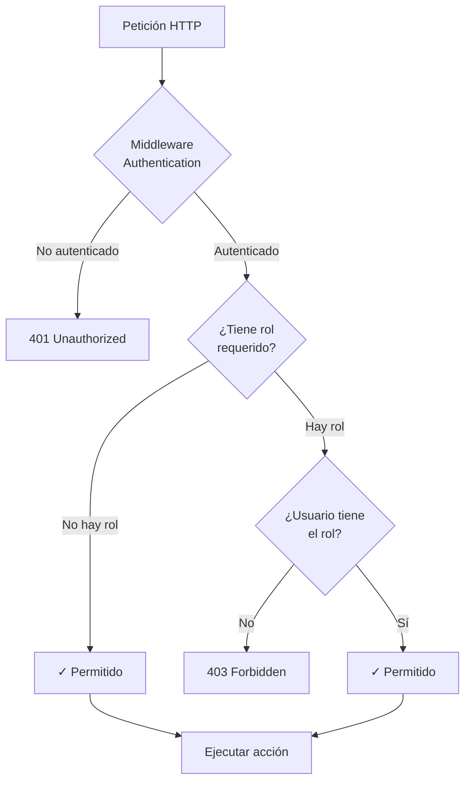

- [4. Autenticación y Autorización con ASP.NET Core Identity](#4-autenticación-y-autorización-con-aspnet-core-identity)
  - [1. Flujo de Autenticación](#1-flujo-de-autenticación)
  - [2. Capas de Seguridad](#2-capas-de-seguridad)
  - [3. Roles vs Claims](#3-roles-vs-claims)
    - [3.1. Roles (Grupos de Permisos)](#31-roles-grupos-de-permisos)
    - [3.2. Claims (Información del Usuario)](#32-claims-información-del-usuario)
    - [3.3. ¿Cuál usar?](#33-cuál-usar)
  - [4. Autorización con \[Authorize\]](#4-autorización-con-authorize)
    - [4.1. Atributos de Autorización](#41-atributos-de-autorización)
    - [4.2. Policies Personalizadas](#42-policies-personalizadas)
  - [5. Configuración de Cookies](#5-configuración-de-cookies)
  - [6. Claims en Blazor](#6-claims-en-blazor)
  - [7. Seguridad AJAX y APIs](#7-seguridad-ajax-y-apis)
    - [7.1. Protección CSRF](#71-protección-csrf)
    - [7.2. APIs con Autorización](#72-apis-con-autorización)
  - [8. Seguridad SignalR](#8-seguridad-signalr)
  - [9. Mejores Prácticas](#9-mejores-prácticas)
    - [9.1. ✅ SIEMPRE](#91--siempre)
    - [9.2. ❌ NUNCA](#92--nunca)


# 4. Autenticación y Autorización con ASP.NET Core Identity
En esta sección, exploraremos cómo implementar autenticación y autorización en una aplicación ASP.NET Core utilizando Identity, roles y claims para gestionar el acceso de usuarios de manera segura y eficiente.

## 1. Flujo de Autenticación



---

## 2. Capas de Seguridad



---

## 3. Roles vs Claims

| Concepto   | Uso                    | Ejemplo                      |
| ---------- | ---------------------- | ---------------------------- |
| **Roles**  | Permisos grupales      | `ADMIN`, `USER`, `MODERADOR` |
| **Claims** | Información específica | `nombre`, `avatar`, `email`  |

### 3.1. Roles (Grupos de Permisos)

```csharp
[Authorize(Roles = "ADMIN")]
public IActionResult AdminPanel() => View();

[Authorize(Roles = "ADMIN,MODERADOR")]
public IActionResult ModerationPanel() => View();

// Policy con roles
builder.Services.AddAuthorization(options =>
{
    options.AddPolicy("AdminOnly", policy => policy.RequireRole("ADMIN"));
});
```

### 3.2. Claims (Información del Usuario)

```csharp
// Claims típicos
ClaimTypes.Name           // "Juan García"
ClaimTypes.Email          // "juan@email.com"
ClaimTypes.Role           // "USER"
ClaimTypes.NameIdentifier // ID del usuario

// Claims personalizados
new Claim("avatar", user.Avatar ?? "")
new Claim("fullname", $"{user.Nombre} {user.Apellidos}")
```

### 3.3. ¿Cuál usar?

| Escenario             | Recomendación |
| --------------------- | ------------- |
| Acceso a admin panels | **Roles**     |
| Permisos generales    | **Roles**     |
| Información de perfil | **Claims**    |
| Datos contextuales    | **Claims**    |

---

## 4. Autorización con [Authorize]



### 4.1. Atributos de Autorización

```csharp
// Solo usuarios autenticados
[Authorize]
public class DashboardController : Controller { }

// Roles específicos
[Authorize(Roles = "ADMIN")]
public class AdminController : Controller { }

// Múltiples roles (AND)
[Authorize(Roles = "ADMIN,MODERADOR")]
public class ModerationController : Controller { }

// Policy personalizada
[Authorize(Policy = "CanDeleteProducts")]
public class ProductManagementController : Controller { }
```

### 4.2. Policies Personalizadas

```csharp
builder.Services.AddAuthorization(options =>
{
    options.AddPolicy("OwnerOrAdmin", policy => 
        policy.RequireAssertion(context =>
        {
            var userId = context.User.FindFirstValue(ClaimTypes.NameIdentifier);
            var isAdmin = context.User.IsInRole("ADMIN");
            return isAdmin || userId == resourceOwnerId?.ToString();
        }));
});
```

---

## 5. Configuración de Cookies

```csharp
builder.Services.ConfigureApplicationCookie(options =>
{
    options.Cookie.Name = "WalaDaw.Auth";
    options.Cookie.HttpOnly = true;
    options.Cookie.SecurePolicy = CookieSecurePolicy.SameAsRequest;
    options.Cookie.SameSite = SameSiteMode.Lax;
    
    options.LoginPath = "/Auth/Login";
    options.AccessDeniedPath = "/Auth/AccessDenied";
    
    options.SlidingExpiration = true;
    options.ExpireTimeSpan = TimeSpan.FromDays(14);
});
```

---

## 6. Claims en Blazor

```csharp
@inject AuthenticationStateProvider AuthenticationStateProvider

<div class="stats-widget">
    @if (isAdmin)
    {
        <h3>Panel de Administración</h3>
        <p>Bienvenido, @userName</p>
    }
</div>

@code {
    private bool isAdmin;
    private string userName = "";
    
    protected override async Task OnInitializedAsync()
    {
        var authState = await AuthenticationStateProvider.GetAuthenticationStateAsync();
        var user = authState.User;
        
        isAdmin = user.IsInRole("ADMIN");
        userName = user.FindFirst("fullname")?.Value ?? user.Identity?.Name ?? "Usuario";
    }
}
```

---

## 7. Seguridad AJAX y APIs

### 7.1. Protección CSRF

```javascript
async function csrfFetch(url, options = {}) {
    const token = document.querySelector('input[name="__RequestVerificationToken"]').value;
    
    return fetch(url, {
        ...options,
        headers: {
            'RequestVerificationToken': token,
            'Content-Type': 'application/json',
            ...options.headers
        }
    });
}
```

### 7.2. APIs con Autorización

```csharp
[ApiController]
[Route("api/[controller]")]
[Authorize]
public class ProductsApiController : ControllerBase
{
    [HttpGet("{id}")]
    public async Task<IActionResult> GetProduct(long id)
    {
        var userId = User.FindFirstValue(ClaimTypes.NameIdentifier);
        var product = await _productService.GetByIdAsync(id);
        return product.Match(Ok, NotFound);
    }
}
```

---

## 8. Seguridad SignalR

```csharp
builder.Services.AddSignalR()
    .AddHubOptions<NotificationHub>(options =>
    {
        options.EnableDetailedErrors = true;
    });

app.MapHub<NotificationHub>("/notifications");

public class NotificationHub : Hub
{
    public override async Task OnConnectedAsync()
    {
        var userId = Context.User?.FindFirstValue(ClaimTypes.NameIdentifier);
        if (!string.IsNullOrEmpty(userId))
        {
            await Groups.AddToGroupAsync(Context.ConnectionId, $"user-{userId}");
        }
        await base.OnConnectedAsync();
    }
}
```

---

## 9. Mejores Prácticas

### 9.1. ✅ SIEMPRE

```csharp
[Authorize]
public class UserProfileController : Controller { }

// Verificar ownership
if (product.PropietarioId != userId && !User.IsInRole("ADMIN"))
    return Forbid();

// Usar claims
var avatar = User.FindFirst("avatar")?.Value;
```

### 9.2. ❌ NUNCA

```csharp
// Almacenar contraseñas en texto plano
// Usar [AllowAnonymous] en acciones sensibles
// Confiar en datos del cliente sin validación
// Exponer IDs internos sin protección
```

---

**Anterior Volumen**: [03. Controladores y Models](../03-Controllers-Models-Results.md)  
**Próximo Volumen**: [05. EF Core y Persistencia](../05-EFCore-Persistence-Seed.md)
