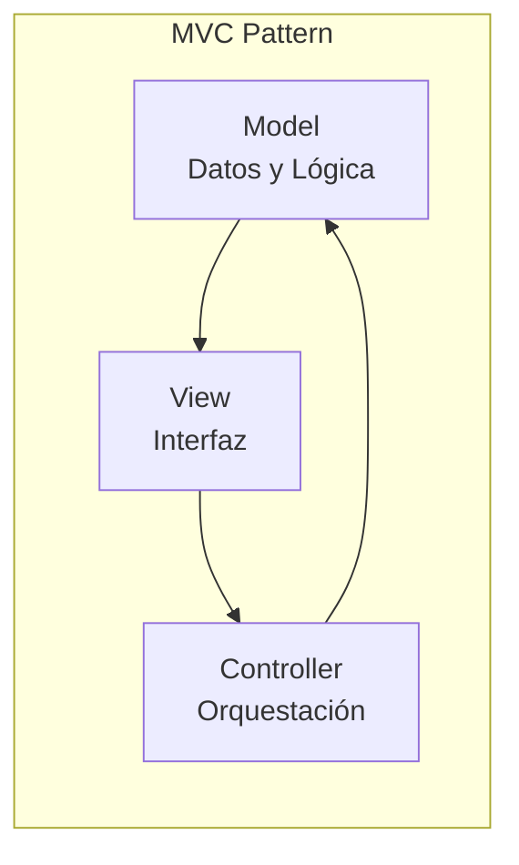
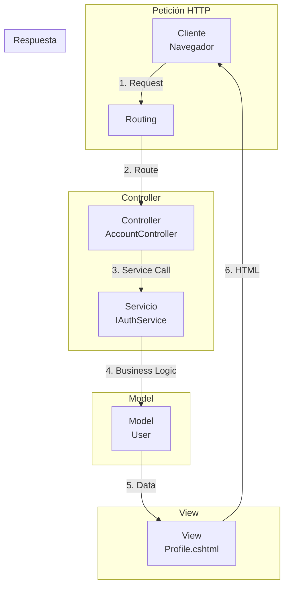
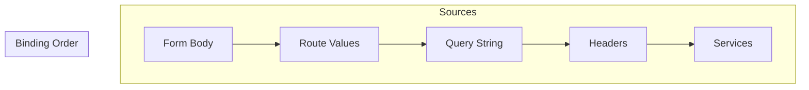
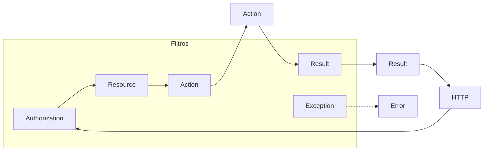

# 4. MVC Controllers: El Enfoque Tradicional

## Índice

[4. MVC Controllers: El Enfoque Tradicional](#4-mvc-controllers-el-enfoque-tradicional)
  - [4.1. Introducción a MVC](#41-introducción-a-mvc)
  - [4.2. Estructura de un Controller](#42-estructura-de-un-controller)
  - [4.3. Routing en MVC](#43-routing-en-mvc)
  - [4.4. Model Binding](#44-model-binding)
  - [4.5. Validación](#45-validación)
  - [4.6. Respuestas](#46-respuestas)
  - [4.7. Filtros](#47-filtros)
  - [4.8. Dependencias y Servicios](#48-dependencias-y-servicios)
  - [4.9. Resumen](#49-resumen)

---

## 4.1. Introducción a MVC

**MVC (Model-View-Controller)** es un patrón de arquitectura que separa la aplicación en tres componentes interconectados:



### Componentes MVC

| Componente | Responsabilidad                                  | Ejemplo en WalaDaw                        |
| --------- | ------------------------------------------------ | ------------------------------------------ |
| **Model**  | Datos, lógica de negocio y reglas de validación | `Product`, `User`, `Purchase`             |
| **View**   | Presentación de datos al usuario                | `_ProductCard.cshtml`, `Login.cshtml`     |
| **Controller** | Maneja peticiones HTTP, coordina Model y View | `ProductsController`, `AccountController` |

### Flujo de una Petición MVC



---

## 4.2. Estructura de un Controller

### Convenciones de Nomenclatura

| Elemento       | Convención                    | Ejemplo                    |
| -------------- | ---------------------------- | -------------------------- |
| **Clase**      | `XxxController`              | `ProductsController`       |
| **Archivo**    | `XxxController.cs`            | `ProductsController.cs`     |
| **Carpeta**    | `Controllers/`                | `Controllers/Products/`   |

### Estructura Basic

```csharp
using Microsoft.AspNetCore.Mvc;
using Microsoft.AspNetCore.Authorization;
using System.Security.Claims;
using TiendaDawWeb.Shared.Services;
using TiendaDawWeb.Shared.Models.Dtos;

namespace TiendaDawWeb.Mvc.Controllers;

[Authorize]
public class ProductsController : Controller
{
    private readonly IProductService _productService;
    private readonly ILogger<ProductsController> _logger;

    public ProductsController(
        IProductService productService,
        ILogger<ProductsController> logger)
    {
        _productService = productService;
        _logger = logger;
    }

    [AllowAnonymous]
    public async Task<IActionResult> Index(string? search, int page = 1)
    {
        var products = await _productService.GetAllAsync(search, page);
        return View(products);
    }

    [HttpGet]
    public IActionResult Create()
    {
        return View();
    }

    [HttpPost]
    [ValidateAntiForgeryToken]
    public async Task<IActionResult> Create(CreateProductDto dto)
    {
        if (!ModelState.IsValid)
            return View(dto);

        var result = await _productService.CreateAsync(dto);

        return result.Match(
            onSuccess: product =>
            {
                TempData["Success"] = "Producto creado";
                return RedirectToAction(nameof(Index));
            },
            onFailure: error =>
            {
                ModelState.AddModelError(string.Empty, error.Message);
                return View(dto);
            });
    }
}
```

### Partes del Controller

```csharp
[Authorize(Roles = "ADMIN")]      // 1. Atributos de clase
public class ProductsController : Controller  // 2. Herencia
{
    private readonly IProductService _service;  // 3. Dependencias
    private readonly ILogger _logger;

    public ProductsController(IProductService service, ILogger logger)
    {
        _service = service;
        _logger = logger;
    }

    [HttpGet]                        // 4. Atributos de acción
    [AllowAnonymous]                  // 5. Filtros
    public IActionResult Index()      // 6. Métodos acción
    {
        return View();
    }
}
```

---

## 4.3. Routing en MVC

### Atributos de Routing

```csharp
[Route("products")]  // Route prefix a nivel de clase
public class ProductsController : Controller
{
    // /products
    [HttpGet]                         // GET /products
    public IActionResult Index() { }

    // /products/details/5
    [HttpGet("details/{id:long}")]   // GET /products/details/5
    public IActionResult Details(long id) { }

    // /products/create
    [HttpGet("create")]              // GET /products/create
    public IActionResult Create() { }

    // /products (POST)
    [HttpPost("create")]             // POST /products/create
    public IActionResult Create(IFormCollection data) { }
}
```

### Parámetros de Ruta

```csharp
[HttpGet("details/{id:long}")]  // Parámetro requerido
[HttpGet("edit/{id:long?}")]    // Parámetro opcional
[HttpGet("category/{categoryId:long}/page/{page:int?}")]  // Múltiples

public IActionResult Details(long id)  // bind automático
{
    // /products/details/5 → id = 5
}
```

### Restricciones de Ruta

| Restricción     | Descripción                        | Ejemplo                    |
| -------------- | --------------------------------- | -------------------------- |
| `:int`         | Entero                            | `{id:int}`                 |
| `:long`        | Entero largo                      | `{id:long}`                |
| `:alpha`       | Solo letras                        | `{name:alpha}`             |
| `:max(length)` | Longitud máxima                   | `{name:max(50)}`           |
| `:range(min,max)` | Rango de valores                | `{age:range(18,99)}`       |
| `:regex(...)`  | Expresión regular                  | `{slug:regex(^[a-z-]+$)}`  |

---

## 4.4. Model Binding

### Fuentes de Binding (Orden de Prioridad)



### Tipos de Binding

```csharp
// Binding desde ruta
[HttpGet("details/{id:long}")]
public IActionResult Details(long id) { }

// Binding desde query string
[HttpGet("search")]
public IActionResult Search(string query, int page = 1) { }

// Binding desde formulario
[HttpPost("create")]
public IActionResult Create(CreateProductDto dto) { }

// Binding desde JSON body
[HttpGet("json-data")]
public IActionResult JsonData([FromBody] ProductDto dto) { }

// Binding desde servicios
[HttpGet("service")]
public IActionResult Service([FromServices] IProductService service) { }
```

### Atributos de Binding

| Atributo          | Fuente                                      |
| ----------------- | ------------------------------------------ |
| `[FromRoute]`     | Valores de la URL (ruta)                   |
| `[FromQuery]`     | Query string                               |
| `[FromForm]`      | Form data (POST)                           |
| `[FromBody]`      | JSON body (POST/PUT)                      |
| `[FromHeader]`    | Headers HTTP                               |
| `[FromServices]`  | Inyección de dependencias                  |
| `[FromQuery(Name)]`| Query string con nombre diferente         |

### Ejemplo de Model Binding

```csharp
// URL: /products/details/5?includeRelated=true
[HttpGet("details/{id:long}")]
public async Task<IActionResult> Details(
    [FromRoute] long id,                    // id = 5
    [FromQuery(Name = "includeRelated")] 
    bool includeRelated = false)            // includeRelated = true
{
    // Uso de los parámetros
}
```

---

## 4.5. Validación

### Validación Automática (ModelState)

```csharp
[HttpPost("create")]
public IActionResult Create(CreateProductDto dto)
{
    // 1. Verificar ModelState (automático)
    if (!ModelState.IsValid)
    {
        // Devolver vista con errores
        return View(dto);
    }
    
    // 2. Procesar si válido
    return RedirectToAction(nameof(Index));
}
```

### Validación Personalizada

```csharp
public class CreateProductDto
{
    [Required(ErrorMessage = "El nombre es obligatorio")]
    [StringLength(100, MinimumLength = 3, 
        ErrorMessage = "El nombre debe tener entre 3 y 100 caracteres")]
    public string Nombre { get; set; } = string.Empty;

    [Range(0.01, 10000, 
        ErrorMessage = "El precio debe estar entre 0.01 y 10000")]
    public decimal Precio { get; set; }

    [Display(Name = "Imagen")]
    public IFormFile? Imagen { get; set; }

    [Remote(action: "VerifyName", controller: "Products", 
        AdditionalFields = nameof(CategoriaId))]
    public string NombreUnico { get; set; } = string.Empty;
}

// Validación en controller
[HttpPost]
public IActionResult Create(CreateProductDto dto)
{
    // Validación personalizada
    if (dto.Precio <= 0)
    {
        ModelState.AddModelError(nameof(dto.Precio), 
            "El precio debe ser mayor que cero");
    }

    if (!ModelState.IsValid)
        return View(dto);
}
```

### Mostrar Errores en Vista

```html
@model CreateProductDto

<form asp-action="Create" method="post">
    <!-- Resumen de errores -->
    <div asp-validation-summary="ModelOnly" class="text-danger"></div>
    
    <!-- Errores por propiedad -->
    <div class="form-group">
        <label asp-for="Nombre"></label>
        <input asp-for="Nombre" class="form-control" />
        <span asp-validation-for="Nombre" class="text-danger"></span>
    </div>

    <div class="form-group">
        <label asp-for="Precio"></label>
        <input asp-for="Precio" class="form-control" />
        <span asp-validation-for="Precio" class="text-danger"></span>
    </div>

    <button type="submit" class="btn btn-primary">Crear</button>
</form>

<!-- Scripts de validación -->
@section Scripts {
    <partial name="_ValidationScriptsPartial" />
}
```

---

## 4.6. Respuestas

### Tipos de Respuesta

| Tipo             | Método            | Descripción                              |
| --------------- | ----------------- | --------------------------------------- |
| **Vista**       | `View()`          | Renderiza Razor View                   |
| **Redirect**    | `Redirect()`      | Redirección HTTP                       |
| **JSON**        | `Json()`          | Respuesta JSON                          |
| **Archivo**     | `File()`          | Envío de archivo                       |
| **Contenido**    | `Content()`       | Texto plano                            |
| **Status**      | `StatusCode()`    | Código de estado HTTP                  |
| **Empty**       | `Empty()`         | Respuesta vacía                         |

### Ejemplos de Respuestas

```csharp
public IActionResult Index()
{
    // Vista con modelo
    var products = _service.GetAll();
    return View(products);
}

public IActionResult Details(long id)
{
    // Vista con modelo
    var product = _service.GetById(id);
    if (product == null)
        return NotFound();
    return View(product);
}

public IActionResult Create()
{
    // Vista vacía
    return View();
}

[HttpPost]
public IActionResult Create(ProductDto dto)
{
    // Redirect después de POST (PRG Pattern)
    if (!ModelState.IsValid)
        return View(dto);
    
    _service.Create(dto);
    return RedirectToAction(nameof(Index));
}

public IActionResult JsonProducts()
{
    // JSON API-style response
    var products = _service.GetAll();
    return Json(new { success = true, data = products });
}

public IActionResult DownloadPdf(long id)
{
    // Archivo para descargar
    var pdf = _service.GenerateInvoice(id);
    return File(pdf, "application/pdf", "factura.pdf");
}

public IActionResult Search(string query)
{
    // Content response
    return Content($"Resultados para: {query}");
}

public IActionResult NoContent()
{
    // 204 No Content
    return NoResult();
}
```

### Redirects

```csharp
// Redirect a acción
return RedirectToAction("Index");

// Redirect a acción con parámetros
return RedirectToAction("Details", new { id = 5 });

// Redirect a otro controller
return RedirectToAction("Index", "Home");

// Redirect externo
return Redirect("https://ejemplo.com");

// Redirect permanente (301)
return RedirectToActionPermanent("NewAction");
```

---

## 4.7. Filtros

### Tipos de Filtros



### Filtros Incorporados

| Filtro      | Propósito                              | Ejemplo                    |
| ----------- | -------------------------------------- | -------------------------- |
| `[Authorize]` | Requiere autenticación                | `[Authorize]`              |
| `[AllowAnonymous]` | Permite acceso anónimo           | `[AllowAnonymous]`        |
| `[ValidateAntiForgeryToken]` | CSRF protection       | `[ValidateAntiForgeryToken]`|
| `[ResponseCache]` | Cache de respuesta             | `[ResponseCache(Duration=0)]`|
| `[TypeFilter]` | Filtro con dependencias           | `[TypeFilter(typeof(LoggingFilter))]`|
| `[ServiceFilter]` | Filtro registrado en DI         | `[ServiceFilter(typeof(ILoggingFilter))]`|

### Filtros Personalizados

```csharp
// Action Filter
public class LogActionFilter : IActionFilter
{
    private readonly ILogger<LogActionFilter> _logger;

    public LogActionFilter(Logger<LogActionFilter> logger)
    {
        _logger = logger;
    }

    public void OnActionExecuting(ActionExecutingContext context)
    {
        _logger.LogInformation(
            "Ejecutando {Controller}.{Action}",
            context.Controller.GetType().Name,
            context.ActionDescriptor.DisplayName);
    }

    public void OnActionExecuted(ActionExecutedContext context)
    {
        _logger.LogInformation(
            "Completado {Controller}.{Action} - Status: {Status}",
            context.Controller.GetType().Name,
            context.ActionDescriptor.DisplayName,
            context.HttpContext.Response.StatusCode);
    }
}

// Usage
[HttpGet("details/{id:long}")]
[TypeFilter(typeof(LogActionFilter))]
public IActionResult Details(long id) { }
```

---

## 4.8. Dependencias y Servicios

### Inyección de Dependencias

```csharp
public class ProductsController : Controller
{
    private readonly IProductService _productService;
    private readonly ICategoryService _categoryService;
    private readonly IMapper _mapper;
    private readonly ILogger<ProductsController> _logger;

    // Constructor con dependencias
    public ProductsController(
        IProductService productService,
        ICategoryService categoryService,
        IMapper mapper,
        ILogger<ProductsController> logger)
    {
        _productService = productService;
        _categoryService = categoryService;
        _mapper = mapper;
        _logger = logger;
    }
}
```

### Acceso al Contexto HTTP

```csharp
public IActionResult Index()
{
    // Usuario actual
    var userId = User.FindFirstValue(ClaimTypes.NameIdentifier);
    var userName = User.Identity?.Name;
    var isAdmin = User.IsInRole("ADMIN");

    // Cookies
    var cookieValue = Request.Cookies["preference"];

    // Headers
    var userAgent = Request.Headers.UserAgent;

    // Session
    HttpContext.Session.SetInt32("visits", 
        HttpContext.Session.GetInt32("visits") ?? 0 + 1);

    return View();
}
```

---

## 4.9. Resumen

| Concepto           | Descripción                                                |
| ------------------ | ---------------------------------------------------------- |
| **Controller**     | Clase que hereda de `Controller` y maneja peticiones HTTP  |
| **Action**         | Método público que devuelve `IActionResult`                 |
| **Routing**        | Mapeo de URLs a Controllers y Actions                      |
| **Model Binding**  | Mapeo de datos HTTP a parámetros y modelos                 |
| **ModelState**     | Estado de validación del modelo                            |
| **ViewResult**     | Renderiza Razor View                                      |
| **RedirectResult** | Redirección HTTP                                          |
| **JsonResult**     | Respuesta JSON                                            |
| **Filters**        | Lógica ejecutada antes/después de Actions                 |
| **DI**             | Inyección de dependencias via constructor                  |

### Ventajas de MVC en WalaDaw

- ✅ Separación clara de responsabilidades
- ✅ SEO friendly (renderizado en servidor)
- ✅ Control total sobre el HTML generado
- ✅ Familiar y bien documentado
- ✅ Integración con Tag Helpers
- ✅ Unit testable (controladores)

---

**Anterior**: [03. Controladores y Models](../03-Controllers-Basics.md)  
**Próximo**: [05. Razor Pages](../05-Razor-Pages.md)
