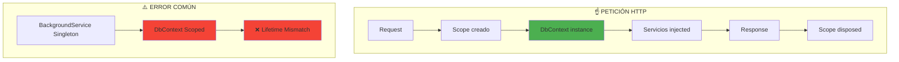
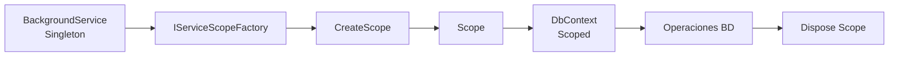

- [5. EF Core y Persistencia Avanzada](#5-ef-core-y-persistencia-avanzada)
  - [1. ApplicationDbContext](#1-applicationdbcontext)
    - [1.1. Ciclo de Vida: Contexto Scoped](#11-ciclo-de-vida-contexto-scoped)
  - [2. In-Memory Database](#2-in-memory-database)
    - [2.1. Ventajas](#21-ventajas)
    - [2.2. Migración a Producción](#22-migración-a-producción)
  - [3. Background Services y DbContext](#3-background-services-y-dbcontext)
    - [3.1. El Problema](#31-el-problema)
    - [3.2. Solución: Patrón Factory](#32-solución-patrón-factory)
    - [3.3. Flujo del Patrón Factory](#33-flujo-del-patrón-factory)
  - [4. SeedData](#4-seeddata)
    - [4.1. Carga en Program.cs](#41-carga-en-programcs)


# 5. EF Core y Persistencia Avanzada
En esta sección, exploramos cómo configurar EF Core con un `DbContext` personalizado, usar una base de datos en memoria para desarrollo, manejar el ciclo de vida del contexto en servicios en segundo plano y sembrar datos iniciales.


## 1. ApplicationDbContext

`ApplicationDbContext` hereda de `DbContext` y define los `DbSet` que representan tus tablas:

```csharp
public class ApplicationDbContext : IdentityDbContext<User, IdentityRole<long>, long>
{
    public DbSet<Product> Products { get; set; }
    public DbSet<Purchase> Purchases { get; set; }
    public DbSet<Rating> Ratings { get; set; }
    public DbSet<Favorite> Favorites { get; set; }
    public DbSet<CarritoItem> CarritoItems { get; set; }

    public ApplicationDbContext(DbContextOptions<ApplicationDbContext> options) : base(options) { }

    protected override void OnModelCreating(ModelBuilder builder)
    {
        base.OnModelCreating(builder);
        
        foreach (var relationship in builder.Model.GetEntityTypes()
            .SelectMany(e => e.GetForeignKeys()))
        {
            relationship.DeleteBehavior = DeleteBehavior.Restrict;
        }
        
        builder.Entity<Product>(entity =>
        {
            entity.HasKey(p => p.Id);
            entity.Property(p => p.Precio).HasColumnType("decimal(18, 2)");
            entity.Property(p => p.CreatedAt).HasDefaultValueSql("GETDATE()");
            entity.Property(p => p.UpdatedAt).ValueGeneratedOnAddOrUpdate();
            
            entity.HasOne(p => p.Propietario)
                  .WithMany(u => u.Products)
                  .HasForeignKey(p => p.PropietarioId)
                  .OnDelete(DeleteBehavior.Restrict);
        });
    }
}
```

### 1.1. Ciclo de Vida: Contexto Scoped



El `DbContext` se registra como **Scoped**:
- Nueva instancia por cada petición HTTP
- Todos los servicios comparten la misma instancia
- Garantiza coherencia transaccional

---

## 2. In-Memory Database

Usamos base de datos en memoria para desarrollo:

```csharp
builder.Services.AddDbContext<ApplicationDbContext>(options =>
    options.UseInMemoryDatabase("WalaDawDb"));
```

### 2.1. Ventajas

| Ventaja                | Descripción                    |
| ---------------------- | ------------------------------ |
| **Configuración Cero** | No necesitas SQL Server        |
| **Estado Limpio**      | Se reinicia con cada ejecución |
| **Pruebas Rápidas**    | Ideal para tests unitarios     |

### 2.2. Migración a Producción

```csharp
// Solo cambiar una línea para usar SQL Server
options.UseSqlServer(builder.Configuration.GetConnectionString("DefaultConnection"));
```

El resto del código es **idéntico**. EF Core abstrae la base de datos.

---

## 3. Background Services y DbContext

Los Background Services son **Singletons** pero `DbContext` es **Scoped**.

### 3.1. El Problema

```csharp
// ❌ ERROR: Lifetime Mismatch
public class CarritoCleanupService : BackgroundService
{
    private readonly ApplicationDbContext _context; // Scoped en Singleton
}
```

### 3.2. Solución: Patrón Factory

```csharp
public class CarritoCleanupService(IServiceScopeFactory scopeFactory) : BackgroundService
{
    protected override async Task ExecuteAsync(CancellationToken stoppingToken)
    {
        while (!stoppingToken.IsCancellationRequested)
        {
            using var scope = scopeFactory.CreateScope();
            var context = scope.ServiceProvider.GetRequiredService<ApplicationDbContext>();
            
            // Usar context...
            
            await Task.Delay(TimeSpan.FromMinutes(60), stoppingToken);
        }
    }
}
```

### 3.3. Flujo del Patrón Factory



---

## 4. SeedData

Datos de prueba que se cargan al iniciar:

```csharp
public static class SeedData
{
    public static void Initialize(IServiceProvider serviceProvider)
    {
        using var scope = serviceProvider.CreateScope();
        var context = scope.ServiceProvider.GetRequiredService<ApplicationDbContext>();
        
        if (context.Products.Any()) return;  // Ya sembrado
        
        // Crear usuarios de prueba
        var admin = new User { /* ... */ };
        
        // Crear productos de ejemplo
        var products = new List<Product>
        {
            new Product { Nombre = "iPhone 17 Pro Max", /* ... */ },
            new Product { Nombre = "MacBook Pro M3", /* ... */ }
        };
        
        context.Products.AddRange(products);
        context.SaveChanges();
    }
}
```

### 4.1. Carga en Program.cs

```csharp
var app = builder.Build();
SeedData.Initialize(app.Services);
```

---

**Anterior Volumen**: [04. Autenticación y Autorización](../04-Authentication-Authorization.md)  
**Próximo Volumen**: [06. SQLite In-Memory](../06-SQLite-InMemory-Persistence.md)
