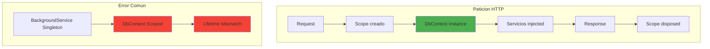
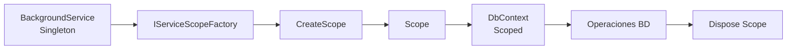
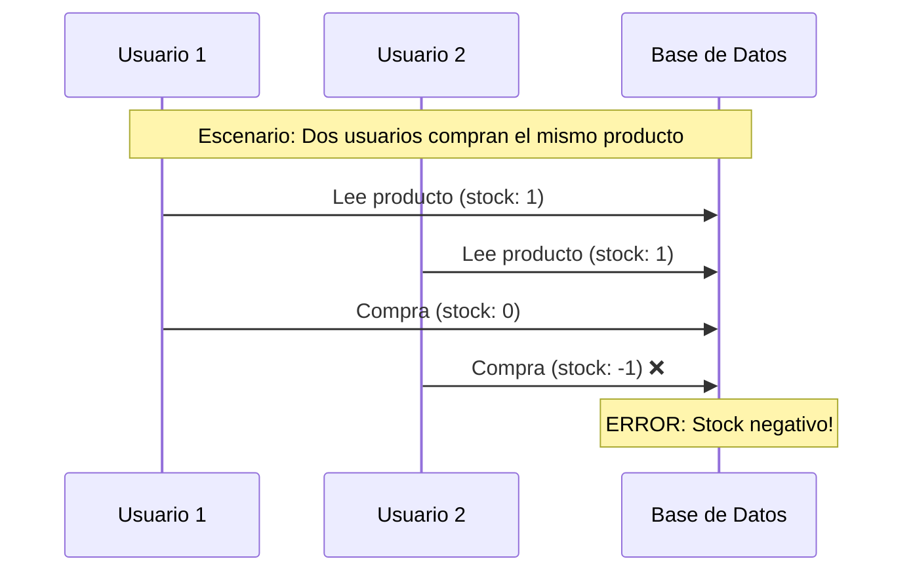
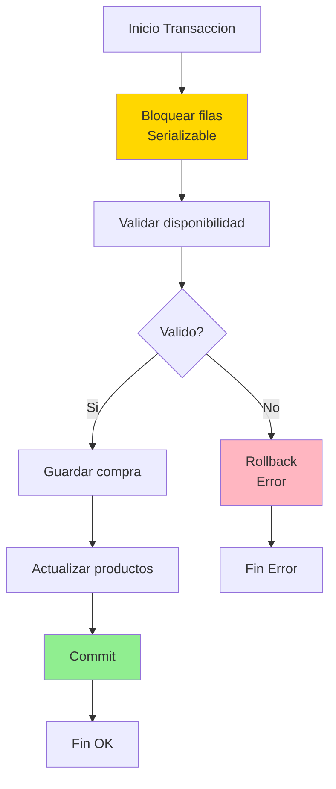
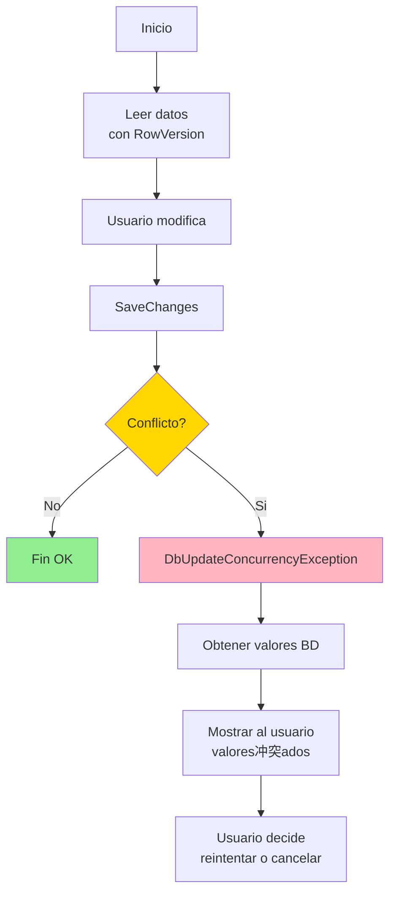
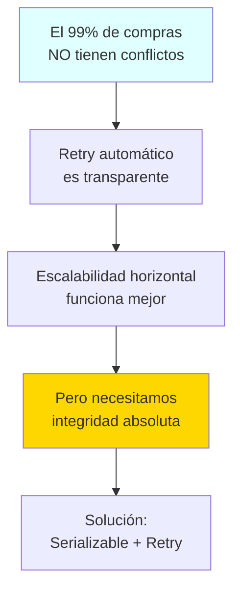
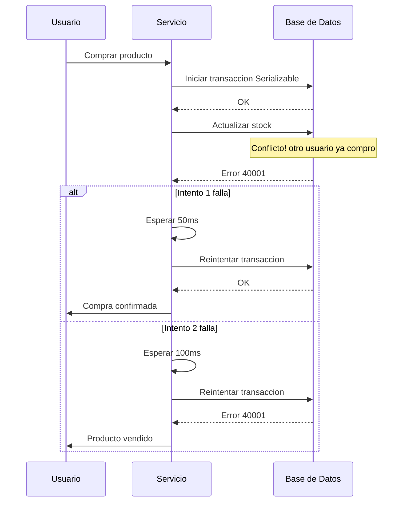
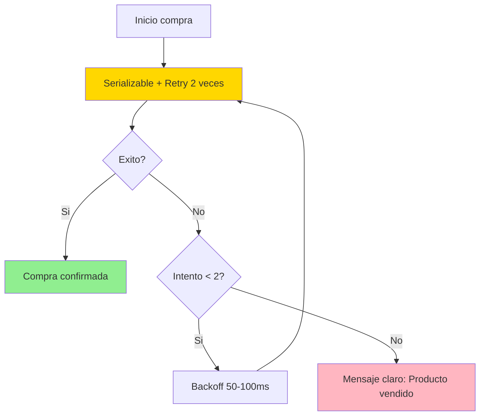
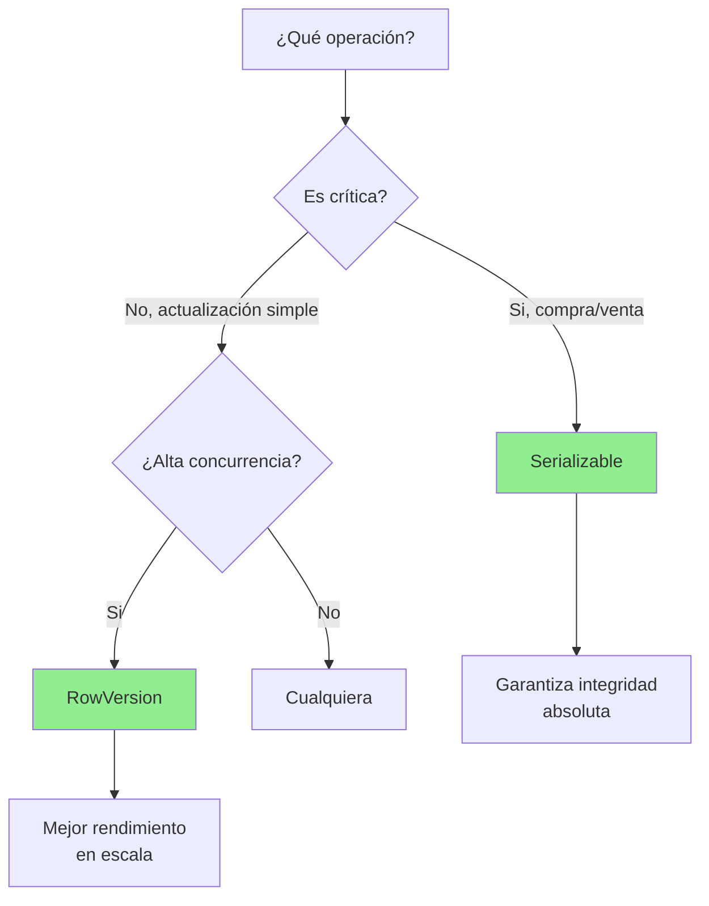

- [5. EF Core y Persistencia Avanzada](#5-ef-core-y-persistencia-avanzada)
  - [1. ApplicationDbContext](#1-applicationdbcontext)
    - [1.1. Ciclo de Vida: Contexto Scoped](#11-ciclo-de-vida-contexto-scoped)
  - [2. In-Memory Database](#2-in-memory-database)
    - [2.1. Ventajas](#21-ventajas)
    - [2.2. Migración a Producción](#22-migración-a-producción)
  - [3. Background Services y DbContext](#3-background-services-y-dbcontext)
    - [3.1. El Problema](#31-el-problema)
    - [3.2. Solución: Patrón Factory](#32-solución-patrón-factory)
    - [3.3. Flujo del Patrón Factory](#33-flujo-del-patrón-factory)
  - [4. SeedData](#4-seeddata)
    - [4.1. Carga en Program.cs](#41-carga-en-programcs)
  - [5. Control de Concurrencia](#5-control-de-concurrencia)
    - [5.1. El Problema de Concurrencia](#51-el-problema-de-concurrencia)
    - [5.2. Enfoque Pesimista: Serializable](#52-enfoque-pesimista-serializable)
      - [5.2.1. Implementación](#521-implementación)
      - [5.2.2. Diagrama de Flujo](#522-diagrama-de-flujo)
      - [5.2.3. Pros y Contras](#523-pros-y-contras)
    - [5.3. Enfoque Optimista: RowVersion](#53-enfoque-optimista-rowversion)
      - [5.3.1. Implementación en el Modelo](#531-implementación-en-el-modelo)
      - [5.3.2. Configuración en DbContext](#532-configuración-en-dbcontext)
      - [5.3.3. Servicio con Control Optimista](#533-servicio-con-control-optimista)
      - [5.3.4. Diagrama de Flujo](#534-diagrama-de-flujo)
      - [5.3.5. Pros y Contras](#535-pros-y-contras)
    - [5.4. Enfoque Híbrido Pragmático (Recomendado)](#54-enfoque-híbrido-pragmático-recomendado)
      - [5.4.1. ¿Por Qué Híbrido?](#541-por-qué-híbrido)
      - [5.4.2. Implementación del Enfoque Híbrido](#542-implementación-del-enfoque-híbrido)
      - [5.4.3. Flujo del Retry Automático](#543-flujo-del-retry-automático)
      - [5.4.4. Por Qué Este Enfoque Funciona](#544-por-qué-este-enfoque-funciona)
      - [5.4.5. Resumen del Enfoque Híbrido](#545-resumen-del-enfoque-híbrido)
    - [5.5. Comparación y Cuándo Usar Cada Uno](#55-comparación-y-cuándo-usar-cada-uno)
      - [Resumen Visual](#resumen-visual)


# 5. EF Core y Persistencia Avanzada

En esta sección, exploramos cómo configurar EF Core con un `DbContext` personalizado, usar una base de datos en memoria para desarrollo, manejar el ciclo de vida del contexto en servicios en segundo plano, sembrar datos iniciales y gestionar el control de concurrencia.


## 1. ApplicationDbContext

`ApplicationDbContext` hereda de `DbContext` y define los `DbSet` que representan tus tablas:

```csharp
public class ApplicationDbContext : IdentityDbContext<User, IdentityRole<long>, long>
{
    public DbSet<Product> Products { get; set; }
    public DbSet<Purchase> Purchases { get; set; }
    public DbSet<Rating> Ratings { get; set; }
    public DbSet<Favorite> Favorites { get; set; }
    public DbSet<CarritoItem> CarritoItems { get; set; }

    public ApplicationDbContext(DbContextOptions<ApplicationDbContext> options) : base(options) { }

    protected override void OnModelCreating(ModelBuilder builder)
    {
        base.OnModelCreating(builder);
        
        foreach (var relationship in builder.Model.GetEntityTypes()
            .SelectMany(e => e.GetForeignKeys()))
        {
            relationship.DeleteBehavior = DeleteBehavior.Restrict;
        }
        
        builder.Entity<Product>(entity =>
        {
            entity.HasKey(p => p.Id);
            entity.Property(p => p.Precio).HasColumnType("decimal(18, 2)");
            entity.Property(p => p.CreatedAt).HasDefaultValueSql("GETDATE()");
            entity.Property(p => p.UpdatedAt).ValueGeneratedOnAddOrUpdate();
            
            entity.HasOne(p => p.Propietario)
                  .WithMany(u => u.Products)
                  .HasForeignKey(p => p.PropietarioId)
                  .OnDelete(DeleteBehavior.Restrict);
        });
    }
}
```

### 1.1. Ciclo de Vida: Contexto Scoped



El `DbContext` se registra como **Scoped**:
- Nueva instancia por cada petición HTTP
- Todos los servicios comparten la misma instancia
- Garantiza coherencia transaccional

---


## 2. In-Memory Database

Usamos base de datos en memoria para desarrollo:

```csharp
builder.Services.AddDbContext<ApplicationDbContext>(options =>
    options.UseInMemoryDatabase("WalaDawDb"));
```

### 2.1. Ventajas

| Ventaja                | Descripción                    |
| ---------------------- | ------------------------------ |
| **Configuración Cero** | No necesitas SQL Server        |
| **Estado Limpio**      | Se reinicia con cada ejecución |
| **Pruebas Rápidas**    | Ideal para tests unitarios     |

### 2.2. Migración a Producción

```csharp
// Solo cambiar una línea para usar SQL Server
options.UseSqlServer(builder.Configuration.GetConnectionString("DefaultConnection"));
```

El resto del código es **idéntico**. EF Core abstrae la base de datos.

---


## 3. Background Services y DbContext

Los Background Services son **Singletons** pero `DbContext` es **Scoped**.

### 3.1. El Problema

```csharp
// ERROR: Lifetime Mismatch
public class CarritoCleanupService : BackgroundService
{
    private readonly ApplicationDbContext _context; // Scoped en Singleton
}
```

### 3.2. Solución: Patrón Factory

```csharp
public class CarritoCleanupService(IServiceScopeFactory scopeFactory) : BackgroundService
{
    protected override async Task ExecuteAsync(CancellationToken stoppingToken)
    {
        while (!stoppingToken.IsCancellationRequested)
        {
            using var scope = scopeFactory.CreateScope();
            var context = scope.ServiceProvider.GetRequiredService<ApplicationDbContext>();
            
            // Usar context...
            
            await Task.Delay(TimeSpan.FromMinutes(60), stoppingToken);
        }
    }
}
```

### 3.3. Flujo del Patrón Factory



---


## 4. SeedData

Datos de prueba que se cargan al iniciar:

```csharp
public static class SeedData
{
    public static void Initialize(IServiceProvider serviceProvider)
    {
        using var scope = serviceProvider.CreateScope();
        var context = scope.ServiceProvider.GetRequiredService<ApplicationDbContext>();
        
        if (context.Products.Any()) return;  // Ya sembrado
        
        // Crear usuarios de prueba
        var admin = new User { /* ... */ };
        
        // Crear productos de ejemplo
        var products = new List<Product>
        {
            new Product { Nombre = "iPhone 17 Pro Max", /* ... */ },
            new Product { Nombre = "MacBook Pro M3", /* ... */ }
        };
        
        context.Products.AddRange(products);
        context.SaveChanges();
    }
}
```

### 4.1. Carga en Program.cs

```csharp
var app = builder.Build();
SeedData.Initialize(app.Services);
```

---


## 5. Control de Concurrencia

El control de concurrencia es esencial cuando múltiples usuarios pueden acceder y modificar los mismos datos simultáneamente. Sin él, podemos tener condiciones de carrera que causan datos inconsistentes.

### 5.1. El Problema de Concurrencia



En un marketplace, si dos usuarios intentan comprar el mismo producto simultáneamente sin control de concurrencia, podríamos vender el mismo producto dos veces.

### 5.2. Enfoque Pesimista: Serializable

El enfoque pesimista usa **bloqueos en la base de datos** para prevenir el acceso simultáneo a los mismos datos.

#### 5.2.1. Implementación

```csharp
public async Task<Result<Purchase, DomainError>> CreatePurchaseFromCarritoAsync(long usuarioId)
{
    var strategy = context.Database.CreateExecutionStrategy();
    return await strategy.ExecuteAsync(async () => {
        using var transaction = await context.Database.BeginTransactionAsync(
            IsolationLevel.Serializable);
        
        try {
            // Validaciones...
            
            // Guardar compra
            context.Purchases.Add(purchase);
            await context.SaveChangesAsync();
            
            // Actualizar productos
            foreach (var producto in productos) {
                producto.CompraId = purchase.Id;
            }
            await context.SaveChangesAsync();
            
            await transaction.CommitAsync();
            return Result.Success(purchase);
        }
        catch (DbUpdateConcurrencyException ex) {
            await transaction.RollbackAsync();
            return Result.Failure(ConcurrencyError("Otro usuario.modificó los datos"));
        }
    });
}
```

#### 5.2.2. Diagrama de Flujo



#### 5.2.3. Pros y Contras

| Pros | Contras |
|------|---------|
| Garantía absoluta de consistencia | Bloquea filas, menor concurrencia |
| No requiere reintentos | Puede causar deadlocks |
| Simple de implementar | Menor escalabilidad |
| Ideal para operaciones críticas | No escala bien en alta carga |

---

### 5.3. Enfoque Optimista: RowVersion

El enfoque optimista asume que los conflictos son raros y los detecta **después** de que ocurren, usando un campo de versión.

#### 5.3.1. Implementación en el Modelo

```csharp
public class Product
{
    public long Id { get; set; }
    public string Nombre { get; set; }
    public decimal Precio { get; set; }
    public long? CompraId { get; set; }
    
    [Timestamp]
    public byte[] RowVersion { get; set; }  // Para control optimista
}
```

#### 5.3.2. Configuración en DbContext

```csharp
builder.Entity<Product>(entity =>
{
    entity.Property(p => p.RowVersion)
          .IsRowVersion()
          .IsConcurrencyToken();
});
```

#### 5.3.3. Servicio con Control Optimista

```csharp
public async Task<Result<Product, DomainError>> UpdateProductAsync(Product updatedProduct)
{
    try {
        var producto = await context.Products.FindAsync(updatedProduct.Id);
        if (producto == null) return Result.Failure(ProductError.NotFound(updatedProduct.Id));
        
        // Copiar propiedades
        producto.Nombre = updatedProduct.Nombre;
        producto.Precio = updatedProduct.Precio;
        
        // EF Core compara RowVersion automáticamente
        await context.SaveChangesAsync();
        
        return Result.Success(producto);
    }
    catch (DbUpdateConcurrencyException ex)
    {
        var entry = ex.Entries.Single();
        var dbValues = await entry.GetDatabaseValuesAsync();
        
        if (dbValues == null) {
            return Result.Failure(ProductError.NotFound(updatedProduct.Id));
        }
        
        // El producto fue modificado por otro usuario
        return Result.Failure(ConcurrencyError(
            "El producto fue modificado. Por favor, recargue y reintente."));
    }
}
```

#### 5.3.4. Diagrama de Flujo



#### 5.3.5. Pros y Contras

| Pros | Contras |
|------|---------|
| Mayor concurrencia | Necesita lógica de reintentos |
| Mejor escalabilidad | Peor UX si hay conflictos frecuentes |
| Sin bloqueos | Más complejo de implementar |
| Ideal para lecturas frecuentes | No garantiza atomicidad completa |

---

### 5.4. Enfoque Híbrido Pragmático (Recomendado)

El enfoque híbrido combina lo mejor de ambos mundos: usa **Serializable** solo para operaciones críticas de decremento de stock, con **retry automático** para manejar conflictos de forma transparente.

#### 5.4.1. ¿Por Qué Híbrido?



#### 5.4.2. Implementación del Enfoque Híbrido

```csharp
public class PurchaseService(/* ... */)
{
    private const int MaxRetries = 2;

    public async Task<Result<Purchase, DomainError>> CreatePurchaseFromCarritoAsync(long usuarioId)
    {
        var attempt = 0;
        
        while (attempt <= MaxRetries)
        {
            try
            {
                return await TryPurchaseAsync(usuarioId);
            }
            catch (DbUpdateConcurrencyException ex) when (IsSerializationFailure(ex) && attempt < MaxRetries)
            {
                attempt++;
                logger.LogWarning("Intento {Attempt} falló por conflicto de concurrencia. Reintentando...", attempt);
                await Task.Delay(50 * attempt); // Backoff exponencial
            }
        }
        
        return Result.Failure<Purchase, DomainError>(
            PurchaseError.ProductNotAvailable("El producto fue adquirido por otro usuario. Por favor, intenta con otro."));
    }

    private async Task<Result<Purchase, DomainError>> TryPurchaseAsync(long usuarioId)
    {
        var strategy = context.Database.CreateExecutionStrategy();
        return await strategy.ExecuteAsync(async () => {
            using var transaction = await context.Database.BeginTransactionAsync(IsolationLevel.Serializable);
            
            try
            {
                // 1. Validar disponibilidad (lectura)
                var carritoResult = await carritoService.GetCarritoByUsuarioIdAsync(usuarioId);
                if (carritoResult.IsFailure) return Result.Failure<Purchase, DomainError>(carritoResult.Error);
                
                // 2. Operación crítica: Marcar productos como comprados
                foreach (var item in carritoItems)
                {
                    var producto = await context.Products.FirstAsync(p => p.Id == item.ProductoId);
                    if (producto.CompraId != null)
                        return Result.Failure<Purchase, DomainError>(
                            PurchaseError.ProductNotAvailable(producto.Nombre));
                    
                    producto.CompraId = purchase.Id;
                    producto.Reservado = false;
                }
                
                // 3. Guardar cambios
                await context.SaveChangesAsync();
                await transaction.CommitAsync();
                
                return Result.Success(purchase);
            }
            catch (Exception ex)
            {
                await transaction.RollbackAsync();
                throw; // Re-lanzar para el retry
            }
        });
    }

    private bool IsSerializationFailure(DbUpdateConcurrencyException ex)
    {
        // PostgreSQL: error 40001 = serialization_failure
        // SQL Server: error 3960 = serialization_failure
        return ex.InnerException?.Message.Contains("40001") == true ||
               ex.InnerException?.Message.Contains("3960") == true ||
               ex.InnerException?.Message.Contains("serialization") == true;
    }
}
```

#### 5.4.3. Flujo del Retry Automatico



#### 5.4.4. Por Qué Este Enfoque Funciona

| Aspecto | Serializable Puro | RowVersion Puro | Híbrido (Recomendado) |
|---------|-------------------|-----------------|----------------------|
| **Integridad** | ✅ Absoluta | ⚠️ Detecta solo | ✅ Absoluta |
| **Escalabilidad** | ❌ Bloquea | ✅ Sin bloqueos | ✅ Buena |
| **UX** | ✅ Sin reintentos | ⚠️ Puede fallar | ✅ Transparente |
| **Complejidad** | Simple | Media | Media |
| **Conflictos** | ❌ Bloquea espera | ❌ Error directo | ✅ Retry auto |

#### 5.4.5. Resumen del Enfoque Hibrido



**El enfoque híbrido pragmático combina:**
1. **Serializable** para decremento de stock (milisegundos, una fila)
2. **Try-catch** del error 40001 (PostgreSQL) / 3960 (SQL Server)
3. **Retry automático** (1-2 veces) con backoff exponencial
4. **Mensaje claro** si persiste el conflicto

---

### 5.5. Comparación y Cuándo Usar Cada Uno



| Escenario | Recomendado | Razón |
|-----------|-------------|-------|
| **Compra en marketplace** | Serializable | No podemos vender dos veces |
| **Edición de perfil** | RowVersion | Conflictos raros |
| **Inventario crítico** | Serializable | stock debe ser exacto |
| **Comentarios/valoraciones** | RowVersion | Conflictos poco probables |
| **Transacciones financieras** | Serializable | Exactitud absoluta |
| **Alta escalabilidad** | RowVersion | Menos bloqueos |

#### Resumen Visual

| Aspecto | Serializable | RowVersion | Hibrido |
|---------|--------------|------------|---------|
| **Integridad** | Absoluta | Detecta solo | Absoluta |
| **Escalabilidad** | Bloquea | Sin bloqueos | Buena |
| **UX** | Sin reintentos | Puede fallar | Transparente |
| **Complejidad** | Simple | Media | Media |
| **Conflictos** | Bloquea espera | Error directo | Retry auto |

---

**Anterior Volumen**: [04. Autenticación y Autorización](../04-Authentication-Authorization.md)  
**Próximo Volumen**: [06. SQLite In-Memory](../06-SQLite-InMemory-Persistence.md)
