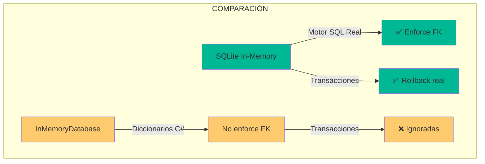
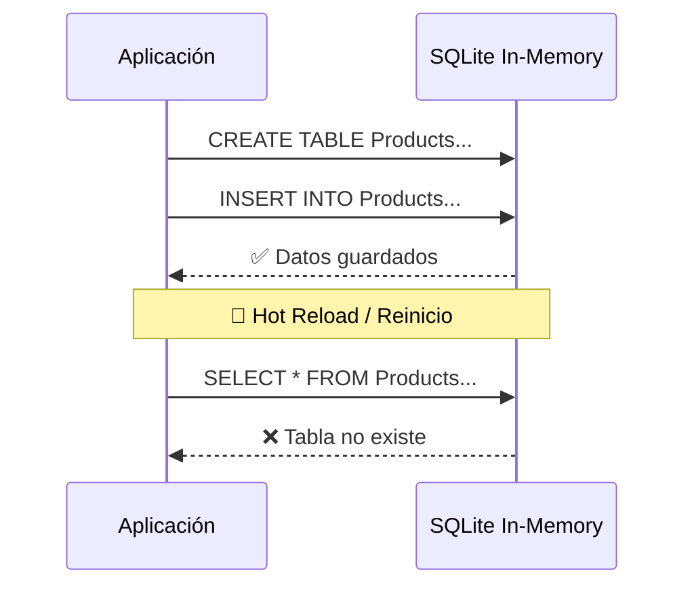

# 6. SQLite In-Memory vs InMemoryDatabase

## Índice

[6. SQLite In-Memory vs InMemoryDatabase](#6-sqlite-in-memory-vs-inmemorydatabase)
  - [6.1. ¿Por qué el cambio?](#61-por-qué-el-cambio)
  - [6.2. El Desafío del Ciclo de Vida](#62-el-desafío-del-ciclo-de-vida)
  - [6.3. La Solución Keep-Alive](#63-la-solución-keep-alive)
  - [6.4. Integración con SeedData](#64-integración-con-seeddata)

---

## 6.1. ¿Por qué el cambio?

Aunque ambos proveedores viven en memoria RAM, existen diferencias críticas:



| Característica        | InMemoryDatabase  | SQLite In-Memory     |
| --------------------- | ----------------- | -------------------- |
| **Tipo de Motor**     | Diccionarios C#   | Motor SQL Relacional |
| **Transacciones**     | Ignoradas (No-op) | ✅ Soportadas         |
| **Claves Foráneas**   | Ignoradas         | ✅ Enforzadas         |
| **Generación de IDs** | Básica            | Secuencial SQL       |

Para transacciones serializables, `InMemoryDatabase` es insuficiente.

---

## 6.2. El Desafío del Ciclo de Vida

Por defecto, SQLite In-Memory desaparece cuando se cierra la conexión:



**Problema**: La conexión se cierra cuando la aplicación se reinicia.

---

## 6.3. La Solución Keep-Alive

### SQLite In-Memory con KeepAlive

```csharp
// ❌ PROBLEMA: La conexión se cierra
services.AddDbContext<AppDbContext>(options =>
    options.UseSqlite("Data Source=:memory:"));

// ✅ SOLUCIÓN: Mantener la conexión abierta
var connection = new SqliteConnection("Data Source=:memory:");
connection.Open();

services.AddDbContext<AppDbContext>(options =>
    options.UseSqlite(connection));

// La conexión permanece abierta durante toda la vida de la app
```

### DbContext Factory (Mejor Práctica)

```csharp
// En Program.cs
var connectionString = "Data Source=:memory:";
var connection = new SqliteConnection(connectionString);
connection.Open();

builder.Services.AddSingleton(connection);
builder.Services.AddDbContextFactory<AppDbContext>(options =>
    options.UseSqlite(connection));

// Usar IDbContextFactory en servicios
public class ProductService
{
    private readonly IDbContextFactory<AppDbContext> _factory;

    public ProductService(IDbContextFactory<AppDbContext> factory)
    {
        _factory = factory;
    }

    public async Task CreateAsync(ProductDto dto)
    {
        using var context = _factory.CreateDbContext();
        // ...
    }
}
```

---

## 6.4. Integración con SeedData

### Clase SeedData

```csharp
public static class SeedData
{
    public static void Initialize(IServiceProvider serviceProvider)
    {
        using var scope = serviceProvider.CreateScope();
        var context = scope.ServiceProvider.GetRequiredService<AppDbContext>();
        
        context.Database.EnsureCreated();

        if (context.Products.Any()) return;

        var products = new List<Product>
        {
            new Product { Nombre = "Laptop", Precio = 999.99m, Stock = 10 },
            new Product { Nombre = "Mouse", Precio = 29.99m, Stock = 50 },
            new Product { Nombre = "Keyboard", Precio = 79.99m, Stock = 30 }
        };

        context.Products.AddRange(products);
        context.SaveChanges();
    }
}
```

### Uso en Program.cs

```csharp
// Crear scope para SeedData
using (var scope = app.Services.CreateScope())
{
    SeedData.Initialize(scope.ServiceProvider);
}

app.Run();
```

### SeedData con Datos Relacionales

```csharp
public static class SeedData
{
    public static void Initialize(AppDbContext context)
    {
        context.Database.EnsureCreated();

        if (context.Categories.Any()) return;

        var electronics = new Category { Nombre = "Electrónica" };
        var clothing = new Category { Nombre = "Ropa" };

        context.Categories.AddRange(electronics, clothing);
        
        var products = new List<Product>
        {
            new Product { Nombre = "Laptop", Precio = 999.99m, Category = electronics },
            new Product { Nombre = "Camisa", Precio = 29.99m, Category = clothing }
        };

        context.Products.AddRange(products);
        context.SaveChanges();
    }
}
```

---

## Resumen

| Aspecto                  | InMemoryDatabase     | SQLite In-Memory                    |
| ------------------------ | ------------------- | ----------------------------------- |
| **Facilidad de uso**     | ✅ Muy simple        | ✅ Simple con KeepAlive              |
| **Transacciones**        | ❌ No soportadas     | ✅ Soportadas                        |
| **Claves Foráneas**      | ❌ Ignoradas         | ✅ Enforzadas                        |
| **Rendimiento**          | ✅ Muy rápido        | ✅ Rápido                            |
| **Realismo para tests** | ❌ Bajo              | ✅ Alto                              |

---

**Anterior**: [05. Razor Pages](../05-Razor-Pages.md)  
**Próximo**: [07. Auditoría Automática](../07-Auditing.md)
