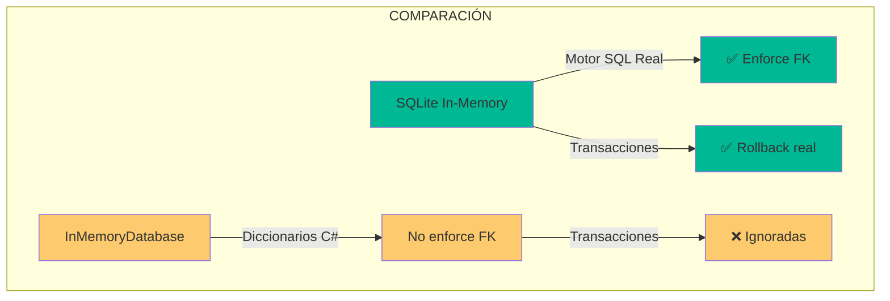
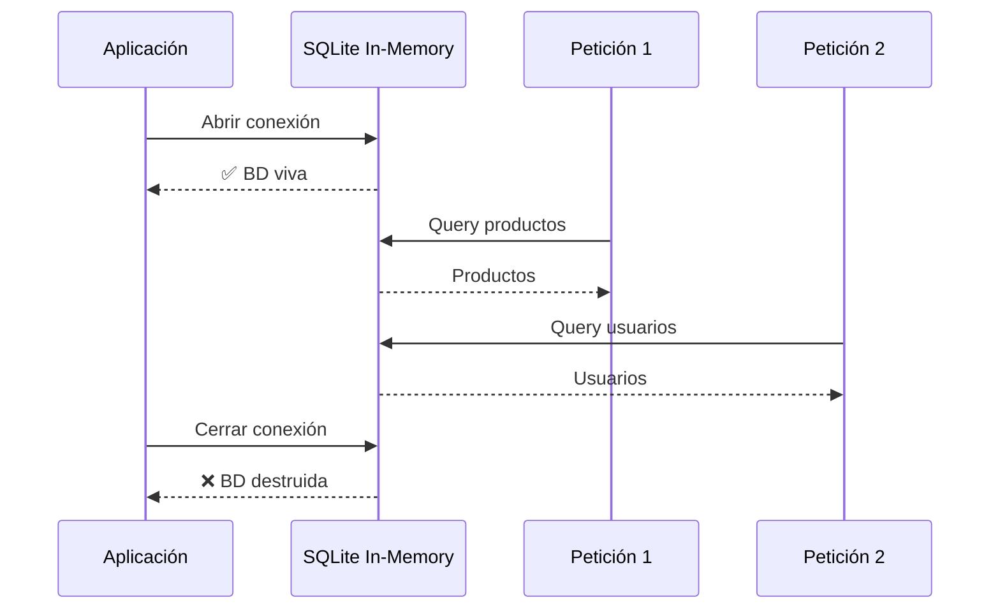

- [6. SQLite In-Memory vs InMemoryDatabase](#6-sqlite-in-memory-vs-inmemorydatabase)
  - [1. ¿Por qué el cambio?](#1-por-qué-el-cambio)
  - [2. El Desafío del Ciclo de Vida](#2-el-desafío-del-ciclo-de-vida)
  - [3. La Solución Keep-Alive](#3-la-solución-keep-alive)
  - [4. Integración con SeedData](#4-integración-con-seeddata)


# 6. SQLite In-Memory vs InMemoryDatabase
En esta sección, exploramos por qué migramos de `InMemoryDatabase` a SQLite In-Memory para pruebas y desarrollo.

## 1. ¿Por qué el cambio?

Aunque ambos proveedores viven en memoria RAM, existen diferencias críticas:



| Característica        | InMemoryDatabase  | SQLite In-Memory     |
| --------------------- | ----------------- | -------------------- |
| **Tipo de Motor**     | Diccionarios C#   | Motor SQL Relacional |
| **Transacciones**     | Ignoradas (No-op) | ✅ Soportadas         |
| **Claves Foráneas**   | Ignoradas         | ✅ Enforzadas         |
| **Generación de IDs** | Básica            | Secuencial SQL       |

Para transacciones serializables, `InMemoryDatabase` es insuficiente.

---

## 2. El Desafío del Ciclo de Vida

Por defecto, SQLite In-Memory desaparece cuando se cierra la conexión:



**Problema**: El `DbContext` se abre/cierra en cada petición.

---

## 3. La Solución Keep-Alive

En `Program.cs`, implementamos conexión persistente:

```csharp
var connectionString = "DataSource=:memory:";
var connection = new SqliteConnection(connectionString);
connection.Open();

builder.Services.AddDbContext<ApplicationDbContext>(options =>
    options.UseSqlite(connection));

var app = builder.Build();
SeedData.Initialize(app.Services);

app.Run();

// La conexión vive hasta que el proceso se detiene
```

Mientras `connection` viva, la base de datos permanece intacta.

---

## 4. Integración con SeedData

```csharp
public static async Task InitializeAsync(IServiceProvider serviceProvider)
{
    using var scope = serviceProvider.CreateScope();
    var context = scope.ServiceProvider.GetRequiredService<ApplicationDbContext>();
    
    if (context.Products.Any()) return;  // Ya sembrado
    
    // Crear datos de prueba
    var products = new List<Product>
    {
        new Product { Nombre = "iPhone 17 Pro Max", Precio = 1199.99m },
        new Product { Nombre = "MacBook Pro M3", Precio = 2499.99m }
    };
    
    context.Products.AddRange(products);
    await context.SaveChangesAsync();
}
```

| Ventaja                     | Inconveniente                          |
| --------------------------- | -------------------------------------- |
| Entorno limpio y predecible | Datos se pierden al reiniciar servidor |

---

**Anterior Volumen**: [05. EF Core y Persistencia](../05-EFCore-Persistence-Seed.md)  
**Próximo Volumen**: [07. Auditoría Automática](../07-Entity-Auditing-EFCore.md)
