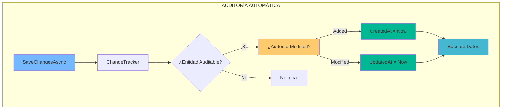
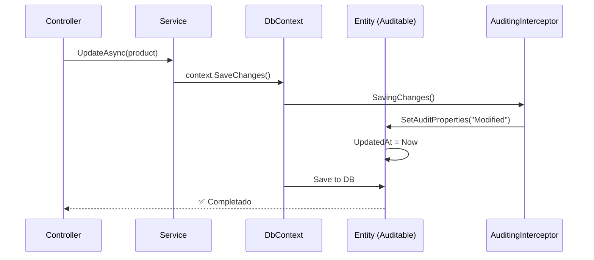

# 7. Auditoría Automática de Entidades con EF Core

## Índice

[7. Auditoría Automática de Entidades con EF Core](#7-auditoría-automática-de-entidades-con-ef-core)
  - [7.1. Enfoque Manual vs Automático](#71-enfoque-manual-vs-automático)
  - [7.2. Implementación del Sistema de Auditoría](#72-implementación-del-sistema-de-auditoría)
  - [7.3. Beneficios del Sistema](#73-beneficios-del-sistema)

---

## 7.1. Enfoque Manual vs Automático

### El Enfoque "Junior" (Manual)

```csharp
// ❌ Repetitivo y propenso a olvidos
public async Task UpdateProductAsync(Product product)
{
    product.Nombre = "Nuevo Nombre";
    product.UpdatedAt = DateTime.UtcNow;  // ¡Se olvida fácil!
    _context.SaveChanges();
}
```

### El Enfoque "Senior" (Automático)



---

## 7.2. Implementación del Sistema de Auditoría

### Clase Base (`AuditableEntity.cs`)

```csharp
using System.ComponentModel.DataAnnotations;

namespace TiendaDawWeb.Shared.Models;

/// <summary>
/// Clase base para entidades que requieren auditoría automática.
/// </summary>
public abstract class AuditableEntity
{
    [Column("CreatedAt")]
    public DateTime CreatedAt { get; set; } = DateTime.UtcNow;

    [Column("UpdatedAt")]
    public DateTime? UpdatedAt { get; set; }

    [Column("CreatedBy")]
    public long? CreatedBy { get; set; }

    [Column("UpdatedBy")]
    public long? UpdatedBy { get; set; }
}

/// <summary>
/// Extensión para IUserAccessor
/// </summary>
public interface IUserAccessor
{
    long? GetCurrentUserId();
}

public static class AuditableEntityExtensions
{
    public static void SetAuditProperties(this AuditableEntity entity, string action, IUserAccessor? userAccessor)
    {
        var now = DateTime.UtcNow;
        var userId = userAccessor?.GetCurrentUserId();

        if (action == "Added")
        {
            entity.CreatedAt = now;
            entity.CreatedBy = userId;
        }
        else if (action == "Modified")
        {
            entity.UpdatedAt = now;
            entity.UpdatedBy = userId;
        }
    }
}
```

### Interceptor en DbContext

```csharp
public class AuditingInterceptor : ISaveChangesInterceptor
{
    private readonly IUserAccessor _userAccessor;

    public AuditingInterceptor(IUserAccessor userAccessor)
    {
        _userAccessor = userAccessor;
    }

    public InterceptorResult<int> SavingChanges(
        DbContextEventData eventData,
        InterceptorResult<int> result)
    {
        var context = eventData.Context;
        if (context == null) return result;

        foreach (var entry in context.ChangeTracker.Entries<AuditableEntity>())
        {
            switch (entry.State)
            {
                case EntityState.Added:
                    entry.Entity.SetAuditProperties("Added", _userAccessor);
                    break;
                case EntityState.Modified:
                    entry.Entity.SetAuditProperties("Modified", _userAccessor);
                    break;
            }
        }

        return result;
    }
}

// Registro en Program.cs
builder.Services.AddScoped<ISaveChangesInterceptor, AuditingInterceptor>();
builder.Services.AddScoped<IUserAccessor, CurrentUserAccessor>();
```

### Entidades que heredan de AuditableEntity

```csharp
// ✅ Entidad que usa auditoría automática
public class Product : AuditableEntity
{
    [Key]
    public long Id { get; set; }

    [Required]
    [MaxLength(100)]
    public string Nombre { get; set; } = string.Empty;

    [Column(TypeName = "decimal(18,2)")]
    public decimal Precio { get; set; }

    public int Stock { get; set; }

    public long? CategoryId { get; set; }
    public Category? Category { get; set; }
}

// ❌ Entidad sin auditoría (datos de sistema, logs)
public class AuditLog
{
    public long Id { get; set; }
    public string Action { get; set; } = string.Empty;
    public DateTime Timestamp { get; set; }
}
```

---

## 7.3. Beneficios del Sistema

| Beneficio               | Descripción                                      |
| ---------------------- | ------------------------------------------------ |
| **Consistencia**       | Nunca se olvida actualizar fechas                |
| **Centralización**     | Un solo lugar para toda la lógica de auditoría    |
| **Testabilidad**       | Easy de testear con mocks                        |
| **Rendimiento**        | Solo afecta a entidades que heredan de Auditable |
| **Trazabilidad**       | CreatedBy/UpdatedBy para追究 (accountability)     |

### Flujo Completo



---

## Resumen

| Concepto                  | Descripción                                              |
| ------------------------ | ------------------------------------------------------- |
| **AuditableEntity**      | Clase base con CreatedAt, UpdatedAt, CreatedBy, UpdatedBy |
| **IUserAccessor**        | Interface para obtener el usuario actual                 |
| **ISaveChangesInterceptor** | Hook para ejecutar lógica antes de guardar cambios     |
| **Herencia**             | Solo las entidades que heredan de AuditableEntity se auditan |

---

**Anterior**: [06. Persistencia de Datos](../06-Persistence.md)  
**Próximo**: [08. Object Mapping](../08-Object-Mapping.md)
