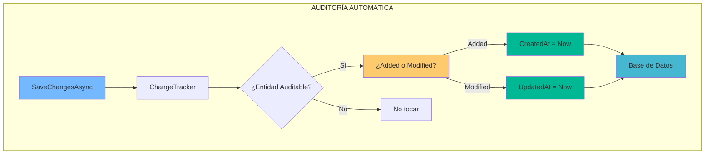
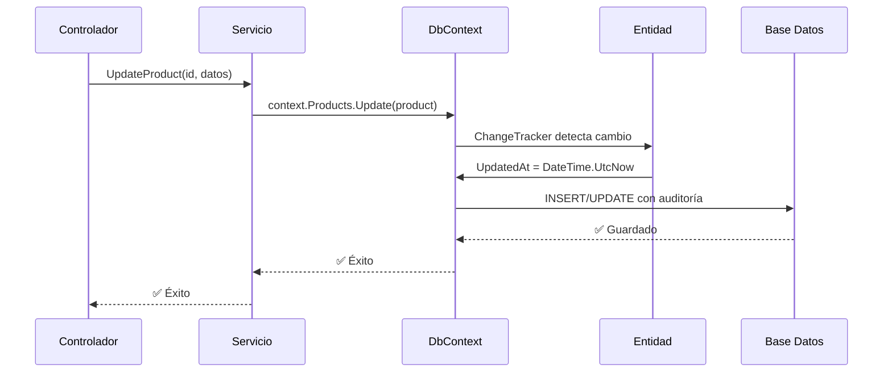

- [7. Auditoría Automática de Entidades con EF Core](#7-auditoría-automática-de-entidades-con-ef-core)
  - [1. Enfoque Manual vs Automático](#1-enfoque-manual-vs-automático)
    - [1.1. El Enfoque "Junior" (Manual)](#11-el-enfoque-junior-manual)
    - [1.2. El Enfoque "Senior" (Automático)](#12-el-enfoque-senior-automático)
  - [2. Implementación del Sistema de Auditoría](#2-implementación-del-sistema-de-auditoría)
    - [2.1. Clase Base (`AuditableEntity.cs`)](#21-clase-base-auditableentitycs)
    - [2.2. Interceptor en DbContext](#22-interceptor-en-dbcontext)
    - [2.3. Entidades que heredan de AuditableEntity](#23-entidades-que-heredan-de-auditableentity)
  - [3. Beneficios del Sistema](#3-beneficios-del-sistema)
    - [3.1. Flujo Completo](#31-flujo-completo)


# 7. Auditoría Automática de Entidades con EF Core
En esta sección, aprenderemos a implementar un sistema de auditoría automática para nuestras entidades en EF Core. Este sistema registrará automáticamente las marcas de tiempo y los usuarios responsables cada vez que una entidad sea creada o modificada, eliminando la necesidad de repetir este código en cada operación de guardado.


## 1. Enfoque Manual vs Automático

### 1.1. El Enfoque "Junior" (Manual)

```csharp
// ❌ Repetitivo y propenso a olvidos
producto.Nombre = "Nuevo Nombre";
producto.UpdatedAt = DateTime.UtcNow;
_context.SaveChanges();
```

### 1.2. El Enfoque "Senior" (Automático)



---

## 2. Implementación del Sistema de Auditoría

### 2.1. Clase Base (`AuditableEntity.cs`)

```csharp
public abstract class AuditableEntity
{
    public DateTime CreatedAt { get; set; }
    public DateTime? UpdatedAt { get; set; }
    public string? CreatedBy { get; set; }
    public string? UpdatedBy { get; set; }
}
```

### 2.2. Interceptor en DbContext

```csharp
public override Task<int> SaveChangesAsync(
    CancellationToken cancellationToken = new())
{
    foreach (var entry in ChangeTracker.Entries<AuditableEntity>())
    {
        if (entry.State == EntityState.Added)
        {
            entry.Entity.CreatedAt = DateTime.UtcNow;
            entry.Entity.CreatedBy = GetCurrentUserId();
        }
        else if (entry.State == EntityState.Modified)
        {
            entry.Entity.UpdatedAt = DateTime.UtcNow;
            entry.Entity.UpdatedBy = GetCurrentUserId();
        }
    }
    
    return base.SaveChangesAsync(cancellationToken);
}
```

### 2.3. Entidades que heredan de AuditableEntity

```csharp
public class Product : AuditableEntity
{
    public long Id { get; set; }
    public string Nombre { get; set; }
    public decimal Precio { get; set; }
    // CreatedAt y UpdatedAt vienen de AuditableEntity
}
```

---

## 3. Beneficios del Sistema

| Beneficio               | Descripción                                        |
| ----------------------- | -------------------------------------------------- |
| **Código Limpio (DRY)** | Sin código de fontanería en controladores          |
| **Consistencia**        | TODOS los registros tienen auditoría               |
| **Trazabilidad**        | Saber exactamente cuándo se modificó cada registro |

### 3.1. Flujo Completo



---

**Anterior Volumen**: [06. SQLite In-Memory](../06-SQLite-InMemory-Persistence.md)  
**Próximo Volumen**: [08. Object Mapping](../08-Object-Mapping-Pattern.md)
