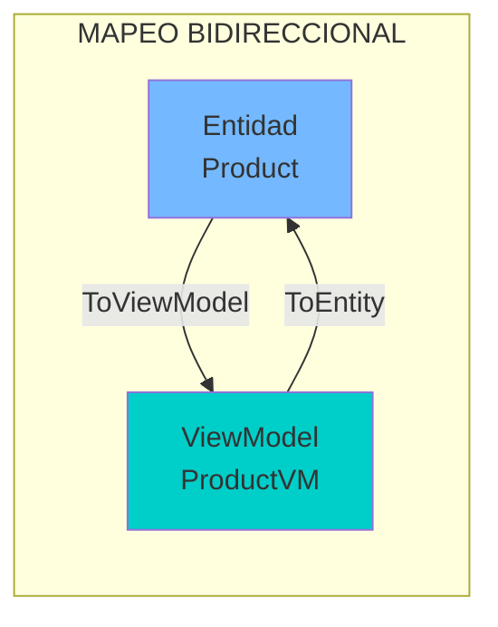
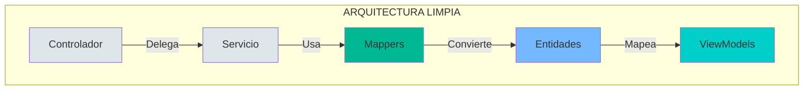

- [8. Patrón de Mapeo de Objetos: Clean Controllers](#8-patrón-de-mapeo-de-objetos-clean-controllers)
  - [1. El Problema: Controladores Sucios](#1-el-problema-controladores-sucios)
    - [1.1. Código Repetitivo](#11-código-repetitivo)
    - [1.2. Problemas del Mapeo Manual en Controlador](#12-problemas-del-mapeo-manual-en-controlador)
  - [2. La Solución: Métodos de Extensión](#2-la-solución-métodos-de-extensión)
    - [2.1. El Mapeador (`Mappers/ProductMapper.cs`)](#21-el-mapeador-mappersproductmappercs)
    - [2.2. Flujo de Mapeo](#22-flujo-de-mapeo)
    - [2.3. Uso en Controlador](#23-uso-en-controlador)
  - [3. Por qué no usar AutoMapper](#3-por-qué-no-usar-automapper)
    - [3.1. Desventajas de AutoMapper](#31-desventajas-de-automapper)
  - [4. Beneficios del Patrón](#4-beneficios-del-patrón)


# 8. Patrón de Mapeo de Objetos: Clean Controllers
En esta sección, exploramos cómo mantener los controladores limpios y enfocados en la orquestación de la lógica de negocio, delegando la responsabilidad de mapear entre entidades y ViewModels a métodos de extensión dedicados. Este enfoque mejora la mantenibilidad, testabilidad y claridad del código.

## 1. El Problema: Controladores Sucios

### 1.1. Código Repetitivo

```csharp
// ❌ Controlador "sucio"
var vm = new ProductViewModel {
    Nombre = product.Nombre,
    Precio = product.Precio,
    Descripcion = product.Descripcion,
    Imagen = product.Imagen,
    Categoria = product.Categoria,
    // ... 15 campos más
};
```

### 1.2. Problemas del Mapeo Manual en Controlador

| Problema         | Impacto                                    |
| ---------------- | ------------------------------------------ |
| **Repetición**   | Mismo código en varios lugares             |
| **Acoplamiento** | Controlador conoce estructura de entidades |
| **Fragilidad**   | Cambios en entidades rompen controladores  |

---

## 2. La Solución: Métodos de Extensión

### 2.1. El Mapeador (`Mappers/ProductMapper.cs`)

```csharp
public static class ProductMapper
{
    public static ProductViewModel ToViewModel(this Product product)
    {
        return new ProductViewModel
        {
            Id = product.Id,
            Nombre = product.Nombre,
            Precio = product.Precio,
            Descripcion = product.Descripcion,
            Imagen = product.Imagen,
            Categoria = product.Categoria.ToString()
        };
    }
    
    public static Product ToEntity(this ProductViewModel vm, Product product)
    {
        product.Nombre = vm.Nombre;
        product.Precio = vm.Precio;
        product.Descripcion = vm.Descripcion;
        return product;
    }
}
```

### 2.2. Flujo de Mapeo



### 2.3. Uso en Controlador

```csharp
// ✅ Controlador limpio
return View(product.ToViewModel());
```

---

## 3. Por qué no usar AutoMapper

| Criterio        | AutoMapper           | Mapeo Manual            |
| --------------- | -------------------- | ----------------------- |
| **Rendimiento** | Reflexión (overhead) | Compilador (más rápido) |
| **Depuración**  | Error en runtime     | Error en compilación    |
| **Control**     | Automático (mágico)  | Explícito (claro)       |

### 3.1. Desventajas de AutoMapper

```csharp
// ❌ Con AutoMapper - error solo al ejecutar
var vm = _mapper.Map<ProductViewModel>(product);

// ✅ Con mapeo manual - el compilador avisa
var vm = product.ToViewModel();
```

---

## 4. Beneficios del Patrón



| Beneficio                           | Descripción                                  |
| ----------------------------------- | -------------------------------------------- |
| **Separación de responsabilidades** | Controladores orquestan, no mapean           |
| **Mantenibilidad**                  | Cambios en entidadescentralizados en mappers |
| **Testabilidad**                    | Mappers pueden probarse independientemente   |

---

**Anterior Volumen**: [07. Auditoría Automática](../07-Entity-Auditing-EFCore.md)  
**Próximo Volumen**: [09. Razor Masterclass](../09-Razor-Syntax-UI.md)
