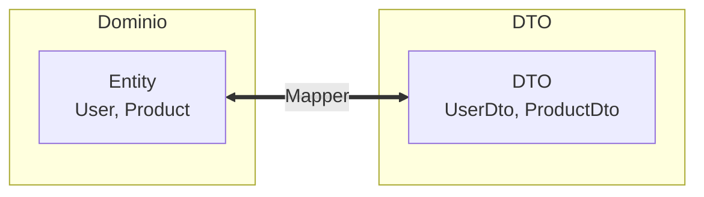

# 8. Object Mapping Pattern

## Índice

[8. Object Mapping Pattern](#8-object-mapping-pattern)
  - [8.1. Qué es Object Mapping](#81-qué-es-object-mapping)
  - [8.2. Mapper Personalizado](#82-mapper-personalizado)
  - [8.3. AutoMapper vs Manual](#83-automapper-vs-manual)
  - [8.4. Ejemplo en WalaDaw](#84-ejemplo-en-waladaw)
  - [8.5. Resumen](#85-resumen)

---

## 8.1. Qué es Object Mapping

El **Object Mapping** es el proceso de transformar objetos de un tipo a otro, típicamente entre entidades de dominio y DTOs (Data Transfer Objects).



### ¿Por qué usar Mapping?

| Problema                     | Solución con Mapping                        |
| -------------------------- | ------------------------------------------ |
| Entidades con datos sensibles | DTOs sin datos sensibles                 |
| Formato de API diferente    | DTOs adaptados al cliente                |
| Acoplamiento con BD        | Capa de abstracción                       |

---

## 8.2. Mapper Personalizado

### Ventajas del Mapper Manual

```csharp
// Mapeo manual simple
public static ProductDto ToDto(this Product product)
{
    return new ProductDto
    {
        Id = product.Id,
        Nombre = product.Nombre,
        Precio = product.Precio,
        PrecioFormateado = product.Precio.ToString("C"),
        CategoryName = product.Category?.Nombre
    };
}

// Mapper con lógica de negocio
public static Product ToEntity(this ProductDto dto, Product? existing = null)
{
    var product = existing ?? new Product();
    product.Nombre = dto.Nombre;
    product.Precio = dto.Precio;
    product.Stock = dto.Stock;
    
    // Lógica de negocio durante el mapeo
    if (dto.Precio < 0)
        throw new ArgumentException("El precio no puede ser negativo");
    
    return product;
}
```

### Mapper con Projection

```csharp
// En DbContext
protected override void OnModelCreating(ModelBuilder modelBuilder)
{
    modelBuilder.Entity<Product>()
        .HasQueryFilter(p => !p.IsDeleted)
        .HasProjection(p => new ProductDto
        {
            Id = p.Id,
            Nombre = p.Nombre,
            Precio = p.Precio,
            CategoryName = p.Category!.Nombre
        });
}

// Uso
var products = await _context.Products
    .WithProjection()
    .ToListAsync();
```

---

## 8.3. AutoMapper vs Manual

### AutoMapper

```csharp
// Configuración
public class AutoMapperProfile : Profile
{
    public AutoMapperProfile()
    {
        CreateMap<Product, ProductDto>();
        CreateMap<CreateProductDto, Product>();
        CreateMap<Product, ProductListDto>()
            .ForMember(dest => dest.CategoryName, 
                opt => opt.MapFrom(src => src.Category!.Nombre));
    }
}

// Uso
var dto = _mapper.Map<ProductDto>(product);
var product = _mapper.Map<Product>(createDto);
```

### Comparación

| Aspecto       | Mapper Manual                 | AutoMapper                    |
| ------------ | --------------------------- | ---------------------------- |
| **Control**  | Total (lógica en código)    | Basado en convenciones        |
| **Debugging**| Fácil de depurar            | Más difícil                   |
| **Rendimiento**| Sin overhead               | Pequeño overhead              |
| **Mantenimiento**| Puede crecer mucho      | Más limpio para muchos mapeos |
| **Errores**  | En tiempo de compilación     | En tiempo de ejecución        |

### Recomendación

```csharp
// ✅ WalaDaw usa Mapper Manual (más control)
public static class ProductMapper
{
    public static ProductDto ToDto(Product product)
    {
        // ... lógica explícita
    }
}

// ⚠️ AutoMapper solo para proyectos muy grandes
// con muchos DTOs similares
```

---

## 8.4. Ejemplo en WalaDaw

### DTOs

```csharp
// DTO para lista (solo datos necesarios)
public class ProductListDto
{
    public long Id { get; set; }
    public string Nombre { get; set; } = string.Empty;
    public decimal Precio { get; set; }
    public string? Imagen { get; set; }
}

// DTO para detalle (todos los datos)
public class ProductDetailDto
{
    public long Id { get; set; }
    public string Nombre { get; set; } = string.Empty;
    public string Descripcion { get; set; } = string.Empty;
    public decimal Precio { get; set; }
    public string PrecioFormateado => Precio.ToString("C");
    public int Stock { get; set; }
    public string CategoryNombre { get; set; } = string.Empty;
    public double RatingPromedio { get; set; }
    public int TotalReviews { get; set; }
}

// DTO para creación
public class CreateProductDto
{
    [Required]
    [MaxLength(100)]
    public string Nombre { get; set; } = string.Empty;

    [MaxLength(500)]
    public string? Descripcion { get; set; }

    [Range(0.01, 100000)]
    public decimal Precio { get; set; }

    [Range(0, int.MaxValue)]
    public int Stock { get; set; }

    public long CategoryId { get; set; }
}
```

### Mapper

```csharp
public static class ProductMapper
{
    public static ProductListDto ToListDto(this Product product)
    {
        return new ProductListDto
        {
            Id = product.Id,
            Nombre = product.Nombre,
            Precio = product.Precio,
            Imagen = product.Imagen
        };
    }

    public static ProductDetailDto ToDetailDto(this Product product)
    {
        return new ProductDetailDto
        {
            Id = product.Id,
            Nombre = product.Nombre,
            Descripcion = product.Descripcion ?? "",
            Precio = product.Precio,
            PrecioFormateado = product.Precio.ToString("C"),
            Stock = product.Stock,
            CategoryNombre = product.Category?.Nombre ?? "Sin categoría",
            RatingPromedio = product.Reviews.Any() 
                ? product.Reviews.Average(r => r.Rating) 
                : 0,
            TotalReviews = product.Reviews.Count
        };
    }

    public static Product ToEntity(this CreateProductDto dto)
    {
        return new Product
        {
            Nombre = dto.Nombre,
            Descripcion = dto.Descripcion,
            Precio = dto.Precio,
            Stock = dto.Stock,
            CategoryId = dto.CategoryId,
            CreatedAt = DateTime.UtcNow
        };
    }

    public static void UpdateEntity(this Product product, CreateProductDto dto)
    {
        product.Nombre = dto.Nombre;
        product.Descripcion = dto.Descripcion;
        product.Precio = dto.Precio;
        product.Stock = dto.Stock;
        product.CategoryId = dto.CategoryId;
        product.UpdatedAt = DateTime.UtcNow;
    }
}
```

### Uso en Controlador

```csharp
public class ProductsController : Controller
{
    private readonly IProductService _service;

    public ProductsController(IProductService service)
    {
        _service = service;
    }

    public async Task<IActionResult> Index(string? search, int page = 1)
    {
        var result = await _service.GetAllAsync(search, page);
        
        return result.Match(
            onSuccess: products => View(products.ToListDtos()),
            onFailure: error => View("Error", error)
        );
    }

    public async Task<IActionResult> Details(long id)
    {
        var result = await _service.GetByIdAsync(id);
        
        return result.Match(
            onSuccess: product => View(product.ToDetailDto()),
            onFailure: error => NotFound(error)
        );
    }
}
```

---

## 8.5. Resumen

| Concepto           | Descripción                                              |
| ------------------ | -------------------------------------------------------- |
| **DTO**            | Data Transfer Object - solo datos que necesita el cliente |
| **Mapper**         | Clase/método que transforma Entity ↔ DTO                |
| **Projection**    | Consulta optimizada que solo trae datos necesarios        |
| **Separation**    | Entity = base de datos, DTO = API/cliente               |

---

**Anterior**: [07. Auditoría Automática](../07-Auditing.md)  
**Próximo**: [09. Sintaxis Razor](../09-Razor-Syntax.md)
