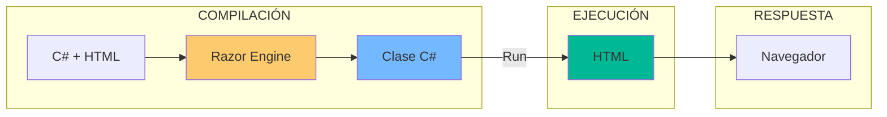
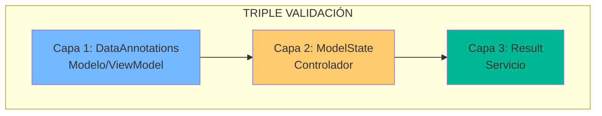

- [9. Razor Masterclass: El Arte de Pintar con C#](#9-razor-masterclass-el-arte-de-pintar-con-c)
  - [1. Sintaxis Fundamental de Razor](#1-sintaxis-fundamental-de-razor)
    - [1.1. Directivas Clave](#11-directivas-clave)
    - [1.2. Ejemplos de Sintaxis](#12-ejemplos-de-sintaxis)
    - [1.3. Flujo de Renderizado](#13-flujo-de-renderizado)
  - [2. Tag Helpers](#2-tag-helpers)
    - [2.1. Navegación Inteligente](#21-navegación-inteligente)
    - [2.2. Formularios Dinámicos](#22-formularios-dinámicos)
    - [2.3. Generación de Atributos](#23-generación-de-atributos)
  - [3. Estrategia de Triple Validación](#3-estrategia-de-triple-validación)
    - [3.1. Las Tres Capas](#31-las-tres-capas)
    - [3.2. DataAnnotations en ViewModel](#32-dataannotations-en-viewmodel)
  - [4. Componentes Parciales](#4-componentes-parciales)
    - [4.1. Crear un Componente Parcial](#41-crear-un-componente-parcial)
    - [4.2. Usar el Componente](#42-usar-el-componente)
  - [5. Layouts y Secciones](#5-layouts-y-secciones)
    - [5.1. Estructura de Layout](#51-estructura-de-layout)
    - [5.2. Definir Secciones](#52-definir-secciones)


# 9. Razor Masterclass: El Arte de Pintar con C#
En esta sección, exploraremos las técnicas avanzadas de Razor para crear vistas dinámicas y robustas en ASP.NET Core MVC.

## 1. Sintaxis Fundamental de Razor

Todo lo que empieza por `@` es código C#. Todo lo demás es HTML.

### 1.1. Directivas Clave

| Directiva | Uso                   | Ejemplo                      |
| --------- | --------------------- | ---------------------------- |
| `@model`  | Tipo de dato esperado | `@model ProductViewModel`    |
| `@inject` | Inyectar servicios    | `@inject IStringLocalizer L` |
| `@{ }`    | Bloque de código C#   | `@{ var x = 1; }`            |
| `@(...)`  | Expresión en HTML     | `<p>@precio €</p>`           |

### 1.2. Ejemplos de Sintaxis

```razor
@model ProductViewModel

@inject IStringLocalizer<SharedResource> Localizer

@{
    ViewData["Title"] = "Detalles del Producto";
    var fecha = DateTime.Now;
}

<h1>@Localizer["Titulo"]</h1>
<p>Precio: @(Model.Precio * 1.21) €</p>
```

### 1.3. Flujo de Renderizado



---

## 2. Tag Helpers

Los Tag Helpers son atributos `asp-*` que se procesan en el servidor.

### 2.1. Navegación Inteligente

```razor
@* Antes: HTML "tono" *@
<a href="/Product/Edit?id=5">Editar</a>

@* Ahora: HTML "inteligente" *@
<a asp-controller="Product" asp-action="Edit" asp-route-id="@Model.Id">
    Editar Producto
</a>
```

**Ventaja**: Si cambias rutas, los enlaces se generan automáticamente.

### 2.2. Formularios Dinámicos

```razor
<form asp-controller="Product" asp-action="Create" method="post">
    <div class="mb-3">
        <label asp-for="Nombre" class="form-label"></label>
        <input asp-for="Nombre" class="form-control" />
        <span asp-validation-for="Nombre" class="text-danger"></span>
    </div>
    <button type="submit" class="btn btn-success">Guardar</button>
</form>
```

### 2.3. Generación de Atributos

```mermaid
flowchart TD
    A["<input asp-for='Nombre' />"] --> B[Genera]
    B --> C[id="Nombre"]
    B --> D[name="Nombre"]
    B --> E[value="valor actual"]
    B --> F[data-val-* attributes]
    
    style A fill:#fdcb6e
    style B fill:#00b894
    style C fill:#dfe6e9
    style D fill:#dfe6e9
    style E fill:#dfe6e9
    style F fill:#dfe6e9
```

---

## 3. Estrategia de Triple Validación

La validación es la primera línea de defensa contra datos erróneos.

### 3.1. Las Tres Capas



| Capa  | Tipo            | Propósito                                  |
| ----- | --------------- | ------------------------------------------ |
| **1** | DataAnnotations | Reglas de formato (requerido, email, etc.) |
| **2** | ModelState      | Validación de modelo recibido              |
| **3** | Result<T,E>     | Reglas de negocio                          |

### 3.2. DataAnnotations en ViewModel

```csharp
public class ProductViewModel
{
    [Required(ErrorMessage = "El nombre es obligatorio")]
    [StringLength(100, MinimumLength = 3)]
    public string Nombre { get; set; }
    
    [Range(0.01, 1000000)]
    public decimal Precio { get; set; }
    
    [EmailAddress]
    public string Email { get; set; }
}
```

---

## 4. Componentes Parciales

Reutiliza código HTML en múltiples vistas.

### 4.1. Crear un Componente Parcial

```csharp
// Views/Shared/_Navbar.cshtml
@model NavbarViewModel

<nav class="navbar">
    <a asp-controller="Home" asp-action="Index">Inicio</a>
    @if (Model.IsAuthenticated)
    {
        <span>Hola, @Model.UserName</span>
    }
</nav>
```

### 4.2. Usar el Componente

```razor
@await Html.PartialAsync("_Navbar", new NavbarViewModel { ... })
```

O con Tag Helper:

```razor
<partial name="_Navbar" model="new NavbarViewModel()" />
```

---

## 5. Layouts y Secciones

### 5.1. Estructura de Layout

```mermaid
flowchart TD
    subgraph "LAYOUT (_Layout.cshtml)"
        A[Header] --> B[RenderBody]
        B --> C[Footer]
    end
    
    subgraph "VISTAS"
        D[View 1] -->|@RenderBody| B
        E[View 2] -->|@RenderBody| B
    end
    
    style B fill:#fdcb6e
```

### 5.2. Definir Secciones

```razor
@* _Layout.cshtml *@
<html>
<head>
    @RenderSection("Styles", required: false)
</head>
<body>
    @RenderBody()
    @RenderSection("Scripts", required: false)
</body>
</html>
```

```razor
@* MiVista.cshtml *@
@section Styles {
    <link rel="stylesheet" href="~/miVista.css" />
}

<h1>Mi Vista</h1>

@section Scripts {
    <script src="~/miVista.js"></script>
}
```

---

**Anterior Volumen**: [08. Object Mapping](../08-Object-Mapping-Pattern.md)  
**Próximo Volumen**: [10. I18n y Localización](../10-I18n-Localization-Decimal.md)
