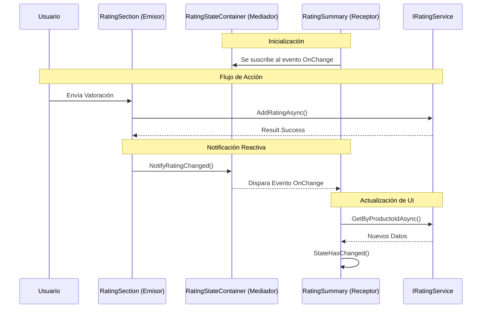

# 10 - Comunicación entre Componentes Blazor: El Patrón State Container

En aplicaciones modernas, a menudo necesitamos que dos partes de la interfaz que **no tienen una relación padre-hijo** se hablen entre sí. En este proyecto, el formulario de valoraciones y el resumen de la cabecera están en lugares distintos del DOM.

---

## 1. El Problema: Componentes Desacoplados

En `Details.cshtml`, inyectamos dos componentes independientes:
1.  `<RatingSummary />` (en la parte superior, junto al precio).
2.  `<RatingSection />` (en la parte inferior, con el formulario).

Si un usuario vota en la sección inferior, la cabecera debe actualizarse automáticamente para reflejar la nueva media. Como no son padre e hijo, no podemos usar `EventCallback` de forma sencilla.

---

## 2. La Solución: El Patrón State Container

Hemos implementado un **State Container** (`RatingStateContainer.cs`). Este patrón actúa como un "Bus de Datos" o "Mediador" que vive en la memoria de la sesión del usuario.

### Cómo funciona el flujo:



1.  **Registro Scoped**: El servicio se registra como `Scoped` en `Program.cs`. Esto significa que hay una instancia única por cada pestaña/usuario conectado.
2.  **El Evento (Trigger)**: El contenedor tiene un evento C# de tipo `Action`.
3.  **Suscripción (Listener)**: El componente que quiere "escuchar" cambios (`RatingSummary`) se suscribe al evento cuando se inicializa.
4.  **Notificación (Publisher)**: El componente que realiza la acción (`RatingSection`) llama a un método del contenedor que dispara el evento.

---

## 3. Implementación Técnica

### El Contenedor (`Services/Implementations/RatingStateContainer.cs`)
```csharp
public class RatingStateContainer {
    public event Action OnChange; // El evento al que todos se suscriben
    public void NotifyRatingChanged() => OnChange?.Invoke(); // Notifica a los oyentes
}
```

### El Receptor (`RatingSummary.razor`)
```csharp
protected override void OnInitialized() {
    // Nos suscribimos al evento
    StateContainer.OnChange += HandleStateChange;
}

private async void HandleStateChange() {
    await LoadDataAsync(); // Recargamos la media
    StateHasChanged();     // Forzamos el renderizado de Blazor
}

public void Dispose() {
    // IMPORTANTE: Desuscribirse para evitar fugas de memoria
    StateContainer.OnChange -= HandleStateChange;
}
```

### El Emisor (`RatingSection.razor`)
```csharp
private async Task HandleSubmit() {
    var result = await RatingService.AddRatingAsync(...);
    if (result.IsSuccess) {
        StateContainer.NotifyRatingChanged(); // ¡Avisamos a todo el mundo!
    }
}
```

---

## 4. Ventajas para el Alumno

- **Desacoplamiento Total**: `RatingSummary` no sabe que existe `RatingSection`, y viceversa. Solo conocen el contenedor de estado.
- **Reactividad Real**: Proporciona una experiencia de "Single Page Application" (SPA) dentro de una estructura MVC.
- **Tipado Fuerte**: A diferencia de los eventos de JavaScript (AJAX), aquí usamos eventos de C# con total soporte de IntelliSense y compilación.

---

## 5. Ciclo de Vida y Memoria (Senior Tip)

Es vital enseñar al alumno que cualquier componente que se suscriba a un evento de un servicio **debe implementar `IDisposable`** y desuscribirse. Si no se hace, el componente nunca será recolectado por el Garbage Collector mientras el servicio esté vivo, provocando fugas de memoria (Memory Leaks).
