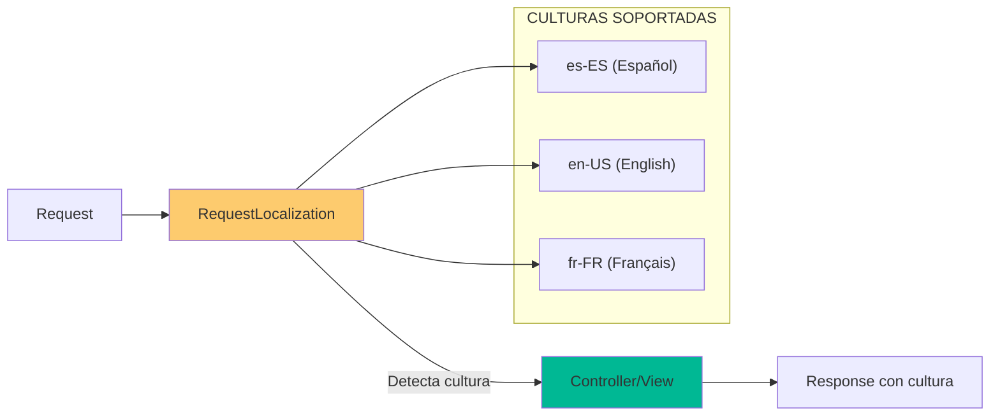

- [10. I18n y Localización: La Torre de Babel](#10-i18n-y-localización-la-torre-de-babel)
  - [1. Archivos de Recursos (.resx)](#1-archivos-de-recursos-resx)
    - [1.1. Organización de Recursos](#11-organización-de-recursos)
    - [1.2. Estructura de Archivos](#12-estructura-de-archivos)
    - [1.3. Uso en Vistas](#13-uso-en-vistas)
    - [1.4. Uso en Controladores](#14-uso-en-controladores)
  - [2. Configuración de Middleware](#2-configuración-de-middleware)
    - [2.1. Registro de Servicios](#21-registro-de-servicios)
    - [2.2. Orden de Middleware](#22-orden-de-middleware)
    - [2.3. Configuración en Program.cs](#23-configuración-en-programcs)
  - [3. Formatos Culturales](#3-formatos-culturales)
    - [3.1. Diferencias Clave](#31-diferencias-clave)
    - [3.2. Ejemplo de Formato](#32-ejemplo-de-formato)
  - [4. Cambio de Idioma](#4-cambio-de-idioma)
    - [4.1. Dropdown de Idiomas](#41-dropdown-de-idiomas)
    - [4.2. Cookie de Cultura](#42-cookie-de-cultura)


# 10. I18n y Localización: La Torre de Babel
En esta sección, aprenderemos a internacionalizar y localizar nuestra aplicación ASP.NET Core MVC para soportar múltiples idiomas y formatos culturales.

## 1. Archivos de Recursos (.resx)

Los archivos `.resx` son diccionarios de traducción con pares clave-valor.

### 1.1. Organización de Recursos

| Archivo                  | Propósito                                  |
| ------------------------ | ------------------------------------------ |
| `SharedResource.es.resx` | Traducciones comunes (Login, Home, Footer) |
| `Messages.es.resx`       | Mensajes de error y validaciones           |

### 1.2. Estructura de Archivos

```
Resources/
├── SharedResource.es.resx
├── SharedResource.en.resx
├── Messages.es.resx
└── Messages.en.resx
```

### 1.3. Uso en Vistas

```razor
@inject IStringLocalizer<SharedResource> Localizer

<h1>@Localizer["TituloBienvenida"]</h1>
<button>@Localizer["BtnGuardar"]</button>
```

### 1.4. Uso en Controladores

```csharp
public class ProductController : Controller
{
    private readonly IStringLocalizer<SharedResource> _localizer;
    
    public ProductController(IStringLocalizer<SharedResource> localizer)
    {
        _localizer = localizer;
    }
    
    public IActionResult NotFound()
    {
        var mensaje = _localizer["ProductoNoEncontrado"];
        return View();
    }
}
```

---

## 2. Configuración de Middleware

### 2.1. Registro de Servicios

```csharp
builder.Services.AddLocalization(options => 
    options.ResourcesPath = "Resources");

builder.Services.AddControllersWithViews()
    .AddViewLocalization()
    .AddDataAnnotationsLocalization();
```

### 2.2. Orden de Middleware



### 2.3. Configuración en Program.cs

```csharp
var supportedCultures = new[] 
{
    new CultureInfo("es-ES"),
    new CultureInfo("en-US"),
    new CultureInfo("fr-FR")
};

var localizationOptions = new RequestLocalizationOptions
{
    DefaultRequestCulture = new RequestCulture("es-ES"),
    SupportedCultures = supportedCultures,
    SupportedUICultures = supportedCultures
};

app.UseRequestLocalization(localizationOptions);
```

---

## 3. Formatos Culturales

Cada cultura tiene reglas diferentes para números, fechas y monedas.

### 3.1. Diferencias Clave

| Concepto    | es-ES (España) | en-US (EEUU) |
| ----------- | -------------- | ------------ |
| **Decimal** | `1.234,56`     | `1,234.56`   |
| **Moneda**  | `1.234,56 €`   | `$1,234.56`  |
| **Fecha**   | `31/12/2025`   | `12/31/2025` |

### 3.2. Ejemplo de Formato

```csharp
decimal precio = 1234.56m;

// es-ES
var es = new CultureInfo("es-ES");
Console.WriteLine(precio.ToString("C", es));  // "1.234,56 €"

// en-US
var en = new CultureInfo("en-US");
Console.WriteLine(precio.ToString("C", en));  // "$1,234.56"
```

---

## 4. Cambio de Idioma

### 4.1. Dropdown de Idiomas

```razor
<div class="dropdown">
    <button class="btn btn-outline-secondary dropdown-toggle" 
            data-bs-toggle="dropdown">
        🌍 @CurrentCulture
    </button>
    <ul class="dropdown-menu">
        <li><a class="dropdown-item" href="?culture=es-ES">🇪🇸 Español</a></li>
        <li><a class="dropdown-item" href="?culture=en-US">🇺🇸 English</a></li>
    </ul>
</div>
```

### 4.2. Cookie de Cultura

```csharp
// La cultura se guarda en cookie y se mantiene entre peticiones
Response.Cookies.Append(
    ".AspNetCore.Culture",
    $"c={culture}|uic={culture}",
    new CookieOptions { Expires = DateTimeOffset.UtcNow.AddYears(1) }
);
```

---

**Anterior Volumen**: [09. Razor Masterclass](../09-Razor-Syntax-UI.md)  
**Próximo Volumen**: [11. JavaScript y AJAX](../11-JS-AJAX-Security.md)
