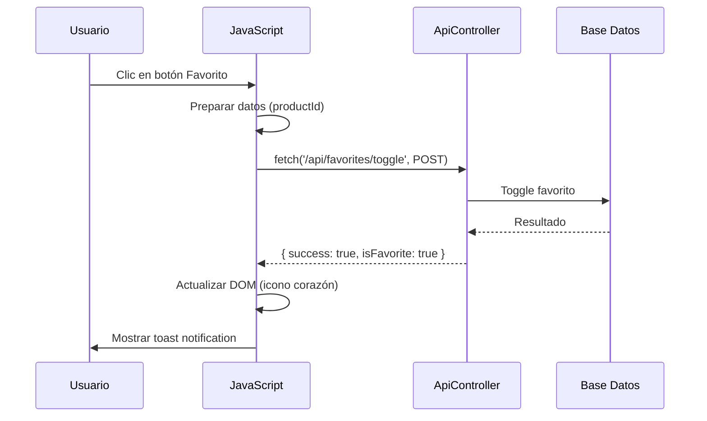
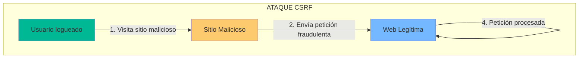

- [11. JavaScript \& AJAX: La Danza Asíncrona](#11-javascript--ajax-la-danza-asíncrona)
  - [1. Ciclo de Vida AJAX con Fetch](#1-ciclo-de-vida-ajax-con-fetch)
    - [1.1. Ejemplo Práctico: `favorites.js`](#11-ejemplo-práctico-favoritesjs)
  - [2. Seguridad CSRF](#2-seguridad-csrf)
    - [2.1. ¿Qué es CSRF?](#21-qué-es-csrf)
    - [2.2. Protección con Anti-Forgery Token](#22-protección-con-anti-forgery-token)
  - [3. Integración con APIs](#3-integración-con-apis)
    - [3.1. ApiController](#31-apicontroller)
    - [3.2. Formato de Respuesta JSON](#32-formato-de-respuesta-json)
  - [4. Manejo de Respuestas](#4-manejo-de-respuestas)
    - [4.1. Actualización del DOM](#41-actualización-del-dom)
    - [4.2. Sistema de Notificaciones](#42-sistema-de-notificaciones)


# 11. JavaScript & AJAX: La Danza Asíncrona
En esta sección, exploraremos cómo integrar JavaScript y AJAX en nuestras aplicaciones ASP.NET Core MVC, centrándonos en la seguridad y las mejores prácticas para manejar solicitudes asíncronas.

## 1. Ciclo de Vida AJAX con Fetch

Cuando un usuario pulsa "Favorito" o deja una valoración:



### 1.1. Ejemplo Práctico: `favorites.js`

```javascript
async function toggleFavorite(productId) {
    try {
        const token = document.querySelector('[name="__RequestVerificationToken"]').value;
        
        const response = await fetch('/api/favorites/toggle', {
            method: 'POST',
            headers: { 
                'Content-Type': 'application/json',
                'RequestVerificationToken': token 
            },
            body: JSON.stringify({ productId: productId })
        });

        const data = await response.json();

        if (data.success) {
            // Actualizar DOM: Cambiar icono del corazón
            updateFavoriteIcon(productId, data.isFavorite);
            showToast(data.message, 'success');
        } else {
            showToast(data.message || 'Error', 'error');
        }
    } catch (error) {
        console.error('Error:', error);
        showToast('Error de conexión', 'error');
    }
}
```

---

## 2. Seguridad CSRF

### 2.1. ¿Qué es CSRF?



### 2.2. Protección con Anti-Forgery Token

```csharp
// En la vista Razor
@Html.AntiForgeryToken()

<script>
async function csrfFetch(url, options = {}) {
    const token = document.querySelector('[name="__RequestVerificationToken"]').value;
    
    return fetch(url, {
        ...options,
        headers: {
            'RequestVerificationToken': token,
            'Content-Type': 'application/json',
            ...options.headers
        }
    });
}
</script>
```

---

## 3. Integración con APIs

### 3.1. ApiController

```csharp
[ApiController]
[Route("api/[controller]")]
public class FavoritesController : ControllerBase
{
    [HttpPost("toggle")]
    public async Task<IActionResult> Toggle([FromBody] FavoriteRequest request)
    {
        var result = await _favoriteService.ToggleAsync(request.ProductId, User.GetUserId());
        return result.Match(
            onSuccess: () => Ok(new { success = true, isFavorite = true }),
            onFailure: error => BadRequest(new { success = false, message = error.Message })
        );
    }
}
```

### 3.2. Formato de Respuesta JSON

```json
{
  "success": true,
  "isFavorite": true,
  "message": "Producto añadido a favoritos"
}
```

---

## 4. Manejo de Respuestas

### 4.1. Actualización del DOM

```javascript
function updateFavoriteIcon(productId, isFavorite) {
    const button = document.querySelector(`[data-product-id="${productId}"]`);
    const icon = button.querySelector('i');
    
    if (isFavorite) {
        icon.classList.remove('bi-heart');
        icon.classList.add('bi-heart-fill', 'text-danger');
    } else {
        icon.classList.remove('bi-heart-fill', 'text-danger');
        icon.classList.add('bi-heart');
    }
}
```

### 4.2. Sistema de Notificaciones

```javascript
function showToast(message, type = 'info') {
    const toastContainer = document.getElementById('toastContainer');
    const toast = document.createElement('div');
    
    toast.className = `toast align-items-center border-0 bg-${type}`;
    toast.innerHTML = `<div class="toast-body">${message}</div>`;
    
    toastContainer.appendChild(toast);
    bootstrap.Toast.getOrCreateInstance(toast).show();
}
```

---

**Anterior Volumen**: [10. I18n y Localización](../10-I18n-Localization-Decimal.md)  
**Próximo Volumen**: [12. Razor vs AJAX vs Blazor](../12-BlazorVsRazorVsAjax.md)
