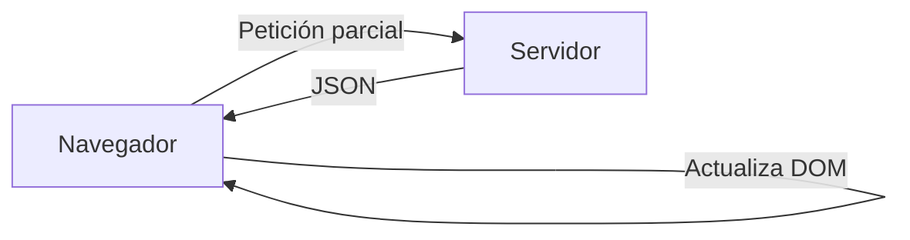
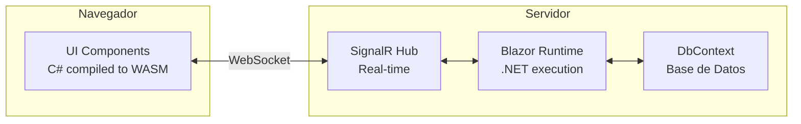

# 12. Razor vs AJAX vs Blazor: Evolución de la Interfaz

## Índice

[12. Razor vs AJAX vs Blazor: Evolución de la Interfaz](#12-razor-vs-ajax-vs-blazor-evolución-de-la-interfaz)
  - [12.1. Enfoque Tradicional: Razor MVC](#121-enfoque-tradicional-razor-mvc)
  - [12.2. Enfoque Dinámico: MVC + AJAX](#122-enfoque-dinámico-mvc--ajax)
  - [12.3. La Modernidad: Blazor Server](#123-la-modernidad-blazor-server)
  - [12.4. Comparativa de Tecnologías](#124-comparativa-de-tecnologías)

---

## 12.1. Enfoque Tradicional: Razor MVC

El servidor procesa la petición, construye el HTML completo y lo envía al navegador.

### Flujo de Petición


### Características

| Aspecto             | Descripción                                              |
| ------------------- | ------------------------------------------------------- |
| **Renderizado**      | Servidor (SSR)                                         |
| **Interactividad**   | Limitada (requiere postback completo)                   |
| **SEO**             | ✅ Excelente                                            |
| **Rendimiento**     | ⚠️ Carga inicial más pesada                            |
| **UX**              | ⚠️ Requiere recarga de página                          |

---

## 12.2. Enfoque Dinámico: MVC + AJAX

Combina Razor MVC con JavaScript/AJAX para actualizaciones parciales.

### Flujo AJAX



### Ventajas y Desventajas

| Aspecto             | ✅ Ventajas                              | ❌ Desventajas                          |
| ------------------- | --------------------------------------- | --------------------------------------- |
| **Renderizado**      | Mixto (SSR + SPA parcial)              | Complejidad de código                   |
| **Interactividad**   | Mejor UX, sin recarga completa          | Codebase dividido                       |
| **SEO**             | ✅ Parcial                              | ⚠️ Contenido dinámico puede no indexarse |
| **Rendimiento**     | Carga inicial + updates parciales      | Lógica dividida entre cliente/servidor  |

### Ejemplo AJAX

```javascript
// Actualizar contador del carrito sin recarga
async function addToCart(productId) {
    const response = await fetch(`/Cart/Add/${productId}`, {
        method: 'POST',
        headers: { 'RequestVerificationToken': token }
    });
    
    const result = await response.json();
    
    // Actualizar UI
    document.getElementById('cart-count').textContent = result.count;
    showNotification('¡Agregado al carrito!');
}
```

---

## 12.3. La Modernidad: Blazor Server

Blazor Server permite escribir C# en el cliente, comunicándose con SignalR.

### Flujo de Blazor



### Componente de Valoraciones

```csharp
// Rating.razor
@using TiendaDawWeb.Shared.Services
@inject IProductService ProductService

<div class="rating">
    @for (int i = 1; i <= 5; i++)
    {
        <span @onclick="() => SetRating(i)"
              @onmouseover="() => HoverRating = i"
              @onmouseout="() => HoverRating = 0"
              class="@GetStarClass(i)">
            ★
        </span>
    }
</div>

@code {
    [Parameter] public long ProductId { get; set; }
    [Parameter] public EventCallback<int> OnRatingChanged { get; set; }
    
    private int HoverRating { get; set; }
    private int _rating;
    
    private int Rating
    {
        get => _rating;
        set
        {
            _rating = value;
            OnRatingChanged.InvokeAsync(value);
        }
    }
    
    private string GetStarClass(int star)
    {
        var threshold = HoverRating > 0 ? HoverRating : Rating;
        return star <= threshold ? "filled" : "empty";
    }
    
    private void SetRating(int rating)
    {
        Rating = rating;
    }
}
```

---

## 12.4. Comparativa de Tecnologías

| Aspecto             | Razor MVC        | MVC + AJAX              | Blazor Server          |
| ------------------- | --------------- | ---------------------- | ---------------------- |
| **Modelo**          | Servidor        | Mixto                  | Cliente/Servidor      |
| **Lógica**          | C#              | C# + JavaScript        | C#                     |
| **Real-time**       | ❌              | ✅ Con extra            | ✅ Nativo (SignalR)    |
| **Curva aprendizaje**| Baja           | Media-Alta             | Media                  |
| **Bundle JS**       | Mínimo          | Depende                | Grande (~1MB)         |

### ¿Cuándo usar cada uno?

| ✅ Usar MVC cuando... | ✅ Usar AJAX cuando... | ✅ Usar Blazor cuando... |
| -------------------- | -------------------- | ----------------------- |
| SEO es crítico       | Actualizaciones parciales | Team C# proficient    |
| App simple          | Integración frontend | SPA-like experience   |
| Rendimiento inicial  | Mejorasgraduales     | Real-time features     |
| Equipo no JS        | Legacy systems       | Components reutilizables |

---

## Resumen

| Tecnología      | Ideal para...                               |
| -------------- | ------------------------------------------ |
| **Razor MVC**  | Apps simples, SEO, páginas tradicionales    |
| **AJAX**       | Actualizaciones parciales, legacy systems  |
| **Blazor**     | SPAs, real-time, equipos C#               |

---

**Anterior**: [11. JavaScript y AJAX](../11-JS-AJAX.md)  
**Próximo**: [13. Blazor Server](../13-Blazor-Server.md)
