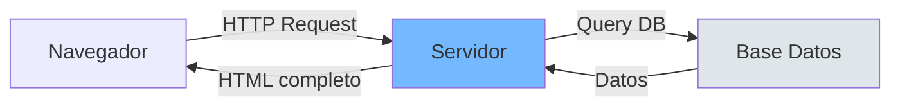
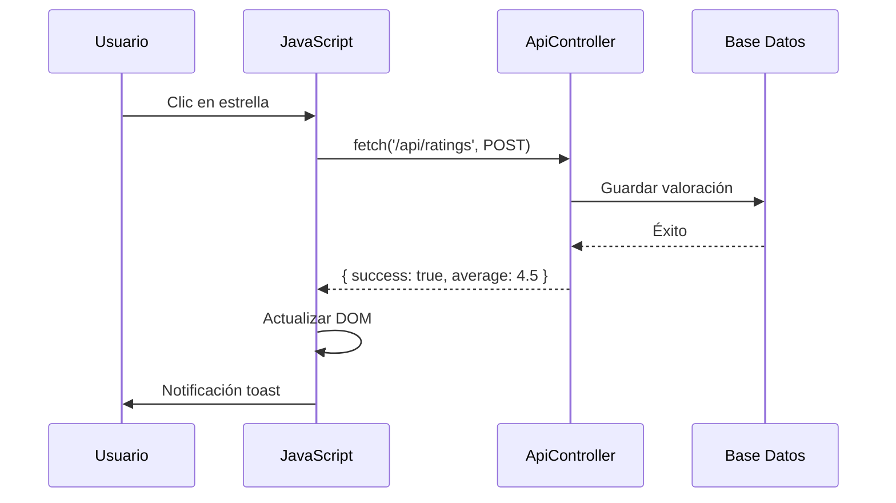
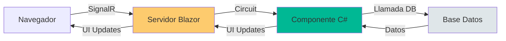

- [12. Razor vs AJAX vs Blazor: Evolución de la Interfaz](#12-razor-vs-ajax-vs-blazor-evolución-de-la-interfaz)
  - [1. Enfoque Tradicional: Razor MVC](#1-enfoque-tradicional-razor-mvc)
    - [1.1. Flujo de Petición](#11-flujo-de-petición)
    - [1.2. Características](#12-características)
    - [1.3. Ejemplo](#13-ejemplo)
  - [2. Enfoque Dinámico: MVC + AJAX](#2-enfoque-dinámico-mvc--ajax)
    - [2.1. Flujo AJAX](#21-flujo-ajax)
    - [2.2. Ventajas y Desventajas](#22-ventajas-y-desventajas)
  - [3. La Modernidad: Blazor Server](#3-la-modernidad-blazor-server)
    - [3.1. Flujo de Blazor](#31-flujo-de-blazor)
    - [3.2. Componente de Valoraciones](#32-componente-de-valoraciones)
  - [4. Comparativa de Tecnologías](#4-comparativa-de-tecnologías)
    - [4.1. ¿Cuándo usar cada uno?](#41-cuándo-usar-cada-uno)


# 12. Razor vs AJAX vs Blazor: Evolución de la Interfaz
En esta sección, compararemos tres enfoques populares para construir interfaces web en ASP.NET Core: Razor MVC tradicional, AJAX dinámico y Blazor Server moderno.

## 1. Enfoque Tradicional: Razor MVC

El servidor procesa la petición, construye el HTML completo y lo envía al navegador.

### 1.1. Flujo de Petición



### 1.2. Características

| Aspecto          | Descripción                         |
| ---------------- | ----------------------------------- |
| **Acoplamiento** | HTML y lógica juntos                |
| **Recarga**      | Página completa en cada interacción |
| **SEO**          | Excelente (HTML completo)           |
| **Simplicidad**  | Sin JavaScript                      |

### 1.3. Ejemplo

```csharp
[HttpPost]
public IActionResult Vote(int rating)
{
    _ratingService.AddRating(rating);
    return RedirectToAction("Details", new { id = Model.Id });
}
```

---

## 2. Enfoque Dinámico: MVC + AJAX

El servidor expone APIs y el cliente usa JavaScript para intercambiar datos.

### 2.1. Flujo AJAX



### 2.2. Ventajas y Desventajas

| Ventajas                 | Desventajas                    |
| ------------------------ | ------------------------------ |
| UX fluida (sin parpadeo) | Duplicidad de lógica (JS + C#) |
| Carga diferida           | Gestión manual de CSRF         |
| Menor ancho de banda     | Mantenimiento complejo         |

---

## 3. La Modernidad: Blazor Server

Blazor permite escribir interfaces en **C#** sin JavaScript, comunicándose via **SignalR**.

### 3.1. Flujo de Blazor



### 3.2. Componente de Valoraciones

```razor
@* RatingComponent.razor *@
<div class="rating">
    @for (int i = 1; i <= 5; i++)
    {
        <span @onclick="() => SetRating(i)"
              class="@(i <= CurrentRating ? "bi-star-fill" : "bi-star")">
        </span>
    }
</div>

@code {
    private int CurrentRating { get; set; }
    
    private async Task SetRating(int rating)
    {
        CurrentRating = rating;
        await Http.PostAsJsonAsync("api/ratings", new { Rating = rating });
    }
}
```

---

## 4. Comparativa de Tecnologías

| Criterio        | Razor MVC        | MVC + AJAX     | Blazor Server |
| --------------- | ---------------- | -------------- | ------------- |
| **Lenguaje**    | C# + HTML        | C# + JS + HTML | Solo C#       |
| **UX**          | Recarga completa | Fluida         | Fluida        |
| **SEO**         | Excelente        | Buena          | Limitado      |
| **Complejidad** | Baja             | Media-Alta     | Media         |
| **JavaScript**  | No necesario     | Requerido      | Mínimo        |

### 4.1. ¿Cuándo usar cada uno?

| Tecnología    | Caso de uso                       |
| ------------- | --------------------------------- |
| **Razor MVC** | Páginas estáticas, SEO crítico    |
| **AJAX**      | Integraciones con APIs externas   |
| **Blazor**    | Interfaces interactivas complejas |

---

**Anterior Volumen**: [11. JavaScript y AJAX](../11-JS-AJAX-Security.md)  
**Próximo Volumen**: [13. Blazor Server Basics](../13-Blazor-Server-Basics.md)
