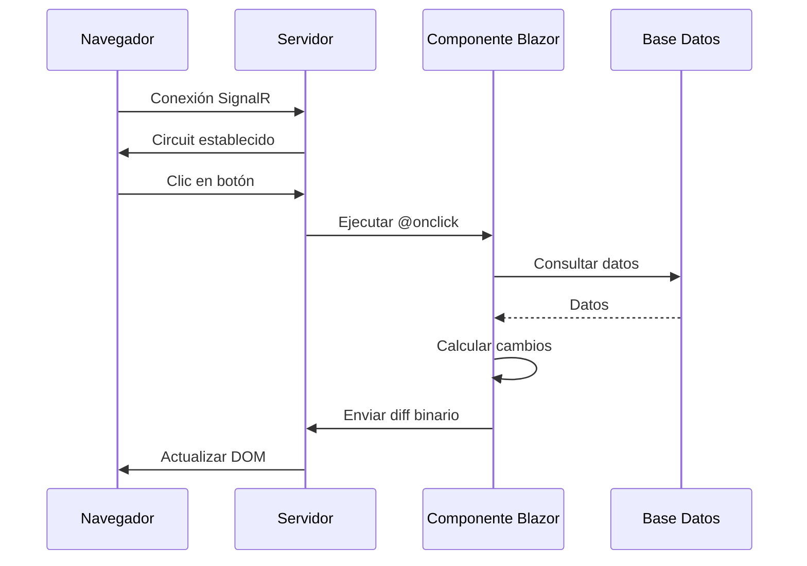
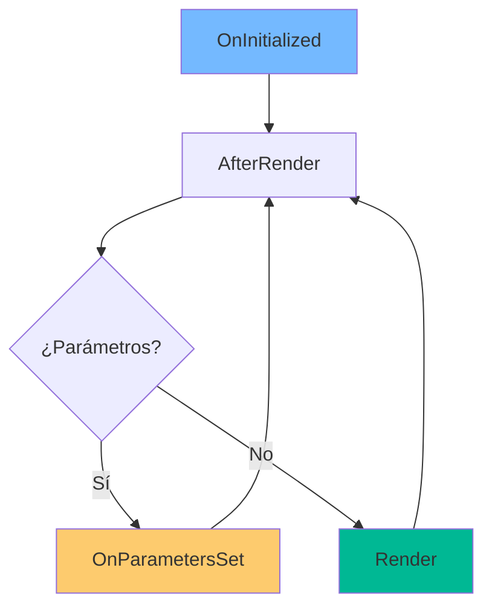

- [13. Blazor Server Basics: La Magia de C# en el Navegador](#13-blazor-server-basics-la-magia-de-c-en-el-navegador)
  - [1. El Túnel de SignalR](#1-el-túnel-de-signalr)
    - [1.1. Flujo de Comunicación](#11-flujo-de-comunicación)
    - [1.2. Características del Túnel](#12-características-del-túnel)
  - [2. Ciclo de Vida de un Componente](#2-ciclo-de-vida-de-un-componente)
    - [2.1. Métodos del Ciclo de Vida](#21-métodos-del-ciclo-de-vida)
    - [2.2. Métodos Clave](#22-métodos-clave)
  - [3. Estado y Binding](#3-estado-y-binding)
    - [3.1. One-Way Binding](#31-one-way-binding)
    - [3.2. Two-Way Binding](#32-two-way-binding)
    - [3.3. Event Handling](#33-event-handling)
  - [4. Integración con Razor](#4-integración-con-razor)
    - [4.1. Componente Embebido en Razor](#41-componente-embebido-en-razor)
    - [4.2. Componente Razor en Blazor](#42-componente-razor-en-blazor)


# 13. Blazor Server Basics: La Magia de C# en el Navegador
En esta sección, exploraremos los conceptos fundamentales de Blazor Server, una tecnología que permite ejecutar C# en el navegador a través de una conexión en tiempo real con el servidor.

## 1. El Túnel de SignalR

Blazor Server permite ejecutar C# en el servidor que controla el HTML del navegador.

### 1.1. Flujo de Comunicación



### 1.2. Características del Túnel

| Aspecto       | Descripción                 |
| ------------- | --------------------------- |
| **Protocolo** | SignalR (WebSockets)        |
| **Mensajes**  | Diff binario (solo cambios) |
| **Latencia**  | Baja (conexión persistente) |

---

## 2. Ciclo de Vida de un Componente

### 2.1. Métodos del Ciclo de Vida



### 2.2. Métodos Clave

```csharp
@code {
    // 1. Inicialización
    protected override void OnInitialized()
    {
        // Se ejecuta cuando el componente se crea
    }
    
    // 2. Parámetros recibidos
    protected override void OnParametersSet()
    {
        // Se ejecuta cuando los @parameters cambian
    }
    
    // 3. Renderizado
    protected override void OnAfterRender(bool firstRender)
    {
        // Se ejecuta después de cada render
    }
    
    // 4. Dispose
    public void Dispose()
    {
        // Limpiar recursos
    }
}
```

---

## 3. Estado y Binding

### 3.1. One-Way Binding

```razor
<h1>@Title</h1>
<p>El precio es: @Product.Precio €</p>
```

### 3.2. Two-Way Binding

```razor
<input @bind="InputValue" @bind:event="oninput" />
<p>Escribiendo: @InputValue</p>

@code {
    private string InputValue { get; set; }
}
```

### 3.3. Event Handling

```razor
<button @onclick="HandleClick" class="btn btn-primary">
    Guardar
</button>

@code {
    private async Task HandleClick()
    {
        await _service.SaveAsync();
        StateHasChanged(); // Forzar re-render
    }
}
```

---

## 4. Integración con Razor

### 4.1. Componente Embebido en Razor

```razor
@* Details.cshtml *@
<h1>Detalles del Producto</h1>

<RatingSection ProductId="Model.Id" />

<p>Descripción: @Model.Descripcion</p>
```

### 4.2. Componente Razor en Blazor

```razor
@* RatingSection.razor *@
@inject IRatingService RatingService

<div class="rating-section">
    <h3>Valoraciones</h3>
    @if (ratings == null)
    {
        <p>Cargando...</p>
    }
    else
    {
        @foreach (var rating in ratings)
        {
            <div class="rating-item">
                <span>@rating.UserName</span>
                <span>@rating.Value / 5</span>
            </div>
        }
    }
</div>

@code {
    [Parameter]
    public long ProductId { get; set; }
    
    private List<Rating>? ratings;
    
    protected override async Task OnInitializedAsync()
    {
        ratings = await RatingService.GetByProductAsync(ProductId);
    }
}
```

---

**Anterior Volumen**: [12. Razor vs AJAX vs Blazor](../12-BlazorVsRazorVsAjax.md)  
**Próximo Volumen**: [14. State Container](../14-Blazor-Component-Communication.md)
