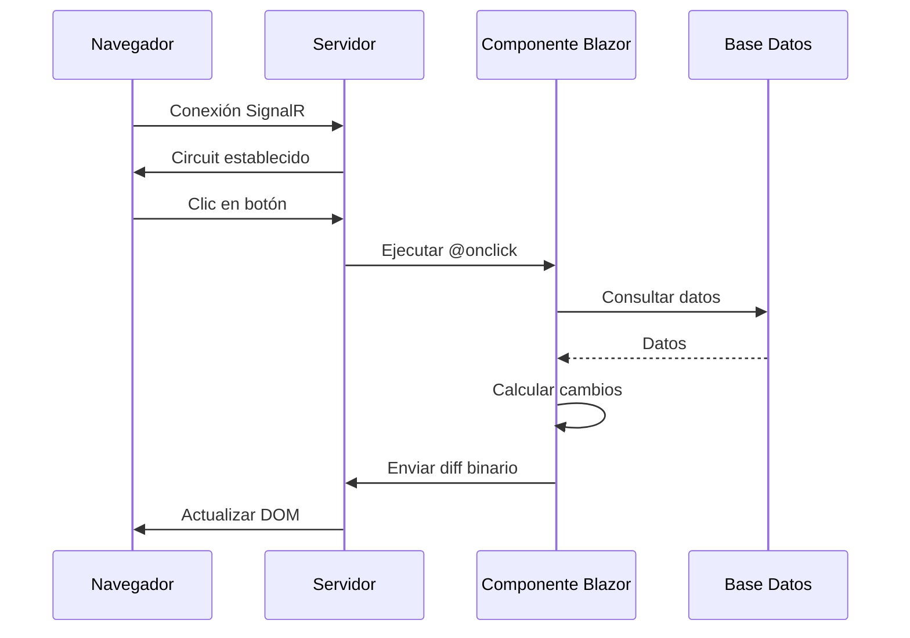

# 13. Blazor Server Basics: La Magia de C# en el Navegador

## Índice

[13. Blazor Server Basics: La Magia de C# en el Navegador](#13-blazor-server-basics-la-magia-de-c-en-el-navegador)
  - [13.1. El Túnel de SignalR](#131-el-túnel-de-signalr)
  - [13.2. Ciclo de Vida de un Componente](#132-ciclo-de-vida-de-un-componente)
  - [13.3. Estado y Binding](#133-estado-y-binding)
  - [13.4. Integración con Razor](#134-integración-con-razor)

---

## 13.1. El Túnel de SignalR

Blazor Server permite ejecutar C# en el servidor que controla el HTML del navegador.

### Flujo de Comunicación



### Características del Túnel

| Aspecto       | Descripción                 |
| ------------- | --------------------------- |
| **Protocolo** | SignalR (WebSockets)        |
| **Mensajes**  | Diff binario (solo cambios)  |
| **Latencia**  | Muy baja (tiempo real)       |
| **Estado**    | Mantenido en el servidor    |

---

## 13.2. Ciclo de Vida de un Componente

### Métodos del Ciclo de Vida

```csharp
protected override void OnInitialized()
{
    // Se ejecuta cuando el componente recibe parámetros
}

protected override void OnParametersSet()
{
    // Se ejecuta después de recibir parámetros
    // Ideal para cargar datos iniciales
}

protected override void OnAfterRender(bool firstRender)
{
    // Se ejecuta después del renderizado
    // Ideal para JS interop
}

public void Dispose()
{
    // Limpieza de recursos
}
```

### Métodos Asíncronos

```csharp
protected override async Task OnInitializedAsync()
{
    // Se ejecuta una vez al inicializar
    // Ideal para carga de datos
    products = await LoadProductsAsync();
}

protected override async Task OnParametersSetAsync()
{
    // Se ejecuta cada vez que cambian los parámetros
    if (ProductId != lastProductId)
    {
        lastProductId = ProductId;
        await LoadProductDetailsAsync();
    }
}

protected override async Task OnAfterRenderAsync(bool firstRender)
{
    if (firstRender)
    {
        // Solo la primera vez
        await InitializeJsInterop();
    }
}
```

---

## 13.3. Estado y Binding

### One-Way Binding

```html
<h1>@Title</h1>
<p>El precio es: @Product.Price</p>
<div class="category">@Category?.Name</div>
```

### Two-Way Binding

```html
<input @bind="searchTerm" />
<input @bind="searchTerm" @bind:format="dd/MM/yyyy" />
<textarea @bind="description" />

@code {
    private string searchTerm = "";
    private string description = "";
}
```

### Event Handling

```html
<button @onclick="HandleClick">Clic aquí</button>
<button @onclick="() => HandleAction(id)">Eliminar</button>
<input @oninput="OnInputChanged" />
<select @onchange="OnSelectionChanged">
    <option value="1">Opción 1</option>
</select>

@code {
    private void HandleClick()
    {
        // Manejar clic
    }
    
    private void HandleAction(long id)
    {
        // Manejar acción con parámetro
    }
    
    private void OnInputChanged(ChangeEventArgs e)
    {
        searchTerm = e.Value?.ToString();
    }
}
```

---

## 13.4. Integración con Razor

### Componente Embebido en Razor

```html
@page "/products/{id:long}"

<h1>Detalles del Producto</h1>

<RatingSummary ProductId="id" />
<RatingSection ProductId="id" />
```

### Componente Razor en Blazor

```csharp
// En un componente Blazor
@inject HttpClient Http

<div>
    @if (products == null)
    {
        <p>Cargando...</p>
    }
    else
    {
        <ul>
            @foreach (var product in products)
            {
                <li>@product.Nombre</li>
            }
        </ul>
    }
</div>

@code {
    private List<ProductDto>? products;
    
    protected override async Task OnInitializedAsync()
    {
        products = await Http.GetFromJsonAsync<List<ProductDto>>("/api/products");
    }
}
```

---

## Resumen

| Concepto           | Descripción                                              |
| ------------------ | -------------------------------------------------------- |
| **SignalR**        | Túnel de comunicación entre cliente y servidor          |
| **Ciclo de Vida** | OnInitialized → OnParametersSet → OnAfterRender         |
| **One-Way**       | `@variable`                                             |
| **Two-Way**       | `@bind="variable"`                                       |
| **Eventos**       | `@onclick="handler"`                                     |

---

**Anterior**: [12. Razor vs AJAX vs Blazor](../12-BlazorVsRazor.md)  
**Próximo**: [14. State Container](../14-Blazor-Comm.md)
