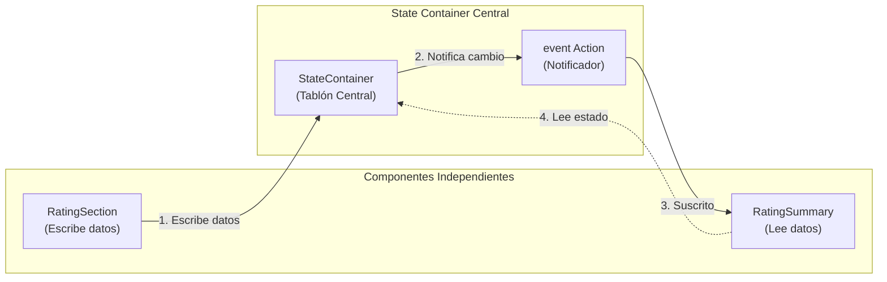
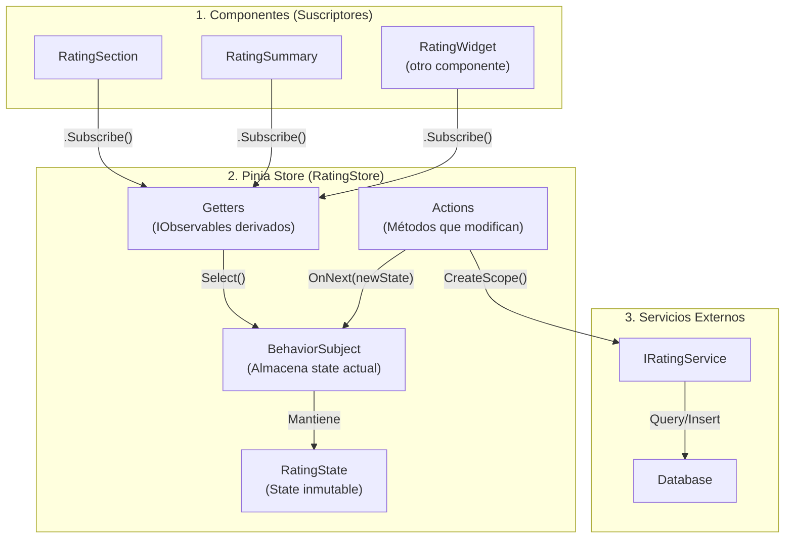
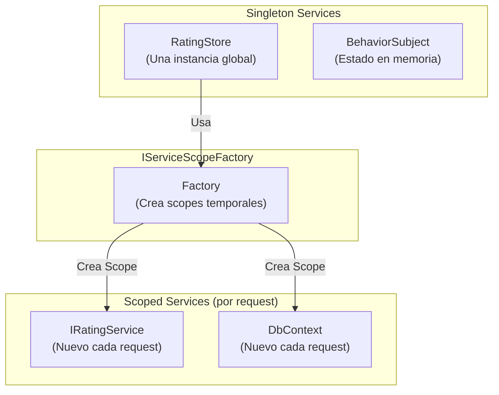
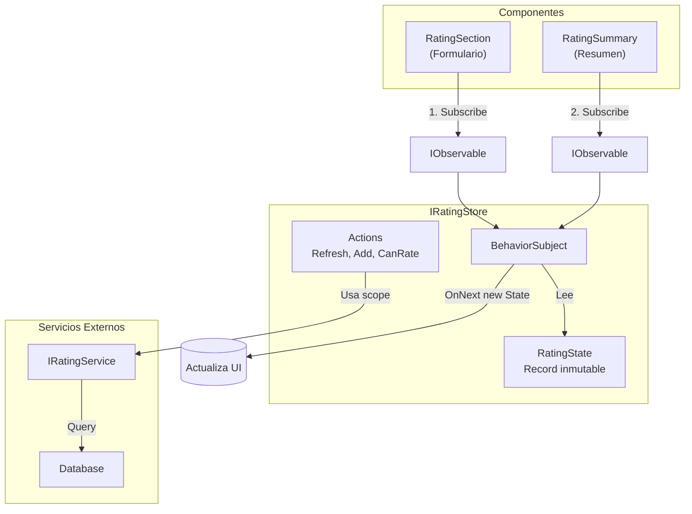

# 14. State Container & Pinia Store: Comunicación entre Componentes

## Índice

[14. State Container & Pinia Store: Comunicación entre Componentes](#14-state-container--pinia-store-comunicación-entre-componentes)
  - [14.1. El Problema: Componentes Desacoplados](#141-el-problema-componentes-desacoplados)
  - [14.2. La Solución: State Container (Patrón Clásico)](#142-la-solución-state-container-patrón-clásico)
  - [14.3. Pinia Store: Enfoque Moderno con Reactive Extensions](#143-pinia-store-enfoque-moderno-con-reactive-extensions)
  - [14.4. Implementación del RatingStore](#144-implementación-del-ratingstore)
  - [14.5. Uso en Componentes Blazor](#145-uso-en-componentes-blazor)
  - [14.6. Patrón: Singleton con Servicios Scoped](#146-patrón-singleton-con-servicios-scoped)
  - [14.7. Diagrama del Flujo de Datos](#147-diagrama-del-flujo-de-datos)

---

## 14.1. El Problema: Componentes Desacoplados

En `Details.cshtml`, tenemos dos componentes independientes:

| Componente          | Ubicación                        |
| ------------------- | -------------------------------- |
| `<RatingSummary />` | Parte superior (junto al precio) |
| `<RatingSection />` | Parte inferior (formulario)      |

**Problema**: Cuando un usuario vota en la sección inferior, la cabecera debe actualizarse. Como no son padre-hijo, `EventCallback` no funciona.

---

## 14.2. La Solución: State Container (Patrón Clásico)

### ¿Qué es el Patrón State Container?

El **State Container** es un patrón de diseño cuyo objetivo es **centralizar el estado de la aplicación en un único lugar accesible por múltiples componentes**.

En lugar de que cada componente tenga su propio estado independiente, todos los componentes que necesitan compartir información van a este "contenedor central" a:
- **Leer** el estado actual
- **Escribir** nuevos valores
- **Suscribirse** a cambios del estado

### ¿Qué Problema Resuelve?

El State Container resuelve el problema de la **comunicación entre componentes que no tienen una relación padre-hijo directa**.

Cuando tenemos dos componentes hermanos (como RatingSummary y RatingSection), Blazor no proporciona una forma nativa de comunicarse entre sí. El State Container actúa como un "tablón de anuncios" o "mediador" que permite:

1. Un componente puede **publicar** un cambio
2. Otros componentes pueden **suscribirse** a esos cambios
3. Cuando algo cambia, todos los interesados son **notificados automáticamente**

### Arquitectura del State Container



### ¿Cómo Funciona?

| Paso | Acción | Descripción |
|------|---------|-------------|
| 1 | **Suscripción** | RatingSummary se registra para recibir notificaciones del State Container |
| 2 | **Escritura** | RatingSection modifica el estado en el State Container |
| 3 | **Notificación** | El State Container dispara el evento `OnChange` |
| 4 | **Actualización** | RatingSummary recibe la notificación y actualiza su UI |

### Partes del State Container

```csharp
public class RatingStateContainer
{
    // ═══════════════════════════════════════════════════════════════
    // STATE - DATOS COMPARTIDOS
    // ═══════════════════════════════════════════════════════════════
    // Son los datos que los componentes necesitan compartir.
    // En este caso: ID del producto, contador de ratings, promedio.
    
    public long ProductId { get; set; }
    public int RatingCount { get; set; }
    public double AverageRating { get; set; }

    // ═══════════════════════════════════════════════════════════════
    // EVENTO - MECANISMO DE NOTIFICACIÓN
    // ═══════════════════════════════════════════════════════════════
    // Permite que componentes se suscriban para recibir alertas cuando
    // el estado cambia. Es como un "anuncio público".
    
    public event Action? OnChange;

    // ═══════════════════════════════════════════════════════════════
    // MÉTODOS - OPERACIONES
    // ═══════════════════════════════════════════════════════════════
    // Acciones que modifican el estado y disparan notificaciones.
    
    public void NotifyStateChanged() => OnChange?.Invoke();
}
```

### Ventajas del State Container

| Ventaja | Descripción |
|---------|-------------|
| ✅ **Desacoplamiento** | Los componentes no necesitan conocerse entre sí |
| ✅ **Sencillo de implementar** | Solo requiere un `event Action` y propiedades |
| ✅ **Centralizado** | El estado está en un solo lugar |
| ✅ **Fácil de depurar** | Se puede ver todo el estado en un punto |

### Limitaciones del State Container

| Limitación | Descripción |
|------------|-------------|
| ❌ **Un suscriptor por evento** | Solo se puede attachar un handler al evento `OnChange` |
| ❌ **Estado mutable** | Las propiedades pueden cambiarse desde cualquier lugar (propenso a bugs) |
| ❌ **Sin historial** | No guarda estados anteriores (no hay "undo") |
| ❌ **Sin retry** | Si un componente se desconecta, pierde datos |
| ❌ **Sin validación** | Cualquier componente puede modificar cualquier propiedad |

### Registro como Scoped

```csharp
// Program.cs
builder.Services.AddScoped<RatingStateContainer>();
```

**¿Por qué Scoped?** El State Container debe tener **un estado por usuario/sesión**. Si fuera Singleton, todos los usuarios compartirían el mismo estado (catastrófico - un usuario vería las valoraciones de otro).

Scoped significa: "crea una nueva instancia de este servicio para cada request HTTP". Así cada usuario tiene su propio State Container.

---

## 14.3. Pinia Store: Enfoque Moderno con Reactive Extensions

### ¿Qué es el Patrón Pinia?

**Pinia** es un patrón de gestión de estado (originalmente de Vue.js, aquí adaptado a C#) que mejora el State Container clásico usando **Reactive Extensions (Rx)**.

La diferencia fundamental es que Pinia usa **observables** en lugar de eventos simples, lo que permite:

- Múltiples suscripciones simultáneas
- Filtrado y transformación de datos
- Composición de streams
- Manejo de errores avanzado

### Partes del Pinia Store

Un Store de Pinia tiene tres partes principales:

```
┌─────────────────────────────────────────────────────────────────┐
│                        PINIA STORE                               │
├─────────────────────────────────────────────────────────────────┤
│                                                                  │
│  ┌────────────────────────────────────────────────────────────┐ │
│  │ 1. STATE - Los datos puros                                │ │
│  │    - Estado inicial de la aplicación                      │ │
│  │    - Datos que se muestran en la UI                       │ │
│  │    - Fuente única de la verdad                            │ │
│  └────────────────────────────────────────────────────────────┘ │
│                                                                  │
│  ┌────────────────────────────────────────────────────────────┐ │
│  │ 2. GETTERS - Selectores calculados                         │ │
│  │    - Derivados del state                                  │ │
│  │    - Se recalculan cuando el state cambia                 │ │
│  │    - Como "propiedades calculadas" (computed)             │ │
│  └────────────────────────────────────────────────────────────┘ │
│                                                                  │
│  ┌────────────────────────────────────────────────────────────┐ │
│  │ 3. ACTIONS - Operaciones que modifican el state           │ │
│  │    - Funciones que cambian el estado                      │ │
│  │    - Pueden llamar a servicios externos                   │ │
│  │    - Contienen la lógica de negocio                       │ │
│  └────────────────────────────────────────────────────────────┘ │
│                                                                  │
└─────────────────────────────────────────────────────────────────┘
```

### 14.3.1. STATE - ¿Qué es?

El **State** es el **estado centralizado de la aplicación**. Es la "fuente única de la verdad" - todos los datos que la UI necesita mostrar están aquí.

```csharp
// ═══════════════════════════════════════════════════════════════
// STATE - Los datos puros
// ═══════════════════════════════════════════════════════════════
//
// ¿Qué es el State?
// - Es un objeto que contiene TODOS los datos del dominio
// - Es la "fuente de la verdad" de la aplicación
// - Es inmutable (no se modifica, se reemplaza)
// - Es reactivo (los cambios automatizan las actualizaciones)
//
// ¿Por qué centralizarlo?
// - Evita datos duplicados en varios componentes
// - Facilita el debugging (todo está en un lugar)
// - Permite persistir el estado completo fácilmente
// - Facilita el testing

public record RatingState
{
    public List<Models.Rating> Ratings { get; init; } = new();
    public long CurrentProductId { get; init; }
    
    public double Average => Ratings.Any() ? Ratings.Average(r => r.Puntuacion) : 0;
    public int Count => Ratings.Count;
    public bool HasRatings => Ratings.Any();
}
```

### 14.3.2. GETTERS - ¿Qué son?

Los **Getters** son **propiedades calculadas derivadas del state**. Son como las fórmulas de Excel: dependen de otros valores y se recalculan automáticamente cuando esos valores cambian.

```csharp
// ═══════════════════════════════════════════════════════════════
// GETTERS - Selectores calculados
// ═══════════════════════════════════════════════════════════════
//
// ¿Qué son los Getters?
// - Funciones que derivan valores del state
// - Se ejecutan automáticamente cuando el state cambia
// - Pueden combinarse y filtrarse
// - Optimizan el rendimiento (evitan cálculos duplicados)
//
// Ejemplos en RatingStore:
// - Average: promedio de todas las puntuaciones
// - Count: número total de valoraciones
// - HasRatings: si hay al menos una valoración

public IObservable<RatingState> State => _state.AsObservable();

// Getter: Observable del promedio
public IObservable<double> Average => 
    _state.Select(s => s.Average).DistinctUntilChanged();

// Getter: Observable del conteo
public IObservable<int> Count => 
    _state.Select(s => s.Count).DistinctUntilChanged();

// Getter: Observable de si hay valoraciones
public IObservable<bool> HasRatings => 
    _state.Select(s => s.HasRatings).DistinctUntilChanged();
```

**¿Por qué usar IObservable para los getters?**

Porque los getters de Pinia no son valores estáticos - son **streams reactivos**:

| Característica | Value Normal | IObservable (Getter) |
|----------------|--------------|---------------------|
| Actualización | Manual | Automática |
| Suscripción | No | Sí (múltiples) |
| Filtrado | No | Sí (`Where`) |
| Transformación | No | Sí (`Select`) |
| Histórico | No | Sí (`Replay`) |

### 14.3.3. ACTIONS - ¿Qué son?

Las **Actions** son **operaciones que modifican el state o ejecutan lógica de negocio**. Son la única forma de cambiar el estado.

```csharp
// ═══════════════════════════════════════════════════════════════
// ACTIONS - Métodos que modifican el estado
// ═══════════════════════════════════════════════════════════════
//
// ¿Qué son las Actions?
// - Funciones públicas que exponemos
// - Contienen la lógica de negocio
// - Son la ÚNICA forma de modificar el state
// - Pueden llamar a servicios externos
// - Pueden ser síncronas o asíncronas
//
// ¿Por qué centralizar las acciones?
// - Control de quién puede modificar qué
// - Validación centralizada
// - Lógica de negocio en un solo lugar
// - Facilidad para testing

public Task EnsureLoadedAsync(long productId) { ... }
public Task RefreshAsync(long productId) { ... }
public Task<Models.Rating?> AddRatingAsync(...) { ... }
public Task<bool> CanUserRateAsync(...) { ... }
```

### Arquitectura Pinia con Rx



### ¿Qué Aporta Rx (Reactive Extensions)?

Rx extiende el patrón State Container con capacidades reactivas:

| Característica | State Container (Clásico) | Pinia Store + Rx |
|----------------|---------------------------|------------------|
| **Notificación** | `event Action` (una vez) | `IObservable<T>` (múltiples) |
| **Múltiples suscripciones** | ❌ Una sola | ✅ Ilimitadas |
| **Filtrado** | ❌ No | ✅ `.Where()` |
| **Transformación** | ❌ No | ✅ `.Select()` |
| **Historial** | ❌ No | ✅ `.Replay()` |
| **Combinación** | ❌ No | ✅ `.Merge()`, `.Zip()` |
| **Retry automático** | ❌ No | ✅ `.Retry()` |
| **Debouncing** | ❌ No | ✅ `.Throttle()` |

### ¿Por Qué BehaviorSubject?

`BehaviorSubject<T>` es un tipo especial de Rx que:

1. **Mantiene el valor actual**: Siempre tiene el último estado disponible
2. **Emite a nuevos suscriptores**: Les da el valor actual inmediatamente al suscribirse
3. **Notifica cambios**: Cuando el estado cambia, avisa a todos los suscriptores

```csharp
// Ejemplo simple de BehaviorSubject
var subject = new BehaviorSubject<string>("Inicial");

// Nuevo suscriptor recibe "Inicial" INMEDIATAMENTE
subject.Subscribe(val => Console.WriteLine($"Recibido: {val}"));

// Cambiamos el valor
subject.OnNext("Actualizado");  // Imprime: Recibido: Actualizado
```

Esto es crucial para Blazor: cuando un componente se suscribe al Store, necesita recibir el estado actual inmediatamente, no esperar al próximo cambio.

### Estructura del RatingStore

```
TiendaDawWeb.Shared/
└── Services/
    └── Rating/
        ├── IRatingStore.cs      (Interfaz contrato - qué expone el Store)
        ├── RatingState.cs       (El State - datos puros)
        └── RatingStore.cs       (Implementación con BehaviorSubject + Actions)
```

---

## 14.4. Implementación del RatingStore

### 14.4.1. RatingState (El Estado)

```csharp
namespace TiendaDawWeb.Shared.Services.Rating;

/// <summary>
/// Estado inmutable de las valoraciones.
/// </summary>
public record RatingState
{
    public List<Models.Rating> Ratings { get; init; } = new();
    public long CurrentProductId { get; init; }
    
    public double Average => Ratings.Any() ? Ratings.Average(r => r.Puntuacion) : 0;
    public int Count => Ratings.Count;
    public bool HasRatings => Ratings.Any();
}
```

### 14.4.2. IRatingStore (El Contrato)

```csharp
namespace TiendaDawWeb.Shared.Services.Rating;

/// <summary>
/// Contrato para el almacén de estado de valoraciones.
/// </summary>
public interface IRatingStore
{
    // ═══════════════════════════════════════════════════════════════
    // STATE - Observable del estado
    // ═══════════════════════════════════════════════════════════════
    
    /// <summary>
    /// Observable del estado completo de valoraciones.
    /// </summary>
    IObservable<RatingState> State { get; }

    // ═══════════════════════════════════════════════════════════════
    // GETTERS - Selectores derivados
    // ═══════════════════════════════════════════════════════════════
    
    IObservable<List<Models.Rating>> Ratings { get; }
    IObservable<double> Average { get; }
    IObservable<int> Count { get; }
    IObservable<bool> HasRatings { get; }

    // ═══════════════════════════════════════════════════════════════
    // ACTIONS - Métodos que modifican el estado
    // ═══════════════════════════════════════════════════════════════
    
    Task EnsureLoadedAsync(long productId);
    Task RefreshAsync(long productId);
    Task<Models.Rating?> AddRatingAsync(long userId, long productId, int puntuacion, string? comentario);
    Task<bool> CanUserRateAsync(long userId, long productId);
    
    /// <summary>
    /// Selector personalizado para observar una parte específica del estado.
    /// </summary>
    IObservable<T> Select<T>(Func<RatingState, T> selector);
}
```

### 14.4.3. RatingStore (Implementación con Rx)

```csharp
using System.Reactive.Linq;
using System.Reactive.Subjects;
using Microsoft.Extensions.DependencyInjection;

namespace TiendaDawWeb.Shared.Services.Rating;

/// <summary>
/// Implementación del almacén de valoraciones usando BehaviorSubject.
/// </summary>
public class RatingStore : IRatingStore
{
    // ═══════════════════════════════════════════════════════════════
    // STATE
    // ═══════════════════════════════════════════════════════════════
    
    private readonly BehaviorSubject<RatingState> _state;
    
    // ═══════════════════════════════════════════════════════════════
    // GETTERS - IObservables derivados del estado
    // ═══════════════════════════════════════════════════════════════
    
    public IObservable<RatingState> State => _state.AsObservable();

    public IObservable<List<Models.Rating>> Ratings => 
        _state.Select(s => s.Ratings).DistinctUntilChanged();

    public IObservable<double> Average => 
        _state.Select(s => s.Average).DistinctUntilChanged();

    public IObservable<int> Count => 
        _state.Select(s => s.Count).DistinctUntilChanged();

    public IObservable<bool> HasRatings => 
        _state.Select(s => s.HasRatings).DistinctUntilChanged();

    // ═══════════════════════════════════════════════════════════════
    // ACTIONS
    // ═══════════════════════════════════════════════════════════════
    
    /// <summary>
    /// Constructor: RatingStore es Singleton, pero IRatingService es Scoped.
    /// Para resolver un servicio Scoped desde un Singleton, usamos IServiceScopeFactory.
    /// Un "Scope" crea un contenedor temporal con instancias frescas.
    /// </summary>
    public RatingStore(IServiceScopeFactory serviceScopeFactory)
    {
        _serviceScopeFactory = serviceScopeFactory;
        _state = new BehaviorSubject<RatingState>(new RatingState());
    }

    public RatingState GetState() => _state.Value;

    public Task EnsureLoadedAsync(long productId)
    {
        if (_state.Value.CurrentProductId == productId && _state.Value.Ratings.Any())
            return Task.CompletedTask;
        return RefreshAsync(productId);
    }
    
    public Task RefreshAsync(long productId)
    {
        return Task.Run(async () =>
        {
            // PATRÓN: Crear scope temporal para servicio scoped
            using var scope = _serviceScopeFactory.CreateScope();
            var ratingService = scope.ServiceProvider.GetRequiredService<IRatingService>();
            
            var result = await ratingService.GetByProductoIdAsync(productId);
            if (result.IsSuccess)
                _state.OnNext(new RatingState(result.Value.ToList(), productId));
        });
    }
    
    public async Task<Models.Rating?> AddRatingAsync(
        long userId, 
        long productId, 
        int puntuacion, 
        string? comentario)
    {
        using var scope = _serviceScopeFactory.CreateScope();
        var ratingService = scope.ServiceProvider.GetRequiredService<IRatingService>();
        
        var result = await ratingService.AddRatingAsync(userId, productId, puntuacion, comentario);
        if (result.IsSuccess && result.Value != null)
        {
            // Actualizar estado inmutable con "with"
            var ratings = _state.Value.Ratings.ToList();
            ratings.Add(result.Value);
            _state.OnNext(new RatingState(ratings, productId));
        }
        return result.Value;
    }
    
    public Task<bool> CanUserRateAsync(long userId, long productId)
    {
        return Task.Run(async () =>
        {
            using var scope = _serviceScopeFactory.CreateScope();
            var ratingService = scope.ServiceProvider.GetRequiredService<IRatingService>();
            var result = await ratingService.CanUserRateProductAsync(userId, productId);
            return result.IsSuccess && result.Value;
        });
    }
    
    public IObservable<T> Select<T>(Func<RatingState, T> selector) 
        => _state.Select(selector).DistinctUntilChanged();

    private readonly IServiceScopeFactory _serviceScopeFactory;
}
```

---

## 14.5. Uso en Componentes Blazor

### 14.5.1. Registro en DI (ServicesConfig.cs)

```csharp
public static IServiceCollection AddStateStores(this IServiceCollection services)
{
    services.AddSingleton<IRatingStore, RatingStore>();
    return services;
}

// En Program.cs
builder.Services.AddStateStores();
```

### 14.5.2. RatingSummary (Consumidor del Store)

```csharp
@namespace TiendaDawWeb.Shared.Blazor.Ratings
@using TiendaDawWeb.Shared.Services.Rating
@inject IRatingStore RatingStore
@implements IDisposable

<div class="rating-summary">
    @if (_loading)
    {
        <span>Cargando...</span>
    }
    else
    {
        <span>★ @(_average.ToString("F1"))</span>
        <span>(@_count valoraciones)</span>
    }
</div>

@code {
    private bool _loading = true;
    private double _average;
    private int _count;
    private readonly List<IDisposable> _subscriptions = new();

    protected override void OnInitialized()
    {
        // Suscripción reactiva al estado
        _subscriptions.Add(RatingStore.Average.Subscribe(value => {
            _average = value;
            InvokeAsync(StateHasChanged);
        }));
        
        _subscriptions.Add(RatingStore.Count.Subscribe(value => {
            _count = value;
            InvokeAsync(StateHasChanged);
        }));
    }

    public void Dispose()
    {
        foreach (var sub in _subscriptions) sub.Dispose();
        _subscriptions.Clear();
    }
}
```

### 14.5.3. RatingSection (Formulario de Valoración)

```csharp
@namespace TiendaDawWeb.Shared.Blazor.Ratings
@using TiendaDawWeb.Shared.Services.Rating
@inject IRatingStore RatingStore
@implements IDisposable

@{
    var userRating = State?.Ratings?.FirstOrDefault(r => r.UsuarioId == CurrentUserId);
    var canRate = _isAuthenticated && !_isOwner && userRating == null && _hasPurchased;
}

@if (userRating != null)
{
    <div class="p-4 border-success">
        <h5>¡Gracias por tu valoración!</h5>
        <span>@userRating.Puntuacion / 5</span>
    </div>
}
else if (canRate)
{
    <div class="card border-primary">
        <div class="card-header bg-primary text-white">
            Valora tu compra ahora
        </div>
        <div class="card-body">
            <form @onsubmit="HandleSubmit">
                <!-- Estrellas y comentario -->
            </form>
        </div>
    </div>
}

@code {
    private RatingState? State { get; set; }
    private bool _hasPurchased;
    private readonly List<IDisposable> _subscriptions = new();

    protected override async Task OnInitializedAsync()
    {
        // Suscripción al estado completo
        _subscriptions.Add(RatingStore.State.Subscribe(state => {
            State = state;
            InvokeAsync(StateHasChanged);
        }));
        
        // Verificar si puede valorar
        if (CurrentUserId.HasValue)
            _hasPurchased = await RatingStore.CanUserRateAsync(CurrentUserId.Value, ProductId);
        
        await RatingStore.EnsureLoadedAsync(ProductId);
    }

    private async Task HandleSubmit()
    {
        if (CurrentUserId.HasValue)
        {
            await RatingStore.AddRatingAsync(
                CurrentUserId.Value, 
                ProductId, 
                _selectedPuntuacion, 
                _comentario);
        }
    }

    public void Dispose()
    {
        foreach (var sub in _subscriptions) sub.Dispose();
        _subscriptions.Clear();
    }
}
```

---

## 14.6. Patrón: Singleton con Servicios Scoped

### El Problema de Lifetime

| Servicio         | Lifetime | Descripción                          |
| ---------------- | -------- | ------------------------------------ |
| `IRatingStore`   | Singleton| Estado compartido global             |
| `IRatingService` | Scoped   | Una instancia por usuario/sesión      |

**Problema**: Un Singleton no puede inyectar directamente un Scoped.

### Solución: IServiceScopeFactory

```csharp
public class RatingStore : IRatingStore
{
    private readonly IServiceScopeFactory _serviceScopeFactory;

    public RatingStore(IServiceScopeFactory serviceScopeFactory)
    {
        _serviceScopeFactory = serviceScopeFactory;
    }

    public Task RefreshAsync(long productId)
    {
        return Task.Run(async () =>
        {
            // Crear scope temporal
            using var scope = _serviceScopeFactory.CreateScope();
            
            // Obtener servicio scoped fresco
            var ratingService = scope.ServiceProvider.GetRequiredService<IRatingService>();
            
            var result = await ratingService.GetByProductoIdAsync(productId);
            // ...
        });
    }
}
```

### Diagrama del Lifetime



---

## 14.7. Diagrama del Flujo de Datos



---

## Comparación: State Container vs Pinia Store

| Aspecto              | State Container (Legacy)      | Pinia Store (Moderno)          |
| -------------------- | ---------------------------- | ------------------------------ |
| **Notificación**     | `event Action`               | `IObservable<T>`               |
| **Estado**           | Mutable (propiedades)        | Inmutable (record + `with`)    |
| **Suscripción**      | Delegados                    | Reactive Extensions (Rx)       |
| **Complejidad**      | Simple                       | Media (más poderoso)           |
| **Testabilidad**     | Media                        | Alta                           |
| **Múltiples susc.**  | Limitado                     | Ilimitado                      |
| **Operadores Rx**    | No                           | Sí (`Select`, `DistinctUntilChanged`) |

---

## Resumen

| Concepto              | Descripción                                              |
| --------------------- | -------------------------------------------------------- |
| **BehaviorSubject**   | Subject que mantiene el último valor y lo emite a nuevos suscriptores |
| **IObservable**       | Stream de datos que permite suscripción                   |
| **IServiceScopeFactory** | Factory para crear scopes temporales de servicios scoped |
| **State inmutable**   | Record que se recrea con `with` en cada actualización    |
| **DistinctUntilChanged** | Optimización: solo emite cuando el valor cambia          |
| **IDisposable**       | Limpieza de suscripciones en componentes Blazor          |

---

**Anterior**: [13. Blazor Server](../13-Blazor-Server.md)  
**Próximo**: [15. SignalR](../15-SignalR.md)
