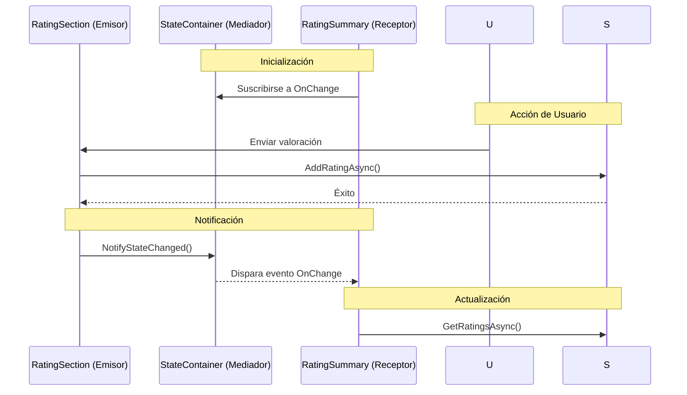

# 14. State Container: Comunicación entre Componentes

## Índice

[14. State Container: Comunicación entre Componentes](#14-state-container-comunicación-entre-componentes)
  - [14.1. El Problema: Componentes Desacoplados](#141-el-problema-componentes-desacoplados)
  - [14.2. La Solución: State Container](#142-la-solución-state-container)
  - [14.3. Implementación del Patrón](#143-implementación-del-patrón)
  - [14.4. Suscripción y Notificación](#144-suscripción-y-notificación)

---

## 14.1. El Problema: Componentes Desacoplados

En `Details.cshtml`, tenemos dos componentes independientes:

| Componente          | Ubicación                        |
| ------------------- | -------------------------------- |
| `<RatingSummary />` | Parte superior (junto al precio) |
| `<RatingSection />` | Parte inferior (formulario)      |

**Problema**: Cuando un usuario vota en la sección inferior, la cabecera debe actualizarse. Como no son padre-hijo, `EventCallback` no funciona.

---

## 14.2. La Solución: State Container



---

## 14.3. Implementación del Patrón

### Registro como Scoped

```csharp
// Program.cs
builder.Services.AddScoped<RatingStateContainer>();
```

### Clase State Container

```csharp
public class RatingStateContainer
{
    private long _productId;
    public long ProductId
    {
        get => _productId;
        set
        {
            if (_productId != value)
            {
                _productId = value;
                NotifyStateChanged();
            }
        }
    }

    public int RatingCount { get; set; }
    public double AverageRating { get; set; }

    public event Action? OnChange;

    public void UpdateRatings(long productId, int count, double average)
    {
        ProductId = productId;
        RatingCount = count;
        AverageRating = average;
        NotifyStateChanged();
    }

    private void NotifyStateChanged() => OnChange?.Invoke();
}
```

---

## 14.4. Suscripción y Notificación

### Componente Emisor (Formulario)

```csharp
// RatingSection.razor
@inject RatingStateContainer StateContainer

<div class="rating-section">
    <h3>Valorar este producto</h3>
    
    <EditForm Model="this" OnValidSubmit="SubmitRating">
        <InputSelect @bind-Value="SelectedRating">
            <option value="1">1 ★</option>
            <option value="2">2 ★★</option>
            <option value="3">3 ★★★</option>
            <option value="4">4 ★★★★</option>
            <option value="5">5 ★★★★★</option>
        </InputSelect>
        
        <button type="submit">Enviar valoración</button>
    </EditForm>
</div>

@code {
    private int SelectedRating { get; set; }
    
    private async Task SubmitRating()
    {
        await RatingService.AddRatingAsync(StateContainer.ProductId, SelectedRating);
        
        // Actualizar state container
        var stats = await RatingService.GetStatsAsync(StateContainer.ProductId);
        StateContainer.UpdateRatings(
            StateContainer.ProductId,
            stats.Count,
            stats.Average
        );
    }
}
```

### Componente Receptor (Resumen)

```csharp
// RatingSummary.razor
@implements IDisposable
@inject RatingStateContainer StateContainer

<div class="rating-summary">
    <span>★ @StateContainer.AverageRating.ToString("F1")</span>
    <span>(@StateContainer.RatingCount valoraciones)</span>
</div>

@code {
    protected override void OnInitialized()
    {
        StateContainer.OnChange += StateHasChanged;
    }
    
    public void Dispose()
    {
        StateContainer.OnChange -= StateHasChanged;
    }
}
```

---

## Resumen

| Concepto           | Descripción                                              |
| ------------------ | -------------------------------------------------------- |
| **State Container**| Servicio compartido entre componentes                     |
| **Scoped**        | Un estado por usuario/sesión                            |
| **OnChange**      | Evento para notificar cambios                           |
| **IDisposable**   | Limpiar suscripción al dispose                          |

---

**Anterior**: [13. Blazor Server](../13-Blazor-Server.md)  
**Próximo**: [15. SignalR](../15-SignalR.md)
