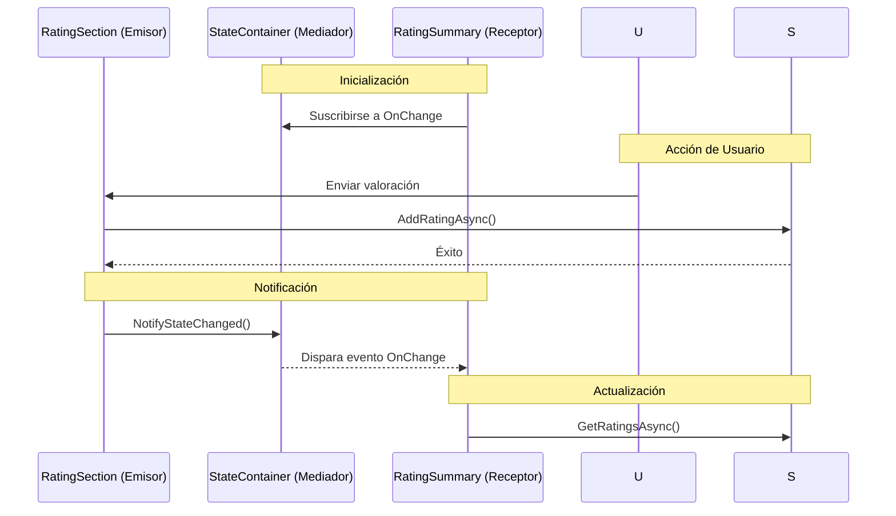
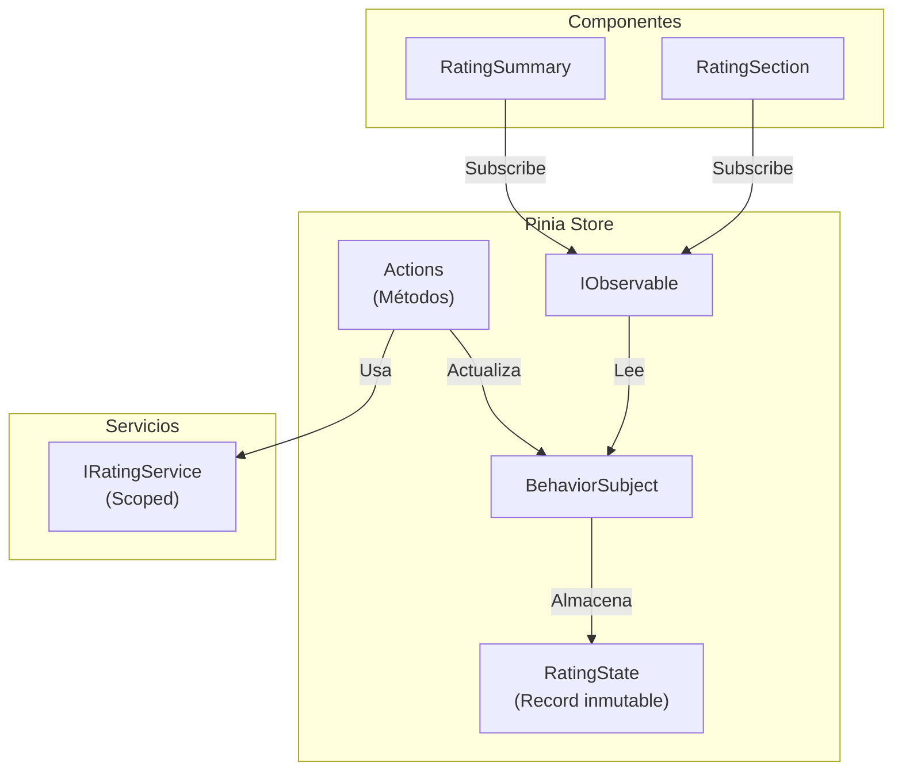
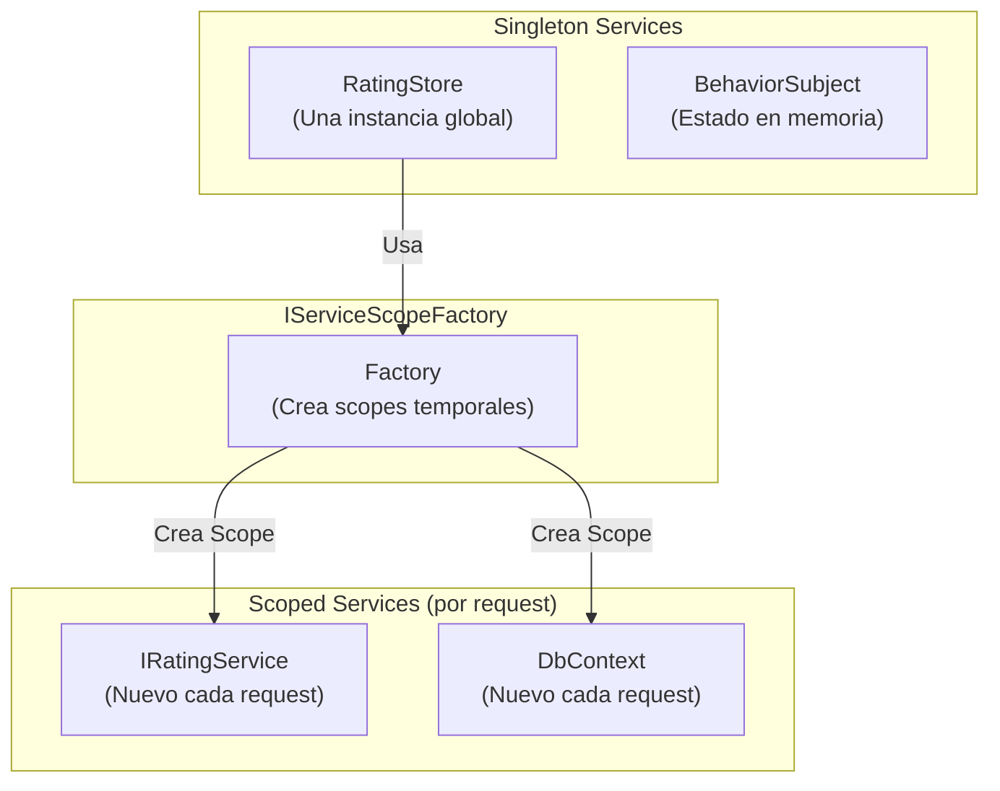
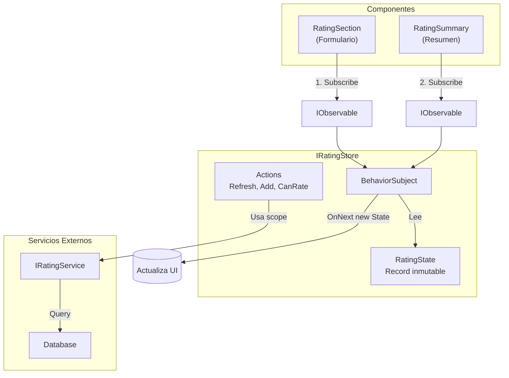

# 14. State Container & Pinia Store: Comunicación entre Componentes

## Índice

[14. State Container & Pinia Store: Comunicación entre Componentes](#14-state-container--pinia-store-comunicación-entre-componentes)
  - [14.1. El Problema: Componentes Desacoplados](#141-el-problema-componentes-desacoplados)
  - [14.2. La Solución: State Container (Patrón Clásico)](#142-la-solución-state-container-patrón-clásico)
  - [14.3. Pinia Store: Enfoque Moderno con Reactive Extensions](#143-pinia-store-enfoque-moderno-con-reactive-extensions)
  - [14.4. Implementación del RatingStore](#144-implementación-del-ratingstore)
  - [14.5. Uso en Componentes Blazor](#145-uso-en-componentes-blazor)
  - [14.6. Patrón: Singleton con Servicios Scoped](#146-patrón-singleton-con-servicios-scoped)
  - [14.7. Diagrama del Flujo de Datos](#147-diagrama-del-flujo-de-datos)

---

## 14.1. El Problema: Componentes Desacoplados

En `Details.cshtml`, tenemos dos componentes independientes:

| Componente          | Ubicación                        |
| ------------------- | -------------------------------- |
| `<RatingSummary />` | Parte superior (junto al precio) |
| `<RatingSection />` | Parte inferior (formulario)      |

**Problema**: Cuando un usuario vota en la sección inferior, la cabecera debe actualizarse. Como no son padre-hijo, `EventCallback` no funciona.

---

## 14.2. La Solución: State Container (Patrón Clásico)



### Registro como Scoped

```csharp
// Program.cs
builder.Services.AddScoped<RatingStateContainer>();
```

### Clase State Container (Legacy)

```csharp
public class RatingStateContainer
{
    public long ProductId { get; set; }
    public int RatingCount { get; set; }
    public double AverageRating { get; set; }

    public event Action? OnChange;

    public void NotifyStateChanged() => OnChange?.Invoke();
}
```

---

## 14.3. Pinia Store: Enfoque Moderno con Reactive Extensions

El patrón **Pinia** (inspirado en Vue's Pinia) usa **Reactive Extensions (Rx)** para un estado reactivo y observable.

### Conceptos Clave



### Estructura del RatingStore

```
TiendaDawWeb.Shared/
└── Services/
    └── Rating/
        ├── IRatingStore.cs      (Interfaz contrato)
        ├── RatingState.cs       (Estado inmutable)
        └── RatingStore.cs       (Implementación con Rx)
```

---

## 14.4. Implementación del RatingStore

### 14.4.1. RatingState (El Estado)

```csharp
namespace TiendaDawWeb.Shared.Services.Rating;

/// <summary>
/// Estado inmutable de las valoraciones.
/// </summary>
public record RatingState
{
    public List<Models.Rating> Ratings { get; init; } = new();
    public long CurrentProductId { get; init; }
    
    public double Average => Ratings.Any() ? Ratings.Average(r => r.Puntuacion) : 0;
    public int Count => Ratings.Count;
    public bool HasRatings => Ratings.Any();
}
```

### 14.4.2. IRatingStore (El Contrato)

```csharp
namespace TiendaDawWeb.Shared.Services.Rating;

/// <summary>
/// Contrato para el almacén de estado de valoraciones.
/// </summary>
public interface IRatingStore
{
    // ═══════════════════════════════════════════════════════════════
    // STATE - Observable del estado
    // ═══════════════════════════════════════════════════════════════
    
    /// <summary>
    /// Observable del estado completo de valoraciones.
    /// </summary>
    IObservable<RatingState> State { get; }

    // ═══════════════════════════════════════════════════════════════
    // GETTERS - Selectores derivados
    // ═══════════════════════════════════════════════════════════════
    
    IObservable<List<Models.Rating>> Ratings { get; }
    IObservable<double> Average { get; }
    IObservable<int> Count { get; }
    IObservable<bool> HasRatings { get; }

    // ═══════════════════════════════════════════════════════════════
    // ACTIONS - Métodos que modifican el estado
    // ═══════════════════════════════════════════════════════════════
    
    Task EnsureLoadedAsync(long productId);
    Task RefreshAsync(long productId);
    Task<Models.Rating?> AddRatingAsync(long userId, long productId, int puntuacion, string? comentario);
    Task<bool> CanUserRateAsync(long userId, long productId);
    
    /// <summary>
    /// Selector personalizado para observar una parte específica del estado.
    /// </summary>
    IObservable<T> Select<T>(Func<RatingState, T> selector);
}
```

### 14.4.3. RatingStore (Implementación con Rx)

```csharp
using System.Reactive.Linq;
using System.Reactive.Subjects;
using Microsoft.Extensions.DependencyInjection;

namespace TiendaDawWeb.Shared.Services.Rating;

/// <summary>
/// Implementación del almacén de valoraciones usando BehaviorSubject.
/// </summary>
public class RatingStore : IRatingStore
{
    // ═══════════════════════════════════════════════════════════════
    // STATE
    // ═══════════════════════════════════════════════════════════════
    
    private readonly BehaviorSubject<RatingState> _state;
    
    // ═══════════════════════════════════════════════════════════════
    // GETTERS - IObservables derivados del estado
    // ═══════════════════════════════════════════════════════════════
    
    public IObservable<RatingState> State => _state.AsObservable();

    public IObservable<List<Models.Rating>> Ratings => 
        _state.Select(s => s.Ratings).DistinctUntilChanged();

    public IObservable<double> Average => 
        _state.Select(s => s.Average).DistinctUntilChanged();

    public IObservable<int> Count => 
        _state.Select(s => s.Count).DistinctUntilChanged();

    public IObservable<bool> HasRatings => 
        _state.Select(s => s.HasRatings).DistinctUntilChanged();

    // ═══════════════════════════════════════════════════════════════
    // ACTIONS
    // ═══════════════════════════════════════════════════════════════
    
    /// <summary>
    /// Constructor: RatingStore es Singleton, pero IRatingService es Scoped.
    /// Para resolver un servicio Scoped desde un Singleton, usamos IServiceScopeFactory.
    /// Un "Scope" crea un contenedor temporal con instancias frescas.
    /// </summary>
    public RatingStore(IServiceScopeFactory serviceScopeFactory)
    {
        _serviceScopeFactory = serviceScopeFactory;
        _state = new BehaviorSubject<RatingState>(new RatingState());
    }

    public RatingState GetState() => _state.Value;

    public Task EnsureLoadedAsync(long productId)
    {
        if (_state.Value.CurrentProductId == productId && _state.Value.Ratings.Any())
            return Task.CompletedTask;
        return RefreshAsync(productId);
    }
    
    public Task RefreshAsync(long productId)
    {
        return Task.Run(async () =>
        {
            // PATRÓN: Crear scope temporal para servicio scoped
            using var scope = _serviceScopeFactory.CreateScope();
            var ratingService = scope.ServiceProvider.GetRequiredService<IRatingService>();
            
            var result = await ratingService.GetByProductoIdAsync(productId);
            if (result.IsSuccess)
                _state.OnNext(new RatingState(result.Value.ToList(), productId));
        });
    }
    
    public async Task<Models.Rating?> AddRatingAsync(
        long userId, 
        long productId, 
        int puntuacion, 
        string? comentario)
    {
        using var scope = _serviceScopeFactory.CreateScope();
        var ratingService = scope.ServiceProvider.GetRequiredService<IRatingService>();
        
        var result = await ratingService.AddRatingAsync(userId, productId, puntuacion, comentario);
        if (result.IsSuccess && result.Value != null)
        {
            // Actualizar estado inmutable con "with"
            var ratings = _state.Value.Ratings.ToList();
            ratings.Add(result.Value);
            _state.OnNext(new RatingState(ratings, productId));
        }
        return result.Value;
    }
    
    public Task<bool> CanUserRateAsync(long userId, long productId)
    {
        return Task.Run(async () =>
        {
            using var scope = _serviceScopeFactory.CreateScope();
            var ratingService = scope.ServiceProvider.GetRequiredService<IRatingService>();
            var result = await ratingService.CanUserRateProductAsync(userId, productId);
            return result.IsSuccess && result.Value;
        });
    }
    
    public IObservable<T> Select<T>(Func<RatingState, T> selector) 
        => _state.Select(selector).DistinctUntilChanged();

    private readonly IServiceScopeFactory _serviceScopeFactory;
}
```

---

## 14.5. Uso en Componentes Blazor

### 14.5.1. Registro en DI (ServicesConfig.cs)

```csharp
public static IServiceCollection AddStateStores(this IServiceCollection services)
{
    services.AddSingleton<IRatingStore, RatingStore>();
    return services;
}

// En Program.cs
builder.Services.AddStateStores();
```

### 14.5.2. RatingSummary (Consumidor del Store)

```csharp
@namespace TiendaDawWeb.Shared.Blazor.Ratings
@using TiendaDawWeb.Shared.Services.Rating
@inject IRatingStore RatingStore
@implements IDisposable

<div class="rating-summary">
    @if (_loading)
    {
        <span>Cargando...</span>
    }
    else
    {
        <span>★ @(_average.ToString("F1"))</span>
        <span>(@_count valoraciones)</span>
    }
</div>

@code {
    private bool _loading = true;
    private double _average;
    private int _count;
    private readonly List<IDisposable> _subscriptions = new();

    protected override void OnInitialized()
    {
        // Suscripción reactiva al estado
        _subscriptions.Add(RatingStore.Average.Subscribe(value => {
            _average = value;
            InvokeAsync(StateHasChanged);
        }));
        
        _subscriptions.Add(RatingStore.Count.Subscribe(value => {
            _count = value;
            InvokeAsync(StateHasChanged);
        }));
    }

    public void Dispose()
    {
        foreach (var sub in _subscriptions) sub.Dispose();
        _subscriptions.Clear();
    }
}
```

### 14.5.3. RatingSection (Formulario de Valoración)

```csharp
@namespace TiendaDawWeb.Shared.Blazor.Ratings
@using TiendaDawWeb.Shared.Services.Rating
@inject IRatingStore RatingStore
@implements IDisposable

@{
    var userRating = State?.Ratings?.FirstOrDefault(r => r.UsuarioId == CurrentUserId);
    var canRate = _isAuthenticated && !_isOwner && userRating == null && _hasPurchased;
}

@if (userRating != null)
{
    <div class="p-4 border-success">
        <h5>¡Gracias por tu valoración!</h5>
        <span>@userRating.Puntuacion / 5</span>
    </div>
}
else if (canRate)
{
    <div class="card border-primary">
        <div class="card-header bg-primary text-white">
            Valora tu compra ahora
        </div>
        <div class="card-body">
            <form @onsubmit="HandleSubmit">
                <!-- Estrellas y comentario -->
            </form>
        </div>
    </div>
}

@code {
    private RatingState? State { get; set; }
    private bool _hasPurchased;
    private readonly List<IDisposable> _subscriptions = new();

    protected override async Task OnInitializedAsync()
    {
        // Suscripción al estado completo
        _subscriptions.Add(RatingStore.State.Subscribe(state => {
            State = state;
            InvokeAsync(StateHasChanged);
        }));
        
        // Verificar si puede valorar
        if (CurrentUserId.HasValue)
            _hasPurchased = await RatingStore.CanUserRateAsync(CurrentUserId.Value, ProductId);
        
        await RatingStore.EnsureLoadedAsync(ProductId);
    }

    private async Task HandleSubmit()
    {
        if (CurrentUserId.HasValue)
        {
            await RatingStore.AddRatingAsync(
                CurrentUserId.Value, 
                ProductId, 
                _selectedPuntuacion, 
                _comentario);
        }
    }

    public void Dispose()
    {
        foreach (var sub in _subscriptions) sub.Dispose();
        _subscriptions.Clear();
    }
}
```

---

## 14.6. Patrón: Singleton con Servicios Scoped

### El Problema de Lifetime

| Servicio         | Lifetime | Descripción                          |
| ---------------- | -------- | ------------------------------------ |
| `IRatingStore`   | Singleton| Estado compartido global             |
| `IRatingService` | Scoped   | Una instancia por usuario/sesión      |

**Problema**: Un Singleton no puede inyectar directamente un Scoped.

### Solución: IServiceScopeFactory

```csharp
public class RatingStore : IRatingStore
{
    private readonly IServiceScopeFactory _serviceScopeFactory;

    public RatingStore(IServiceScopeFactory serviceScopeFactory)
    {
        _serviceScopeFactory = serviceScopeFactory;
    }

    public Task RefreshAsync(long productId)
    {
        return Task.Run(async () =>
        {
            // Crear scope temporal
            using var scope = _serviceScopeFactory.CreateScope();
            
            // Obtener servicio scoped fresco
            var ratingService = scope.ServiceProvider.GetRequiredService<IRatingService>();
            
            var result = await ratingService.GetByProductoIdAsync(productId);
            // ...
        });
    }
}
```

### Diagrama del Lifetime



---

## 14.7. Diagrama del Flujo de Datos



---

## Comparación: State Container vs Pinia Store

| Aspecto              | State Container (Legacy)      | Pinia Store (Moderno)          |
| -------------------- | ---------------------------- | ------------------------------ |
| **Notificación**     | `event Action`               | `IObservable<T>`               |
| **Estado**           | Mutable (propiedades)        | Inmutable (record + `with`)    |
| **Suscripción**      | Delegados                    | Reactive Extensions (Rx)       |
| **Complejidad**      | Simple                       | Media (más poderoso)           |
| **Testabilidad**     | Media                        | Alta                           |
| **Múltiples susc.**  | Limitado                     | Ilimitado                      |
| **Operadores Rx**    | No                           | Sí (`Select`, `DistinctUntilChanged`) |

---

## Resumen

| Concepto              | Descripción                                              |
| --------------------- | -------------------------------------------------------- |
| **BehaviorSubject**   | Subject que mantiene el último valor y lo emite a nuevos suscriptores |
| **IObservable**       | Stream de datos que permite suscripción                   |
| **IServiceScopeFactory** | Factory para crear scopes temporales de servicios scoped |
| **State inmutable**   | Record que se recrea con `with` en cada actualización    |
| **DistinctUntilChanged** | Optimización: solo emite cuando el valor cambia          |
| **IDisposable**       | Limpieza de suscripciones en componentes Blazor          |

---

**Anterior**: [13. Blazor Server](../13-Blazor-Server.md)  
**Próximo**: [15. SignalR](../15-SignalR.md)
