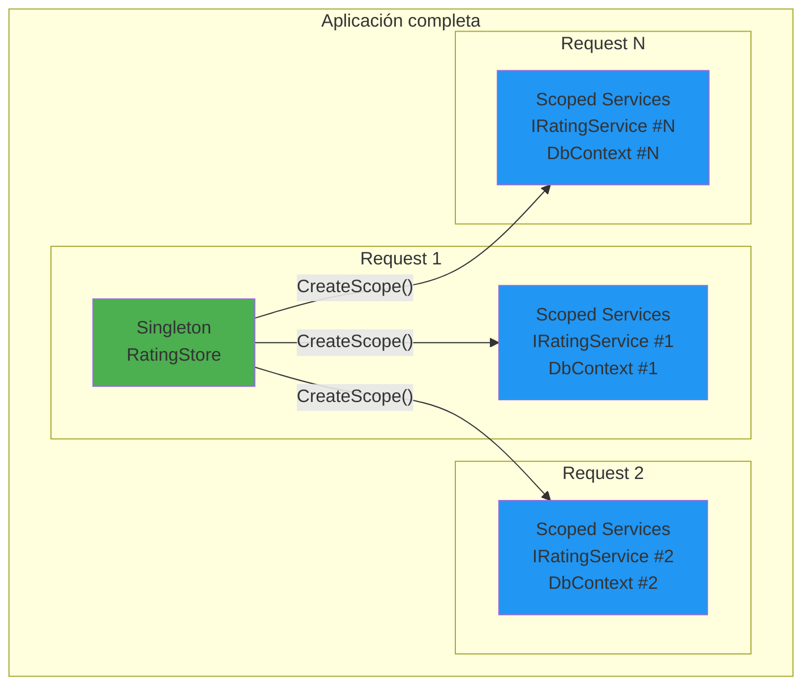
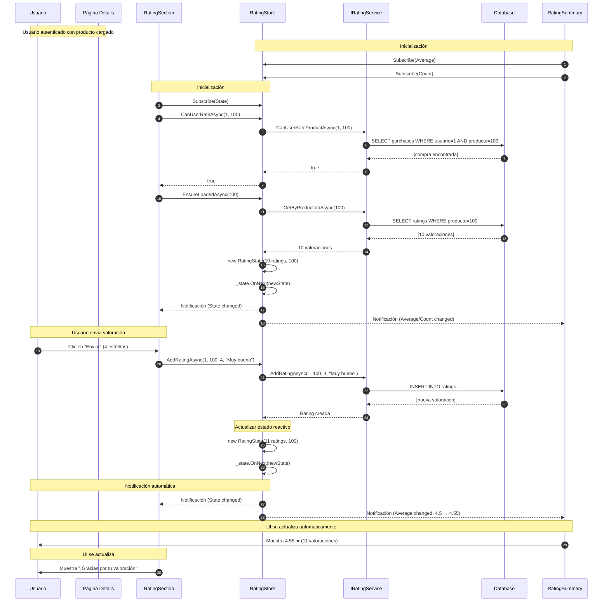

---

## 14.5. Uso en Componentes Blazor

### 14.5.1. Registro en el Contenedor de Dependencias

Antes de usar el Store, debemos registrarlo en el contenedor DI:

```csharp
// TiendaDawWeb.Shared/Infrastructures/ServicesConfig.cs

using Microsoft.Extensions.DependencyInjection;
using TiendaDawWeb.Shared.Services.Rating;

namespace TiendaDawWeb.Shared.Infrastructures;

/// <summary>
/// Extensiones para registrar servicios del proyecto Shared.
/// </summary>
public static class ServicesConfig
{
    /// <summary>
    /// Registra los servicios de valoraciones y stores de estado.
    /// </summary>
    public static IServiceCollection AddStateStores(this IServiceCollection services)
    {
        // RatingStore es Singleton: una instancia global para toda la aplicación
        services.AddSingleton<IRatingStore, RatingStore>();
        
        return services;
    }
}
```

```csharp
// Program.cs de TiendaDawWeb.Mvc o TiendaDawWeb.RazorPages

// Registrar todos los servicios
builder.Services
    .AddScoped<IRatingService, RatingService>()
    .AddStateStores();  // ← Registro del Store
```

### 14.5.2. RatingSummary (Consumidor del Store)

```csharp
@namespace TiendaDawWeb.Shared.Blazor.Ratings
@using TiendaDawWeb.Shared.Services.Rating
@inject IRatingStore RatingStore
@implements IDisposable

@*
    RatingSummary: Muestra el resumen de valoraciones.
    
    ¿Qué hace este componente?
    1. Se suscribe al observable "Average" del Store
    2. Se suscribe al observable "Count" del Store
    3. Cuando el estado cambia, actualiza la UI automáticamente
    
    ¿Por qué usa IDisposable?
    - Para limpiar las suscripciones cuando el componente se destruye
    - Evita fugas de memoria
*@

<div class="rating-summary mb-3">
    @if (_loading)
    {
        <div class="text-center">
            <div class="spinner-border spinner-border-sm" role="status">
                <span class="visually-hidden">Cargando...</span>
            </div>
        </div>
    }
    else
    {
        <div class="d-flex align-items-center">
            <span class="me-2">★</span>
            <span class="fw-bold me-1">@(_average.ToString("F1"))</span>
            <span class="text-muted">(@_count valoraciones)</span>
        </div>
    }
</div>

@code {
    // ═══════════════════════════════════════════════════════════════
    // STATE LOCAL DEL COMPONENTE
    // ═══════════════════════════════════════════════════════════════
    
    private bool _loading = true;
    private double _average;
    private int _count;
    
    // ═══════════════════════════════════════════════════════════════
    // SUSCRIPCIONES - Lista para limpiar después
    // ═══════════════════════════════════════════════════════════════
    
    private readonly List<IDisposable> _subscriptions = new();

    // ═══════════════════════════════════════════════════════════════
    // CICLO DE VIDA
    // ═══════════════════════════════════════════════════════════════
    
    protected override void OnInitialized()
    {
        // Suscripción 1: Solo reacciona cuando cambia el promedio
        _subscriptions.Add(RatingStore.Average.Subscribe(value => {
            _average = value;
            // InvokeAsync: asegura que StateHasChanged se ejecute en el hilo correcto
            InvokeAsync(StateHasChanged);
        }));
        
        // Suscripción 2: Solo reacciona cuando cambia el conteo
        _subscriptions.Add(RatingStore.Count.Subscribe(value => {
            _count = value;
            InvokeAsync(StateHasChanged);
        }));
    }

    protected override async Task OnAfterRenderAsync(bool firstRender)
    {
        if (firstRender)
        {
            // Cargar datos iniciales
            await RatingStore.EnsureLoadedAsync(ProductId);
            _loading = false;
            await InvokeAsync(StateHasChanged);
        }
    }

    // ═══════════════════════════════════════════════════════════════
    // LIMPIEZA DE RECURSOS
    // ═══════════════════════════════════════════════════════════════
    
    public void Dispose()
    {
        foreach (var sub in _subscriptions)
            sub.Dispose();
        _subscriptions.Clear();
    }

    // ═══════════════════════════════════════════════════════════════
    // PARÁMETROS
    // ═══════════════════════════════════════════════════════════════
    
    [Parameter]
    public long ProductId { get; set; }
}
```

### 14.5.3. RatingSection (Formulario de Valoración)

```csharp
@namespace TiendaDawWeb.Shared.Blazor.Ratings
@using TiendaDawWeb.Shared.Services.Rating
@inject IRatingStore RatingStore
@implements IDisposable

@*
    RatingSection: Formulario para enviar valoraciones.
    
    ¿Qué hace este componente?
    1. Verifica si el usuario ha comprado el producto (CanUserRateAsync)
    2. Si puede valorar, muestra el formulario
    3. Al enviar, llama a AddRatingAsync del Store
    4. El Store notifica a RatingSummary automáticamente
*@

@{
    // Determinar estado desde el Store
    var userRating = State?.Ratings?.FirstOrDefault(r => r.UsuarioId == CurrentUserId);
    var canRate = _isAuthenticated && !_isOwner && userRating == null && _hasPurchased;
}

@if (userRating != null)
{
    @* El usuario ya valoró: mostrar mensaje de agradecimiento *@
    <div class="p-4 rounded border border-success bg-light mb-4">
        <h5 class="text-success">¡Gracias por tu valoración!</h5>
        <div class="d-flex align-items-center">
            <span>@RenderStars(userRating.Puntuacion)</span>
            <span class="ms-2 fw-bold">@userRating.Puntuacion / 5</span>
        </div>
    </div>
}
else if (canRate)
{
    @* El usuario puede valorar: mostrar formulario *@
    <div class="card border-primary mb-4">
        <div class="card-header bg-primary text-white">
            <i class="bi bi-pencil-square"></i> Valora tu compra ahora
        </div>
        <div class="card-body">
            <form @onsubmit="HandleSubmit">
                <div class="mb-3">
                    <label class="form-label">Tu puntuación:</label>
                    <div class="star-rating-input">
                        @for (int i = 1; i <= 5; i++)
                        {
                            var starValue = i;
                            <i class="bi @(GetStarClass(starValue)) star-item"
                               style="cursor:pointer; font-size:1.5rem"
                               @onclick="() => SelectStar(starValue)"></i>
                        }
                    </div>
                </div>
                
                <div class="mb-3">
                    <label class="form-label">Comentario (opcional):</label>
                    <textarea class="form-control" @bind="_comentario" rows="3" maxlength="500"
                              placeholder="¿Qué te ha parecido este producto?"></textarea>
                </div>
                
                <button type="submit" class="btn btn-primary" disabled="@_submitting">
                    @if (_submitting)
                    {
                        <span class="spinner-border spinner-border-sm"></span>
                        <span>Enviando...</span>
                    }
                    else
                    {
                        <span>Enviar Valoración</span>
                    }
                </button>
            </form>
        </div>
    </div>
}

@code {
    // ═══════════════════════════════════════════════════════════════
    // STATE LOCAL
    // ═══════════════════════════════════════════════════════════════
    
    private RatingState? State { get; set; }
    private bool _isAuthenticated;
    private bool _isOwner;
    private bool _hasPurchased;
    private bool _loading = true;
    private bool _submitting = false;
    private int _selectedPuntuacion = 0;
    private string _comentario = "";
    
    // ═══════════════════════════════════════════════════════════════
    // SUSCRIPCIONES
    // ═══════════════════════════════════════════════════════════════
    
    private readonly List<IDisposable> _subscriptions = new();

    // ═══════════════════════════════════════════════════════════════
    // INICIALIZACIÓN
    // ═══════════════════════════════════════════════════════════════
    
    protected override async Task OnInitializedAsync()
    {
        // Suscribirse al estado completo
        _subscriptions.Add(RatingStore.State.Subscribe(state => {
            State = state;
            InvokeAsync(StateHasChanged);
        }));
        
        // Configurar estado desde parámetros
        _isAuthenticated = IsAuthenticated;
        _isOwner = IsOwner;
        
        // Verificar si el usuario ha comprado el producto
        if (CurrentUserId.HasValue)
            _hasPurchased = await RatingStore.CanUserRateAsync(CurrentUserId.Value, ProductId);
        
        // Cargar valoraciones si no están cargadas
        await RatingStore.EnsureLoadedAsync(ProductId);
        
        _loading = false;
    }

    // �══════════════════════════════════════════════════════════════
    // MANEJO DE EVENTOS
    // ═══════════════════════════════════════════════════════════════
    
    private void SelectStar(int value)
    {
        _selectedPuntuacion = value;
    }

    private async Task HandleSubmit()
    {
        if (!CurrentUserId.HasValue || _selectedPuntuacion == 0)
            return;

        _submitting = true;
        
        // Llamar al Store: esto actualizará el estado y notificará a RatingSummary
        await RatingStore.AddRatingAsync(
            CurrentUserId.Value,
            ProductId,
            _selectedPuntuacion,
            _comentario);
        
        _submitting = false;
    }

    private string GetStarClass(int starValue)
    {
        return starValue <= _selectedPuntuacion 
            ? "bi-star-fill text-warning" 
            : "bi-star text-secondary";
    }

    private RenderFragment RenderStars(double val) => builder =>
    {
        for (int i = 1; i <= 5; i++)
        {
            builder.OpenElement(i, "i");
            builder.AddAttribute(i + 1, "class", 
                i <= val ? "bi-star-fill text-warning" : "bi-star text-secondary");
            builder.CloseElement();
        }
    };

    // ═══════════════════════════════════════════════════════════════
    // LIMPIEZA
    // ═══════════════════════════════════════════════════════════════
    
    public void Dispose()
    {
        foreach (var sub in _subscriptions) sub.Dispose();
        _subscriptions.Clear();
    }

    // ═══════════════════════════════════════════════════════════════
    // PARÁMETROS
    // ═══════════════════════════════════════════════════════════════
    
    [Parameter] public long ProductId { get; set; }
    [Parameter] public long? CurrentUserId { get; set; }
    [Parameter] public bool IsOwner { get; set; }
    [Parameter] public bool IsAuthenticated { get; set; }
}
```

---

## 14.6. Patrón: Singleton con Servicios Scoped

### 14.6.1. El Problema de Lifetime

En ASP.NET Core, cada servicio tiene un **lifetime** (duración):

| Lifetime      | Descripción                                      | Ejemplos                          |
| ------------- | ------------------------------------------------ | -------------------------------- |
| **Transient** | Nueva instancia cada vez que se solicita          | `ILogger<T>`                    |
| **Scoped**    | Una instancia por request HTTP o conexión        | `DbContext`, `IRatingService`    |
| **Singleton** | Una instancia para toda la aplicación            | `ILogger`, `IRatingStore`       |

### El Problema Específico

```
┌─────────────────────────────────────────────────────────────┐
│                    Contenedor DI                            │
├─────────────────────────────────────────────────────────────┤
│                                                              │
│  Singleton: RatingStore (UNA INSTANCIA global)               │
│     │                                                       │
│     └─[❌ NO PUEDE DIRECTAMENTE]──> IRatingService (Scoped) │
│                                                              │
│  Error: Cannot consume scoped service from singleton         │
└─────────────────────────────────────────────────────────────┘
```

**Error típico**:
```
InvalidOperationException: Cannot consume scoped service 
'IRatingService' from singleton 'IRatingStore'.
```

### ¿Por Qué Ocurre Esto?

1. **Scoped** significa "una instancia por request"
2. **Singleton** significa "una instancia para toda la app"
3. Si un Singleton guarda una referencia a un Scoped:
   - El Scoped podría ser de un request anterior
   - Los datos podrían ser stale (obsoletos)
   - El DbContext podría estar disposed

### 14.6.2. Solución: IServiceScopeFactory

```csharp
public class RatingStore : IRatingStore
{
    // ═══════════════════════════════════════════════════════════════
    // INYECTAMOS LA FÁBRICA, NO EL SERVICIO DIRECTAMENTE
    // ═══════════════════════════════════════════════════════════════
    
    private readonly IServiceScopeFactory _serviceScopeFactory;

    public RatingStore(IServiceScopeFactory serviceScopeFactory)
    {
        _serviceScopeFactory = serviceScopeFactory;
    }

    // ═══════════════════════════════════════════════════════════════
    // USO: Crear scope temporal cuando necesitemos el servicio
    // ═══════════════════════════════════════════════════════════════
    
    public Task RefreshAsync(long productId)
    {
        return Task.Run(async () =>
        {
            // ═══════════════════════════════════════════════════════
            // PATRÓN: "using" + CreateScope()
            // ═══════════════════════════════════════════════════════
            // 
            // 1. "using" → asegura que el scope se dispose al salir
            // 2. CreateScope() → crea un contenedor temporal
            // 3. GetRequiredService() → obtiene el servicio de ese scope
            // 
            // El servicio obtenido es fresco para este scope específico
            // ═══════════════════════════════════════════════════════
            
            using var scope = _serviceScopeFactory.CreateScope();
            var ratingService = scope.ServiceProvider.GetRequiredService<IRatingService>();
            
            var result = await ratingService.GetByProductoIdAsync(productId);
            if (result.IsSuccess)
                _state.OnNext(new RatingState(result.Value.ToList(), productId));
        });
    }
}
```

### 14.6.3. Diagrama del Lifetime



### 14.6.4. Explicación del Diagrama

| Elemento       | Descripción                                              |
| -------------- | -------------------------------------------------------- |
| **RatingStore** | Singleton: una instancia global para toda la app          |
| **Scoped #1**  | Request 1: tiene sus propios IRatingService y DbContext   |
| **Scoped #2**  | Request 2: tiene sus propios IRatingService y DbContext   |
| **Scoped #N** | Request N: tiene sus propios IRatingService y DbContext   |

**Flujo**:
1. Request 1 llega → RatingStore crea scope #1 → usa IRatingService #1
2. Request 2 llega → RatingStore crea scope #2 → usa IRatingService #2
3. Request N llega → RatingStore crea scope #N → usa IRatingService #N

### 14.6.5. Ventajas del Patrón

| Ventaja              | Descripción                                              |
| ------------------- | -------------------------------------------------------- |
| ✅ Thread-safe      | Cada scope es independiente                              |
| ✅ Datos frescos    | Cada request obtiene servicios nuevos                     |
| ✅ Memoria controlada| Scopes se disposan, liberando recursos                  |
| ✅ Correcto         | Evita referencias a objetos disposed                      |

### 14.6.6. Alternativas Considered

| Alternativa             | ¿Por qué no la usamos?                                |
| ---------------------- | ------------------------------------------------------ |
| Hacer RatingStore Scoped | El estado de ratings debería ser global, no por request |
| Hacer IRatingService Singleton | Tendría que manejar concurrencia de múltiples usuarios |
| Pasarlo como parámetro | Inconveniente en componentes anidados                  |

---

## 14.7. Flujo Completo de Datos

### 14.7.1. Diagrama de Secuencia



### 14.7.2. Explicación del Flujo

| Paso | Acción                                               | Resultado                                    |
| ---- | ---------------------------------------------------- | -------------------------------------------- |
| 1-4  | RatingSummary y RatingSection se suscriben           | Ambos reciben actualizaciones automáticas      |
| 5-10 | RatingSection verifica si puede valorar              | Solo ve el formulario si ha comprado         |
| 11-16| RatingSection carga valoraciones iniciales           | Store obtiene datos del servicio             |
| 17-18| Store notifica a todos los suscriptores             | RatingSummary muestra datos iniciales        |
| 19-23| Usuario envía valoración                            | Store procesa la acción                      |
| 24-27| Store persiste y actualiza estado                   | Nueva valoración añadida al estado           |
| 28-31| Store notifica a todos                              | RatingSummary y RatingSection se actualizan  |
| 32-33| UI se re-renderiza                                  | Usuario ve el promedio actualizado           |

### 14.7.3. Puntos Clave

| Concepto              | Descripción                                              |
| --------------------- | -------------------------------------------------------- |
| **Suscripción**       | Los componentes se "conectan" al Store una vez           |
| **Notificación**      | Cuando el estado cambia, TODOS los suscriptores recibenlo |
| **Actualización automática**| No hay código de sincronización manual               |
| **Desacoplamiento**   | RatingSection NO conoce a RatingSummary                  |

---

## Comparación: State Container vs Pinia Store

| Aspecto              | State Container (Legacy)      | Pinia Store (Moderno)          |
| -------------------- | ---------------------------- | ------------------------------ |
| **Notificación**     | `event Action`               | `IObservable<T>`               |
| **Estado**           | Mutable (propiedades)        | Inmutable (record + `with`)    |
| **Suscripción**      | Un handler por evento        | Múltiples suscripciones        |
| **Complejidad**      | Simple                       | Media (más poderoso)          |
| **Testabilidad**     | Media                        | Alta                           |
| **Múltiples susc.**  | ❌ Limitado                  | ✅ Ilimitado                   |
| **Operadores Rx**    | ❌ No                        | ✅ Sí (`Select`, `Where`)     |
| **Filtrado**         | ❌ No                        | ✅ Sí                          |
| **Historial**        | ❌ No                        | ✅ Sí (`Replay`)               |
| **Retry automático**| ❌ No                        | ✅ Sí (`Retry()`)              |

---

## Resumen de Conceptos

| Concepto                    | Descripción                                                                 |
| -------------------------- | --------------------------------------------------------------------------- |
| **BehaviorSubject**         | Subject que mantiene el último valor y lo emite a nuevos suscriptores         |
| **IObservable<T>**         | Stream de datos que permite suscripción con `.Subscribe()`                    |
| **IServiceScopeFactory**    | Factory para crear scopes temporales de servicios scoped                     |
| **State inmutable**        | Record que se recrea con `with` en cada actualización                       |
| **DistinctUntilChanged**   | Operador Rx: solo emite cuando el valor realmente cambia                     |
| **IDisposable**            | Interfaz para limpieza de recursos (suscripciones)                           |
| **InvokeAsync**            | Asegura que `StateHasChanged` se ejecute en el hilo correcto de Blazor      |
| **Pattern `with`**         | Sintaxis de C# para crear copias inmutables con valores modificados         |

---

## Resumen Visual de la Arquitectura

```
┌─────────────────────────────────────────────────────────────────┐
│                    APLICACIÓN BLazor                             │
│                                                                 │
│  ┌─────────────────────────────────────────────────────────────┐│
│  │                  RatingStore (Singleton)                    ││
│  │  ┌─────────────────────────────────────────────────────────┐││
│  │  │  BehaviorSubject<RatingState>                           │││
│  │  │  (Mantiene estado, notifica cambios)                   │││
│  │  └─────────────────────────────────────────────────────────┘││
│  │           │                           │                     ││
│  │           ▼                           ▼                     ││
│  │  ┌──────────────┐           ┌──────────────────┐          ││
│  │  │ IObservable   │           │ IObservable      │          ││
│  │  │<State>        │◄──────────┤<Average>          │          ││
│  │  └──────┬───────┘           └────────┬─────────┘          ││
│  │         │                           │                      ││
│  └─────────┼───────────────────────────┼──────────────────────┘│
│            │                           │                       │
│            ▼                           ▼                       │
│  ┌─────────────────────┐     ┌─────────────────────┐          │
│  │   RatingSection     │     │   RatingSummary     │          │
│  │   (Formulario)       │     │   (Resumen)         │          │
│  │                     │     │                     │          │
│  │  - Escribe rating   │     │  - Lee promedio     │          │
│  │  - CanRate check   │     │  - Lee contador     │          │
│  └─────────────────────┘     └─────────────────────┘          │
│                                                                 │
└─────────────────────────────────────────────────────────────────┘
```

---

## Cuándo Usar Cada Patrón

| Situación                              | Recomendación                    |
| -------------------------------------- | -------------------------------- |
| App simple, pocos componentes          | State Container (más simple)     |
| Múltiples componentes reactivos        | Pinia Store + Rx                |
| Necesitas filtrar/transformar datos    | Pinia Store + Rx                |
| Necesitas retry/manejado de errores    | Pinia Store + Rx                |
| Un solo componente consume el estado   | Inyectar directamente           |

---

**Anterior**: [13. Blazor Server](../13-Blazor-Server.md)  
**Próximo**: [15. SignalR](../15-SignalR.md)