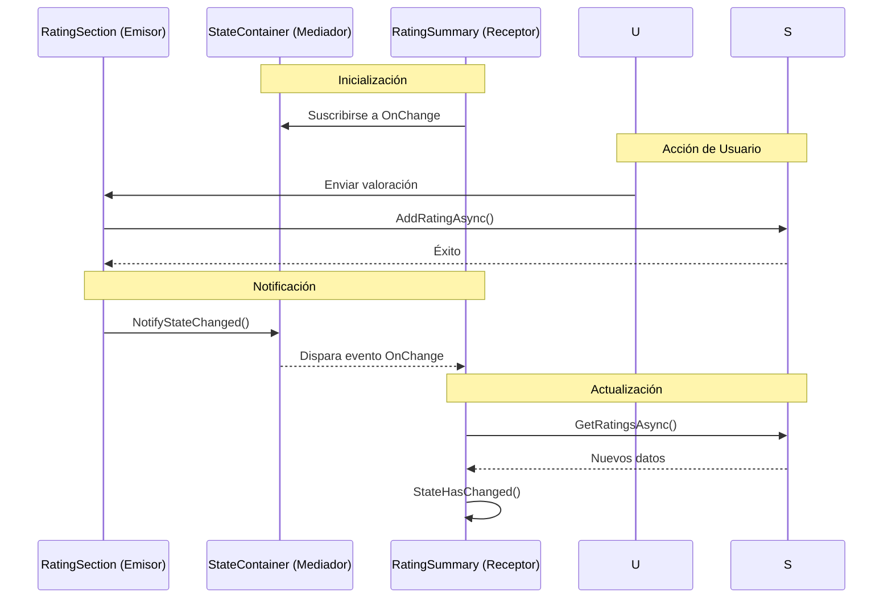

- [14. State Container: Comunicación entre Componentes](#14-state-container-comunicación-entre-componentes)
  - [1. El Problema: Componentes Desacoplados](#1-el-problema-componentes-desacoplados)
  - [2. La Solución: State Container](#2-la-solución-state-container)
  - [3. Implementación del Patrón](#3-implementación-del-patrón)
    - [3.1. Registro como Scoped](#31-registro-como-scoped)
    - [3.2. Clase State Container](#32-clase-state-container)
  - [4. Suscripción y Notificación](#4-suscripción-y-notificación)
    - [4.1. Componente Emisor (Formulario)](#41-componente-emisor-formulario)
    - [4.2. Componente Receptor (Resumen)](#42-componente-receptor-resumen)


# 14. State Container: Comunicación entre Componentes
En este capítulo, aprenderemos a implementar el patrón State Container en Blazor para facilitar la comunicación entre componentes que no tienen una relación directa de padre-hijo.


## 1. El Problema: Componentes Desacoplados

En `Details.cshtml`, tenemos dos componentes independientes:

| Componente          | Ubicación                        |
| ------------------- | -------------------------------- |
| `<RatingSummary />` | Parte superior (junto al precio) |
| `<RatingSection />` | Parte inferior (formulario)      |

**Problema**: Cuando un usuario vota en la sección inferior, la cabecera debe actualizarse. Como no son padre-hijo, `EventCallback` no funciona.

---

## 2. La Solución: State Container



---

## 3. Implementación del Patrón

### 3.1. Registro como Scoped

```csharp
// Program.cs
builder.Services.AddScoped<RatingStateContainer>();
```

**Importante**: `Scoped` = una instancia por sesión de usuario.

### 3.2. Clase State Container

```csharp
public class RatingStateContainer
{
    private long? _currentProductId;
    public event Action? OnRatingChanged;

    public long? CurrentProductId
    {
        get => _currentProductId;
        set
        {
            if (_currentProductId != value)
            {
                _currentProductId = value;
                NotifyStateChanged();
            }
        }
    }

    private void NotifyStateChanged()
    {
        OnRatingChanged?.Invoke();
    }
}
```

---

## 4. Suscripción y Notificación

### 4.1. Componente Emisor (Formulario)

```razor
@inject RatingStateContainer StateContainer

<EditForm Model="newRating" OnValidSubmit="SubmitRating">
    <InputNumber @bind-Value="newRating.Value" />
    <button type="submit">Votar</button>
</EditForm>

@code {
    private async Task SubmitRating()
    {
        await _ratingService.AddAsync(newRating);
        StateContainer.CurrentProductId = ProductId;  // Trigger
    }
}
```

### 4.2. Componente Receptor (Resumen)

```razor
@inject RatingStateContainer StateContainer
@implements IDisposable

@code {
    protected override void OnInitialized()
    {
        StateContainer.OnRatingChanged += StateHasChanged;
    }
    
    public void Dispose()
    {
        StateContainer.OnRatingChanged -= StateHasChanged;
    }
}
```

---

**Anterior Volumen**: [13. Blazor Server Basics](../13-Blazor-Server-Basics.md)  
**Próximo Volumen**: [15. SignalR](../15-SignalR-RealTime-Notifications.md)
