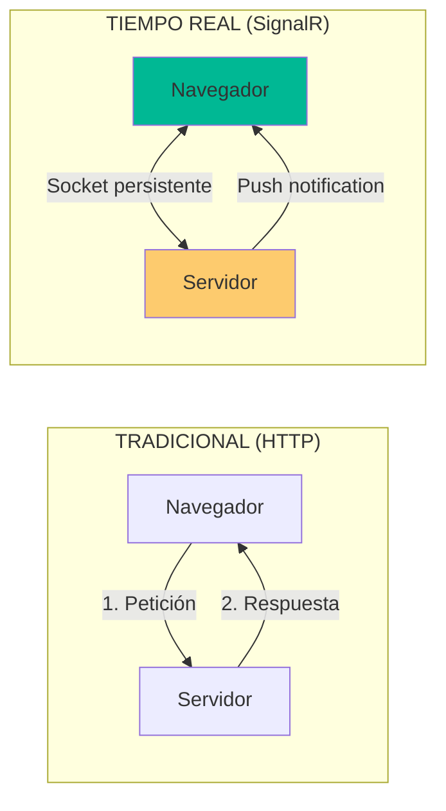
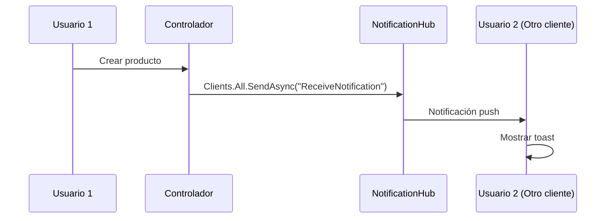

- [15. SignalR: Notificaciones en Tiempo Real](#15-signalr-notificaciones-en-tiempo-real)
  - [1. ¿Qué es SignalR?](#1-qué-es-signalr)
    - [1.1. Petición-Respuesta vs Push](#11-petición-respuesta-vs-push)
    - [1.2. Características](#12-características)
  - [2. Componentes de la Solución](#2-componentes-de-la-solución)
    - [2.1. El Hub (Servidor)](#21-el-hub-servidor)
    - [2.2. IHubContext (Desde Controladores)](#22-ihubcontext-desde-controladores)
    - [2.3. Cliente JavaScript](#23-cliente-javascript)
  - [3. Caso de Uso: Broadcast](#3-caso-de-uso-broadcast)
    - [3.1. Flujo Completo](#31-flujo-completo)
  - [4. SignalR vs Blazor](#4-signalr-vs-blazor)
    - [4.1. ¿Cuándo usar cada uno?](#41-cuándo-usar-cada-uno)


# 15. SignalR: Notificaciones en Tiempo Real
En esta sección, aprenderemos a implementar notificaciones en tiempo real utilizando SignalR en ASP.NET Core.

## 1. ¿Qué es SignalR?

SignalR permite comunicación **bidireccional permanente** entre servidor y cliente mediante WebSockets.

### 1.1. Petición-Respuesta vs Push



### 1.2. Características

| Aspecto       | Descripción                                  |
| ------------- | -------------------------------------------- |
| **Protocolo** | WebSockets (con fallback a SSE/Long Polling) |
| **Conexión**  | Persistente (no requiere reconnect)          |
| **Mensajes**  | Bidireccionales en tiempo real               |

---

## 2. Componentes de la Solución

### 2.1. El Hub (Servidor)

```csharp
public class NotificationHub : Hub
{
    public override async Task OnConnectedAsync()
    {
        await base.OnConnectedAsync();
        await Clients.Caller.SendAsync("ReceiveNotification", "¡Conectado!");
    }
}
```

### 2.2. IHubContext (Desde Controladores)

```csharp
public class ProductController : Controller
{
    private readonly IHubContext<NotificationHub> _hubContext;
    
    public ProductController(IHubContext<NotificationHub> hubContext)
    {
        _hubContext = hubContext;
    }
    
    public async Task<IActionResult> Create(ProductVM model)
    {
        await _productService.CreateAsync(model);
        
        // Broadcast a todos los clientes
        await _hubContext.Clients.All.SendAsync("ReceiveNotification", 
            $"¡Nuevo producto: {model.Nombre}!");
            
        return RedirectToAction("Index");
    }
}
```

### 2.3. Cliente JavaScript

```javascript
// notifications.js
const connection = new signalR.HubConnectionBuilder()
    .withUrl("/notifications")
    .build();

connection.on("ReceiveNotification", (message) => {
    showToast(message, "info");
});

connection.start();
```

---

## 3. Caso de Uso: Broadcast



### 3.1. Flujo Completo

| Paso | Acción                              |
| ---- | ----------------------------------- |
| 1    | Usuario publica producto            |
| 2    | Controlador guarda en BD            |
| 3    | IHubContext envía mensaje           |
| 4    | Hub distribuye a todos los clientes |
| 5    | JavaScript muestra toast            |

---

## 4. SignalR vs Blazor

| Criterio    | SignalR Puro            | Blazor Server         |
| ----------- | ----------------------- | --------------------- |
| **Uso**     | Notificaciones globales | Interfaz interactiva  |
| **Control** | Total (JS + C#)         | Solo C#               |
| **Ámbito**  | Toda la aplicación      | Componente específico |

### 4.1. ¿Cuándo usar cada uno?

| Tecnología  | Caso de uso                             |
| ----------- | --------------------------------------- |
| **SignalR** | Notificaciones, chats, alertas globales |
| **Blazor**  | Formularios interactivos, UI compleja   |

---

**Anterior Volumen**: [14. State Container](../14-Blazor-Component-Communication.md)  
**Próximo Volumen**: [16. Exception Handling](../16-Global-Exception-Handling.md)
