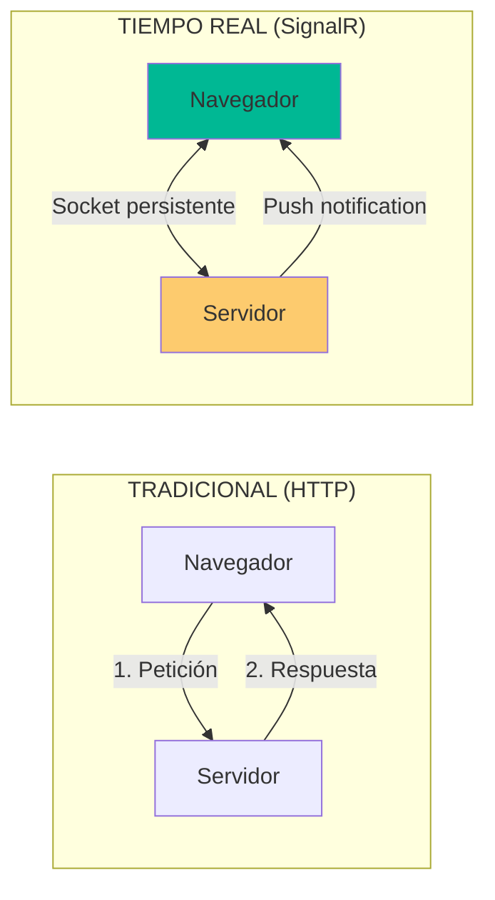

# 15. SignalR: Notificaciones en Tiempo Real

## Índice

[15. SignalR: Notificaciones en Tiempo Real](#15-signalr-notificaciones-en-tiempo-real)
  - [15.1. ¿Qué es SignalR?](#151-qué-es-signalr)
  - [15.2. Componentes de la Solución](#152-componentes-de-la-solución)
  - [15.3. Caso de Uso: Broadcast](#153-caso-de-uso-broadcast)
  - [15.4. SignalR vs Blazor](#154-signalr-vs-blazor)

---

## 15.1. ¿Qué es SignalR?

SignalR permite comunicación **bidireccional permanente** entre servidor y cliente mediante WebSockets.

### Petición-Respuesta vs Push



### Características

| Aspecto       | Descripción                                  |
| ------------- | -------------------------------------------- |
| **Protocolo** | WebSockets (con fallback a SSE/Long Polling) |
| **Conexión**  | Persistente (no requiere reconnect)          |
| **Mensajes**  | Bidireccionales en tiempo real               |

---

## 15.2. Componentes de la Solución

### El Hub (Servidor)

```csharp
public class NotificationHub : Hub
{
    public async Task SendMessage(string user, string message)
    {
        await Clients.All.SendAsync("ReceiveMessage", user, message);
    }
    
    public async Task JoinGroup(string groupName)
    {
        await Groups.AddToGroupAsync(Context.ConnectionId, groupName);
    }
    
    public async Task SendToGroup(string groupName, string message)
    {
        await Clients.Group(groupName).SendAsync("ReceiveMessage", message);
    }
}
```

### IHubContext (Desde Controladores)

```csharp
public class ProductController : Controller
{
    private readonly IHubContext<NotificationHub> _hubContext;

    public ProductController(IHubContext<NotificationHub> hubContext)
    {
        _hubContext = hubContext;
    }

    [HttpPost("{id}/review")]
    public async Task<IActionResult> AddReview(long id, ReviewDto dto)
    {
        // Guardar review
        await _reviewService.AddAsync(id, dto);
        
        // Notificar a todos los clientes
        await _hubContext.Clients.All.SendAsync("NewReview", id, dto);
        
        return Ok();
    }
}
```

### Cliente JavaScript

```javascript
// Conexión
const connection = new signalR.HubConnectionBuilder()
    .withUrl("/notificationHub")
    .build();

// Recibir mensajes
connection.on("ReceiveMessage", (user, message) => {
    console.log(`${user}: ${message}`);
});

// Iniciar conexión
connection.start()
    .then(() => console.log("Conectado a SignalR"))
    .catch(err => console.error(err));

// Enviar mensaje
document.getElementById("sendBtn").addEventListener("click", () => {
    connection.invoke("SendMessage", "User", "Hola Mundo");
});
```

---

## 15.3. Caso de Uso: Broadcast

### Notificación Global

```csharp
// Cuando se crea un nuevo pedido
await _hubContext.Clients.All.SendAsync("NewOrder", order.Id, order.Total);
```

### Notificación por Grupo

```csharp
// Unirse al grupo de un producto
await _hubContext.Groups.AddToGroupAsync(
    Context.ConnectionId, 
    $"product-{productId}"
);

// Notificar solo a usuarios interesados en el producto
await _hubContext.Clients.Group($"product-{productId}")
    .SendAsync("PriceChanged", productId, newPrice);
```

### Notificación a Usuario Específico

```csharp
// Por ConnectionId
await _hubContext.Clients.Client(connectionId)
    .SendAsync("PrivateMessage", message);

// Por User ID (requiere Identity)
await _hubContext.Clients.User(userId)
    .SendAsync("Notification", notification);
```

---

## 15.4. SignalR vs Blazor

| Aspecto             | SignalR                  | Blazor Server              |
| ------------------- | ----------------------- | -------------------------- |
| **Lógica**          | JavaScript + C#         | C# completo                |
| **Complejidad**     | Media                   | Alta                       |
| **Real-time**       | ✅ Nativo               | ✅ Nativo                  |
| **Binding**         | Manual                  | Automático                 |
| **Curva aprendizaje**| Baja                    | Media                      |

### ¿Cuándo usar cada uno?

| ✅ Usar SignalR cuando... | ✅ Usar Blazor cuando... |
| ---------------------- | ------------------------ |
| App existente (JavaScript) | Team conoce C#        |
| Solo notificaciones     | Lógica compleja UI      |
| Microservicio         | Components reutilizables |
| Rendimiento crítico    | SPA-like experience     |

---

## Resumen

| Concepto           | Descripción                                              |
| ------------------ | -------------------------------------------------------- |
| **Hub**            | Punto central de comunicación                            |
| **IHubContext**    | Acceso al hub desde controllers/servicios                |
| **Groups**         | Salas de comunicación                                    |
| **Clients**        | Todos, usuario específico, o grupo                      |

---

**Anterior**: [14. State Container](../14-Blazor-Comm.md)  
**Próximo**: [16. Manejo de Excepciones](../16-Exception-Handling.md)
