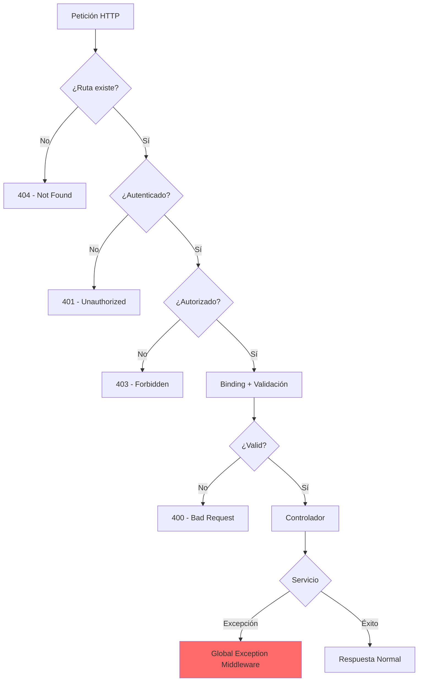

# 16. Gestión Global de Errores: El Middleware de Seguridad

## Índice

[16. Gestión Global de Errores: El Middleware de Seguridad](#16-gestión-global-de-errores-el-middleware-de-seguridad)
  - [16.1. ¿Qué es un Middleware de Excepciones?](#161-qué-es-un-middleware-de-excepciones)
  - [16.2. Por qué es mejor que el predeterminado](#162-por-qué-es-mejor-que-el-predeterminado)
  - [16.3. ¿Cuándo NO actúa el Middleware?](#163-cuándo-no-actúa-el-middlewares)
  - [16.4. Implementación en WalaDaw](#164-implementación-en-waladaw)
  - [16.5. Beneficios para el Alumno](#165-beneficios-para-el-alumno)

---

## 16.1. ¿Qué es un Middleware de Excepciones?

Es una pieza de código que se sitúa al principio del pipeline de .NET. Todas las peticiones pasan por él.

- Si la petición tiene éxito, no hace nada.
- Si cualquier componente posterior (Controlador, Servicio, Base de Datos) lanza un error, el Middleware lo captura en su bloque `catch`.

---

## 16.2. Por qué es mejor que el predeterminado

El `app.UseExceptionHandler` de .NET está orientado principalmente a páginas web (HTML). Sin embargo, WalaDaw es una aplicación **híbrida**:

- Tiene Vistas Razor.
- Tiene APIs JSON para AJAX y Favoritos.

Nuestro Middleware personalizado detecta el origen de la petición:

1. **Si es una API**: Devuelve un JSON estructurado con `success: false`. Esto evita que el JavaScript del navegador intente procesar un HTML de error y falle silenciosamente.
2. **Si es una Web**: Redirige a la vista de error amigable `/Error`.

---

## 16.3. ¿Cuándo NO actúa el Middleware?

| Escenario                          | Captura el Middleware? | Captura por...              |
| ---------------------------------- | ---------------------- | -------------------------- |
| Excepción en Controlador           | ✅ Sí                  | Middleware                 |
| Excepción en Servicio              | ✅ Sí                  | Middleware                 |
| Error de Base de Datos             | ✅ Sí                  | Middleware                 |
| 404 (Ruta no encontrada)          | ❌ No                  | Endpoint Middleware        |
| 401 (No autenticado)              | ❌ No                  | Authorization Middleware   |
| Error de sintaxis en JSON body    | ❌ No                  | ModelState (automático)    |
| Validación de modelo              | ❌ No                  | Controlador (ModelState)   |

### El Flujo Completo de Errores en WalaDaw



---

## 16.4. Implementación en WalaDaw

### La Clase Middleware

```csharp
public class GlobalExceptionMiddleware
{
    private readonly RequestDelegate _next;
    private readonly ILogger<GlobalExceptionMiddleware> _logger;

    public GlobalExceptionMiddleware(RequestDelegate next, ILogger<GlobalExceptionMiddleware> logger)
    {
        _next = next;
        _logger = logger;
    }

    public async Task InvokeAsync(HttpContext context)
    {
        try
        {
            await _next(context);
        }
        catch (Exception ex)
        {
            await HandleExceptionAsync(context, ex);
        }
    }

    private async Task HandleExceptionAsync(HttpContext context, Exception exception)
    {
        _logger.LogError(exception, "Ha ocurrido una excepción");

        context.Response.ContentType = "application/json";

        var response = context.Response;

        response.StatusCode = exception switch
        {
            AppException => (int)HttpStatusCode.BadRequest,
            UnauthorizedAccessException => (int)HttpStatusCode.Unauthorized,
            KeyNotFoundException => (int)HttpStatusCode.NotFound,
            _ => (int)HttpStatusCode.InternalServerError
        };

        var errorResponse = new
        {
            success = false,
            message = exception.Message,
            details = exception.StackTrace
        };

        await response.WriteAsync(JsonSerializer.Serialize(errorResponse));
    }
}
```

### Registro en el Pipeline

```csharp
// Program.cs
app.UseMiddleware<GlobalExceptionMiddleware>();

app.MapControllers();
app.MapRazorPages();
```

---

## 16.5. Beneficios para el Alumno

| Beneficio               | Descripción                                      |
| ---------------------- | ------------------------------------------------ |
| **Centralización**     | Un solo lugar para manejar todos los errores      |
| **Consistencia**       | Mismo formato de error para toda la aplicación   |
| **Logging automático** | Todos los errores quedan registrados              |
| **Debugging**         | Stack trace completo para investigar problemas   |
| **Seguridad**         | Evita exponer detalles de implementación         |

---

## Resumen

| Concepto           | Descripción                                              |
| ------------------ | -------------------------------------------------------- |
| **Middleware**     | Pieza de código en el pipeline HTTP                       |
| **Try-Catch**     | Bloque que captura excepciones                            |
| **400 Bad Request**| Error del cliente (validación, formato)                 |
| **500 Internal**  | Error del servidor (bug, excepción)                      |

---

**Anterior**: [15. SignalR](../15-SignalR.md)  
**Próximo**: [17. Authentication Identity](../17-Auth-Identity.md)
