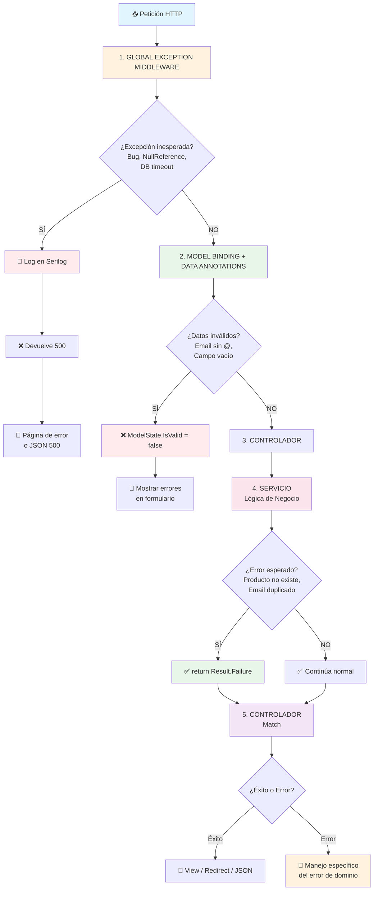
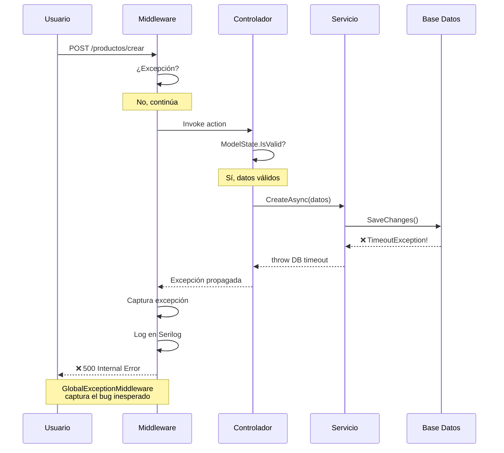

- [16. Gestión Global de Errores: El Middleware de Seguridad](#16-gestión-global-de-errores-el-middleware-de-seguridad)
  - [1. ¿Qué es un Middleware de Excepciones?](#1-qué-es-un-middleware-de-excepciones)
  - [2. Por qué es mejor que el predeterminado](#2-por-qué-es-mejor-que-el-predeterminado)
  - [3. ¿Cuándo NO actúa el Middleware? (La Pregunta del Millón)](#3-cuándo-no-actúa-el-middleware-la-pregunta-del-millón)
    - [El Flujo Completo de Errores en WalaDaw](#el-flujo-completo-de-errores-en-waladaw)
    - [Diagrama de Secuencia: Una Petición con Error](#diagrama-de-secuencia-una-petición-con-error)
    - [Resumen: ¿Quién Captura Qué?](#resumen-quién-captura-qué)
  - [4. Implementación en WalaDaw](#4-implementación-en-waladaw)
    - [La Clase Middleware (`TiendaDawWeb.Web/Middlewares/GlobalExceptionMiddleware.cs`)](#la-clase-middleware-tiendadawwebwebmiddlewaresglobalexceptionmiddlewarecs)
    - [Registro en el Pipeline (`Program.cs`)](#registro-en-el-pipeline-programcs)
  - [4. Beneficios para el Alumno](#4-beneficios-para-el-alumno)
  - [5. Conclusión](#5-conclusión)


# 16. Gestión Global de Errores: El Middleware de Seguridad

En esta sección aprendemos a construir una "red de seguridad" que captura cualquier fallo inesperado en nuestra aplicación, evitando que el usuario vea pantallas técnicas y asegurando que nosotros (los desarrolladores) tengamos un rastro claro del error.

---

## 1. ¿Qué es un Middleware de Excepciones?

Es una pieza de código que se sitúa al principio del pipeline de .NET. Todas las peticiones pasan por él.
- Si la petición tiene éxito, no hace nada.
- Si cualquier componente posterior (Controlador, Servicio, Base de Datos) lanza un error, el Middleware lo captura en su bloque `catch`.

---

## 2. Por qué es mejor que el predeterminado

El `app.UseExceptionHandler` de .NET está orientado principalmente a páginas web (HTML). Sin embargo, WalaDaw es una aplicación **híbrida**:
- Tiene Vistas Razor.
- Tiene APIs JSON para AJAX y Favoritos.

Nuestro Middleware personalizado detecta el origen de la petición:
1. **Si es una API**: Devuelve un JSON estructurado con `success: false`. Esto evita que el JavaScript del navegador intente procesar un HTML de error y falle silenciosamente.
2. **Si es una Web**: Redirige a la vista de error amigable `/Error`.

---

## 3. ¿Cuándo NO actúa el Middleware? (La Pregunta del Millón)

El **GlobalExceptionMiddleware** solo captura **excepciones inesperadas** (bugs/crashes). No captura:

| Tipo de error                                   | Capturado por | Ver documento                                                       |
| ----------------------------------------------- | ------------- | ------------------------------------------------------------------- |
| Validaciones de formulario (ej. email inválido) | ModelState    | [Vol. 07: Controladores y Models](07-Controllers-Models-Results.md) |
| Errores de dominio (ej. usuario no existe)      | Result<T,E>   | [Vol. 07: Controladores y Models](07-Controllers-Models-Results.md) |

### El Flujo Completo de Errores en WalaDaw



### Diagrama de Secuencia: Una Petición con Error



### Resumen: ¿Quién Captura Qué?

| Escenario                | Ejemplo                             | Capturado por                |
| ------------------------ | ----------------------------------- | ---------------------------- |
| Bug de programación      | `product.Name.Length` siendo `null` | GlobalExceptionMiddleware    |
| Timeout de base de datos | Conexión perdida                    | GlobalExceptionMiddleware    |
| Email sin formato        | `"hola"` en campo `[EmailAddress]`  | ModelState (DataAnnotations) |
| Campo requerido vacío    | `""` en `[Required]`                | ModelState (DataAnnotations) |
| Producto no existe       | ID 99999 inexistente                | Result<T,E> (servicio)       |
| Email ya registrado      | Usuario duplicado                   | Result<T,E> (servicio)       |
| Password débil           | Menos de 8 caracteres               | Result<T,E> (servicio)       |

---

## 4. Implementación en WalaDaw

### La Clase Middleware (`TiendaDawWeb.Web/Middlewares/GlobalExceptionMiddleware.cs`)
Utiliza un `try-catch` que envuelve al `RequestDelegate next`.

### Registro en el Pipeline (`Program.cs`)
```csharp
app.UseGlobalExceptionHandler(); // Debe ir al principio
```

---

## 4. Beneficios para el Alumno

-   **Limpieza de Código**: Ya no necesitas llenar tus controladores de bloques `try-catch` repetitivos. Si algo falla, el middleware se encarga.
-   **Observabilidad profesional**: Cada error no controlado se guarda automáticamente en **Serilog** con el mensaje, el stack trace y la ruta que falló.
-   **Robustez**: Garantiza que la aplicación nunca devuelva una "pantalla blanca" o un error 500 sin formato.

---

## 5. Conclusión

El manejo global de excepciones es una de las marcas de un desarrollador senior. Separa la lógica de negocio del manejo de desastres, resultando en un sistema más mantenible y fácil de depurar.
