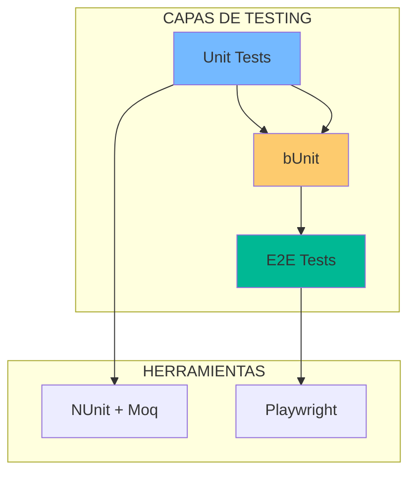
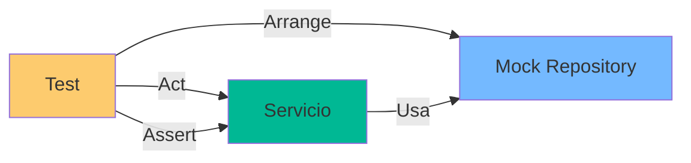

- [17. Unit Testing: NUnit, Moq y bUnit](#17-unit-testing-nunit-moq-y-bunit)
  - [1. Stack de Testing](#1-stack-de-testing)
    - [1.1. Arquitectura de Testing](#11-arquitectura-de-testing)
  - [2. Patrón AAA](#2-patrón-aaa)
    - [2.1. Estructura del Test](#21-estructura-del-test)
    - [2.2. Ejemplo Completo](#22-ejemplo-completo)
  - [3. Testing con Moq](#3-testing-con-moq)
    - [3.1. Crear Mocks](#31-crear-mocks)
    - [3.2. Configurar Comportamiento](#32-configurar-comportamiento)
    - [3.3. Flujo de Test con Mock](#33-flujo-de-test-con-mock)
  - [4. Testing Blazor con bUnit](#4-testing-blazor-con-bunit)
    - [4.1. Renderizar Componente](#41-renderizar-componente)
    - [4.2. Simular Interacciones](#42-simular-interacciones)
    - [4.3. Verificar Estados](#43-verificar-estados)


# 17. Unit Testing: NUnit, Moq y bUnit
En esta sección, aprenderemos a escribir pruebas unitarias efectivas para nuestra aplicación utilizando NUnit, Moq y bUnit.

## 1. Stack de Testing

Para garantizar calidad, usamos tres herramientas:

| Herramienta | Propósito                     |
| ----------- | ----------------------------- |
| **NUnit**   | Motor de ejecución de pruebas |
| **Moq**     | Crear mocks (dobles de test)  |
| **bUnit**   | Renderizar componentes Blazor |

### 1.1. Arquitectura de Testing



---

## 2. Patrón AAA

Todos los tests siguen la estructura **Arrange-Act-Assert**.

### 2.1. Estructura del Test

```csharp
[Test]
public void Should_Calculate_Cart_Total_Correctly()
{
    // Arrange: Preparar escenario
    var service = new CarritoService(_mockRepo.Object);
    var expected = 99.99m;
    
    // Act: Ejecutar lógica
    var total = service.GetTotal();
    
    // Assert: Verificar resultado
    Assert.That(total, Is.EqualTo(expected));
}
```

### 2.2. Ejemplo Completo

```csharp
[Test]
public async Task GetProductById_ReturnsProduct_WhenExists()
{
    // Arrange
    var productId = 1L;
    var mockRepo = new Mock<IProductRepository>();
    mockRepo.Setup(r => r.GetByIdAsync(productId))
            .ReturnsAsync(new Product { Id = productId, Nombre = "Test" });
    
    var service = new ProductService(mockRepo.Object);
    
    // Act
    var result = await service.GetByIdAsync(productId);
    
    // Assert
    Assert.That(result.IsSuccess, Is.True);
    Assert.That(result.Value.Nombre, Is.EqualTo("Test"));
}
```

---

## 3. Testing con Moq

### 3.1. Crear Mocks

```csharp
var mockRepo = new Mock<IProductRepository>();
var mockLogger = new Mock<ILogger<ProductService>>();
```

### 3.2. Configurar Comportamiento

```csharp
// Retorno de valor
mockRepo.Setup(r => r.GetByIdAsync(It.IsAny<long>()))
        .ReturnsAsync((long id) => new Product { Id = id });

// Verificar que se llamó
mockRepo.Verify(r => r.SaveChangesAsync(), Times.Once);
```

### 3.3. Flujo de Test con Mock



---

## 4. Testing Blazor con bUnit

### 4.1. Renderizar Componente

```csharp
using var ctx = new TestContext();

var cut = ctx.RenderComponent<RatingSection>(parameters => 
    parameters.Add(p => p.ProductId, 1)
);

Assert.Contains("Valoraciones", cut.Markup);
```

### 4.2. Simular Interacciones

```csharp
cut.Find("button").Click();

Assert.Contains("Gracias", cut.Markup);
```

### 4.3. Verificar Estados

```csharp
cut.FindAll(".rating-star").Should().HaveCount(5);
```

---

**Anterior Volumen**: [16. Exception Handling](../16-Global-Exception-Handling.md)  
**Próximo Volumen**: [18. Code Coverage](../18-Code-Coverage.md)
