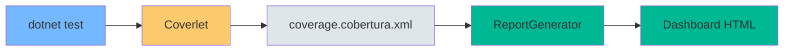
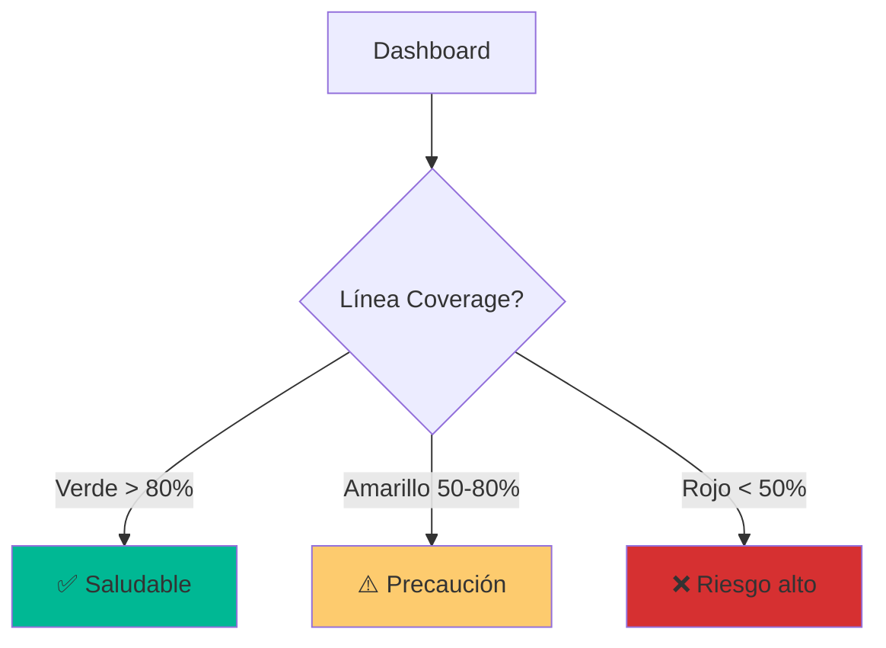

- [18. Code Coverage: Métricas de Calidad](#18-code-coverage-métricas-de-calidad)
  - [1. Herramientas de Cobertura](#1-herramientas-de-cobertura)
    - [1.1. Flujo de Cobertura](#11-flujo-de-cobertura)
  - [2. Generar Informe de Cobertura](#2-generar-informe-de-cobertura)
    - [2.1. Ejecutar Tests con Cobertura](#21-ejecutar-tests-con-cobertura)
    - [2.2. Generar Dashboard Visual](#22-generar-dashboard-visual)
  - [3. Interpretación del Dashboard](#3-interpretación-del-dashboard)
    - [3.1. Métricas Clave](#31-métricas-clave)
    - [3.2. Interpretación de Colores](#32-interpretación-de-colores)
  - [4. Visualización en el Código](#4-visualización-en-el-código)
    - [4.1. Colores en el Código](#41-colores-en-el-código)
    - [4.2. Ejemplo de Código Marcado](#42-ejemplo-de-código-marcado)
    - [4.3. Acción Correctiva](#43-acción-correctiva)


# 18. Code Coverage: Métricas de Calidad
En esta sección, aprenderemos a medir y analizar la cobertura de código en nuestros proyectos .NET utilizando herramientas como Coverlet y ReportGenerator.

## 1. Herramientas de Cobertura

Para medir la efectividad de tests, usamos:

| Herramienta         | Propósito                        |
| ------------------- | -------------------------------- |
| **Coverlet**        | Recolector de datos de cobertura |
| **ReportGenerator** | Genera dashboard HTML            |

### 1.1. Flujo de Cobertura



---

## 2. Generar Informe de Cobertura

### 2.1. Ejecutar Tests con Cobertura

```bash
dotnet test --collect:"XPlat Code Coverage"
```

Esto genera archivos `coverage.cobertura.xml` en `TestResults/`.

### 2.2. Generar Dashboard Visual

```bash
reportgenerator -reports:"**/coverage.cobertura.xml" \
    -targetdir:"CoverageReport" \
    -reporttypes:Html
```

---

## 3. Interpretación del Dashboard

### 3.1. Métricas Clave

| Métrica             | Descripción                   | Umbral |
| ------------------- | ----------------------------- | ------ |
| **Line Coverage**   | % de líneas ejecutadas        | > 80%  |
| **Branch Coverage** | % de ramas (if/else) probadas | > 70%  |
| **Complexity**      | Complejidad del método        | < 10   |

### 3.2. Interpretación de Colores



---

## 4. Visualización en el Código

### 4.1. Colores en el Código

| Color       | Significado                            |
| ----------- | -------------------------------------- |
| **Verde**   | Código probado por tests               |
| **Rojo**    | Código no ejecutado (ciego)            |
| **Naranja** | Rama parcial (solo `if` o solo `else`) |

### 4.2. Ejemplo de Código Marcado

```csharp
public decimal Calculate(decimal precio)
{
    if (precio > 1000)        // ✅ Verde (probado)
        return precio * 0.9m;  // ✅ Verde (probado)
    else                      // ⚠️ Naranja (else no probado)
        return precio;         // ⚠️ Naranja (else no probado)
}
```

### 4.3. Acción Correctiva

```csharp
// Si una rama no está probada, añadir test:
// [Test] public void Calculate_AppliesDiscount()
// [Test] public void Calculate_NoDiscountForSmallAmount()
```

---

**Anterior Volumen**: [17. Unit Testing](../17-Unit-Testing-NUnit-bUnit.md)  
**Próximo Volumen**: [19. E2E Testing Playwright](../19-E2E-Testing-Playwright.md)
