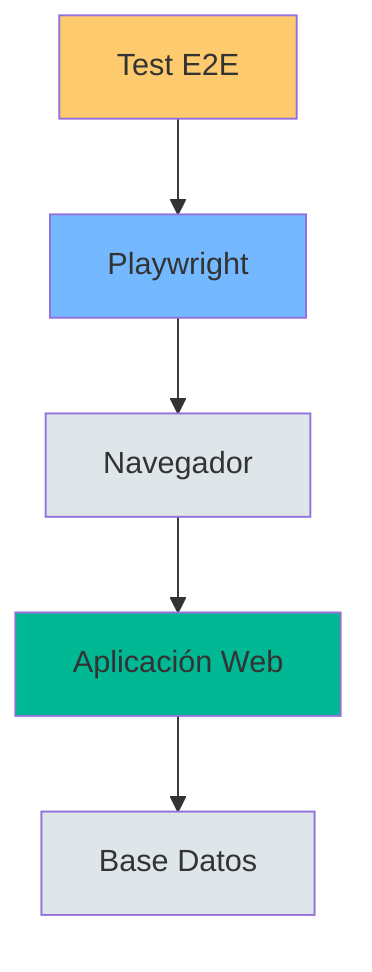

- [19. E2E Testing con Playwright](#19-e2e-testing-con-playwright)
  - [1. Configuración de Playwright](#1-configuración-de-playwright)
    - [1.1. Instalación](#11-instalación)
    - [1.2. Configuración del Contexto](#12-configuración-del-contexto)
    - [1.3. Arquitectura de Test E2E](#13-arquitectura-de-test-e2e)
  - [2. Selectores y Locators](#2-selectores-y-locators)
    - [2.1. Tipos de Selectores (Orden de Preferencia)](#21-tipos-de-selectores-orden-de-preferencia)
    - [2.2. Ejemplo de Test](#22-ejemplo-de-test)
  - [3. Patrón Page Object](#3-patrón-page-object)
    - [3.1. Estructura Page Object](#31-estructura-page-object)
    - [3.2. Uso del Page Object](#32-uso-del-page-object)
  - [4. Testeando Blazor Server](#4-testeando-blazor-server)
    - [4.1. Espera de Conexión](#41-espera-de-conexión)
    - [4.2. Test de Componente Blazor](#42-test-de-componente-blazor)


# 19. E2E Testing con Playwright
En esta sección, aprenderemos a realizar pruebas end-to-end (E2E) utilizando Playwright para garantizar que nuestra aplicación web funcione correctamente desde la perspectiva del usuario final.

---

## 1. Configuración de Playwright

Playwright controla el navegador desde fuera, sin inyectar código en la app.

### 1.1. Instalación

```bash
dotnet build
npx playwright install chromium --with-deps
```

### 1.2. Configuración del Contexto

```csharp
public override BrowserNewContextOptions ContextOptions()
{
    return new BrowserNewContextOptions
    {
        Locale = "es-ES",              // Formato de fechas y moneda
        TimezoneId = "Europe/Madrid",  // Horas sincronizadas
        ViewportSize = new() { Width = 1280, Height = 720 },
        AcceptDownloads = true
    };
}
```

### 1.3. Arquitectura de Test E2E



---

## 2. Selectores y Locators

### 2.1. Tipos de Selectores (Orden de Preferencia)

| Selector           | Uso                       | Ejemplo                                              |
| ------------------ | ------------------------- | ---------------------------------------------------- |
| `GetByRole`        | Elementos por función     | `GetByRole(AriaRole.Button, new { Name = "Login" })` |
| `GetByPlaceholder` | Campos de formulario      | `GetByPlaceholder("tu@email.com")`                   |
| `GetByLabel`       | Labels asociados          | `GetByLabel("Email")`                                |
| `GetByText`        | Texto visible             | `GetByText("Bienvenido")`                            |
| `GetByTestId`      | data-testid personalizado | `GetByTestId("submit-button")`                       |

### 2.2. Ejemplo de Test

```csharp
[Test]
public async Task Login_WithValidCredentials_ShouldSucceed()
{
    // Arrange
    await Page.GotoAsync("/Auth/Login");
    
    // Act
    await Page.GetByPlaceholder("tu@email.com").FillAsync("admin@waladaw.com");
    await Page.GetByPlaceholder("••••••••").FillAsync("admin");
    await Page.GetByRole(AriaRole.Button, new { Name = "Iniciar Sesión" }).ClickAsync();
    
    // Assert
    await Expect(Page.Locator(".navbar")).ToContainTextAsync("Admin");
}
```

---

## 3. Patrón Page Object

### 3.1. Estructura Page Object

```csharp
public class LoginPage
{
    private readonly IPage _page;
    
    public LoginPage(IPage page) => _page = page;
    
    public ILocator EmailInput => _page.GetByPlaceholder("tu@email.com");
    public ILocator PasswordInput => _page.GetByPlaceholder("••••••••");
    public ILocator SubmitButton => _page.GetByRole(AriaRole.Button, new { Name = "Iniciar Sesión" });
    
    public async Task LoginAsync(string email, string password)
    {
        await EmailInput.FillAsync(email);
        await PasswordInput.FillAsync(password);
        await SubmitButton.ClickAsync();
    }
}
```

### 3.2. Uso del Page Object

```csharp
[Test]
public async Task LoginTest()
{
    var loginPage = new LoginPage(Page);
    await loginPage.LoginAsync("admin@waladaw.com", "admin");
    
    await Expect(Page.Locator(".navbar")).ToContainTextAsync("Admin");
}
```

---

## 4. Testeando Blazor Server

### 4.1. Espera de Conexión

```csharp
[SetUp]
public async Task Setup()
{
    await Page.GotoAsync("/Product/Details/1");
    await Page.WaitForLoadStateAsync(LoadState.NetworkIdle);
}
```

### 4.2. Test de Componente Blazor

```csharp
[Test]
public async Task RatingComponent_ShouldUpdateAfterVote()
{
    // El componente RatingSection está en la página
    var ratingSection = Page.Locator("rating-section");
    await Expect(ratingSection).ToBeVisibleAsync();
    
    // Clic en estrellas
    await Page.Locator(".bi-star").Nth(3).ClickAsync();
    
    // Verificar actualización
    await Expect(Page.Locator(".toast-body")).ToContainTextAsync("Gracias");
}
```

---

**Anterior Volumen**: [18. Code Coverage](../18-Code-Coverage.md)  
**Próximo Volumen**: [20. InMemory Cache](../20-Optimizacion-InMemoryCache.md)
