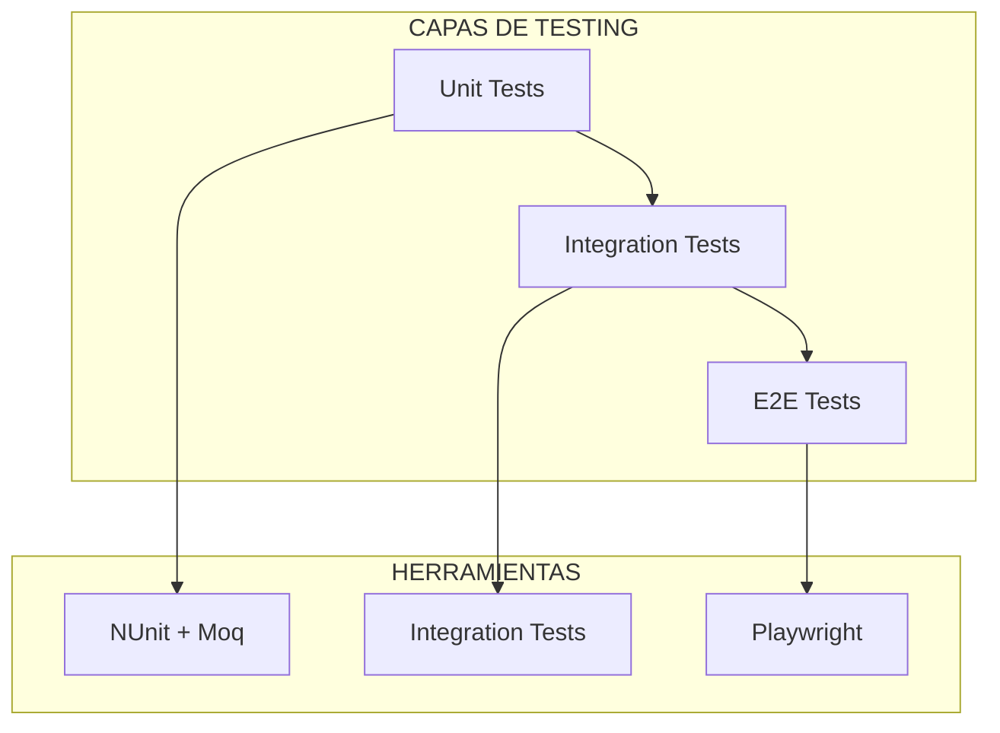
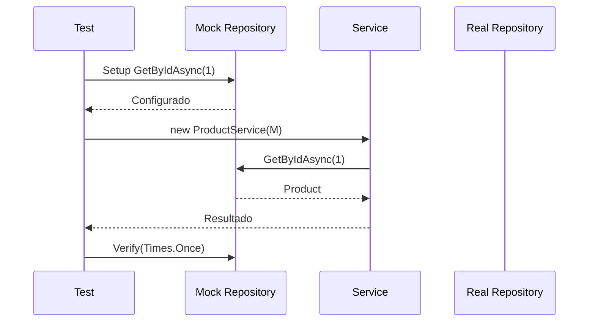

# 19. Unit Testing: NUnit, Moq y bUnit

## Índice

[19. Unit Testing: NUnit, Moq y bUnit](#19-unit-testing-nunit-moq-y-bunit)
  - [19.1. Stack de Testing](#191-stack-de-testing)
  - [19.2. Patrón AAA](#192-patrón-aaa)
  - [19.3. Testing con Moq](#193-testing-con-moq)
  - [19.4. Testing Blazor con bUnit](#194-testing-blazor-con-bunit)

---

## 19.1. Stack de Testing

Para garantizar calidad, usamos tres herramientas:

| Herramienta | Propósito                     |
| ----------- | ----------------------------- |
| **NUnit**   | Motor de ejecución de pruebas |
| **Moq**     | Crear mocks (dobles de test)  |
| **bUnit**   | Renderizar componentes Blazor |

### Arquitectura de Testing



---

## 19.2. Patrón AAA

### Estructura del Test

```csharp
[Test]
public void CalculateTotal_WithValidItems_ReturnsCorrectTotal()
{
    // Arrange: Preparar
    var cart = new ShoppingCart();
    cart.AddItem(new Product { Price = 10m });
    cart.AddItem(new Product { Price = 20m });
    
    // Act: Ejecutar
    var total = cart.CalculateTotal();
    
    // Assert: Verificar
    Assert.That(total, Is.EqualTo(30m));
}
```

### Ejemplo Completo

```csharp
[TestFixture]
public class ProductServiceTests
{
    private ProductService _service;
    private Mock<IProductRepository> _mockRepository;
    private Mock<ILogger<ProductService>> _mockLogger;

    [SetUp]
    public void Setup()
    {
        _mockRepository = new Mock<IProductRepository>();
        _mockLogger = new Mock<ILogger<ProductService>>();
        _service = new ProductService(_mockRepository.Object, _mockLogger.Object);
    }

    [Test]
    public async Task GetByIdAsync_ExistingProduct_ReturnsProduct()
    {
        // Arrange
        var productId = 1L;
        var expectedProduct = new Product { Id = productId, Nombre = "Test" };
        
        _mockRepository.Setup(r => r.GetByIdAsync(productId))
            .ReturnsAsync(expectedProduct);

        // Act
        var result = await _service.GetByIdAsync(productId);

        // Assert
        Assert.That(result, Is.Not.Null);
        Assert.That(result.Id, Is.EqualTo(productId));
        Assert.That(result.Nombre, Is.EqualTo("Test"));
    }

    [Test]
    public async Task GetByIdAsync_NonExistingProduct_ReturnsNull()
    {
        // Arrange
        var productId = 999L;
        _mockRepository.Setup(r => r.GetByIdAsync(productId))
            .ReturnsAsync((Product?)null);

        // Act
        var result = await _service.GetByIdAsync(productId);

        // Assert
        Assert.That(result, Is.Null);
    }
}
```

---

## 19.3. Testing con Moq

### Crear Mocks

```csharp
// Mock básico
var mockRepository = new Mock<IProductRepository>();

// Mock con configuración
var mockLogger = new Mock<ILogger<ProductService>>();

// Obtener objeto real
var repository = mockRepository.Object;
```

### Configurar Comportamiento

```csharp
// Configurar retorno
mockRepository.Setup(r => r.GetByIdAsync(It.IsAny<long>()))
    .ReturnsAsync((Product?)null);

// Configurar con parámetros específicos
mockRepository.Setup(r => r.GetByIdAsync(1L))
    .ReturnsAsync(new Product { Id = 1L, Nombre = "Test" });

// Verificar que se llamó
mockRepository.Verify(r => r.SaveChangesAsync(), Times.Once);

// Verificar que NO se llamó
mockRepository.Verify(r => r.DeleteAsync(It.IsAny<long>()), Times.Never);
```

### Flujo de Test con Mock



---

## 19.4. Testing Blazor con bUnit

### Renderizar Componente

```csharp
using bUnit;

public class CounterTests
{
    [Fact]
    public void Counter_Increments_WhenClicked()
    {
        // Arrange
        using var ctx = new TestContext();
        
        // Act
        var cut = ctx.Render(@<Counter />);
        
        // Assert
        cut.Find("p.current-count").MarkupMatches("<p>Current count: 0</p>");
        
        // Click
        cut.Find("button").Click();
        
        // Assert
        cut.Find("p.current-count").MarkupMatches("<p>Current count: 1</p>");
    }
}
```

### Simular Interacciones

```csharp
[Fact]
public void ProductList_FiltersBySearchTerm()
{
    using var ctx = new TestContext();
    
    // Mock service
    var mockService = ctx.Services.AddMock<IPageProductService>();
    mockService.Setup(p => p.GetProductsAsync(It.IsAny<string>()))
        .ReturnsAsync(new List<ProductDto> { new ProductDto { Nombre = "Test" } });
    
    // Render
    var cut = ctx.Render(@<ProductList SearchTerm="Test" />);
    
    // Verify
    cut.Find(".product-card").MarkupMatches(
        @<div class="product-card">Test</div>
    );
}
```

### Verificar Estados

```csharp
[Fact]
public async Task RatingComponent_ShowsAverageRating()
{
    using var ctx = new TestContext();
    
    // Setup
    var ratings = new List<RatingDto>
    {
        new RatingDto { Value = 5 },
        new RatingDto { Value = 3 }
    };
    
    // Render
    var cut = ctx.Render(@<RatingSummary ProductId="1" />);
    
    // Initial state
    Assert.Contains("Cargando", cut.Markup);
    
    // After async load
    cut.WaitForState(() => !cut.Markup.Contains("Cargando"));
    
    // Verify
    Assert.Contains("4.0", cut.Markup);
}
```

---

## Resumen

| Herramienta | Uso                                              |
| ----------- | ------------------------------------------------ |
| **NUnit**   | Atributos [Test], [SetUp], [TestFixture]        |
| **Moq**     | Mock<T>, Setup, Verify                          |
| **bUnit**   | TestContext, Render, Find, Click                 |

---

**Anterior**: [18. Authentication Cookies](../18-Auth-Cookies.md)  
**Próximo**: [20. Code Coverage](../20-Code-Coverage.md)
