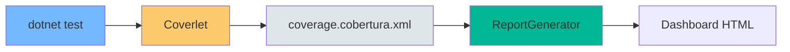

# 20. Code Coverage: Métricas de Calidad

## Índice

[20. Code Coverage: Métricas de Calidad](#20-code-coverage-métricas-de-calidad)
  - [20.1. Herramientas de Cobertura](#201-herramientas-de-cobertura)
  - [20.2. Generar Informe de Cobertura](#202-generar-informe-de-cobertura)
  - [20.3. Interpretación del Dashboard](#203-interpretación-del-dashboard)
  - [20.4. Visualización en el Código](#204-visualización-en-el-código)

---

## 20.1. Herramientas de Cobertura

Para medir la efectividad de tests, usamos:

| Herramienta         | Propósito                        |
| ------------------- | -------------------------------- |
| **Coverlet**        | Recolector de datos de cobertura |
| **ReportGenerator** | Genera dashboard HTML            |

### Flujo de Cobertura



---

## 20.2. Generar Informe de Cobertura

### Instalar Herramientas

```bash
# Coverlet (ya incluido en NUnit)
dotnet add package Coverlet.MSBuild

# ReportGenerator
dotnet tool install -g dotnet-reportgenerator-globaltool
```

### Ejecutar Tests con Cobertura

```bash
# Con cobertura
dotnet test --collect:"XPlat Code Coverage"

# Con cobertura y threshold
dotnet test --collect:"XPlat Code Coverage" \
    /p:Threshold=80 \
    /p:ThresholdMode=Exclusive
```

### Generar Dashboard

```bash
# Generar reporte HTML
reportgenerator \
    -reports:./TestResults/**/coverage.cobertura.xml \
    -targetdir:./coverage-report \
    -reporttypes:Html
```

### Configurar en YAML

```yaml
- task: PublishBuildArtifacts@1
  inputs:
    pathToPublish: 'coverage-report'
    artifactName: 'CodeCoverage'
```

---

## 20.3. Interpretación del Dashboard

### Métricas Clave

| Métrica              | Descripción                              | Objetivo      |
| ------------------- | --------------------------------------- | ------------ |
| **Line Coverage**   | Porcentage de líneas ejecutadas          | ≥ 80%        |
| **Branch Coverage** | Porcentage de ramas (if/else) cubiertas | ≥ 80%        |
| **Method Coverage** | Porcentage de métodos llamados          | ≥ 80%        |
| **Class Coverage**  | Porcentage de clases probadas           | ≥ 90%        |

### Interpretación de Colores

| Color      | Significado                              |
| ---------- | --------------------------------------- |
| 🟢 Verde   | Código ejecutado por tests             |
| 🔴 Rojo    | Código no ejecutado (sin coverage)      |
| 🟡 Amarillo | Rama no cubierta (if sin else)         |

---

## 20.4. Visualización en el Código

### Colores en el Código

```csharp
🟢 public decimal CalculateTotal()  // Probado
{
    var subtotal = _items.Sum(i => i.Price);  // 🟢 Probado
    var discount = subtotal > 100 ? 10 : 0;    // 🟡 Falta else
    
    return subtotal - discount;
}

🔴 public decimal CalculateTax()  // ❌ Sin tests
{
    return 0.21m;  // ❌ No ejecutado
}
```

### Ejemplo de Código Marcado

```csharp
🟢 [Test]
🟢 public void CalculateDiscount_WithHighValue_ReturnsDiscount()
{
    // Arrange
    var calculator = new DiscountCalculator();
    
    // Act
    var discount = calculator.CalculateDiscount(150m);
    
    // Assert
    Assert.That(discount, Is.EqualTo(10m));
}

🔴 [Test]
🔴 public void CalculateDiscount_WithLowValue_ReturnsZero()
{
    // ❌ Este test no existe o está comentado
}
```

### Acción Correctiva

| Situación                    | Acción                                      |
| --------------------------- | ------------------------------------------ |
| Código rojo (no probado)    | Escribir test que lo ejecute              |
| Rama amarilla (if sin else) | Escribir test para el caso faltante       |
| Coverage < 80%              | Aumentar tests o marcar como excepciones   |

---

## Resumen

| Herramienta         | Descripción                                              |
| ------------------ | ------------------------------------------------------- |
| **Coverlet**       | Recoge datos de coverage durante tests                  |
| **ReportGenerator** | Genera reporte visual HTML                             |
| **Line Coverage**  | Líneas de código ejecutadas por tests                  |
| **Branch Coverage** | Ramas condicionales cubiertas                          |

---

**Anterior**: [19. Unit Testing](../19-Unit-Testing.md)  
**Próximo**: [21. E2E Testing](../21-E2E-Testing.md)
