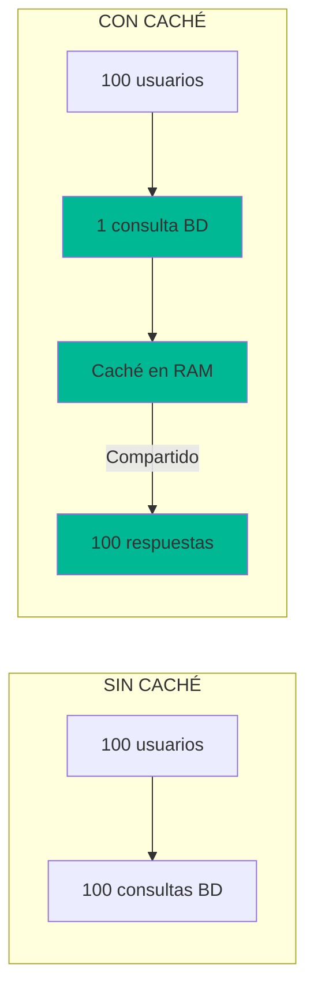
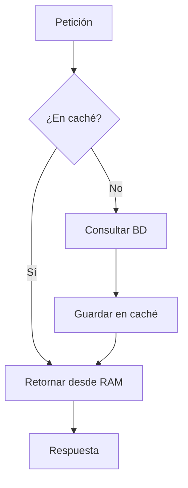

- [20. InMemoryCache: Optimización de Rendimiento](#20-inmemorycache-optimización-de-rendimiento)
  - [1. ¿Por qué cachear?](#1-por-qué-cachear)
    - [1.1. Sin Caché vs Con Caché](#11-sin-caché-vs-con-caché)
  - [2. Implementación del Patrón Cache-Aside](#2-implementación-del-patrón-cache-aside)
    - [2.1. Registro del Servicio](#21-registro-del-servicio)
    - [2.2. Uso en Servicio](#22-uso-en-servicio)
    - [2.3. Flujo Cache-Aside](#23-flujo-cache-aside)
  - [3. Invalidación de Caché](#3-invalidación-de-caché)
    - [3.1. Invalidación Manual](#31-invalidación-manual)
    - [3.2. Patrón Cache-Invalidation](#32-patrón-cache-invalidation)
  - [4. Consideraciones de Rendimiento](#4-consideraciones-de-rendimiento)
    - [4.1. Sliding vs Absolute Expiration](#41-sliding-vs-absolute-expiration)
    - [4.2. Tamaño de Caché](#42-tamaño-de-caché)


# 20. InMemoryCache: Optimización de Rendimiento
En esta sección, aprenderemos a implementar una caché en memoria para mejorar el rendimiento de nuestras aplicaciones ASP.NET Core mediante el patrón Cache-Aside.

## 1. ¿Por qué cachear?

Los servicios consultan frecuentemente datos que **cambian poco**:

| Datos | Frecuencia de cambio | Vale la pena cachear? |
|-------|----------------------|----------------------|
| Catálogo productos | Baja | ✅ Sí |
| Detalles producto | Baja | ✅ Sí |
| Valoraciones | Media | ⚠️ Depende |
| Carrito usuario | Alta | ❌ No |

### 1.1. Sin Caché vs Con Caché



---

## 2. Implementación del Patrón Cache-Aside

### 2.1. Registro del Servicio

```csharp
builder.Services.AddMemoryCache();
```

### 2.2. Uso en Servicio

```csharp
public class ProductService : IProductService
{
    private const string ProductsCacheKey = "all_products";
    private readonly IMemoryCache _cache;
    
    public ProductService(ApplicationDbContext context, IMemoryCache cache)
    {
        _cache = cache;
    }
    
    public async Task<Result<IEnumerable<Product>, DomainError>> GetAllAsync()
    {
        // 1. Buscar en caché
        if (_cache.TryGetValue<IEnumerable<Product>>(ProductsCacheKey, out var cached))
        {
            return Result.Success(cached!);
        }
        
        // 2. Si no está, consultar BD
        var products = await _context.Products.ToListAsync();
        
        // 3. Guardar en caché (30 minutos)
        _cache.Set(ProductsCacheKey, products, TimeSpan.FromMinutes(30));
        
        return Result.Success(products);
    }
}
```

### 2.3. Flujo Cache-Aside



---

## 3. Invalidación de Caché

### 3.1. Invalidación Manual

```csharp
public async Task<Result<Product, DomainError>> UpdateAsync(Product product)
{
    // Actualizar en BD
    await _context.SaveChangesAsync();
    
    // Invalidar caché
    _cache.Remove(ProductsCacheKey);
    _cache.Remove($"product_{product.Id}");
    
    return Result.Success(product);
}
```

### 3.2. Patrón Cache-Invalidation


---

## 4. Consideraciones de Rendimiento

### 4.1. Sliding vs Absolute Expiration

| Tipo | Uso |
|------|-----|
| **Sliding** | Se renueva si se accede (datos frecuentemente usados) |
| **Absolute** | Expira a tiempo fijo (datos que caducan) |

```csharp
// Sliding: se renueva en cada acceso, máximo 30 min
_cache.Set(key, data, new MemoryCacheEntryOptions
{
    SlidingExpiration = TimeSpan.FromMinutes(30)
});

// Absolute: expira a los 60 min exactos
_cache.Set(key, data, TimeSpan.FromMinutes(60));
```

### 4.2. Tamaño de Caché

```csharp
// Limitar tamaño de caché
_cache.Set(key, data, new MemoryCacheEntryOptions
{
    Size = 1  // Cada entrada cuenta como 1
});
```

---

**Anterior Volumen**: [19. E2E Testing Playwright](../19-E2E-Testing-Playwright.md)  
**Próximo Volumen**: [21. Output Cache](../21-OutputCache-Performance.md)
