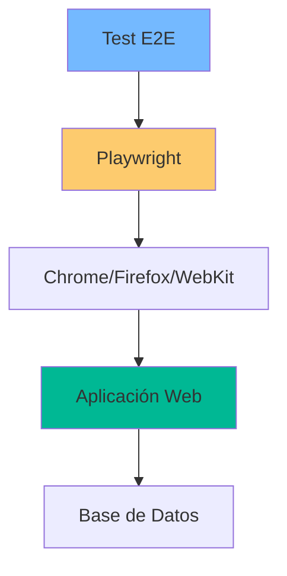

# 21. E2E Testing con Playwright

## Índice

[21. E2E Testing con Playwright](#21-e2e-testing-con-playwright)
  - [21.1. Configuración de Playwright](#211-configuración-de-playwright)
  - [21.2. Selectores y Locators](#212-selectores-y-locators)
  - [21.3. Patrón Page Object](#213-patrón-page-object)
  - [21.4. Testeando Blazor Server](#214-testeando-blazor-server)

---

## 21.1. Configuración de Playwright

Playwright controla el navegador desde fuera, sin inyectar código en la app.

### Instalación

```bash
dotnet build
npx playwright install chromium --with-deps
```

### Configuración del Contexto

```csharp
public override BrowserNewContextOptions ContextOptions()
{
    return new BrowserNewContextOptions
    {
        Locale = "es-ES",              // Formato de fechas y moneda
        IgnoreHTTPSErrors = true,      // Para desarrollo
        BaseURL = "http://localhost:5000",
        ScreenSize = new ViewportSize { Width = 1280, Height = 720 }
    };
}

public override async Task InitializeAsync()
{
    await Playwright.EnsureChromiumInstalledAsync();
}
```

### Arquitectura de Test E2E



---

## 21.2. Selectores y Locators

### Tipos de Selectores (Orden de Preferencia)

| Prioridad | Selector              | Ejemplo                          | Cuándo usar          |
| --------- | -------------------- | ------------------------------- | -------------------- |
| 1         | `data-testid`       | `[data-testid="add-button"]`   | ✅ Recomendado        |
| 2         | `id`                | `#login-button`                | Elementos únicos     |
| 3         | `role`              | `button[role="submit"]`        | Accesibilidad        |
| 4         | `text`              | `text="Iniciar Sesión"`        | Contenido visible    |
| 5         | `css`               | `.btn-primary`                 | Último recurso       |

### Ejemplo de Test

```csharp
[TestFixture]
public class LoginTests : PlaywrightTest
{
    [Test]
    public async Task Login_WithValidCredentials_RedirectsToHome()
    {
        // Arrange
        var page = Context.NewPageAsync();
        
        // Act
        await Page.GotoAsync("/Account/Login");
        await Page.FillAsync("[data-testid='email']", "test@test.com");
        await Page.FillAsync("[data-testid='password']", "password123");
        await Page.ClickAsync("[data-testid='login-button']");
        
        // Assert
        await Expect(Page).ToHaveURLAsync(new Regex(".*/Home$"));
        await Expect(Page.Locator("[data-testid='user-name']"))
            .ToHaveTextAsync("test@test.com");
    }

    [Test]
    public async Task Login_WithInvalidCredentials_ShowsError()
    {
        // Arrange
        await Page.GotoAsync("/Account/Login");
        
        // Act
        await Page.FillAsync("[data-testid='email']", "wrong@test.com");
        await Page.FillAsync("[data-testid='password']", "wrongpassword");
        await Page.ClickAsync("[data-testid='login-button']");
        
        // Assert
        var errorLocator = Page.Locator("[data-testid='error-message']");
        await Expect(errorLocator).ToBeVisibleAsync();
        await Expect(errorLocator).ToHaveTextAsync("Credenciales incorrectas");
    }
}
```

---

## 21.3. Patrón Page Object

### Estructura Page Object

```csharp
public class LoginPage
{
    private readonly IPage _page;
    private readonly string _baseUrl;

    public LoginPage(IPage page, string baseUrl)
    {
        _page = page;
        _baseUrl = baseUrl;
    }

    private ILocator EmailInput => _page.Locator("[data-testid='email']");
    private ILocator PasswordInput => _page.Locator("[data-testid='password']");
    private ILocator LoginButton => _page.Locator("[data-testid='login-button']");
    private ILocator ErrorMessage => _page.Locator("[data-testid='error-message']");
    private ILocator UserName => _page.Locator("[data-testid='user-name']");

    public async Task OpenAsync()
    {
        await _page.GotoAsync($"{_baseUrl}/Account/Login");
        await _page.WaitForLoadStateAsync(LoadState.NetworkIdle);
    }

    public async Task LoginAsync(string email, string password)
    {
        await EmailInput.FillAsync(email);
        await PasswordInput.FillAsync(password);
        await LoginButton.ClickAsync();
    }

    public async Task<bool> IsErrorVisibleAsync(string expectedMessage)
    {
        await Expect(ErrorMessage).ToBeVisibleAsync();
        return await ErrorMessage.TextContentAsync() == expectedMessage;
    }

    public async Task<string> GetUserNameAsync()
    {
        await Expect(UserName).ToBeVisibleAsync();
        return await UserName.TextContentAsync();
    }
}
```

### Uso del Page Object

```csharp
[Test]
public async Task Login_UsingPageObject_Succeeds()
{
    // Arrange
    var loginPage = new LoginPage(Page, BaseURL);
    
    // Act
    await loginPage.OpenAsync();
    await loginPage.LoginAsync("test@test.com", "password123");
    
    // Assert
    var userName = await loginPage.GetUserNameAsync();
    Assert.That(userName, Is.EqualTo("test@test.com"));
}
```

---

## 21.4. Testeando Blazor Server

### Espera de Conexión

```csharp
[Test]
public async Task BlazorComponent_RendersAfterConnection()
{
    // Arrange
    await Page.GotoAsync("/products");
    
    // Act - Esperar a que Blazor establezca conexión
    await Page.WaitForFunctionAsync("() => window.Blazor");

    // Assert - Verificar que el componente está renderizado
    var productCards = Page.Locator(".product-card");
    await Expect(productCards.First()).ToBeVisibleAsync();
}
```

### Test de Componente Blazor

```csharp
[Test]
public async Task RatingComponent_ShowsUpdatedValue()
{
    // Arrange
    await Page.GotoAsync("/products/1");
    
    // Act - Esperar conexión Blazor
    await Page.WaitForFunctionAsync("() => window.Blazor");
    
    // Interactuar con el componente
    var starButtons = Page.Locator(".rating-star button");
    await starButtons.Nth(4).ClickAsync();  // 5 estrellas
    
    // Assert - Verificar actualización
    var averageRating = Page.Locator(".average-rating");
    await Expect(averageRating).ToHaveTextAsync("5.0");
}
```

---

## Resumen

| Concepto           | Descripción                                              |
| ------------------ | -------------------------------------------------------- |
| **Playwright**     | Framework de automatización de navegadores               |
| **Page Object**    | Patron para encapsular páginas                          |
| **Locators**       | Selectores para encontrar elementos                    |
| **Assertions**     | Verificaciones con Expect                               |

---

**Anterior**: [20. Code Coverage](../20-Code-Coverage.md)  
**Próximo**: [22. InMemory Cache](../22-InMemoryCache.md)
