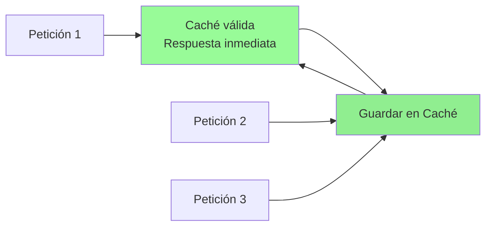
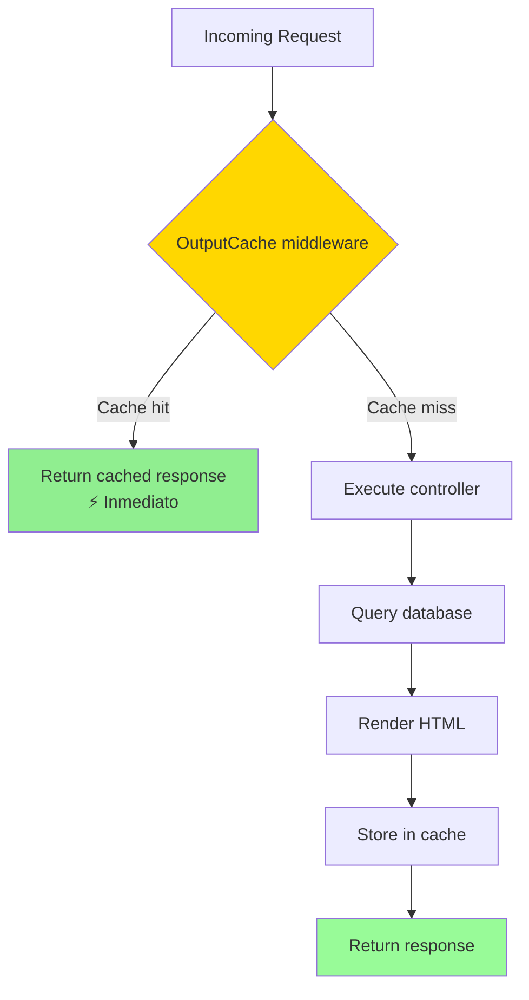
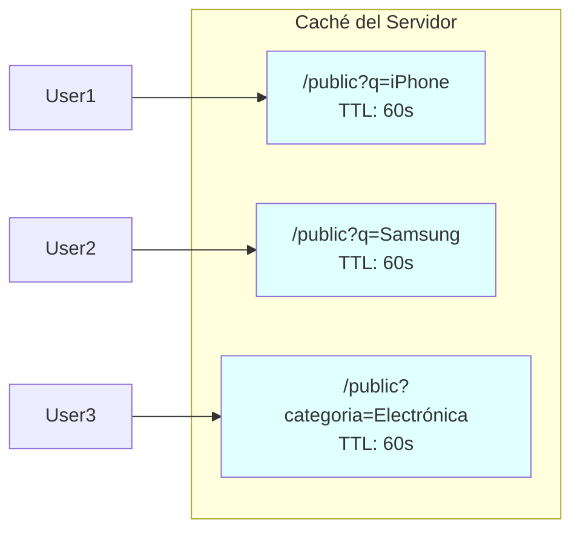
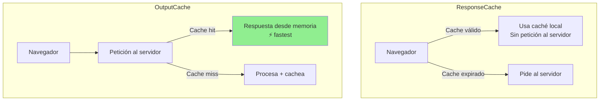
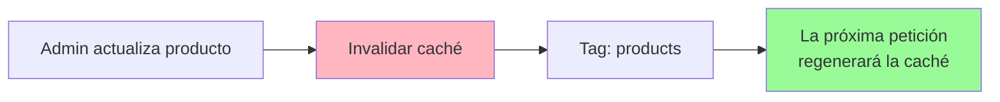

- [21. Optimización de Rendimiento: Output Cache en .NET 10](#21-optimización-de-rendimiento-output-cache-en-net-10)
  - [1. El Concepto: ¿Por qué cachear el catálogo?](#1-el-concepto-por-qué-cachear-el-catálogo)
  - [2. Implementación Técnica](#2-implementación-técnica)
    - [A. Registro del Servicio (`Program.cs`)](#a-registro-del-servicio-programcs)
    - [B. Aplicación en el Controlador (`PublicController.cs`)](#b-aplicación-en-el-controlador-publiccontrollercs)
  - [3. El desafío de la Variación (`VaryByQueryKeys`)](#3-el-desafío-de-la-variación-varybyquerykeys)
  - [4. Diferencia con ResponseCache (Senior Tip)](#4-diferencia-con-responsecache-senior-tip)
  - [5. Invalidación de Caché](#5-invalidación-de-caché)
  - [6. Conclusión para el Alumno](#6-conclusión-para-el-alumno)


# 21. Optimización de Rendimiento: Output Cache en .NET 10
En esta sección, aprenderemos a utilizar la funcionalidad de **Output Cache** introducida en .NET 10 para mejorar el rendimiento de nuestras aplicaciones web ASP.NET Core MVC. Esta técnica es especialmente útil para páginas que no cambian con frecuencia, como el catálogo de productos en una tienda en línea.

---

## 1. El Concepto: ¿Por qué cachear el catálogo?

En el escaparate público (`Public/Index`), los productos no cambian cada segundo. Sin embargo, cada vez que un usuario entra o refresca, el servidor:

```mermaid
sequenceDiagram
    participant U as Usuario
    participant S as Servidor
    participant DB as Base de Datos
    
    U->>S: Petición GET /public
    S->>DB: SELECT * FROM Productos
    DB-->>S: Datos productos
    S->>S: Renderizar HTML (Razor)
    S-->>U: Respuesta HTML
    
    Note over U,S,DB: Sin Output Cache: cada usuario repite todo el proceso
```

Si tenemos 1.000 usuarios concurrentes, estamos haciendo 1.000 consultas idénticas. **Output Cache** permite que el servidor haga este trabajo una sola vez y guarde el resultado en memoria para los siguientes usuarios.



---

## 2. Implementación Técnica

### A. Registro del Servicio (`Program.cs`)

```csharp
builder.Services.AddOutputCache();

// ...

app.UseOutputCache();
```

### B. Aplicación en el Controlador (`PublicController.cs`)

Hemos aplicado el atributo `[OutputCache]` con una duración de 60 segundos.

```csharp
[OutputCache(Duration = 60, VaryByQueryKeys = new[] { "q", "categoria", "minPrecio", "maxPrecio", "page", "size" })]
public async Task<IActionResult> Index(...) { ... }
```



---

## 3. El desafío de la Variación (`VaryByQueryKeys`)

Un error común del programador junior es cachear la página sin tener en cuenta los filtros. Si un usuario busca "iPhone" y el servidor cachea esa respuesta para todos, el siguiente usuario que busque "Samsung" vería los iPhones.

Para evitarlo, usamos `VaryByQueryKeys`. Esto le indica a .NET que genere **entradas de caché distintas** para cada combinación de:

- Texto de búsqueda (`q`).
- Categoría seleccionada.
- Rango de precios.
- Número de página.



---

## 4. Diferencia con ResponseCache (Senior Tip)

Es vital que el alumno distinga estos dos conceptos:

| Característica       | ResponseCache                                | OutputCache (.NET 10)                           |
| :------------------- | :------------------------------------------- | :---------------------------------------------- |
| **Ubicación**        | Navegador del cliente                        | Memoria del servidor                            |
| **Ahorro de Red**    | Sí (el cliente no pide)                      | No (el cliente pide, el server responde rápido) |
| **Ahorro de CPU/DB** | No (si otro cliente pide, el server trabaja) | **SÍ (el server no vuelve a consultar DB)**     |
| **Control**          | Basado en cabeceras HTTP                     | Control total desde C#                          |



---

## 5. Invalidación de Caché

En escenarios donde los datos cambian frecuentemente, necesitamos invalidar la caché:

```csharp
// Invalidar toda la caché de un endpoint
await outputCacheManager.EvictByTagAsync("products", default);

// Invalidar por ruta específica
await outputCacheManager.EvictByTagAsync("/public", default);
```



---

## 6. Conclusión para el Alumno

La caché es una de las herramientas más potentes pero peligrosas. Un buen desarrollador debe saber **qué cachear** (datos que cambian poco y se consultan mucho) y **cómo invalidar** esa caché si fuera necesario. En este proyecto, logramos que el escaparate sea ultrarrápido sin comprometer la precisión de los filtros.

---

**Volúmenes relacionados:**
- Volumen anterior: [20. Optimización: In-Memory Cache](20-Optimizacion-InMemoryCache.md)
- Volumen siguiente: [22. Operaciones y Producción: Docker, Ficheros y Despliegue](22-Ops-Docker-Files.md)
