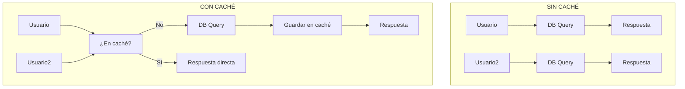
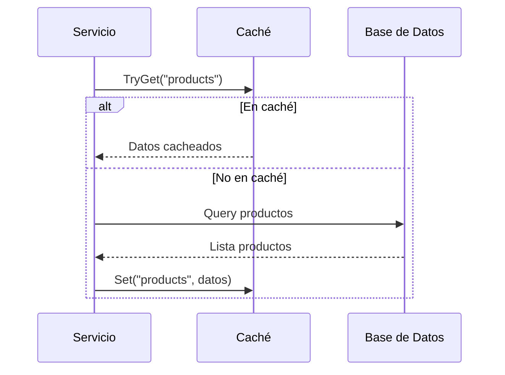

# 22. InMemoryCache: Optimización de Rendimiento

## Índice

[22. InMemoryCache: Optimización de Rendimiento](#22-inmemorycache-optimización-de-rendimiento)
  - [22.1. ¿Por qué cachear?](#221-por-qué-cachear)
  - [22.2. Implementación del Patrón Cache-Aside](#222-implementación-del-patrón-cache-aside)
  - [22.3. Invalidación de Caché](#223-invalidación-de-caché)
  - [22.4. Consideraciones de Rendimiento](#224-consideraciones-de-rendimiento)

---

## 22.1. ¿Por qué cachear?

Los servicios consultan frecuentemente datos que **cambian poco**:

| Datos | Frecuencia de cambio | Vale la pena cachear? |
|-------|----------------------|----------------------|
| Catálogo productos | Baja | ✅ Sí |
| Detalles producto | Baja | ✅ Sí |
| Valoraciones | Media | ⚠️ Depende |
| Carrito usuario | Alta | ❌ No |

### Sin Caché vs Con Caché



---

## 22.2. Implementación del Patrón Cache-Aside

### Registro del Servicio

```csharp
// Program.cs
builder.Services.AddMemoryCache();
builder.Services.AddSingleton<ICacheService, MemoryCacheService>();
```

### Uso en Servicio

```csharp
public class ProductService
{
    private readonly IProductRepository _repository;
    private readonly IMemoryCache _cache;
    private readonly ILogger<ProductService> _logger;

    private static readonly string CacheKey = "products_list";

    public ProductService(
        IProductRepository repository,
        IMemoryCache cache,
        ILogger<ProductService> logger)
    {
        _repository = repository;
        _cache = cache;
        _logger = logger;
    }

    public async Task<IEnumerable<ProductDto>> GetAllAsync()
    {
        // 1. Intentar obtener de caché
        if (_cache.TryGetValue(CacheKey, out List<ProductDto>? cachedProducts))
        {
            _logger.LogInformation("Productos obtenidos de caché");
            return cachedProducts!;
        }

        // 2. Si no está en caché, obtener de BD
        _logger.LogInformation("Productos obtenidos de BD");
        var products = await _repository.GetAllAsync();

        // 3. Guardar en caché
        var cacheOptions = new MemoryCacheEntryOptions()
            .SetAbsoluteExpiration(TimeSpan.FromMinutes(10))
            .SetSlidingExpiration(TimeSpan.FromMinutes(2));

        _cache.Set(CacheKey, products.ToList(), cacheOptions);

        return products;
    }
}
```

### Flujo Cache-Aside



---

## 22.3. Invalidación de Caché

### Invalidación Manual

```csharp
public class ProductService
{
    private readonly IMemoryCache _cache;
    private readonly string CacheKey = "products_list";

    public async Task<Product> CreateAsync(CreateProductDto dto)
    {
        var product = await _repository.CreateAsync(dto);
        
        // Invalidar caché al crear
        _cache.Remove(CacheKey);
        
        return product;
    }

    public async Task<Product> UpdateAsync(long id, UpdateProductDto dto)
    {
        var product = await _repository.UpdateAsync(id, dto);
        
        // Invalidar caché al actualizar
        _cache.Remove(CacheKey);
        
        return product;
    }

    public async Task DeleteAsync(long id)
    {
        await _repository.DeleteAsync(id);
        
        // Invalidar caché al eliminar
        _cache.Remove(CacheKey);
    }
}
```

### Patrón Cache-Invalidation

```csharp
public interface ICacheInvalidator
{
    void Invalidate(string key);
    void InvalidateAll();
}

public class CacheInvalidator : ICacheInvalidator
{
    private readonly IMemoryCache _cache;

    public CacheInvalidator(IMemoryCache cache)
    {
        _cache = cache;
    }

    public void Invalidate(string key)
    {
        _cache.Remove(key);
    }

    public void InvalidateAll()
    {
        // Para InMemoryCache, no hay método directo
        // Se puede usar un identificador especial
        _cache.Remove("all_cache_keys");
    }
}
```

---

## 22.4. Consideraciones de Rendimiento

### Sliding vs Absolute Expiration

| Tipo | Descripción | Cuándo usar |
| ---- | ---------- | ---------- |
| **Sliding** | Se renueva con cada acceso | Datos accedidos frecuentemente |
| **Absolute** | Expira a una hora fija | Datos que deben renovarse |

```csharp
var options = new MemoryCacheEntryOptions()
    // Expira 10 min después del último acceso
    .SetSlidingExpiration(TimeSpan.FromMinutes(10))
    
    // Expira siempre (always) 1 hora después de creado
    .SetAbsoluteExpiration(TimeSpan.FromHours(1))
    
    // Prioridad baja (se elimina primero si falta memoria)
    .SetPriority(CacheItemPriority.Low);
```

### Tamaño de Caché

```csharp
// Limitar tamaño de caché
builder.Services.AddMemoryCache(options =>
{
    options.SizeLimit = 1000; // Máximo 1000 entradas
    options.CompactionPercentage = 0.25; // Eliminar 25% cuando lleno
});
```

---

## Resumen

| Concepto           | Descripción                                              |
| ------------------ | -------------------------------------------------------- |
| **Cache-Aside**    | Consultar BD solo si no está en caché                    |
| **MemoryCache**    | Caché en memoria del servidor                            |
| **Invalidación**   | Eliminar/actualizar caché cuando datos cambian           |
| **Expiration**     | Tiempo de vida de los elementos en caché                 |

---

**Anterior**: [21. E2E Testing](../21-E2E-Testing.md)  
**Próximo**: [23. Output Cache](../23-OutputCache.md)
