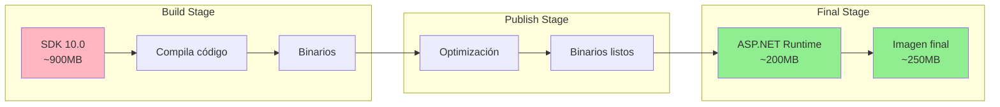
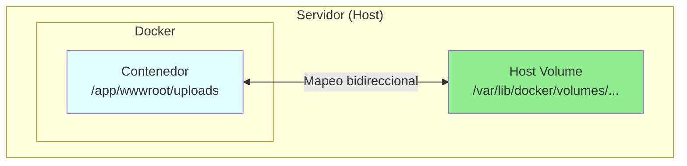
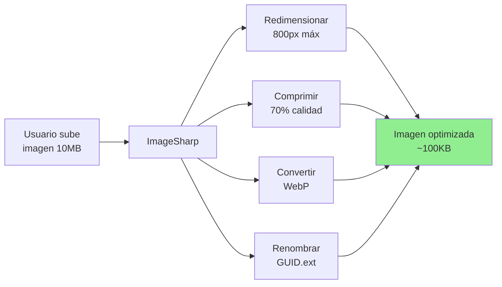
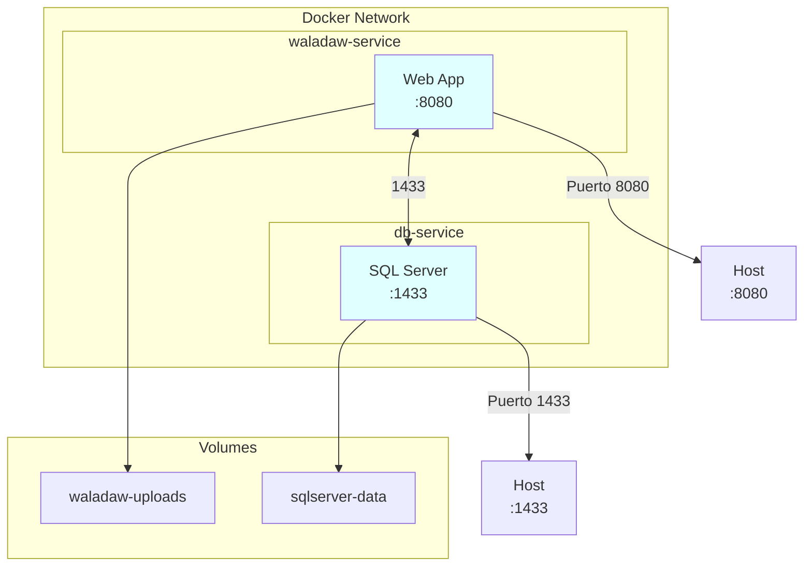

- [22. Operaciones y Producción: Docker, Ficheros y Despliegue](#22-operaciones-y-producción-docker-ficheros-y-despliegue)
  - [1. Docker: El Contenedor Indestructible](#1-docker-el-contenedor-indestructible)
    - [1.1. El Dockerfile Multi-Stage: La Dieta Extrema de tu Aplicación](#11-el-dockerfile-multi-stage-la-dieta-extrema-de-tu-aplicación)
  - [2. Persistencia en Contenedores: Los Volúmenes de Docker](#2-persistencia-en-contenedores-los-volúmenes-de-docker)
    - [2.1. El Problema de `wwwroot/uploads`](#21-el-problema-de-wwwrootuploads)
    - [2.2. La Solución: Mapeo de Volúmenes en `docker-compose.yml`](#22-la-solución-mapeo-de-volúmenes-en-docker-composeyml)
  - [3. Procesamiento Profesional de Archivos: El Caso de las Imágenes](#3-procesamiento-profesional-de-archivos-el-caso-de-las-imágenes)
    - [3.1. `SixLabors.ImageSharp`: El Cuchillo Suizo de las Imágenes](#31-sixlaborsimagesharp-el-cuchillo-suizo-de-las-imágenes)
    - [3.2. Sirviendo Archivos Fuera de `wwwroot` (`PhysicalFileProvider`)](#32-sirviendo-archivos-fuera-de-wwwroot-physicalfileprovider)
  - [4. Generación de Facturas en PDF (`QuestPDF`)](#4-generación-de-facturas-en-pdf-questpdf)
    - [4.1. El Desafío de los PDFs](#41-el-desafío-de-los-pdfs)
    - [4.2. La Solución: `QuestPDF`](#42-la-solución-questpdf)
  - [5. docker-compose.yml: Orquestación de Servicios](#5-docker-composeyml-orquestación-de-servicios)
  - [6. Conclusión](#6-conclusión)


# 22. Operaciones y Producción: Docker, Ficheros y Despliegue
En esta sección, abordaremos los aspectos clave para llevar tu aplicación ASP.NET Core a producción utilizando Docker. 

## 1. Docker: El Contenedor Indestructible

Docker empaqueta tu aplicación y todas sus dependencias en un "contenedor" aislado. Así, funciona igual en tu máquina que en el servidor de producción.

### 1.1. El Dockerfile Multi-Stage: La Dieta Extrema de tu Aplicación

Un Dockerfile profesional no solo "pone tu código en una caja". Optimiza el tamaño de la imagen para que sea ligera, rápida de desplegar y más segura.

```dockerfile
# TiendaDawWeb-NetCore/TiendaDawWeb.Web/Dockerfile

# Stage 1: build - Aquí usamos el SDK de .NET (la "caja de herramientas" grande)
FROM mcr.microsoft.com/dotnet/sdk:10.0 AS build
WORKDIR /src

# Copia el archivo .csproj y restaura las dependencias para aprovechar el cacheado de capas
COPY ["TiendaDawWeb.Web/TiendaDawWeb.csproj", "TiendaDawWeb.Web/"]
RUN dotnet restore "TiendaDawWeb.Web/TiendaDawWeb.csproj"

# Copia todo el código fuente y compila la aplicación
COPY . .
WORKDIR "/src/TiendaDawWeb.Web"
RUN dotnet build "TiendaDawWeb.csproj" -c Release -o /app/build

# Stage 2: publish - Genera los binarios listos para ejecutar
FROM build AS publish
RUN dotnet publish "TiendaDawWeb.csproj" -c Release -o /app/publish /p:UseAppHost=false

# Stage 3: final - Aquí usamos solo el Runtime de .NET (la "caja de herramientas" pequeña)
FROM mcr.microsoft.com/dotnet/aspnet:10.0 AS final
WORKDIR /app
EXPOSE 8080
EXPOSE 8081

COPY --from=publish /app/publish .

RUN mkdir -p wwwroot/uploads && chmod 777 wwwroot/uploads

ENV ASPNETCORE_URLS=http://+:8080
ENV ASPNETCORE_ENVIRONMENT=Production

ENTRYPOINT ["dotnet", "TiendaDawWeb.dll"]
```

**Explicación Detallada:**
- **Stage 1 (`AS build`)**: Usa la imagen `dotnet/sdk` (herramientas de desarrollo, cientos de MB). Copia solo el `.csproj` para que Docker cachee la restauración de paquetes.
- **Stage 2 (`AS publish`)**: Genera una versión optimizada de tu aplicación.
- **Stage 3 (`AS final`)**: Usa `dotnet/aspnet` (solo runtime, mucho más ligera). Copia **solo** el resultado de `publish`. La imagen final no contiene código fuente.



---

## 2. Persistencia en Contenedores: Los Volúmenes de Docker

Los contenedores Docker son efímeros. Si apagas o borras un contenedor, ¡todo lo que guardaste dentro desaparece!

### 2.1. El Problema de `wwwroot/uploads`

Si tu aplicación permite subir fotos de productos, y estas fotos se guardan dentro del contenedor (`/app/wwwroot/uploads`), se perderán cada vez que el contenedor se reinicie o se elimine.

### 2.2. La Solución: Mapeo de Volúmenes en `docker-compose.yml`

Creamos un "volumen" que es una carpeta especial en el disco duro del servidor y la "mapeamos" a una carpeta dentro del contenedor.

```yaml
# TiendaDawWeb-NetCore/docker-compose.yml
services:
  webapp:
    build: .
    ports:
      - "8080:8080"
    volumes:
      - waladaw-uploads:/app/wwwroot/uploads
    environment:
      - ASPNETCORE_ENVIRONMENT=Production

volumes:
  waladaw-uploads:
    driver: local
```



**Lección de Supervivencia**: Siempre que tu aplicación necesite almacenar datos que deban sobrevivir al ciclo de vida del contenedor (bases de datos, archivos subidos por usuarios, logs), usa volúmenes persistentes.

---

## 3. Procesamiento Profesional de Archivos: El Caso de las Imágenes

Nunca confíes en los usuarios. Si te suben una imagen de 10 MB, tu servidor puede colapsar o tu web ir lenta.

### 3.1. `SixLabors.ImageSharp`: El Cuchillo Suizo de las Imágenes

Esta librería se usa en `StorageService` para:
- **Redimensionar**: Limitar el tamaño máximo de las imágenes (ej. a 800px).
- **Comprimir**: Reducir el tamaño del archivo sin perder calidad visible.
- **Optimizar Formato**: Convertir a formatos más eficientes (WebP, AVIF).
- **Cambio de Nombres**: Guardar la imagen con un `GUID` para evitar colisiones.



### 3.2. Sirviendo Archivos Fuera de `wwwroot` (`PhysicalFileProvider`)

Por defecto, `app.UseStaticFiles()` solo sirve archivos de `wwwroot`. Si tienes archivos en otra carpeta, necesitas un `FileProvider` personalizado:

```csharp
// TiendaDawWeb.Web/Program.cs
var uploadPath = Path.Combine(Directory.GetCurrentDirectory(), "wwwroot", "uploads");

app.UseStaticFiles(new StaticFileOptions
{
    FileProvider = new PhysicalFileProvider(uploadPath),
    RequestPath = "/uploads"
});
```

---

## 4. Generación de Facturas en PDF (`QuestPDF`)

Generar documentos PDF complejos es una tarea que requiere precisión.

### 4.1. El Desafío de los PDFs

- Convertir HTML a PDF es lento, consume muchos recursos y es propenso a errores de formato.
- Generar PDFs directamente es dibujar el documento.

### 4.2. La Solución: `QuestPDF`

`QuestPDF` permite definir la estructura de un documento PDF usando código C# de forma declarativa.

```csharp
// TiendaDawWeb.Web/Services/Implementations/PdfService.cs
public async Task<byte[]> GenerateInvoicePdfAsync(Purchase purchase)
{
    var document = Document.Create(container =>
    {
        container.Page(page =>
        {
            page.Header().Text("Factura #" + purchase.Id);
            page.Content().Column(column =>
            {
                column.Item().Text("Detalles de la compra...");
            });
            page.Footer().Text(text => text.Span("Página ")
                .CurrentPageNumber().Span(" de ").TotalPages());
        });
    });

    using var stream = new MemoryStream();
    document.GeneratePdf(stream);
    return stream.ToArray();
}
```

```mermaid
flowchart LR
    A[Datos Purchase] --> B[QuestPDF Builder]
    B --> C[Document Definition<br/>Header, Content, Footer]
    C --> D[GeneratePdf]
    D --> E[MemoryStream]
    E --> F[byte[] PDF]
    F --> G[FileStreamResult<br/>Descargar en navegador]
    
    style G fill:#90EE90
```

**Lección de Supervivencia**: Cuando necesites generar documentos complejos, busca librerías que trabajen directamente con el formato de destino (PDF) en lugar de convertir un formato intermedio (HTML).

---

## 5. docker-compose.yml: Orquestación de Servicios

```yaml
version: '3.8'

services:
  waladaw:
    build:
      context: .
      dockerfile: TiendaDawWeb.Web/Dockerfile
    ports:
      - "8080:8080"
    environment:
      - ASPNETCORE_ENVIRONMENT=Production
      - ConnectionStrings__DefaultConnection=Server=db;Database=TiendaDaw;User=sa;Password=YourPassword123;
    depends_on:
      - db
    volumes:
      - waladaw-uploads:/app/wwwroot/uploads

  db:
    image: mcr.microsoft.com/mssql/server:2022-latest
    environment:
      - ACCEPT_EULA=Y
      - SA_PASSWORD=YourPassword123
    ports:
      - "1433:1433"
    volumes:
      - sqlserver-data:/var/opt/mssql

volumes:
  waladaw-uploads:
    driver: local
  sqlserver-data:
    driver: local
```



---

## 6. Conclusión

Este volumen te ha guiado por los retos de llevar tu aplicación a producción: desde cómo Docker la empaqueta de forma eficiente hasta cómo gestiona los datos que suben los usuarios y los documentos que genera el sistema. Eres ahora un arquitecto de operaciones.

---

**Volúmenes relacionados:**
- Volumen anterior: [21. Optimización de Rendimiento: Output Cache en .NET 10](21-OutputCache-Performance.md)
