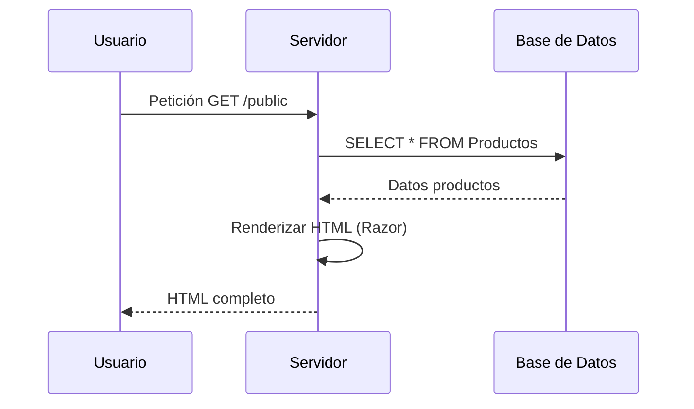
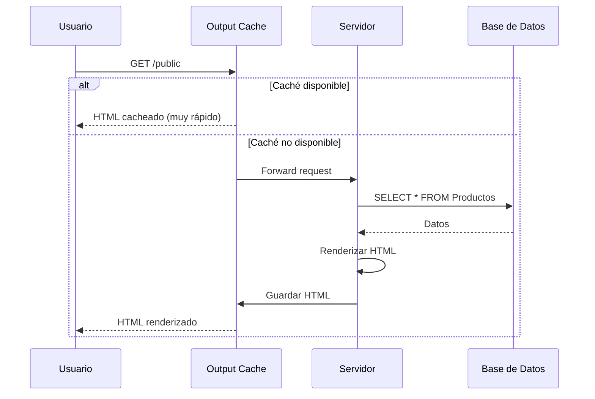

# 23. Optimización de Rendimiento: Output Cache en .NET 10

## Índice

[23. Optimización de Rendimiento: Output Cache en .NET 10](#23-optimización-de-rendimiento-output-cache-en-net-10)
  - [23.1. El Concepto: ¿Por qué cachear el catálogo?](#231-el-concepto-por-qué-cachear-el-catálogo)
  - [23.2. Implementación Técnica](#232-implementación-técnica)
  - [23.3. El desafío de la Variación](#233-el-desafío-de-la-variación)
  - [23.4. Diferencia con ResponseCache](#234-diferencia-con-responsecache)
  - [23.5. Invalidación de Caché](#235-invalidación-de-caché)

---

## 23.1. El Concepto: ¿Por qué cachear el catálogo?

En el escaparate público (`Public/Index`), los productos no cambian cada segundo. Sin embargo, cada vez que un usuario entra o refresca, el servidor:



**Problema**: Cada petición golpea la BD y renderiza HTML.

**Solución**: Output Cache guarda el HTML renderizado.



---

## 23.2. Implementación Técnica

### Registro del Servicio

```csharp
// Program.cs
builder.Services.AddOutputCache();

// Configuración
builder.Services.AddOutputCache(options =>
{
    options.DefaultExpirationTimeSpan = TimeSpan.FromMinutes(5);
    options.SizeLimit = 1000;
});
```

### Aplicación en el Controlador

```csharp
[ApiController]
[Route("api/[controller]")]
public class ProductsController : ControllerBase
{
    [HttpGet]
    [OutputCache(PolicyName = "ProductCache")]
    public async Task<IActionResult> GetProducts(
        [FromQuery] string? category,
        [FromServices] ICacheOutput cacheOutput)
    {
        // Lógica para obtener productos
        var products = await _productService.GetAllAsync(category);
        
        return Ok(products);
    }
}
```

### Con Tag Helpers (Razor Pages)

```html
@page "/products"
@addTagHelper *, Microsoft.AspNetCore.Mvc.TagHelpers

@{
    ViewData["Title"] = "Catálogo de Productos";
}

<cache expires-after="TimeSpan.FromMinutes(10)">
    @await Component.InvokeAsync("ProductList", new { category = "electronics" })
</cache>
```

---

## 23.3. El desafío de la Variación

### VaryByQueryKeys

```csharp
[HttpGet]
[OutputCache(PolicyName = "SearchCache", VaryByQueryKeys = new[] { "search", "page" })]
public async Task<IActionResult> Search([FromQuery] string search, int page = 1)
{
    var results = await _searchService.SearchAsync(search, page);
    return Ok(results);
}
```

### VaryByHeader

```csharp
[HttpGet]
[OutputCache(PolicyName = "ApiCache", VaryByHeader = "Accept-Language")]
public async Task<IActionResult> GetData()
{
    // Cache separado por idioma
    var products = await _productService.GetAllAsync();
    return Ok(products);
}
```

---

## 23.4. Diferencia con ResponseCache

| Aspecto             | ResponseCache                    | Output Cache                  |
| ------------------ | ------------------------------- | ---------------------------- |
| **Qué cachea**    | Headers + HTML                 | HTML completo               |
| **Dónde**          | Cliente + Proxy + Servidor     | Solo servidor               |
| **VaryBy**         | Query, Headers, UserAgent      | Query, Headers, Cookies      |
| **Invalidación**   | Manual                          | Tags + Expiración           |
| **Rendimiento**   | Bueno                           | Mejor (HTML completo)       |

### Cuándo usar cada uno

| ✅ ResponseCache      | ✅ Output Cache                      |
| -------------------- | ----------------------------------- |
| APIs JSON pequeñas   | Páginas Razor completas             |
| Debugging            | Catálogos públicos                  |
| APIs muy variables  | Contenido que no cambia frecuente   |

---

## 23.5. Invalidación de Caché

### Por Tags

```csharp
[HttpPost]
[OutputCacheInvalidate(Tags = new[] { "products" })]
public async Task<IActionResult> CreateProduct([FromBody] CreateProductDto dto)
{
    var product = await _productService.CreateAsync(dto);
    return CreatedAtAction(nameof(GetProduct), new { id = product.Id }, product);
}

[HttpPut("{id}")]
[OutputCacheInvalidate(Tags = new[] { "products" })]
public async Task<IActionResult> UpdateProduct(long id, [FromBody] UpdateProductDto dto)
{
    await _productService.UpdateAsync(id, dto);
    return NoContent();
}

[HttpDelete("{id}")]
[OutputCacheInvalidate(Tags = new[] { "products" })]
public async Task<IActionResult> DeleteProduct(long id)
{
    await _productService.DeleteAsync(id);
    return NoContent();
}
```

### Invalidación Manual

```csharp
public class CacheService
{
    private readonly ICacheInvalidator _invalidator;

    public async Task InvalidateProductsCacheAsync()
    {
        await _invalidator.CreateRelatedTagInvalidatorAsync("products");
    }
}
```

---

## Resumen

| Concepto           | Descripción                                              |
| ------------------ | -------------------------------------------------------- |
| **Output Cache**  | Caché de HTML completo en el servidor                    |
| **VaryBy**        | Variar caché por query, headers, cookies                |
| **Invalidate**    | Invalidar caché por tags                                |
| **ResponseCache** | Caché de headers y respuestas simples                   |

---

**Anterior**: [22. InMemory Cache](../22-InMemoryCache.md)  
**Próximo**: [24. Docker y Producción](../24-Docker.md)
