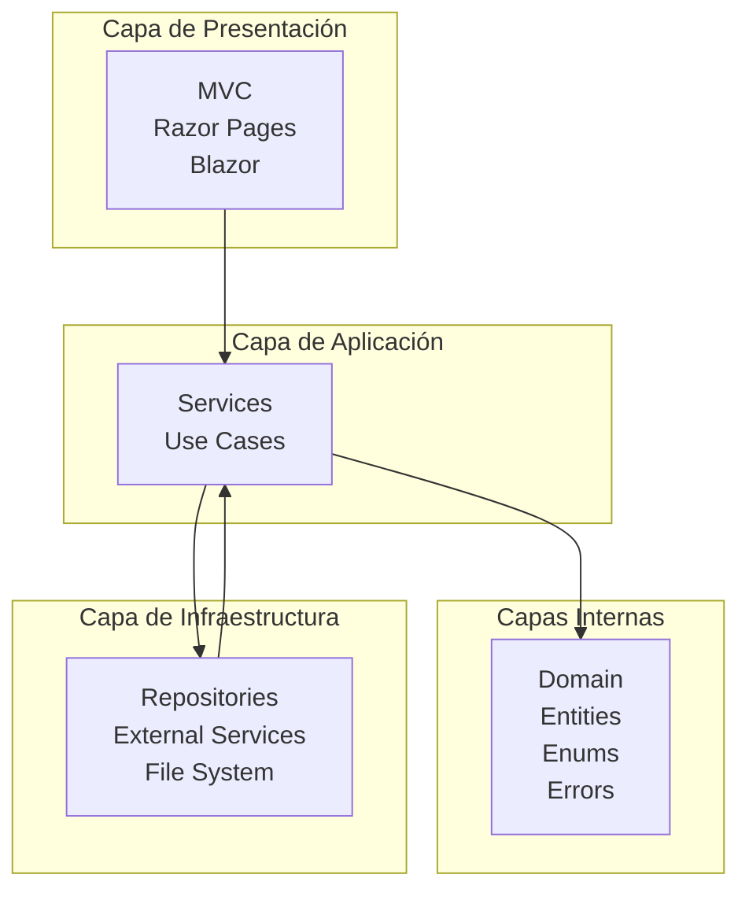
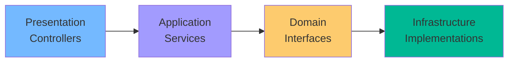

# 26. Clean Architecture e Infraestructura

## Índice

[26. Clean Architecture e Infraestructura](#26-clean-architecture-e-infraestructura)
  - [26.1. Principios de Clean Architecture](#261-principios-de-clean-architecture)
  - [26.2. Estructura de Capas](#262-estructura-de-capas)
  - [26.3. Dependency Injection](#263-dependency-injection)
  - [26.4. Extension Methods](#264-extension-methods)
  - [26.5. Configuration Patterns](#265-configuration-patterns)
  - [26.6. Infrastructure as Code](#266-infrastructure-as-code)

---

## 26.1. Principios de Clean Architecture

Clean Architecture es un patrón que separa las responsabilidades en capas, permitiendo que el código sea:

| Principio            | Descripción                                      |
| ------------------- | ------------------------------------------------ |
| **Testable**        | Sin dependencias de BD, UI o frameworks          |
| **Independiente**   | La lógica de negocio no depende de detalles      |
| **Mantenedor**     | Código organizado y fácil de entender            |
| **Escalable**      | Nuevas features sin modificar código existente   |



---

## 26.2. Estructura de Capas

### Estructura del Proyecto

```
TiendaDawWeb/
├── TiendaDawWeb.Domain/           # Entidades y lógica de negocio
│   ├── Entities/
│   ├── Enums/
│   ├── Errors/
│   └── Interfaces/
├── TiendaDawWeb.Application/      # Casos de uso y servicios
│   ├── Services/
│   ├── DTOs/
│   └── Mappers/
├── TiendaDawWeb.Infrastructure/  # Implementaciones externas
│   ├── Repositories/
│   ├── FileStorage/
│   └── ExternalServices/
├── TiendaDawWeb.Web/             # Presentación (MVC)
│   ├── Controllers/
│   ├── Views/
│   └── wwwroot/
└── TiendaDawWeb.Tests/           # Tests
```

### Dependency Flow



---

## 26.3. Dependency Injection

### Registro por Convention

```csharp
public static class ServiceCollectionExtensions
{
    public static void AddApplicationLayer(this IServiceCollection services)
    {
        // Registrar todos los servicios
        var assembly = Assembly.GetExecutingAssembly();
        
        services.RegisterAssemblyPublicNonGenericClasses(assembly)
            .Where(x => x.Name.EndsWith("Service"))
            .AsPublicImplementedInterfaces(ServiceDescriptor.Scoped);
    }
}

// Uso
builder.Services.AddApplicationLayer();
```

### Registro Explícito

```csharp
builder.Services.AddScoped<IProductRepository, ProductRepository>();
builder.Services.AddScoped<IProductService, ProductService>();
builder.Services.AddSingleton<ICacheService, MemoryCacheService>();
```

---

## 26.4. Extension Methods

### Configuration Extensions

```csharp
public static class ConfigurationExtensions
{
    public static T GetTypedConfiguration<T>(this IConfiguration configuration)
        where T : class, new()
    {
        var config = new T();
        
        foreach (var property in typeof(T).GetProperties())
        {
            var value = configuration[property.Name];
            if (value != null && property.CanWrite)
            {
                property.SetValue(config, Convert.ChangeType(value, property.PropertyType));
            }
        }
        
        return config;
    }
}

// Uso
var appConfig = configuration.GetTypedConfiguration<AppConfiguration>();
```

### Service Collection Extensions

```csharp
public static class ServiceCollectionExtensions
{
    public static IServiceCollection AddInfrastructure(
        this IServiceCollection services,
        IConfiguration configuration)
    {
        services.AddDbContext<AppDbContext>(options =>
            options.UseSqlite(configuration.GetConnectionString("Default")));
        
        services.AddScoped<IProductRepository, ProductRepository>();
        services.AddScoped<ICacheService, MemoryCacheService>();
        
        return services;
    }
}

// Uso
builder.Services.AddInfrastructure(builder.Configuration);
```

---

## 26.5. Configuration Patterns

### Options Pattern

```csharp
public class AppSettings
{
    public string DefaultCulture { get; set; } = "es";
    public int PageSize { get; set; } = 10;
    public int CacheExpirationMinutes { get; set; } = 30;
}

// Registro
builder.Services.Configure<AppSettings>(builder.Configuration.GetSection("App"));

// Uso
public class ProductService
{
    private readonly AppSettings _settings;
    
    public ProductService(IOptions<AppSettings> settings)
    {
        _settings = settings.Value;
    }
}
```

### IConfiguration Sections

```csharp
// appsettings.json
{
  "Database": {
    "Provider": "SQLite",
    "ConnectionString": "Data Source=app.db"
  },
  "Cache": {
    "ExpirationMinutes": 30
  }
}

// Registro
builder.Services.Configure<DatabaseOptions>(
    builder.Configuration.GetSection("Database"));

builder.Services.Configure<CacheOptions>(
    builder.Configuration.GetSection("Cache"));
```

---

## 26.6. Infrastructure as Code

### Configuration como Código

```csharp
public class InfrastructureConfigurator
{
    public static void ConfigureDatabase(IServiceCollection services, IConfiguration config)
    {
        var provider = config["Database:Provider"];
        
        switch (provider)
        {
            case "SQLite":
                var connString = config.GetConnectionString("Default");
                services.AddDbContext<AppDbContext>(options =>
                    options.UseSqlite(connString));
                break;
                
            case "PostgreSQL":
                var pgConnString = config.GetConnectionString("PostgreSQL");
                services.AddDbContext<AppDbContext>(options =>
                    options.UseNpgsql(pgConnString));
                break;
        }
    }
}
```

### Feature Flags

```csharp
public static class FeatureManager
{
    public const string BlazorSupport = "BlazorSupport";
    public const string RedisCache = "RedisCache";
    public const string GraphQL = "GraphQL";
}

// appsettings.json
{
  "Features": {
    "BlazorSupport": true,
    "RedisCache": false,
    "GraphQL": true
  }
}

// Uso
if (builder.Configuration.GetValue<bool>($"Features:{FeatureManager.BlazorSupport}"))
{
    builder.Services.AddServerSideBlazor();
}
```

---

## Resumen

| Concepto           | Descripción                                              |
| ------------------ | -------------------------------------------------------- |
| **Clean Architecture** | Separación en capas independientes                    |
| **Capas**          | Domain, Application, Infrastructure, Presentation        |
| **Extension Methods**| Organizar registro de servicios                         |
| **Options Pattern** | Configuración tipada                                    |
| **IaC**           | Infraestructura configurada como código                 |

---

**Anterior**: [25. Logging](../25-Logging.md)  
**Próximo**: [README](../README.md)
